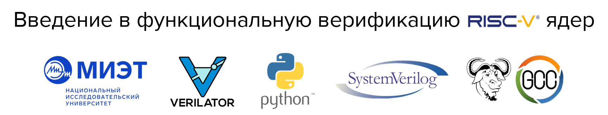

---

- [Об авторе](#об-авторе)
- [О репозитории](#о-репозитории)
  - [Клонирование и работа](#клонирование-и-работа)
  - [Структура](#структура)
- [О курсе](#о-курсе)
  - [Общее описание](#общее-описание)
  - [Особенности курса](#особенности-курса)
  - [Минимальные требования к знаниям](#минимальные-требования-к-знаниям)
  - [Установка необходимого ПО](#установка-необходимого-по)
    - [Использование виртуальной машины](#использование-виртуальной-машины)
    - [Ручная установка](#ручная-установка)
  - [Маршрут прохождения](#маршрут-прохождения)


# Об авторе

Привет, дорогой **единомышленник**! Меня зовут **Чусов Сергей Андреевич** ([LinkedIn](https://www.linkedin.com/in/sergey-chusov-699768251/), [Telegram](https://t.me/srg_chs)), я преподаватель в [НИУ МИЭТ](https://miet.ru/), а также инженер по верификации цифровых устройств [НИЛ ЭСК](https://miet.ru/structure/s/3812) в этом же университете. Уже более четырех лет я занимаюсь верификацией цифровых устройств. Имею опыт верификации как отдельных СФ-блоков, так и целых Систем на Кристалле.


# О репозитории
## Клонирование и работа

Для того, чтобы работать с репозиторием (выполнять практические занятия, модифицировать код и т.д.), необходимо склонировать его ([на предоставляемую виртуальную машину](#использование-виртуальной-машины) или на иной дистрибутив Linux) и обновить сабмодули.

```bash
git clone https://github.com/serge0699/riscv-tests-intro.git
cd riscv-tests-intro
git -c submodule."submodules/riscv-gnu-toolchain".update=none submodule update --recursive --init && git submodule update --init
```

## Структура

- `doc` - дополнительная документация.
- `practice` - практические занятия;
  - `00_basic_hex` - конкретное занятие;
    - `golden` - эталонная реализация;
    - `README.md` - инструкция по выполнению;
  - ...
  - `README.md` - краткое содержание.
- `scripts` - вспомогательные скрипты;
- `submodules` - сабмодули;
- `theory` - теоретический материал.
  - `00_intro` - конкретная тема;
  - ...
  - `README.md` - краткое содержание.

# О курсе

Разработка курса поддержана в рамках конкурса грантов [Альянса RISC-V](https://riscv-alliance.ru/).

Материалы допускаются к использованию под лицензией [CC BY 4.0](https://creativecommons.org/licenses/by/4.0/deed.ru).

## Общее описание

**Курс знакомит с основными подходами к функциональной верификации RISC-V ядер**, использующимися в индустрии микроэлектроники в настоящее время. Ядром курса являются [практические занятия](./practice/), реализующие полный маршрут 3 различных подходов к тестированию (от простого к сложному). Однако, без базовых теоретических знаний осознанно их выполнить непросто, так что в курсе представлен блок [теоретического материала](./theory/), формирующий контекст восприятия.

**Интересной особенностью** курса является [раздел bug hunting](./bughunt/), который представляет собой сборник смоделированных и подробно разобранных ситуаций обнаружения и исправления ошибок в RTL-описании процессорого ядра с открытым исходным кодом [MIRISCV](https://github.com/riscv-tests-intro/MIRISCV/tree/b510b308addc4a7271e36f2a348bd18bf24c1d77).

**Рекомендуемый маршрут прохождения** представлен в [соответствующем разделе](#маршрут-прохождения).

## Особенности курса

- Использование исключительно открытого ПО;
- Предоставление виртуальной машины, на которой можно сразу начать работу;
- Возможность установки ПО и выполнения курса на пользовательской машине;
- [Ознакомительная теоретическая](./theory/) и [исчерпывающая практическая](./practice) части;
- Использование разнообразных методик[^1];
- Наличие эталонных реализаций практических занятий;
- Моделирование ситуаций обнаружения и исправления ошибок в RTL (раздел [bug hunting](./bughunt/)).

## Минимальные требования к знаниям

- Минимальные знания команд Linux;
- Минимальные знания Git ([онлайн курс ~1 час](https://githowto.com/ru));
- Базовые знания цифровой схемотехники и булевой алгебры;
- Базовые знания SystemVerilog;
- Базовые знания архитектуры RISC-V ([спецификация](https://drive.google.com/file/d/1uviu1nH-tScFfgrovvFCrj7Omv8tFtkp/view)):
  - Адресное пространство (спецификация, раздел 1.4);
  - Исключения и прерывания (спецификация, раздел 1.6);
  - Представление о наборе команд RISC-V RV32I (спецификация, раздел 2);
  - Представление о наборе команд RISC-V RV32M (спецификация, раздел 13).
- Базовые знания Python, C, процессов компиляции и линковки.

## Установка необходимого ПО

### Использование виртуальной машины

Вы можете воспользоваться [предоставляемым образом виртуальной машины](https://files.sberdisk.ru/s/DdT3ti66fKyTUPR) для [VirtualBox](#https://www.virtualbox.org/) Это [конкретная версия Ubuntu 22.04 LTS](https://files.sberdisk.ru/s/TW5YPQ8iLR5ZYtD), со всем необходимым установленным ПО.

Руководство по скачиванию и настройке виртуальной машины  находится в файле [`doc/vm.md`](./doc/vm.md). **При использовании виртуальной машины дополнительно никакое ПО устанавливать не нужно.**

### Ручная установка

Вы можете вручную **установить следущее ПО** на свой дистрибутив Linux:

- [Генератор случайных инструкций RISC-V AAPG `2d7d40f`](https://github.com/riscv-tests-intro/aapg/tree/2d7d40feb8ce7ae20ccbe8225ed9947c188e9cc3);
- [Программная модель RISC-V Spike ISS `00dfa28`](https://github.com/riscv-software-src/riscv-isa-sim/tree/00dfa28cd71326a9b553052bf0160cb76f0e7e07);
- [ПО riscv-gnu-toolchain `6d7b5b7`](https://github.com/riscv-collab/riscv-gnu-toolchain/tree/6d7b5b720f6c6a89b4f22c62b22c1d0ebc2dc353);
- [Verilator 5.024 `522bead`](https://github.com/verilator/verilator/tree/522bead374d6b7b2adb316304126e5361b18bcf1);
- [GTKWave](https://gtkwave.sourceforge.net/).

**а также все зависимости** для сборки данного ПО.

Так как все ПО является открытым, то **б*о*льшая его часть жестко привязана к конкретным коммитам**. Все ПО на нужных коммитах находится в директории [`submodules`](./submodules/). **Инструкция по ручной установке**, которая привязана к данным сабмодулям, находится в файле [`doc/soft.md`](./doc/soft.md).

Ручная установка проверена и гаранитируется только для [конкретной версии Ubuntu 22.04 LTS](https://files.sberdisk.ru/s/TW5YPQ8iLR5ZYtD). Однако никаких ограничений на установку на другие дистрибутивы не накладывается.

## Маршрут прохождения

Предполагается, что [репозиторий склонирован](#клонирование-и-работа) на [предоставляемую виртуальную машину](#использование-виртуальной-машины) или на иной дистрибутив Linux с [установленным необходимым ПО](#ручная-установка).

**Рекомендуемый маршрут прохождения:**

1. [Тема 00: Вводная](./theory/00_intro.md)
2. [Тема 01: Функциональная верификация процессорных ядер](./theory/01_basics.md)
3. [Тема 02: Основные подходы к функциональной верификации RISC-V ядер](./theory/02_approach.md)
4. [Тема 03: Базовые подходы к симуляции RISC-V ядер](./theory/03_func.md)
    - [Практическое занятие 00: Тест "Hello world!"](./practice/00_basic_hex/)
    - [Практическое занятие 01: Тестирование с самопроверкой](./practice/01_riscv_tests/)
5. [Тема 04: RISC-V верификация: Сравнение с эталонной моделью](./theory/04_rgen.md)
    - [Практическое занятие 02: Cравнение с эталонной моделью](./practice/02_aapg/)
6. [Тема 05: RISC-V верификация: Модифицированное сравнение с эталонной моделью](./theory/05_advanced.md)

**По завершению** [теоретического](./theory/) и [практического](./practice/) разделов рекомендуется освоить раздел [bug hunting](./bughunt/). В каждом из его занятий моделируется поиск, локализация и исправление ошибки в RTL [MIRISCV](https://github.com/riscv-tests-intro/MIRISCV/tree/b510b308addc4a7271e36f2a348bd18bf24c1d77) при помощи различных подходов к верификации, представленных в данном курсе.

[^1]: В практических занятиях присутствуют пересекающиеся части, однако автор реализует эти части каждый раз по-разному, чтобы познакомить вас с различными подходами к проектированию тех или иных частей верификационного окружения.
