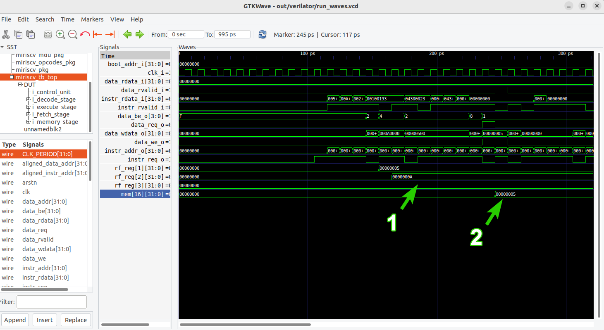

# Bug hunting 00: Потерянные регистры

- [Bug hunting 00: Потерянные регистры](#bug-hunting-00-потерянные-регистры)
  - [Необходимое ПО](#необходимое-по)
  - [Рекомендуемый материал](#рекомендуемый-материал)
  - [Краткое содержание](#краткое-содержание)
  - [Важные сведения](#важные-сведения)
  - [Тестируемое RISC-V ядро](#тестируемое-risc-v-ядро)
  - [Подготовка](#подготовка)
  - [Доступные подходы](#доступные-подходы)
  - [Применение подхода "Hello world!"](#применение-подхода-hello-world)
    - [Сборка и запуск симуляции](#сборка-и-запуск-симуляции)
    - [Анализ результатов](#анализ-результатов)
    - [Поиск ошибки](#поиск-ошибки)
  - [Исправление ошибки](#исправление-ошибки)
  - [Проверка корректности работы](#проверка-корректности-работы)
  - [Выводы](#выводы)


## Необходимое ПО

Подразумевается, что **задание выполняется на:**
- [на предоставленной виртуальной машине](../../#использование-виртуальной-машины);
- на ином дистрибутиве Linux с [установленным необходимым ПО](../../#ручная-установка).


## Рекомендуемый материал

- [Тема 00: Вводная](../../theory/00_intro.md)
- [Тема 01: Функциональная верификация процессорных ядер](../../theory/01_basics.md)
- [Тема 02: Основные подходы к функциональной верификации RISC-V ядер](../../theory/02_approach.md)
- [Тема 03: Базовые подходы к симуляции RISC-V ядер](../../theory/03_func.md)
  - [Практическое занятие 00: Тест "Hello world!"](./practice/00_basic_hex/)


## Краткое содержание

Казалось бы, что может пойти не так при запуске простейшего ["Hello world!"](../../theory/03_func.md#hello-world) теста. Пара инструкций сложения, простое ветвление и запись результата в память. Но не все так просто! Вместе "распутываем" неочевидные взаимосвязи конвейера [MIRISCV](https://github.com/riscv-tests-intro/MIRISCV/tree/b510b308addc4a7271e36f2a348bd18bf24c1d77) и ищем "виновника". **Занятие состоит из 3 основных этапов, выполняемых друг за другом.**

[Применение подхода "Hello world!"](#применение-подхода-hello-world) - для верификации процессорного ядра применяется подход "Hello world" Анализируются лог-файлы и временные диаграммы, а также делается вывод о некорректности исполнения программы процессорным ядром. Далее автором производится анализ RTL процессорного ядра и временных диаграмм с целью локализации ошибки. [Исправление ошибки](#исправление-ошибки) - найденная ошибка исправляется, автором приводятся обоснования внесенным изменениям. [Проверка корректности работы](#проверка-корректности-работы) - к исправленной версии ядра вновь применяется подход "Hello world!", подтверждается корректность работы.


## Важные сведения

**Обратите внимание**, что в части файлов, которые разбираются в ходе занятия, часть кода осознанно пропущена, оставлена лишь значимая, необходимая для формирования общей картины.

Например:

```SystemVerilog
  always_ff @(posedge clk_i or negedge arstn_i) begin
    if(~arstn_i)
      f_valid_ff <= '0;
    else if (cu_kill_f_i)
      ...
      f_valid_ff <= fetch_instr_valid;
  end
```

В данном файле пропущена часть кода между `else if (cu_kill_f_i)` и `f_valid_ff <= fetch_instr_valid;`.


## Тестируемое RISC-V ядро

В рамках курса будет тестироваться учебное ядро, разработанное в НИУ МИЭТ: [MIRISCV](https://github.com/riscv-tests-intro/MIRISCV/tree/b510b308addc4a7271e36f2a348bd18bf24c1d77). Процессор поддерживает расширения RV32I и RV32M и является четырехстадийным [in-order](https://en.wikipedia.org/wiki/Out-of-order_execution#In-order_processors) [конвейером](https://en.wikipedia.org/wiki/Instruction_pipelining). Ядро поддерживает только машинный уровень привилегий[^1].

<p align="center">
  </img>
</p>

Подробную документацию на процессор можно найти по [ссылке](https://github.com/riscv-tests-intro/MIRISCV/tree/b510b308addc4a7271e36f2a348bd18bf24c1d77). В рамках курса его функциональные особенности подробно разбираться не будут, а необходимая для выполнения заданий информация будет даваться по ходу повествования.


## Подготовка

**Подразумевается, что команды начинают выполняться в директории, в которой расположен данный файл с описанием занятия.**

Для того, чтобы работать с определенной версией ядра [MIRISCV](https://github.com/riscv-tests-intro/MIRISCV/tree/bug_00) выполните команды:

```bash
cd ../../submodules/MIRISCV/
git checkout bug_00
cd -
```

## Доступные подходы

В рамках курса доступно 3 подхода к верификации RISC-V ядер:

- Тест "Hello world!":
  - [теория](../../theory/03_func.md#hello-world);
  - [практика](../../practice/00_basic_hex/).
- Тестирование с самопроверкой:
  - [теория](../../theory/03_func.md#тестирование-с-самопроверкой);
  - [практика](../../practice/01_riscv_tests/);
- Cравнение с эталонной моделью:
  - [теория](../../theory/04_rgen.md#описание-подхода-часть-1);
  - [практика](../../practice/02_aapg/).

Начнем с самого простого!


## Применение подхода "Hello world!"

### Сборка и запуск симуляции

Проверим ядро при помощи [подхода "Hello world!"](../../theory/03_func.md#hello-world). Будем использовать [эталонную реализацию](../../practice/00_basic_hex/golden/) автора.

Скопируем все необходимое в текущую директорию:

```bash
cp -r ../../practice/00_basic_hex/golden/* ./
```

Перейдем в директорию для сборки и запуска и удалим артефакты от предыдущих возможных запусков пользователя при прохождении [соответствующего практического занятия](../../practice/00_basic_hex/):

```bash
cd build/ && rm -rf out/
```

Обратите внимание, что дальнейшие действия по сборке и запуску симуляции подробно разбираться не будут, так как были разобраны в [соответствующем разделе практического занятия](../../practice/00_basic_hex/README.md#сборка-и-запуск-симуляции).

Запускать симуляцию будем при помощи [Verilator 5.024](https://github.com/verilator/verilator/tree/522bead374d6b7b2adb316304126e5361b18bcf1).

Создадим директорию для сохранения артефактов симуляции:

```
mkdir -p out/verilator
```

**Скомпилируем RTL тестируемого ядра и сам файл окружения** при помощи Verilator:

```bash
verilator -Wno-WIDTHEXPAND -Wno-WIDTHTRUNC -Wno-UNUSEDSIGNAL -Wno-UNUSEDPARAM \
-Wno-PINMISSING -Wno-GENUNNAMED -Wno-CASEINCOMPLETE -Wno-UNOPTFLAT -Wno-INFINITELOOP \
-Wno-MULTIDRIVEN -Wno-INITIALDLY -cc -O2 -j 1 --threads 1 --binary \
../../../submodules/MIRISCV/miriscv/rtl/include/*.sv ../../../submodules/MIRISCV/miriscv/rtl/*.sv \
../tb/miriscv_tb_top.sv +incdir+../tb/ --trace --trace-params --trace-structs --x-assign 0 \
-top-module miriscv_tb_top -Mdir out/verilator &> out/verilator/compile.log
```

Откроем файл лог-файл компиляции `out/verilator/compile.log` любым редактором:

```bash
gedit out/verilator/compile.log
```

Увидим что-то похожее на:

```bash
- V e r i l a t i o n   R e p o r t:
- Verilator: Built from 2.592 MB sources in 27 modules, into 0.901 MB in 12 C++ files needing 0.001 MB
- Verilator: Walltime 0.331 s (elab=0.009, cvt=0.053, bld=0.242); cpu 0.000 s on 1 threads; alloced 29.789 MB
```

Компиляция завершилась успешно. Запустим симуляцию:

```bash
out/verilator/Vmiriscv_tb_top +bin=program.hex \
  +dump=out/verilator/run_waves.vcd &> out/verilator/run.log
```

### Анализ результатов

Любым редактором откроем лог-файл симуляции `out/verilator/run.log`:

```bash
gedit out/verilator/run.log
```

Увидим что-то похожее на:

```bash
- ../tb/../tb/miriscv_tb_top.sv:95: Verilog $finish
- S i m u l a t i o n   R e p o r t:
- Verilator: $finish at 1ns; walltime 0.001 s; speed 0.000 s/s
- Verilator: cpu 0.000 s on 1 threads; alloced 57 MB
```

Делаем вывод, что симуляция завершилась так, как мы ожидали (а как мы ожидали - написано в [соответствующем разделе практического занятия](../../practice/00_basic_hex/README.md#лог-файлы)), и теперь можно анализировать временную диаграмму, расположенную в директории `out/verilator`.

Заранее откроем тестовую программу:

```bash
gedit program.hex
```

А после временную диаграмму при помощи GTKWave:

```bash
gtkwave out/verilator/run_waves.vcd
```

Как мы помним, при подключении тестируемого ядра в топ-модуль верификационного окружения мы дали имя экземпляру процессора `DUT`. Теперь в GTKWave мы иерархически обращаемся к этому модулю для получения и информации об изменении его сигналов.

В иерархии слева вверху выберем `TOP` -> `miriscv_tb_top` -> 
`DUT` и при помощи соттветствующих фильтров добавим все необходимые сигналы на временную диаграмму: входные и выходные порты процессора, его регистры общего назначения с 1 по 3, а также ячейку памяти с номером 16. (более подробно про необходимые сигналы написано в [соответствующем разделе практического занятия](../../practice/00_basic_hex/README.md#лог-файлы)).

Увидим следующую картину:



Вернемся к коду тестовой программы:

```
00500093 // addi x1, x0, 5
00a00113 // addi x2, x0, 10
00208863 // beq x1, x2, 16
00100193 // addi x3, x0, 1
04300023 // sb x3, 64(x0)
0000006f // jal x0, 0
00000193 // addi x3, x0, 0
04300023 // sb x3, 64(x0)
0000006f // jal x0, 0
```

Процессорное ядро в ходе корректного выполнения программы должно записать в регистр 3 значение 1, а после записать в память по адресу 64 (16 ячейка памяти) значение 1 и оказаться в бесконечном цикле (разбор - в [соответствующем разделе практического занятия](../../practice/00_basic_hex/README.md#написание-тестовой-программы)).

На временной диаграмме не наблюдаем записи значения 1 в регистр 3 (1), а в память по адресу 64 (в 16 ячейку) вместо значения 1 записывается значение 5 (2). Ядро некорретно выполняет программу.


### Поиск ошибки

Так, первое, что сразу бросается в глаза - в регистры 1 и 2 записываются значения, определенные в программе: 5 и 10. Предварительно делаем вывод, что эти инструкции выполняются верно. Стоит обратить внимание на следующую инструкцию: `beq x1, x2, 16`. При ее выполнении значения в регистрах 1 и 2 сравниваются. Если они не равны, то следом выполняется инструкция `addi x3, x0, 1`, которая записывает в регистр 3 значение 1.

Итак, пока что у нас 2 кандидата на некорректное выполнение: `beq x1, x2, 16` и `addi x3, x0, 1`. Так как результат выполнения первых двух инструкций сложения мы видим на симуляции, то `addi x3, x0, 1` выполняется некорректно с меньшей вероятностью. Давайте оценим инструкцию ветвления `beq x1, x2, 16`.

Для простоты восприятия на временной диаграмме отобразим значения сигнала `instr_addr_o`, отвечающего за адрес запрашиваемой инструкции в десятичной системе счисления.


Получим:


Последовательность запросов: 0, 4, 8, 12, 12, 16, 24 (такты, на которых сигнал `instr_req_o`, отвечающий за запрос инструкции, равен 1). Это соответствует последовательности инструкций: `addi x1, x0, 5`, `addi x2, x0, 10`, `beq x1, x2, 16`, `addi x3, x0, 1`, `addi x3, x0, 1`, `sb x3, 64(x0)`, `addi x3, x0, 0`. Легче не стало. Очередность запросов неинтуитивна и слабо поддается анализу. Что является распространенной ситуацией для конвейерного процессора, для которого свойственны спекулятивные запросы и конфликты, приводящие к повторным запросам.

Давайте погрузимся чуть глубже. Для этого обратим внимание на [микроархитектурную схему ядра](#тестируемое-risc-v-ядро). За функционал запроса инструкций отвечает модуль `fetch_unit`. Давайте отправим на временную диаграмму часть его сигналов. В иерархии переходим `TOP` -> `miriscv_tb_top` ->  `DUT` -> `i_fetch_stage` -> `fetch_unit`.

И давайте сразу посмотрим на RTL данного модуля [`miriscv_fetch_unit.sv`](https://github.com/riscv-tests-intro/MIRISCV/tree/bug_00/miriscv/rtl/miriscv_fetch_unit.sv). Файл можно открыть в любом редакторе. Открываем при помощи gedit:

```bash
gedit ../../../submodules/MIRISCV/miriscv/rtl/miriscv_fetch_unit.sv
```

Нас интересует регистр `pc_ff`, который является счетчиком команд.

```SystemVerilog
...
module miriscv_fetch_unit;

  ...

  always_ff @(posedge clk_i or negedge arstn_i) begin
    if (~arstn_i) begin
      pc_ff <= {XLEN{1'b0}};
    end
    else if (fetch_en) begin
      pc_ff <= pc_next;
    end
  end

  ...

endmodule
```

Отправим данный сигнал на временную диаграмму.

Обратим теперь наше внимание на модуль [`miriscv_fetch_stage.sv`](https://github.com/riscv-tests-intro/MIRISCV/tree/bug_00/miriscv/rtl/miriscv_fetch_stage.sv). Файл можно открыть в любом редакторе. Открываем при помощи gedit:

```bash
gedit ../../../submodules/MIRISCV/miriscv/rtl/miriscv_fetch_stage.sv
```

В данном модуле нас интересуют сигналы `f_valid_o` и `f_instr_o`, которые формируются непосредственно из сигналов `fetch_rvalid_o` и `instr_o` модуля [`miriscv_fetch_unit.sv`](https://github.com/riscv-tests-intro/MIRISCV/tree/bug_00/miriscv/rtl/miriscv_fetch_unit.sv). Эти сигналы отвечают за валидность инструкции и значение самой инструкции соответственно.

```SystemVerilog
...
module miriscv_fetch_unit;

  ...

  always_ff @(posedge clk_i or negedge arstn_i) begin
    if(~arstn_i)
      f_valid_ff <= '0;
    else if (cu_kill_f_i)
      ...
      f_valid_ff <= fetch_instr_valid;
  end

  always_ff @(posedge clk_i) begin
    if (~cu_stall_f_i) begin
      f_instr_ff <= fetch_instr;
      ...
    end
  end

  assign f_instr_o = f_instr_ff;
  ...
  assign f_valid_o = f_valid_ff;

  ...

endmodule
```

Взглянем теперь на временную диаграмму:


Обратим внимание, что после инструкции ветвления `00208863` (`beq x1, x2, 16`) вычитывается инструкция `00100193` (`addi x3, x0, 1`) (1). Об этом свидетельствует сигнал `f_valid_o`, равный 1. Однако, выполнение последующих инструкций приостанавливается, `f_valid_o` равен 0 (2), а после начинается выполнение инструкций `00000193` (`addi x3, x0, 0`) (3), `04300023` (`sb x3, 64(x0)`) и `0000006f` (`jal x0, 0`). Далее ядро проваливается в бесконечный цикл.

Есть ощущение, что решение о ветвлении принимается неверно. Давайте оценим ситуацию. За формирование счетчика команд отвечает сигнал `pc_next`.

```SystemVerilog
...
module miriscv_fetch_unit;

  ...

  always_ff @(posedge clk_i or negedge arstn_i) begin
    ...
      pc_ff <= pc_next;
    ...
  end

  ...

  assign pc_next    = cu_force_f_i ? cu_force_pc_i :
                      cu_stall_f_i ? fetched_pc_ff : pc_plus_inc;

  ...

endmodule
```

Давайте обратим внимание на сигналы `cu_force_f_i` и `cu_force_pc_i`. Есть подозрение, что при операциях ветвления именно они отвечают за формирование нового счетчика команд, так как в иных случаях в `next_pc` попадает либо текущий счетчик команд `fetched_pc_ff` (случай приостановки конвейера), либо адрес следуюзей инструкции `pc_plus_inc`. Отправим сигналы `cu_force_f_i` и `cu_force_pc_i` на временную диаграмму.

Видим:


А вот и момент, когда счетчик команд перезаписывается значением 18 в шестнадцатиричном формате, что соответствует значению 24 в десятичном. А это адрес инструкции `addi x3, x0, 0`! Ветвление происходит неверно. Но почему? Давайте разбираться.

Сигналы `cu_force_f_i` и `cu_force_pc_i` формируются в модуле `control_unit` (внимание на [микроархитектурную схему ядра](#тестируемое-risc-v-ядро)) - [`miriscv_control_unit.sv`](https://github.com/riscv-tests-intro/MIRISCV/tree/bug_00/miriscv/rtl/miriscv_control_unit.sv)

Откроем его RTL:

```bash
gedit ../../../submodules/MIRISCV/miriscv/rtl/miriscv_control_unit.sv
```

Нас интересует прежде всего сигнал `cu_force_pc_o`:

```SystemVerilog
...
module miriscv_control_unit;

  ...

  assign cu_force_f_o = cu_boot_addr_load_en | cu_mispredict;

  ...

endmodule
```

Есть подозрения, что в данном случае за формирование на нем значения логической единицы в данный момент времени отвечает сигнал `cu_mispredict`. Добавим его на временную диаграмму.


Все верно! Но в что обуславливает сигнал `cu_mispredict`? Он формируется чуть выше:

```SystemVerilog
...
module miriscv_control_unit;

  ...

  assign cu_mispredict = m_valid_i & (m_prediction_i ^ m_br_j_taken_i) ;

   ...

  assign cu_force_f_o = cu_boot_addr_load_en | cu_mispredict;

  ...

endmodule
```

Поразмыслив над логикой формирования, можно сделать вывод, что данный сигнал равен 1 тогда, когда предсказание условного перехода (ветвления)[^2], сделанное на этапе декодирования (decode stage) не совпадает с реальным результатом ветвления, вычисленном на этапе выполнения (execute stage) (внимание на [микроархитектурную схему ядра](#тестируемое-risc-v-ядро)).

В `control_unit` сигналы `m_prediction_i` и `m_br_j_taken_i` приходят со стадии памяти (memory). `m_prediction_i` остается неизменным при переходе между стадиями, а формируется на стадии декодирование (decode) в файле [`miriscv_decode_stage.sv`](https://github.com/riscv-tests-intro/MIRISCV/tree/bug_00/miriscv/rtl/miriscv_decode_stage.sv) следующим образом:


```SystemVerilog
...
module miriscv_decode_stage;

  ...

  d_prediction_ff <= '0; // All instructions are "predicted" as not taken

  ...

endmodule
```

То есть ядро реализует простейшую статическую логику предсказания, которая предполагает отсутствие перехода в любом случае.

Что же касается сигнала `m_br_j_taken_i`, то он остается неизменным со стадии выполнения (execute), а формируется в файле [`miriscv_execute_stage.sv`](https://github.com/riscv-tests-intro/MIRISCV/tree/bug_00/miriscv/rtl/miriscv_execute_stage.sv) следующим образом:

```SystemVerilog
...
module miriscv_execute_stage;

  ...

  e_br_j_taken_ff  <= d_br_j_taken_i | (d_branch_i & branch_des);

  ...

endmodule
```

Поразмыслив над логикой формирования, можно сделать вывод, что данный сигнал равен 1 в том случае, если на стадии декодирования (decode) обнаружена инструкция безусловного перехода, либо если на стадии декодирования обнаружена инструкция условного перехода и на стадии выполнения (execute) условие перехода истинно.

**Обратим особое внимание** на сигнал `branch_des`. Он формируется арифметико логическим устройстом (АЛУ). Подключение АЛУ представлено в модуле [`miriscv_execute_stage.sv`](https://github.com/riscv-tests-intro/MIRISCV/tree/bug_00/miriscv/rtl/miriscv_execute_stage.sv):

```SystemVerilog
...
module miriscv_execute_stage;

  ...

  miriscv_alu
  i_alu
  (
    .alu_port_a_i      ( d_op1_i           ),
    .alu_port_b_i      ( d_op2_i           ),
    .alu_op_i          ( d_alu_operation_i ),
    .alu_result_o      ( alu_result        ),
    .alu_branch_des_o  ( branch_des        )
  );

  ...

endmodule
```

Отправим на временную диаграмму сигналы подключения АЛУ `d_op1_i`, `d_op2_i`, `d_alu_operation_i`, `branch_des`:


Наблюдаем интересную картину. На АЛУ подается верная операция `beq` (кодировка определена в [`miriscv_alu_pkg.sv`](https://github.com/riscv-tests-intro/MIRISCV/tree/bug_00/miriscv/rtl/include/miriscv_alu_pkg.sv)) (1). Первый операнд `d_op1_i` (2) согласно проверяемой нами инструкции ветвления `beq x1, x2, 16` находится в регистре `x1`. Это значение 5, все верно. А что же со вторым операндом `d_op2_i` (3)? Он же находится в регистре `x2` и должен быть равен 5. Кажется, мы приближаемся к разгадке.

Операнд `d_op2_i` подключается к сигналу `d_op2_o` стадии декодирования (decode), который в свою очередь подключается к сигналу `op2`, который формируется в файле [`miriscv_decode_stage.sv`](https://github.com/riscv-tests-intro/MIRISCV/tree/bug_00/miriscv/rtl/miriscv_decode_stage.sv) следующим образом:

```SystemVerilog
...
module miriscv_decode_stage;

  ...

  always_comb begin
    unique case (decode_ex_op2_sel)
      RS2_DATA: op2 = r2_data;
      IMM_I:    op2 = imm_i;
      IMM_U:    op2 = imm_u;
      NEXT_PC:  op2 = f_next_pc_i;
    endcase
  end

  ...

endmodule
```

Отправим сигнал `op2` и сигнал `decode_ex_op2_sel`, отвечающий за его формирование, на временную диаграмму:


Перед тем, как попасть на стадию декодирования (внимание на [микроархитектурную схему ядра](#тестируемое-risc-v-ядро)), сигнал `op2` равен 5, при этом значение `decode_ex_op2_sel` равно `RS2_DATA` (кодировка определена в [`miriscv_decode_pkg.sv`](https://github.com/riscv-tests-intro/MIRISCV/tree/bug_00/miriscv/rtl/include/miriscv_decode_pkg.sv)).

Резюмируя вышесказанное - сигнал `op2` равен 5, при этом он подключен к сигналу `r2_data`. Чему же равен сигнал `r2_data`?

Откроем модуль [`miriscv_decode_stage.sv`](https://github.com/riscv-tests-intro/MIRISCV/tree/bug_00/miriscv/rtl/miriscv_decode_stage.sv). Файл можно открыть в любом редакторе. Открываем при помощи gedit:

```bash
gedit ../../../submodules/MIRISCV/miriscv/rtl/miriscv_decode_stage.sv
```

Находим подключение сигнала `r2_data`:

```SystemVerilog
...
module miriscv_decode_stage;

  ...

  miriscv_gpr
  i_gpr
  (
    .clk_i      ( clk_i       ),
    .arstn_i    ( arstn_i     ),

    .wr_en_i    ( gpr_wr_en   ),
    .wr_addr_i  ( gpr_wr_addr ),
    .wr_data_i  ( gpr_wr_data ),

    .r1_addr_i  ( r1_addr     ),
    .r1_data_o  ( r1_data     ),
    .r2_addr_i  ( r2_addr     ),
    .r2_data_o  ( r2_data     )
  );

  ...

endmodule
```

Осознаем, что это просто один из двух комбинационных выходов асинхронного чтения регистрового файла. Значение считывается по адресу `r2_addr`. Ищем объявление этого провода:

```SystemVerilog
...
module miriscv_decode_stage;

  ...

  assign r2_addr = f_instr_i[25:21];

  ...

endmodule
```

А вот и "виновник торжества"! Согласно спецификации адрес второго операнда в регистровом файле в RISC-V инструкции `beq` кодируется битами с 24 по 20:


Классическая bit-slice **ошибка локализована!** Закрываем все открытые в gedit файлы и временную диаграмму. Переходим к исправлению!


## Исправление ошибки

Откроем модуль [`miriscv_decode_stage.sv`](https://github.com/riscv-tests-intro/MIRISCV/tree/bug_00/miriscv/rtl/miriscv_decode_stage.sv). Файл можно открыть в любом редакторе. Открываем при помощи gedit:

```bash
gedit ../../../submodules/MIRISCV/miriscv/rtl/miriscv_decode_stage.sv
```

Ищем объявление провода `r2_addr`, значение которого формируется ошибочно:

```SystemVerilog
...
module miriscv_decode_stage;

  ...

  assign r2_addr = f_instr_i[25:21];

  ...

endmodule
```

**Еще раз обратим внимание**, что согласно спецификации адрес второго операнда в регистровом файле в RISC-V инструкции `beq` кодируется битами с 24 по 20:


Исправляем ошибку:

```SystemVerilog
assign r2_addr = f_instr_i[24:20];
```

Закроем открытый файл `miriscv_decode_stage.sv`. 


## Проверка корректности работы

Удалим артефакты от предыдущих запусков:

```bash
rm -rf out/
```

Повторим шаги, связанные с компиляцией и симуляцией выполнения программы процессорным ядром из раздела [сборка и запуск симуляции](#сборка-и-запуск-симуляции).

<details>
  <summary>Какие шаги?</summary>

---

Создадим директорию для сохранения артефактов симуляции:

```
mkdir -p out/verilator
```

**Скомпилируем RTL тестируемого ядра и сам файл окружения** при помощи Verilator:

```bash
verilator -Wno-WIDTHEXPAND -Wno-WIDTHTRUNC -Wno-UNUSEDSIGNAL -Wno-UNUSEDPARAM \
-Wno-PINMISSING -Wno-GENUNNAMED -Wno-CASEINCOMPLETE -Wno-UNOPTFLAT -Wno-INFINITELOOP \
-Wno-MULTIDRIVEN -Wno-INITIALDLY -cc -O2 -j 1 --threads 1 --binary \
../../../submodules/MIRISCV/miriscv/rtl/include/*.sv ../../../submodules/MIRISCV/miriscv/rtl/*.sv \
../tb/miriscv_tb_top.sv +incdir+../tb/ --trace --trace-params --trace-structs --x-assign 0 \
-top-module miriscv_tb_top -Mdir out/verilator &> out/verilator/compile.log
```

Откроем файл лог-файл компиляции `out/verilator/compile.log` любым редактором:

```bash
gedit out/verilator/compile.log
```

Увидим что-то похожее на:

```bash
- V e r i l a t i o n   R e p o r t:
- Verilator: Built from 2.592 MB sources in 27 modules, into 0.901 MB in 12 C++ files needing 0.001 MB
- Verilator: Walltime 0.331 s (elab=0.009, cvt=0.053, bld=0.242); cpu 0.000 s on 1 threads; alloced 29.789 MB
```

Компиляция завершилась успешно. Запустим симуляцию:

```bash
out/verilator/Vmiriscv_tb_top +bin=program.hex \
  +dump=out/verilator/run_waves.vcd &> out/verilator/run.log
```

Любым редактором откроем лог-файл симуляции `out/verilator/run.log`:

```bash
gedit out/verilator/run.log
```

Увидим что-то похожее на:

```bash
- ../tb/../tb/miriscv_tb_top.sv:95: Verilog $finish
- S i m u l a t i o n   R e p o r t:
- Verilator: $finish at 1ns; walltime 0.001 s; speed 0.000 s/s
- Verilator: cpu 0.000 s on 1 threads; alloced 57 MB
```

Делаем вывод, что симуляция завершилась так, как мы ожидали (а как мы ожидали - написано в [соответствующем разделе практического занятия](../../practice/00_basic_hex/README.md#лог-файлы)), и теперь можно анализировать временную диаграмму, расположенную в директории `out/verilator`.

---

</details>
<br>

Заранее откроем тестовую программу:

```bash
gedit program.hex
```

А после временную диаграмму при помощи GTKWave:

```bash
gtkwave out/verilator/run_waves.vcd
```

Добавим все необходимые сигналы на временную диаграмму: входные и выходные порты процессора, его регистры общего назначения с 1 по 3, а также ячейку памяти с номером 16.

Увидим следующую картину:


Вернемся к коду тестовой программы:

```
00500093 // addi x1, x0, 5
00a00113 // addi x2, x0, 10
00208863 // beq x1, x2, 16
00100193 // addi x3, x0, 1
04300023 // sb x3, 64(x0)
0000006f // jal x0, 0
00000193 // addi x3, x0, 0
04300023 // sb x3, 64(x0)
0000006f // jal x0, 0
```

Вспомним, что процессорное ядро в ходе корректного выполнения программы должно записать в регистр 3 значение 1, а после записать в память по адресу 64 (16 ячейку памяти) значение 1 и оказаться в бесконечном цикле (разбор - в [соответствующем разделе практического занятия](../../practice/00_basic_hex/README.md#написание-тестовой-программы)).

Именно это мы и наблюдаем на временной диаграмме выше. Запись значения 1 в регистр общего назначения 3 (1) и запись значения 1 в память по адресу 64 (16 ячейку памяти) (2). Также отметим запись верных значений 5 и 10 в регистры общего назначения 1 и 2 (3). **Ошибка исправлена, ядро корректно выполняет программу!**


## Выводы

В ходе данного занятия к процессорному ядру [MIRISCV](https://github.com/riscv-tests-intro/MIRISCV/tree/b510b308addc4a7271e36f2a348bd18bf24c1d77) был применен верификационный подход ["Hello world!"](../../theory/03_func.md#hello-world). Был сделан вывод о некорректности работы ядра. Ошибка была локализована и исправлена, симуляция запущена повторно, подтверждено корректное выполнение тестовой программы.

[^1]: Хороший ознакомительный материал об уровнях привилегий в RISC-V расположен по [ссылке](https://danielmangum.com/posts/risc-v-bytes-privilege-levels/).

[^2]: Большинство современный процессорных ядер имеет логику [предсказания условных переходов](https://en.wikipedia.org/wiki/Branch_predictor), повышающую их производительность. [Отличная статья по данной теме](https://blog.cloudflare.com/branch-predictor).
