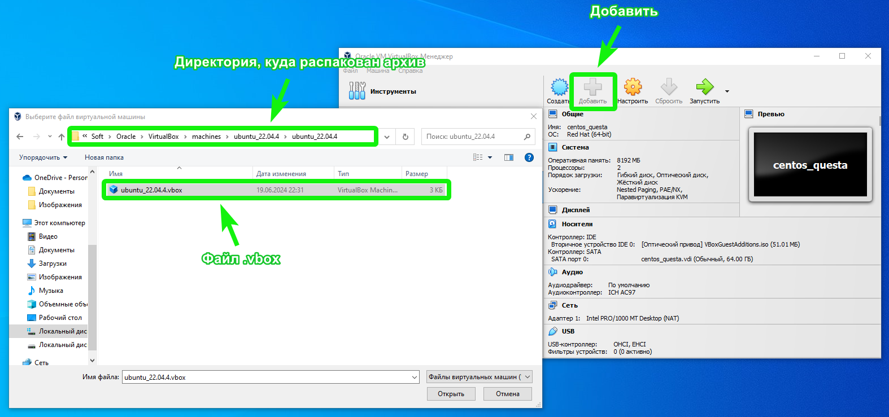
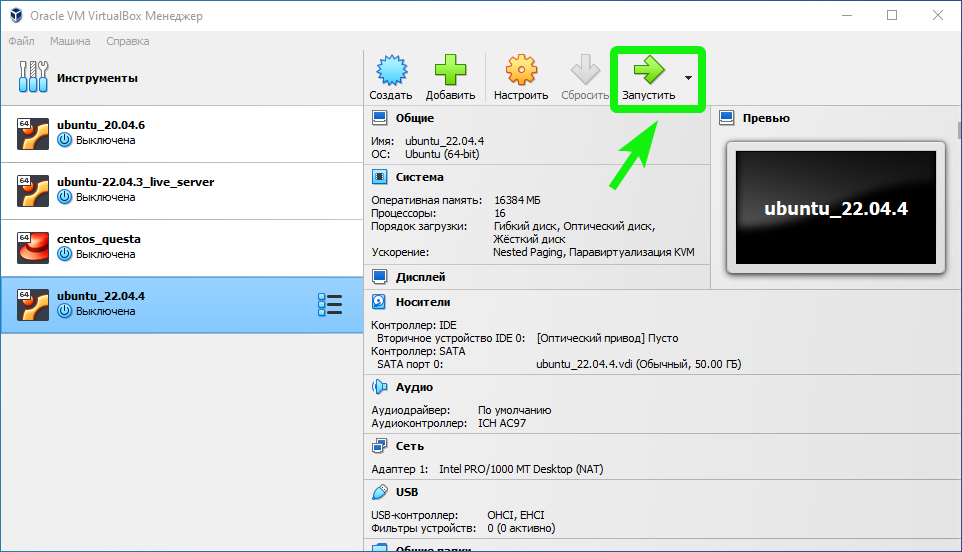

# Настройка виртуальной машины

## Общая информация

Предоставляемыая в рамках курса виртуальная машина является [OEM-версией](https://askubuntu.com/questions/1386806/what-is-oem-installation-regarding-linux-distributions), то есть **создание учетной записи предусмотрено на стороне пользователя**.

При этом машина уже содержит все ПО, необходимое для выполнения курса. Так что после создания учетной записи можно сразу же [клонировать](../README.md#клонирование-и-работа) репозиторий курса и работать с ним.

## Маршрут установки

1. [Загрузите архив](https://files.sberdisk.ru/s/4spKiYpcaxarmPC) с виртуальной машиной;
2. Распакуйте архив;
3. В VirtualBox выберите `Добавить` и укажите файл с расширением `.vbox` из распакованного архива;
  
4. Запустите ВМ;
  
5. Создайте учетную запись;
6. Вы готовы к работе.
