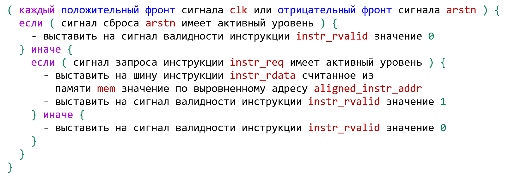
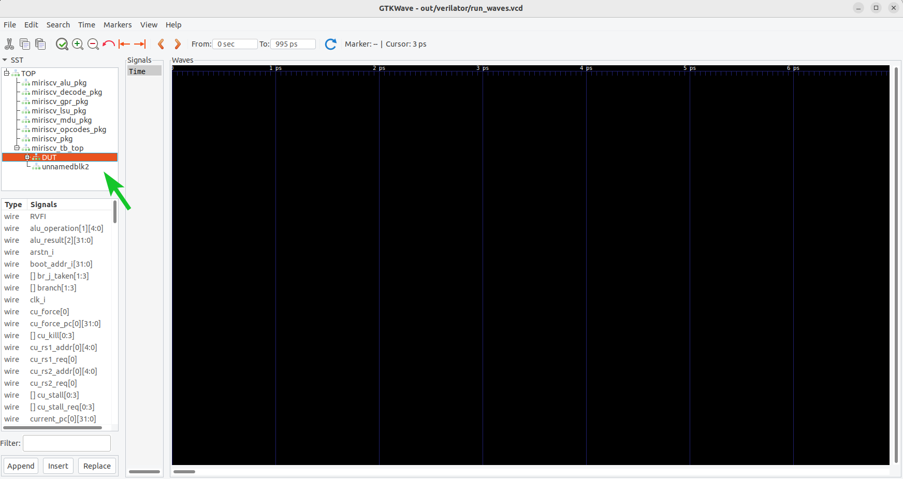
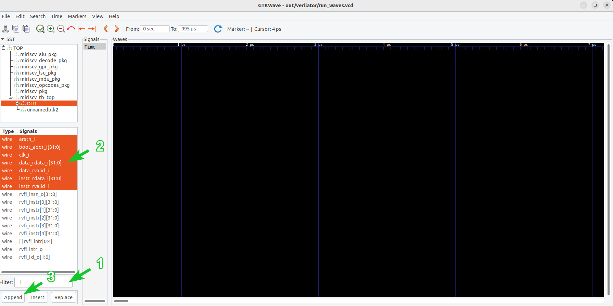
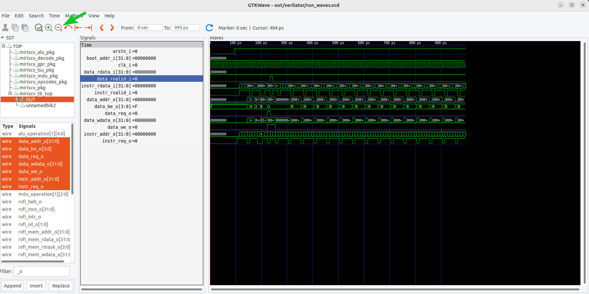
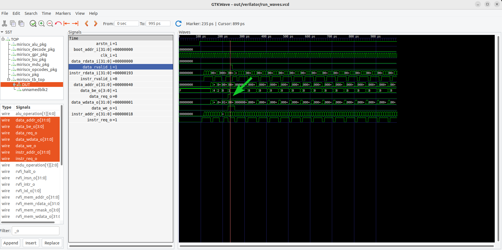
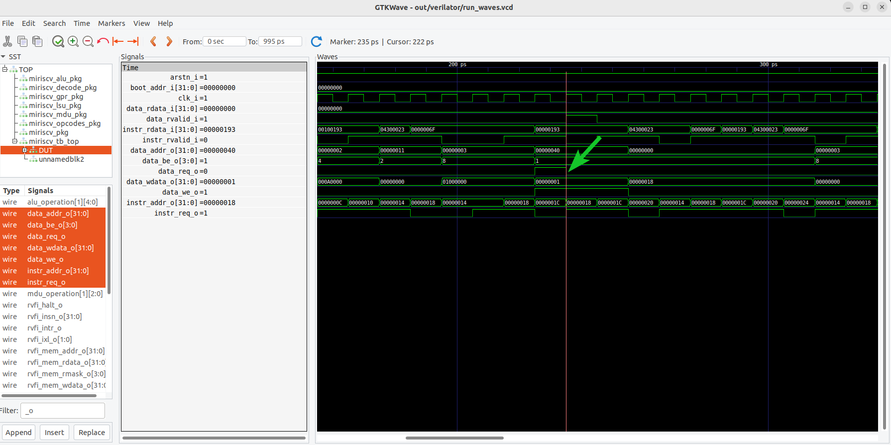
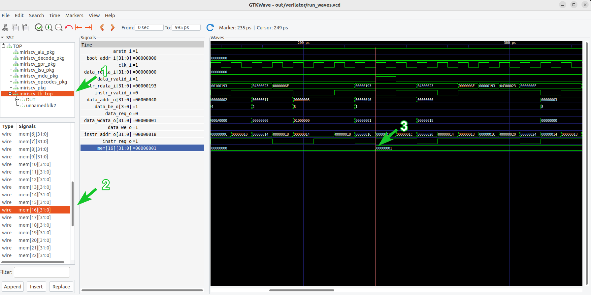
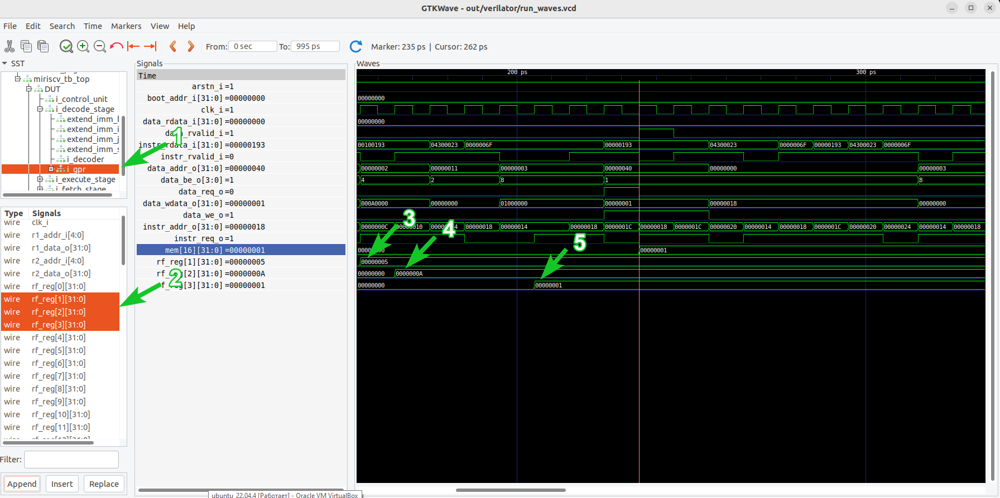

# Практическое занятие 00: Тест "Hello world!"

- [Практическое занятие 00: Тест "Hello world!"](#практическое-занятие-00-тест-hello-world)
  - [Необходимое ПО](#необходимое-по)
  - [Рекомендуемый материал](#рекомендуемый-материал)
  - [Краткое содержание](#краткое-содержание)
  - [Тестируемое RISC-V ядро](#тестируемое-risc-v-ядро)
  - [Работа с верификационным окружением](#работа-с-верификационным-окружением)
    - [Подготовка](#подготовка)
    - [Создание главного модуля верификационного окружения](#создание-главного-модуля-верификационного-окружения)
    - [Анализ главного модуля тестируемого ядра](#анализ-главного-модуля-тестируемого-ядра)
    - [Подключение главного модуля ядра в верификационное окружение](#подключение-главного-модуля-ядра-в-верификационное-окружение)
    - [Создание модели памяти](#создание-модели-памяти)
    - [Блок основного тестового сценария](#блок-основного-тестового-сценария)
    - [Взаимодействие с сигналами инструкций и данных ядра](#взаимодействие-с-сигналами-инструкций-и-данных-ядра)
  - [Написание тестовой программы](#написание-тестовой-программы)
  - [Сборка и запуск симуляции](#сборка-и-запуск-симуляции)
  - [Анализ результатов](#анализ-результатов)
    - [Лог-файлы](#лог-файлы)
    - [Временные диаграммы](#временные-диаграммы)
  - [Эталонная реализация](#эталонная-реализация)
  - [Выводы](#выводы)


## Необходимое ПО

Подразумевается, что **задание выполняется на:**
- [на предоставленной виртуальной машине](../../#использование-виртуальной-машины);
- на ином дистрибутиве Linux с [установленным необходимым ПО](../../#ручная-установка).


## Рекомендуемый материал

- [Тема 00: Вводная](../../theory/00_intro.md)
- [Тема 01: Функциональная верификация процессорных ядер](../../theory/01_basics.md)
- [Тема 02: Основные подходы к функциональной верификации RISC-V ядер](../../theory/02_approach.md)
- [Тема 03: Базовые подходы к симуляции RISC-V ядер](../../theory/03_func.md)


## Краткое содержание

Данное занятие воспроизводит маршрут подхода к верификации процессорных ядер ["Hello world"](../../theory/03_func.md#hello-world) на примере RISC-V ядра с открытым исходным кодом [MIRISCV](https://github.com/riscv-tests-intro/MIRISCV/tree/b510b308addc4a7271e36f2a348bd18bf24c1d77). **Занятие состоит из 4 основных этапов, выполняемых друг за другом.**

[Работа с верификационным окружением](#работа-с-верификационным-окружением) - создаются и заполняются должным образом исходные файлы верификационного окружения. [Написание тестовой программы](#написание-тестовой-программы)- создается программа для тестирования ядра. [Сборка и запуск симуляции](#сборка-и-запуск-симуляции) - создаются необходимые директории и выполняются команды, необходимые для запуска симуляции. [Анализ результатов](#анализ-результатов) - анализируется поведение процессорного ядра, делается вывод о корректности его работы.

## Тестируемое RISC-V ядро

В рамках курса будет тестироваться учебное ядро, разработанное в НИУ МИЭТ: [MIRISCV](https://github.com/riscv-tests-intro/MIRISCV/tree/b510b308addc4a7271e36f2a348bd18bf24c1d77). Процессор поддерживает расширения RV32I и RV32M и является четырехстадийным [in-order](https://en.wikipedia.org/wiki/Out-of-order_execution#In-order_processors) [конвейером](https://en.wikipedia.org/wiki/Instruction_pipelining). Ядро поддерживает только машинный уровень привилегий[^1].

<p align="center">
  </img>
</p>

Подробную документацию на процессор можно найти по [ссылке](https://github.com/riscv-tests-intro/MIRISCV/tree/b510b308addc4a7271e36f2a348bd18bf24c1d77/doc/miriscv/miriscv_scheme.md). В рамках курса его функциональные особенности подробно разбираться не будут, а необходимая для выполнения заданий информация будет даваться по ходу повествования.

## Работа с верификационным окружением

### Подготовка

**Подразумевается, что команды начинают выполняться в директории, в которой расположен данный файл с описанием занятия.** Для того, чтобы реализовать [подход "Hello world"](../../theory/03_func.md#hello-world) нам для начала понадобятся две директории:

- `tb` - для исходных файлов верификационного окружения;
- `build` - для файлов сборки и запуска тестирования.

Создадим эти директории:

```bash
mkdir tb
mkdir build
```

### Создание главного модуля верификационного окружения

Все верификационное окружение будет располагаться в файле `miriscv_tb_top.sv`. Писать будем на языке описания и верификации аппаратуры [SystemVerilog](https://en.wikipedia.org/wiki/SystemVerilog). В настоящее время он является промышленным стандартом.

Перейдем в директорию исходных файлов верификационного окружения:

```bash
cd tb
```

Создадим необходимый файл:

```bash
touch miriscv_tb_top.sv
```

### Анализ главного модуля тестируемого ядра

И давайте сразу посмотрим на главный модуль (далее может применяться термин "топ-модуль") тестируемого ядра [`miriscv_core.sv`](https://github.com/riscv-tests-intro/MIRISCV/tree/b510b308addc4a7271e36f2a348bd18bf24c1d77/miriscv/rtl/miriscv_core.sv). Файл можно открыть в любом редакторе. Открываем при помощи gedit:

```bash
gedit ../../../submodules/MIRISCV/miriscv/rtl/miriscv_core.sv
```

**Обратите внимание**, что в превью ниже **часть кода осознанно исключена**, так как в рамках этого занятия она не играет никакой роли.

```SystemVerilog
module miriscv_core
  ...
  import miriscv_pkg::ILEN;
  ...
#(
  parameter bit RVFI = 1'b1
) (
  // Clock, reset
  input  logic              clk_i,
  input  logic              arstn_i,

  input  logic [XLEN-1:0]   boot_addr_i,

  // Instruction memory interface
  input  logic              instr_rvalid_i,
  input  logic [XLEN-1:0]   instr_rdata_i,
  output logic              instr_req_o,
  output logic [XLEN-1:0]   instr_addr_o,

  // Data memory interface
  input  logic              data_rvalid_i,
  input  logic [XLEN-1:0]   data_rdata_i,
  output logic              data_req_o,
  output logic              data_we_o,
  output logic [XLEN/8-1:0] data_be_o,
  output logic [XLEN-1:0]   data_addr_o,
  output logic [XLEN-1:0]   data_wdata_o,

  // RVFI
  ...
);
```

Прежде всего видим параметр, отвечающий за поддержку [интерфейса RVFI](../../theory/04_rgen.md#интерфейс-rvfi). По умолчанию его значение равно 1, запомним это.

Далее можем наблюдать тактовый сигнал `clk_i`, сигнал асинхронного сброса с негативным активным уровнем `arstn_i`, сигнал `boot_addr_i`, отвечающий за то, с какого адреса в памяти ядро начнет выполнять инструкции.

Также видим сигналы с `instr_rvalid` ... `instr_addr`, отвечающие за интерфейс инструкций и сигналы `data_rvalid` ... `data_be`, отвечающие за интерфейс данных. Более подробно про чтение инструкций из памяти ядром MIRISCV можно прочитать [тут](https://github.com/riscv-tests-intro/MIRISCV/tree/b510b308addc4a7271e36f2a348bd18bf24c1d77/doc/miriscv/fetch_stage.md#%D0%B7%D0%B0%D0%B3%D1%80%D1%83%D0%B7%D0%BA%D0%B0-%D0%B8%D0%BD%D1%81%D1%82%D1%80%D1%83%D0%BA%D1%86%D0%B8%D0%B9-%D0%B8%D0%B7-%D0%BF%D0%B0%D0%BC%D1%8F%D1%82%D0%B8-%D0%B8%D0%BD%D1%81%D1%82%D1%80%D1%83%D0%BA%D1%86%D0%B8%D0%B9). Про чтение(запись) данных из(в) памяти(ь) - [тут](https://github.com/riscv-tests-intro/MIRISCV/tree/b510b308addc4a7271e36f2a348bd18bf24c1d77/doc/miriscv/lsu.md).

### Подключение главного модуля ядра в верификационное окружение

Начинаем писать верификационное окружение. Открываем созданный ранее `miriscv_tb_top.sv`:

```bash
gedit miriscv_tb_top.sv
```

Код ниже пишем в открытом файле.

Для начала определим тело верхнего модуля (топ-модуля) верификации:

```SystemVerilog
module miriscv_tb_top;

endmodule
```

Определим:
- тактовый сигнал;
- сигнал сброса;
- остальные сигналы инструкций и данных.

```SystemVerilog
module miriscv_tb_top;

    // Clock period
    parameter CLK_PERIOD = 10;

    // Clock and reset
    logic clk;
    logic arstn;

    // Instruction memory signals
    logic        instr_rvalid;
    logic [31:0] instr_rdata;
    logic        instr_req;
    logic [31:0] instr_addr;

    // Data memory signals
    logic        data_rvalid;
    logic [31:0] data_rdata;
    logic        data_req;
    logic [31:0] data_wdata;
    logic [31:0] data_addr;
    logic        data_we;
    logic [31:0] data_be;

endmodule
```

Сгенерируем тактовый сигнал и сигнал сброса:

```SystemVerilog
initial begin
    clk <= 0;
    forever begin
        #(CLK_PERIOD/2) clk = ~clk;
    end
end

initial begin
    arstn <= 0;
    repeat(10) @(posedge clk);
    arstn <= 1;
end
```

Подключим необходимые сигналы тестируемому ядру. Код будет выглядеть так:

```SystemVerilog
module miriscv_tb_top;

    // Clock period
    parameter CLK_PERIOD = 10;

    // Clock and reset
    logic clk;
    logic arstn;

    // Instruction memory signals
    logic        instr_rvalid;
    logic [31:0] instr_rdata;
    logic        instr_req;
    logic [31:0] instr_addr;

    // Data memory signals
    logic        data_rvalid;
    logic [31:0] data_rdata;
    logic        data_req;
    logic [31:0] data_wdata;
    logic [31:0] data_addr;
    logic        data_we;
    logic [31:0] data_be;

    initial begin
        clk <= 0;
        forever begin
            #(CLK_PERIOD/2) clk = ~clk;
        end
    end

    initial begin
        arstn <= 0;
        repeat(10) @(posedge clk);
        arstn <= 1;
    end

    // DUT
    miriscv_core #(
        .RVFI                 ( 0            )
    ) DUT (

        // Clock and Reset
        .clk_i                ( clk          ),
        .arstn_i              ( arstn        ),

        // Boot address
        .boot_addr_i          ( 'b0          ),

        // Instruction memory interface
        .instr_rvalid_i       ( instr_rvalid ),
        .instr_rdata_i        ( instr_rdata  ),
        .instr_req_o          ( instr_req    ),
        .instr_addr_o         ( instr_addr   ),

        // Data memory interface
        .data_rvalid_i        ( data_rvalid  ),
        .data_rdata_i         ( data_rdata   ),
        .data_req_o           ( data_req     ),
        .data_we_o            ( data_we      ),
        .data_be_o            ( data_be      ),
        .data_addr_o          ( data_addr    ),
        .data_wdata_o         ( data_wdata   )

    );

endmodule
```

**Обратите внимание**, что значение параметра `RVFI` установлено в 0, т.к. в ходе данного занятия поддержка этого интерфейса ядром нам не потребуется. Также сигнал `boot_addr_i` подключен к 0, то есть процессор начнет запрашивать инструкции с нулевого адреса.

Далее продолжаем писать внутри модуля `miriscv_tb_top`.

### Создание модели памяти

Процессор будет взаимодействовать с памятью для чтения инструкций и чтения/записи данных. Определим память, состоящую из 32 слов по 32 бита каждое, при помощи распакованного массива:

```SystemVerilog
// Main memory handle
logic [31:0] mem [32];
```

Также нам необходимо загрузить инструкции и данные в память из некоторого файла. Давайте создадим для этого специальную функцию `load_binary_to_mem()`:

```SystemVerilog
function automatic void load_binary_to_mem();
    string bin;
    if(!$value$plusargs("bin=%0h", bin))
        $fatal("You must provide 'bin' via commandline!");
    $readmemh(bin, mem);
endfunction
```

Через системную функцию `$value$plusargs` в переменную `bin` считываем имя файла, откуда будет проинициализирована память. Не забываем вызвать системную функцию `$fatal()`, которая сразу завершит симуляцию, если при запуске симулятора в качестве аргумента не будет передан нужный файл таким образом: `+bin=<имя-файла>`.

Далее через системную функцию `$readmemh()` считываем данные из файла, название которого хранится в переменной `bin`, в память `mem`. **Обратите внимание**, что для корректной работы функции `$readmemh()` данные в файле должны быть в шестнадцатиричном формате.

### Блок основного тестового сценария

Далее напишем блок, который будет выполняться в начале симуляции и отвечать за:

- сохранение сигналов на временную диаграмму;
- инициализацию памяти;
- ожидание 100 положительных фронтов сигнала `clk`;
- завершение тестирования.

```SystemVerilog
initial begin
    string dump;
    // Save waveforms
    if(!$value$plusargs("dump=%s", dump)) begin
        dump = "waves.vcd";
    end
    $dumpfile(dump);
    $dumpvars();
    // Load program to the memory
    load_binary_to_mem();
    // Wait some clocks
    repeat(100) @(posedge clk);
    $finish();
end
```

В этом блоке мы опционально получаем через `$value$plusargs` аргумент `dump`, указывающий имя файла для сохранения изменения сигналов во времени (временная диаграмма). Далее определяем файл и сохраняем сигналы при помощи `$dumpfile()` и `$dumpvars()`.

<details>
  <summary>Чуть подробнее про сохранение сигналов</summary>

Вызов `$dumpvars()` без аргументов сохраняет изменение всех сигналов (топ-модуля и всех модулей, включенных в топ-модуль и так далее по иерархии) в течение всего времени симуляции (если в ходе симуляции в коде далее не будет выполнена системная функция `$dumpoff`). Подробнее про `$dumpfile()` и `$dumpvars()` можно прочитать по [ссылке](https://referencedesigner.com/tutorials/verilog/verilog_62.php).

</details><br>

Далее происходит инициализация памяти при помощи функции `load_binary_to_mem()`, код которой был разобран выше. Завершающим шагом идет ожидание 100 положительных фронтов тактового сигнала `clk`. **Обратите внимание**, что число 100 здесь выбрано из эмпирических соображений о том, что процессор завершит выполнение программы в памяти `mem` за 100 тактов.

###  Взаимодействие с сигналами инструкций и данных ядра

Осталось спроектировать часть окружения, отвечающую за взаимодействие с сигналами инструкций и данных ядра.

**Начнем с сигналов инструкций:**

```SystemVerilog
logic [31:0] aligned_instr_addr;
assign aligned_instr_addr = {2'b00, instr_addr [31:2]};

always_ff @(posedge clk or negedge arstn) begin
    if(!arstn) begin
        instr_rvalid <= 0;
    end
    else begin
        if(instr_req) begin
            instr_rdata  <= mem[aligned_instr_addr];
            instr_rvalid <= 1;
        end
        else instr_rvalid <= 0;
    end
end
```

**Псевдокод ниже объясняет поведение сигналов инструкций.**<br>
**Вдумчиво прочитайте его!**

```
( каждый положительный фронт сигнала 'clk' или отрицательный фронт сигнала 'arstn' ) {
  если ( сигнал сброса 'arstn' имеет активный уровень ) {
    - выставить на сигнал валидности инструкции 'instr_rvalid' значение 0
  } иначе {
    если ( сигнал запроса инструкции 'instr_req' имеет активный уровень ) {
      - выставить на шину инструкции 'instr_rdata' считанное из 
        памяти mem значение по выровненному адресу 'aligned_instr_addr'
      - выставить на сигнал валидности инструкции 'instr_rvalid' значение 1
    } иначе {
      - выставить на сигнал валидности инструкции 'instr_rvalid' значение 0
    }
  }
}
```

<details>
  <summary>Тот же псевдокод без возможности копирования, но с подсветкой ситаксиса</summary>



</details><br>

Отдельно стоит остановиться на том, почему при чтении инструкции значение шины адреса делится на 4 посредством отбрасывания двух младших бит:

```SystemVerilog
logic [31:0] aligned_instr_addr;
assign aligned_instr_addr = {2'b00, instr_addr [31:2]};
```

Дело в том, что адрес, генерируемый ядром - побайтовый. А память, к которой мы обращаемся - пословная (ширина слова 32-бит). Мы ожидаем, что адрес, генерируемый ядром всегда будет выровнен по границе 4 байт (т.к. программа, которая может исполняться на ядре содержит только инструкции длиной 32 бит). Тогда мы можем смело отбрасывать последние 2 бита адреса и обращаться по "урезанному" адресу в память `mem`. Таким образом, для побайтового адреса конвертация будет следующей:

```
0 -> 0 //
1 -> 0 // 
2 -> 0 // 
3 -> 0 // 
4 -> 1 // 
5 -> 1 // 
...
```

То есть побайтовый адрес "транслируется" в пословный при помощи деления. Байты с 3 по 0 соответствуют 1 слову, с 4 по 7 - 2 слову и так далее. Расположение байт в памяти `mem` представлено в таблице ниже:

<p align="center">

|  |  |  |  |  |
|:----------------:|:----------------:|:----------------:|:----------------:|:----------------:|
| 3                | 2                | 1                | 0                | `mem[0]`         |
| 7                | 6                | 5                | 4                | `mem[1]`         |
| ...              | ...              | ...              | ...              |   ...            |

</p>

Более подробно про чтение инструкций из памяти ядром MIRISCV можно прочитать [тут](https://github.com/riscv-tests-intro/MIRISCV/tree/b510b308addc4a7271e36f2a348bd18bf24c1d77/doc/miriscv/fetch_stage.md#%D0%B7%D0%B0%D0%B3%D1%80%D1%83%D0%B7%D0%BA%D0%B0-%D0%B8%D0%BD%D1%81%D1%82%D1%80%D1%83%D0%BA%D1%86%D0%B8%D0%B9-%D0%B8%D0%B7-%D0%BF%D0%B0%D0%BC%D1%8F%D1%82%D0%B8-%D0%B8%D0%BD%D1%81%D1%82%D1%80%D1%83%D0%BA%D1%86%D0%B8%D0%B9).

**Если разобрались с инструкциями - приступаем к данным:**

```SystemVerilog
logic [31:0] aligned_data_addr;
assign aligned_data_addr = {2'b00, data_addr [31:2]};

always_ff @(posedge clk or negedge arstn) begin
    if(!arstn) begin
        data_rvalid <= 0;
    end
    else begin
        if(data_req) begin
            if (data_we) begin
                for (int i = 0; i < 4; i++) begin
                    if (data_be[i]) begin
                        mem[aligned_data_addr][8*i+:8] <= data_wdata[8*i+:8];
                    end
                end
            end
            else begin
                data_rdata <= mem[aligned_data_addr];
            end
            data_rvalid <= 1;
        end
        else data_rvalid <= 0;
    end
end
```

**Псевдокод ниже объясняет поведение сигналов данных.**<br>
**Вдумчиво прочитайте его!**

```
( каждый положительный фронт сигнала 'clk' или отрицательный фронт сигнала 'arstn' ) {
  если ( сигнал сброса 'arstn' имеет активный уровень ) {
    - выставить на сигнал валидности данных 'data_rvalid' значение 0
  } иначе {
    если ( сигнал запроса данных 'data_req' имеет активный уровень ) {
      если ( сигнала записи данных 'data_we' имеет активный уровень ) {
        ( для каждого бита сигнала валидности байта 'data_be' ) {
          если ( бит сигнала 'data_be' имеет активный уровень ) {
            - записать в байт слова памяти mem по выровненному адресу
              'aligned_data_addr' соответствующий ему байт шины данных
              записи data_wdata
          } 
        }
      } иначе {
        - выставить на шину данных чтения 'data_rdata' считанное 
          из памяти mem значение по выровненному адресу 'aligned_data_addr'
      }
      - выставить на сигнал валидности данных 'data_rvalid' значение 1
    } иначе {
      - выставить на сигнал валидности данных 'data_rvalid' значение 0
    }
  }
}
```

<details>
  <summary>Тот же псевдокод без возможности копирования, но с подсветкой ситаксиса</summary>


</details><br>

Деление и выравнивание адреса данных делается аналогично выравниванию адреса инструкций. Адрес может быть выровнен, так как **MIRISCV не поддерживает чтение и запись данных по невыровненному адресу.** Более подробно про чтение(запись) данных из(в) памяти(ь) ядром MIRISCV можно прочитать [тут](https://github.com/riscv-tests-intro/MIRISCV/tree/b510b308addc4a7271e36f2a348bd18bf24c1d77/doc/miriscv/lsu.md).

<details>
  <summary>Если вам интересно, как работает [8*i+:8]</summary>

Отдельно стоит остановиться на том, как происходит побайтовое итерирование при определении валидности байт при помощи сигнала `data_be`:

```SystemVerilog
for (int i = 0; i < 4; i++) begin
    if (data_be[i]) begin
        mem[aligned_data_addr][8*i+:8] <= data_wdata[8*i+:8];
    end
end
```

Если вы попробуете определять диапазон бит как `[8*i:8*i+7]`, то большинство симуляторов укажут вам на ошибку. В Verilator 5.024 текст ошибки выглядит следующим образом:

```
%Error: ../tb/../tb/miriscv_tb_top.sv:123:53: First value of [a:b] isn't a constant, maybe you want +: or -:
                                            : ... note: In instance 'miriscv_tb_top'
  123 |                             mem[aligned_data_addr][8*i:8*i+7] <= data_wdata[8*i+:8];
      |                                                     ^
```

Дело в том, что стандартом языка SystemVerilog закреплено, что ширина диапазона должна быть константной при итерировании. Как мы видим, Verilator сам подсказывает нам решение: `maybe you want +: or -:`.

При помощи конструкций `+:` и `-:` в SystemVerilog появляется возможность циклически определять диапазон одинаковой ширины. `[A+:B]` раскрывается в `[A+B-1:A]`, а `[A-:B]` раскрывается в `[A:A-B+1]`. Например:

`mem[ 0 +: 8]` эквивалентно `mem[ 7 : 0]` <br>
`mem[15 -: 8]` эквивалентно `mem[15 : 8]` <br>

Тогда в нашем случае цикл

```SystemVerilog
for (int i = 0; i < 4; i++) begin
    if (data_be[i]) begin
        mem[aligned_data_addr][8*i+:8] <= data_wdata[8*i+:8];
    end
end
```

раскроется в

```SystemVerilog
if (data_be[0]) begin
    mem[aligned_data_addr][ 7: 0] <= data_wdata[ 7: 0];
end
if (data_be[1]) begin
    mem[aligned_data_addr][15: 8] <= data_wdata[15: 8];
end
if (data_be[2]) begin
    mem[aligned_data_addr][23:16] <= data_wdata[23:16];
end
if (data_be[3]) begin
    mem[aligned_data_addr][31:24] <= data_wdata[31:24];
end
```

</details>

Итак, проектирование окружения завершено. Сохраняем и закрываем файл `miriscv_tb_top.sv`.

Переходим на один уровень назад:

```bash
cd ..
```

Теперь мы в корневой директории практического занятия. **Приступаем к написанию тестовой программы.**

## Написание тестовой программы

[Тестирование "Hello world!"](../../theory/03_func.md#hello-world) подразумевает под собой написание простейшей программы, которая может подтвердить, что процессор корректно выполняет элементарный тестовый сценарий.

В качестве тестовой программы предлагается следующая (написана на ассемблере[^2] RISC-V, все инструкции являются инструкциями базового расширения RV32I, которое поддерживает тестируемое процессорное ядро MIRISCV):

```bash
addi x1, x0, 5
addi x2, x0, 10
beq x1, x2, 16
addi x3, x0, 1
sb x3, 64(x0)
jal x0, 0
addi x3, x0, 0
sb x3, 64(x0)
jal x0, 0
```

- При помощи инструкций `addi x1, x0, 5` и `addi x2, x0, 10` в 1 и 2 регистры общего назначения процессорного ядра записываются значения 5 и 10 соответственно.
- Далее значения в регистрах 1 и 2 сравниваются при помощи инструкции `beq x1, x2, 16`.
  - В случае равенства значений происходит переход на 16/4 = 4 инструкции вперед, то есть на инструкцию `addi x3, x0, 0`, которая загружает в регистр 3 значение 0. Далее следует сохранение этого нуля в память по адресу 64 при помощи инструкции `sb x3, 64(x0)` и зацикливание на одном месте при помощи инструкции `jal x0, 0`, которая выполняет безусловный переход "сама на себя".
  - В случае неравенства значений в регистрах 1 и 2 происходит схожая ситуация, только в регистр 3 записывается значение 1, а далее это значение записывается в память по такому же адресу 64.

<details>
  <summary>Подробное описание каждой инструкции тестовой программы</summary>

|                  |                                                                                                                                                   |
|------------------|---------------------------------------------------------------------------------------------------------------------------------------------------|
|  |                                                                                                                                                   |
|`addi x1, x0, 5`  |сложение значения в регистре `x0` с константой 5 и запись резальтата в регистр `x1`;                                                               |
|`addi x2, x0, 10` |сложение значения в регистре `x0` с константой 10 и запись резальтата в регистр `x2`;                                                              |
|`beq x1, x2, 16`  |если значение в регистре `x1` равно значению в регистре `x2` - совершить переход по адресу `pc` + 16, где `pc` - текущее значение счетчика команд; |
|`addi x3, x0, 1`  |сложение значения в регистре `x0` с константой 1 и запись резальтата в регистр `x3`;                                                               |
|`sb x3, 64(x0)`   |запись малдшего байта слова из регистра `x3` по адресу `x0` + 64, где `x0` - значение в регистре `x0`;                                             |
|`jal x0, 0`       |безусловный переход по адресу `pc` + 0, где `pc` - текущее значение счетчика команд (в регистр `x0` сохраняется значение `pc` + 4);                |
|`addi x3, x0, 0`  |сложение значения в регистре `x0` с константой 1 и запись резальтата в регистр `x3`;                                                               |
|`sb x3, 64(x0)`   |запись малдшего байта слова из регистра `x3` по адресу `x0` + 64, где `x0` - значение в регистре `x0`;                                             |
|`jal x0, 0`       |безусловный переход по адресу `pc` + 0, где `pc` - текущее значение счетчика команд (в регистр `x0` сохраняется значение `pc` + 4);                |

</details><br>

Перейдем в директорию для сборки и запуска:

```bash
cd build
```

Создадим файл тестовой программы `program.hex` и откроем его текстовым редактором:

```bash
touch program.hex
gedit program.hex
```

Сконвертируем ассемблерные команды в машинный код в шестандцатиричном формате и запишем в файл `program.hex`:

```bash
00500093
00a00113
00208863
00100193
04300023
0000006f
00000193
04300023
0000006f
```

Добавим к каждой инструкции комментарий в виде ассемблера:

```
00500093 // addi x1, x0, 5
00a00113 // addi x2, x0, 10
00208863 // beq x1, x2, 16
00100193 // addi x3, x0, 1
04300023 // sb x3, 64(x0)
0000006f // jal x0, 0
00000193 // addi x3, x0, 0
04300023 // sb x3, 64(x0)
0000006f // jal x0, 0
```

Написание тестовой программы завершено. **Остается открытым вопрос: какое поведение тестируемого процессорного ядра при выполнении этой программы является корректным?**

Очевидно, что значения в регистрах 1 и 2 не совпадают. Значит процессорное ядро в ходе выполнения программы должно записать в память по адресу 64 значение 1, после чего оказаться в бесконечном цикле. Остается только убедиться в этом, запустив симуляцию!

Теперь сохраним файл тестовой программы `program.hex` и закроем его.

Переходим на один уровень назад:

```bash
cd ..
```

Теперь мы в корневой директории практического занятия. **Приступаем к сборке и запуску симуляции.**


## Сборка и запуск симуляции

Перейдем в директорию для сборки и запуска:

```bash
cd build
```

Запускать симуляцию будем при помощи [Verilator 5.024](https://github.com/verilator/verilator/tree/522bead374d6b7b2adb316304126e5361b18bcf1).


Создадим директорию для сохранения артефактов симуляции:

```
mkdir -p out/verilator
```

**Скомпилируем RTL тестируемого ядра и сам файл окружения** при помощи Verilator (команда содержит большое количество аргументов, ниже разберем их значение):

```bash
verilator -Wno-WIDTHEXPAND -Wno-WIDTHTRUNC -Wno-UNUSEDSIGNAL -Wno-UNUSEDPARAM \
-Wno-PINMISSING -Wno-GENUNNAMED -Wno-CASEINCOMPLETE -Wno-UNOPTFLAT -Wno-INFINITELOOP \
-Wno-MULTIDRIVEN -Wno-INITIALDLY -cc -O2 -j 1 --threads 1 --binary \
../../../submodules/MIRISCV/miriscv/rtl/include/*.sv ../../../submodules/MIRISCV/miriscv/rtl/*.sv \
../tb/miriscv_tb_top.sv +incdir+../tb/ --trace --trace-params --trace-structs --x-assign 0 \
-top-module miriscv_tb_top -Mdir out/verilator &> out/verilator/compile.log
```

**Обратим внимание** на аргументы  `../../../submodules/MIRISCV/miriscv/rtl/include/*.sv` и `../../../submodules/MIRISCV/miriscv/rtl/*.sv`. Они являются регулярными выражениями для определения исходных файлов RTL ядра. Аргумент `../tb/miriscv_tb_top.sv` является файлом верификационного окружения.

Аргумент `-top-module miriscv_tb_top` определяет топ-модуль для симуляции. Иначе говоря определяет точку входа. Аргумент `-Mdir out/verilator` определяет выходную директорию артефактов компиляции. Выражение `&> out/verilator/compile.log` перенаправляет поток вывода в файл `out/verilator/compile.log`. По сути этот файл будет являться лог-файлом компиляции.

<details>
  <summary>Если вам интересен разбор всех аргументов, переданных в Verilator в ходе компиляции</summary>

Разберем аргументы команды `verilator` подробнее:

- `Wno-WIDTHEXPAND -Wno-WIDTHTRUNC -Wno-UNUSEDSIGNAL -Wno-UNUSEDPARAM
-Wno-PINMISSING -Wno-GENUNNAMED -Wno-CASEINCOMPLETE -Wno-UNOPTFLAT -Wno-INFINITELOOP -Wno-MULTIDRIVEN -Wno-INITIALDLY` - аргумент `Wno-<название>` отключает вывод предупреждения с названием `<название>`. Например, `-Wno-UNUSEDSIGNAL` отключает информирование о том, что сигнал был объявлен в контексте компиляции, но не был ни разу использован. Если вы хотите получить информацию о каждом предупреждении, то это можно сделать [в соответствующем разделе документации](https://verilator.org/guide/latest/warnings.html#list-of-warnings) на Verilator.
  <details>
    <summary>Почему бы тогда не писать "чистый" код?</summary>
  Очевидно, что в идеальном случае, при отсутствии "вольностей" в коде, в ходе компиляции предупреждений возникать не должно. Подавляющая часть предупреждений в данном случае возникает в исходных файлах тестируемого ядра, было принято решение не модифицировать оригинальный RTL и использовать его "как есть", а предупреждения отключать при помощи аргументов.
  </details>
- `-cc -O2` - задает уровень оптимизации в ходе компиляции;
- `-j 1` - задание количества потоков для компиляции;
- `--threads 1` - задание количества потоков для симуляции;
- `--binary` - указание на то, что результатом компиляции будет бинарный файл;
- `../../../submodules/MIRISCV/miriscv/rtl/include/*.sv ../../../submodules/MIRISCV/miriscv/rtl/*.sv ../tb/miriscv_tb_top.sv` - wildcard файлов для компиляции исходных файлов RTL ядра и файл верификационного окружения;
- ` +incdir+../tb/` - директория для поиска файлоа директивы \`include;
- `--trace --trace-params` - включение сохранения изменения сигналов (временных диаграмм) и включение сохранения значений параметров;
- `--trace-structs` - включение поэлементного сохранения элементов упакованных и распакованных массивов (с целью удобства восприятия временной диаграммы);
- `--x-assign 0` - Verilator поддерживает только два состояния переменных симулируемой системы: 0 и 1 (не поддерживает X и Z). Флаг указывает на то, чтобы переменные, которые могут принимать X-состоянеи в начале симуляции, принимали значение 0;
- `-top-module miriscv_tb_top` - определение топ-модуля для симуляции (в нашем случае это топ-файл верификационного окружения). Иначе говоря определяет точку входа.
- `-Mdir out/verilator` определяет выходную директорию артефактов компиляции.

</details>

Откроем файл лог-файл компиляции `out/verilator/compile.log` любым редактором:

```bash
gedit out/verilator/compile.log
```

Увидим что-то похожее на:

```bash
- V e r i l a t i o n   R e p o r t:
- Verilator: Built from 2.592 MB sources in 27 modules, into 0.901 MB in 12 C++ files needing 0.001 MB
- Verilator: Walltime 0.331 s (elab=0.009, cvt=0.053, bld=0.242); cpu 0.000 s on 1 threads; alloced 29.789 MB
```

Компиляция завершилась успешно. В этом случае в директории `out/verilator` появится большое количество файлов, в том числе файл `Vmiriscv_tb_top`, который нам и нужен. Для запуска симуляции Verilator 5.024 создает файл с названием `V<имя-топ-модуля>`, где `<имя-топ-модуля>` - имя модуля, указанное в аргументе `-top-module`.

Запустим симуляцию:

```bash
out/verilator/Vmiriscv_tb_top +bin=program.hex \
  +dump=out/verilator/run_waves.vcd &> out/verilator/run.log
```

Аргумент `+bin=program.hex` определяет имя файла с тестовой программой, которая будет загружаться в память, с которой будет взаимодействовать ядро. Иницилизация памяти подробно разбиралась в разделе [Создание модели памяти](#создание-модели-памяти). Аргумент `+dump=out/verilator/run_waves.vcd` определяет имя файла для сохранения изменения сигналов (временной диаграммы). Выражение `&> out/verilator/run.log` перенаправляет поток вывода в файл `out/verilator/run.log`. По сути этот файл будет являться лог-файлом симуляции.

## Анализ результатов

### Лог-файлы

Любым редактором откроем лог-файл симуляции `out/verilator/run.log`:

```bash
gedit out/verilator/run.log
```

Увидим что-то похожее на:

```bash
- ../tb/../tb/miriscv_tb_top.sv:95: Verilog $finish
- S i m u l a t i o n   R e p o r t:
- Verilator: $finish at 1ns; walltime 0.001 s; speed 0.000 s/s
- Verilator: cpu 0.000 s on 1 threads; alloced 57 MB
```

Отчет информирует нас о том, что симуляция завершилась вызовом `$finish()` на определенной строке файла `miriscv_tb_top.sv`. `$finish()` в файле окружения написан в единственном месте - после ожидания 100 тактов:

```SystemVerilog
initial begin
    string dump;
    // Save waveforms
    if(!$value$plusargs("dump=%s", dump)) begin
        dump = "waves.vcd";
    end
    ...
    repeat(100) @(posedge clk);
    $finish();
end
```

Делаем вывод, что симуляция завершилась так, как мы ожидали, и теперь можно анализировать временную диаграмму, расположенную в директории `out/verilator`.

### Временные диаграммы

Теперь можно анализировать временную диаграмму, расположенную в директории `out/verilator`.

Откроем временную диаграмму при помощи GTKWave:

```bash
gtkwave out/verilator/run_waves.vcd
```

Как мы помним, при подключении тестируемого ядра в топ-модуль верификационного окружения мы дали имя экземпляру процессора `DUT`. Теперь в GTKWave мы иерархически обращаемся к этому модулю для получения и информации об изменении его сигналов. В иерархии слева вверху выберем `TOP` -> `miriscv_tb_top` -> 
`DUT`.



Далее в строке слева внизу `Filter` напишем `_i` (1) для того, чтобы отфильтровать сигналы по наличию этой части в имени. Так мы сможем быстро найти входные сигналы ядра по соответствующему постфиксу. После чего выделим необходимые сигналы (2) и слева внизу нажмем `Append` (3), чтобы добавить сигналы на временную диаграмму.



Тоже самое проделаем для постфикса `_o`, чтобы добавить на временную диаграмму выходные сигналы. Отдалим временную диаграмму при помощи кнопки в верхнем левом углу.



В разделе [Написание тестовой программы](#написание-тестовой-программы) мы определили, что успешное выполнение программы должно завершиться записью 1 по адресу 64.

Давайте найдем на временной диаграмме момент обращения в память. Ищем активный уровень сигнала `data_req`.



Приблизим этот момент.



Видим, что сигнал `data_wdata` имеет значение 1, `data_addr` значение 40, `data_we` значение 1. Данное сочетание сигналов в рамках одного такта говорит и записи значения 1 по адресу 40. **Обратите внимание**, что значения представлены в шестнадцатиричном формате, то есть для адреса значение 40 эквивалентно 64 в десятичном формате.

Также можем **обратить внимание**, что сигнал `data_be` равен 1, что в двоичном формате равно 0001, что в свою очередь означает, что в память производится запись только нулевого байта шины `data_wdata`. Это соответствует истине, так операция записи в память в тестовой программе производится при помощи инструкции `sb x3, 64(x0)`, которая по спецификации RISC-V (ее можно найти в разделе [Минимальные требования к знаниям](../../README.md#минимальные-требования-к-знаниям) в корне репозитория) записывает один байт в память.

Более подробно про чтение(запись) данных из(в) памяти(ь) ядром MIRISCV можно прочитать [тут](https://github.com/riscv-tests-intro/MIRISCV/tree/b510b308addc4a7271e36f2a348bd18bf24c1d77/doc/miriscv/lsu.md).

Давайте посмотрим, записалось ли значение в память. Так как адрес побайтовый, смотрим ячейку с номером 64/4 = 16. Для этого а иерархии в левом верхнем углу выберем топ-модуль верификационного окружения `TOP` -> `miriscv_tb_top` (1) и на временную диаграмму отправим сигнал `mem[16]` (2). **Не забудьте убрать `_o` в строке `Filter` слева внизу.**



Видим, что в ячейку памяти под номером 16 записалось значение 1 (3). Все так, как мы ожидали. Но давайте "погрузимся" еще глубже. Отправим на временную диаграмму сигналы регистрового файла ядра. Для этого в иерархии выберем модуль регистров общего назначения: `TOP` -> `miriscv_tb_top` -> `DUT` -> `i_decode_stage` -> `i_gpr` (1). После чего в списке сигналов выберем регистры с 1 по 3 (2), потому что они участвуют в выполнении программы. Добавим их на временную диаграмму.



Видим, что сначала в 1 регистр записывается значение 5 (3), далее во 2 регистр записывается значение A (10 в десятичной системе счисления) (4), а чуть позже в 3 регистр записывается значение 1 (5). Это соответствует верному ходу выполнения программы: `addi x1, x0, 5`, `addi x2, x0, 10`,
`addi x3, x0, 1`.

Мы еще раз убедились, что процессор верно выполняет тестовую программу. Закроем GTKWave.

Переходим на один уровень назад:

```bash
cd ..
```

Теперь мы в корневой директории практического занятия.

## Эталонная реализация

Эталонная реализация данного практического занятия находится в директории [`golden`](./golden/). В директории находятся заполненные должным образом директории `build` и `tb`. Все команды для запуска из раздела [Сборка и запуск симуляции](#сборка-и-запуск-симуляции) могут быть выполнены без необходимости создания и заполнения файлов из разделов [Саздание главного модуля верификационного окружения](#создание-главного-модуля-верификационного-окружения) и [Написание тестовой программы](#написание-тестовой-программы). После выполнения команд можно будет выполнить шаги из раздела [Анализ результатов](#анализ-результатов). 

Также в качестве альтернативы в директории [`golden/build`](./golden/build/) может быть запущена команда

```bash
make clean && make -s
```

которая друг за другом выполнит все команды из раздела [Сборка и запуск симуляции](#сборка-и-запуск-симуляции). Далее можно будет выполнить шаги из раздела [Анализ результатов](#анализ-результатов). 


## Выводы

В ходе данного практического занятия был освоен подход к верификации процессорных ядер ["Hello world"](../../theory/03_func.md#hello-world) на примере RISC-V ядра с открытым исходным кодом [MIRISCV](https://github.com/riscv-tests-intro/MIRISCV/tree/b510b308addc4a7271e36f2a348bd18bf24c1d77).

[^1]: Хороший ознакомительный материал об уровнях привилегий в RISC-V расположен по [ссылке](https://danielmangum.com/posts/risc-v-bytes-privilege-levels/).

[^2]: Язык ассемблера - язык программирования низкого уровня со строгим соответствием между командами языка и инструкциями машинного кода архитектуры. Исчерпывающий документ по ассемблеру RISC-V доступен по [ссылке](https://github.com/riscv-non-isa/riscv-asm-manual/blob/main/riscv-asm.md). Статья для начинающих по ассемблеру RISC-V доступна по [ссылке](https://habr.com/en/articles/558706/).
