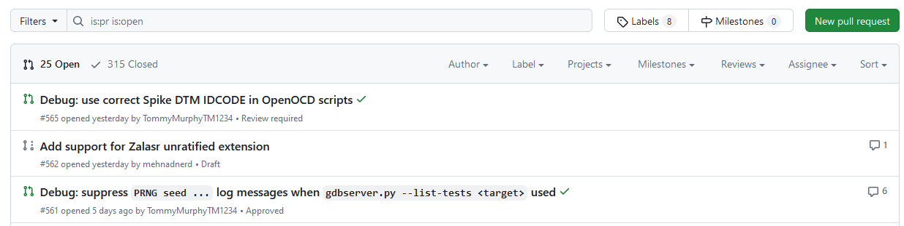
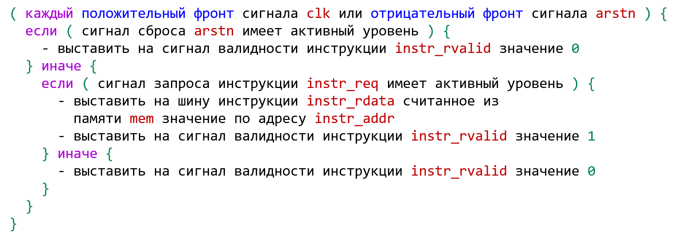
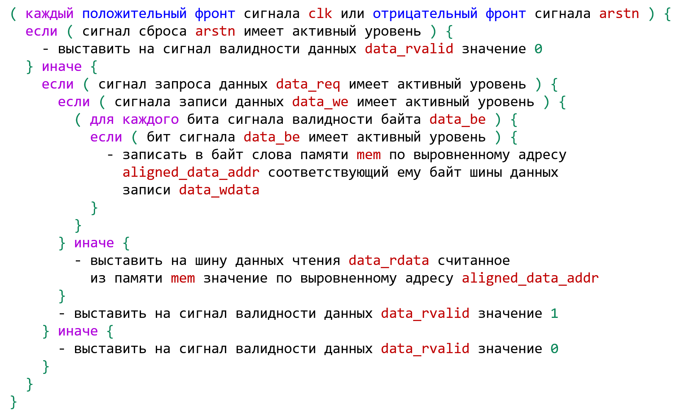
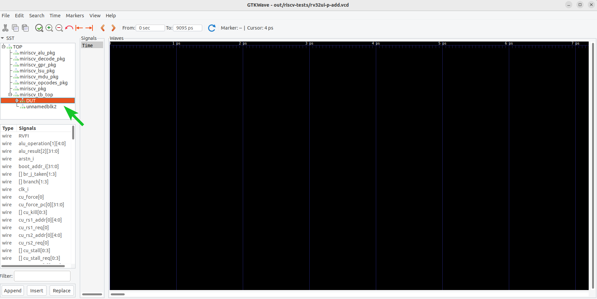
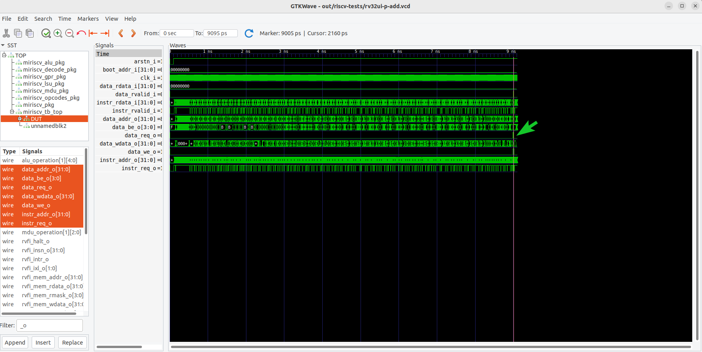
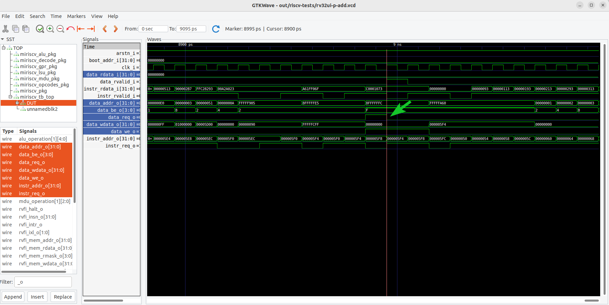
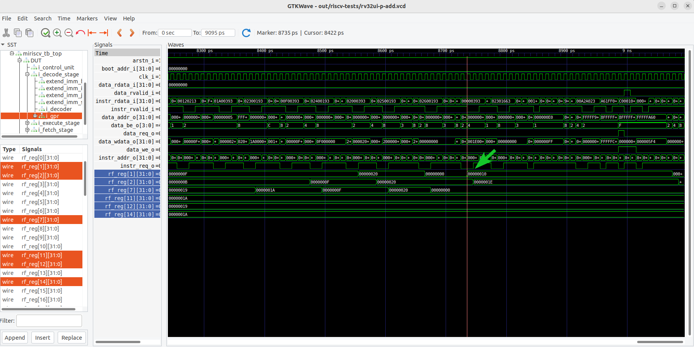

# Практическое занятие 01: Тестирование с самопроверкой

- [Практическое занятие 01: Тестирование с самопроверкой](#практическое-занятие-01-тестирование-с-самопроверкой)
  - [Необходимое ПО](#необходимое-по)
  - [Рекомендуемый материал](#рекомендуемый-материал)
  - [Краткое содержание](#краткое-содержание)
  - [Важные сведения](#важные-сведения)
  - [Тестируемое RISC-V ядро](#тестируемое-risc-v-ядро)
  - [Используемый набор тестовых сценариев riscv-tests](#используемый-набор-тестовых-сценариев-riscv-tests)
  - [Работа с набором тестовых сценариев riscv-tests](#работа-с-набором-тестовых-сценариев-riscv-tests)
    - [Общая информация](#общая-информация)
    - [Изучение исходных файлов](#изучение-исходных-файлов)
    - [Разбор тестирования инструкции](#разбор-тестирования-инструкции)
    - [Модификация](#модификация)
    - [Сохранение изменений модификации](#сохранение-изменений-модификации)
  - [Работа с верификационным окружением](#работа-с-верификационным-окружением)
    - [Подготовка](#подготовка)
    - [Создание главного файла верификационного окружения](#создание-главного-файла-верификационного-окружения)
    - [Анализ главного модуля тестируемого ядра](#анализ-главного-модуля-тестируемого-ядра)
    - [Подключение главного модуля ядра в верификационное окружение](#подключение-главного-модуля-ядра-в-верификационное-окружение)
    - [Создание модели памяти](#создание-модели-памяти)
    - [Завершение тестирования по истечению времени (timeout)](#завершение-тестирования-по-истечению-времени-timeout)
    - [Завершение тестирования по условию](#завершение-тестирования-по-условию)
    - [Блок основного тестового сценария](#блок-основного-тестового-сценария)
    - [Взаимодействие с сигналами инструкций и данных ядра](#взаимодействие-с-сигналами-инструкций-и-данных-ядра)
  - [Сборка и запуск симуляции](#сборка-и-запуск-симуляции)
    - [Компиляция тестовых программ](#компиляция-тестовых-программ)
    - [Экспорт тестовых программ](#экспорт-тестовых-программ)
    - [Запуск симуляции](#запуск-симуляции)
  - [Анализ результатов](#анализ-результатов)
    - [Лог-файлы](#лог-файлы)
    - [Временные диаграммы](#временные-диаграммы)
    - [Соответствие тестовым сценариям](#соответствие-тестовым-сценариям)
    - [Автоматизация](#автоматизация)
  - [Эталонная реализация](#эталонная-реализация)
  - [Выводы](#выводы)


## Необходимое ПО

Подразумевается, что **задание выполняется на:**
- [на предоставленной виртуальной машине](../../#использование-виртуальной-машины);
- на ином дистрибутиве Linux с [установленным необходимым ПО](../../#ручная-установка).


## Рекомендуемый материал

- [Тема 00: Вводная](../../theory/00_intro.md)
- [Тема 01: Функциональная верификация процессорных ядер](../../theory/01_basics.md)
- [Тема 02: Основные подходы к функциональной верификации RISC-V ядер](../../theory/02_approach.md)
- [Тема 03: Базовые подходы к симуляции RISC-V ядер](../../theory/03_func.md)


## Краткое содержание

Данное занятие воспроизводит маршрут подхода к верификации процессорных ядер [тестирование с самопроверкой](../../theory/03_func.md#тестирование-с-самопроверкой) на примере RISC-V ядра с открытым исходным кодом [MIRISCV](https://github.com/riscv-tests-intro/MIRISCV/tree/b510b308addc4a7271e36f2a348bd18bf24c1d77). Занятие состоит из **4 основных этапов, выполняемых друг за другом.**

[Работа с набором тестовых сценариев riscv-tests](#работа-с-набором-тестовых-сценариев-riscv-tests) - изучаются и модифицируются тестовые сценарии [riscv-tests](https://github.com/riscv-software-src/riscv-tests/tree/408e461da11e0b298c4b69e587729532787212f5). [Работа с верификационным окружением](#работа-с-верификационным-окружением) - создаются и заполняются должным образом исходные файлы верификационного окружения. [Сборка и запуск симуляции](#сборка-и-запуск-симуляции) - компилируются и экспортируются  тестовые программы, создаются необходимые директории и выполняются команды, необходимые для запуска симуляции. [Анализ результатов](#анализ-результатов) - анализируется поведение процессорного ядра, делается вывод о корректности его работы, автоматизируется процесс проверки.


## Важные сведения

**Обратите внимание**, что в части файлов, которые разбираются в ходе занятия, часть кода осознанно пропущена, оставлена лишь значимая, необходимая для формирования общей картины.

Например:

```assembly
#define INIT_XREG \
  li x1, 0;       \
  li x2, 0;       \
  ...
  li x29, 0;      \
  li x30, 0;      \
  li x31, 0;
```

В данном файле пропущена часть кода между `li x2, 0;` и `li x29, 0;`.

## Тестируемое RISC-V ядро

В рамках курса будет тестироваться учебное ядро, разработанное в НИУ МИЭТ: [MIRISCV](https://github.com/riscv-tests-intro/MIRISCV/tree/b510b308addc4a7271e36f2a348bd18bf24c1d77). Процессор поддерживает расширения RV32I и RV32M и является четырехстадийным [in-order](https://en.wikipedia.org/wiki/Out-of-order_execution#In-order_processors) [конвейером](https://en.wikipedia.org/wiki/Instruction_pipelining). Ядро поддерживает только машинный уровень привилегий[^1].

<p align="center">
  </img>
</p>

Подробную документацию на процессор можно найти по [ссылке](https://github.com/riscv-tests-intro/MIRISCV/tree/b510b308addc4a7271e36f2a348bd18bf24c1d77/doc/miriscv/miriscv_scheme.md). В рамках курса его функциональные особенности подробно разбираться не будут, а необходимая для выполнения заданий информация будет даваться по ходу повествования.


## Используемый набор тестовых сценариев [riscv-tests](https://github.com/riscv-software-src/riscv-tests/tree/408e461da11e0b298c4b69e587729532787212f5)

Для тестирования процессорного ядра будет использоваться набор тестовых сценариев [riscv-tests](https://github.com/riscv-software-src/riscv-tests/tree/408e461da11e0b298c4b69e587729532787212f5). Он является одним из самых популярных и активно поддерживаемых наборов тестов для [самопроверки](../../theory/03_func.md#тестирование-с-самопроверкой).

На момент создания данного практического задания в репозитории данного набора тестов присутствует 315 закрытых и 25 открытых pull requests, два из которых были открыты один день назад.




## Работа с набором тестовых сценариев [riscv-tests](https://github.com/riscv-software-src/riscv-tests/tree/408e461da11e0b298c4b69e587729532787212f5)

### Общая информация

Перейдем в [корень репозитория riscv-tests](https://github.com/riscv-software-src/riscv-tests/tree/408e461da11e0b298c4b69e587729532787212f5) и внимательно прочитаем [README](https://github.com/riscv-software-src/riscv-tests/tree/408e461da11e0b298c4b69e587729532787212f5/README.md). **Остановим свое внимание** на следующих выдержках:

-
  > The test program will begin execution at the first instruction after RVTEST_CODE_BEGIN, and continue until execution reaches an RVTEST_PASS macro or the RVTEST_CODE_END macro, which is implicitly a success. A test can explicitly fail by invoking the RVTEST_FAIL macro.

  Данная выдержка означает, что первой инструкцией для процессора будет инструкция в начале макроса `RVTEST_CODE_BEGIN`. Тестирование будет продолжаться до момента, пока не выполнятся инструкции в макросе `RVTEST_PASS`, `RVTEST_CODE_END` или `RVTEST_FAIL`. Первые два сигнализируют об успешном завершении тестирования, третий о неуспешном. Запомним названия этих макросов, их мы еще встретим чуть позже.
  
- 
  > However, self-checks rely on correct functioning of the processor instructions used to implement the self check (e.g., the branch) and so cannot be the only testing strategy.

  Здесь указывается одна из ключевых особенностей данного подхода к тестированию. Самопроверка может дать ложное позитивное срабатывание при наличии ошибок в процессорном ядре. Например, неверная реализация условного перехода может привести к переходу к участку кода, который сигнализирует об успешном завершении.

-
  > Any given test environment for running tests should also include a timeout facility, which will class a test as failing if it does not successfully complete a test within a reasonable time bound.

  Данная выдержка указывает на то, что любое тестовое окружение, использующее данный набор тестов, должно иметь механизм завершения симуляции по истечению некоторого промежутка времени. В англоязычной литературе данный промежуток времени чаще всего называют **timeout**.

### Изучение исходных файлов

Перейдем в директорию тестовых сценариев [`riscv-tests/isa`](https://github.com/riscv-software-src/riscv-tests/tree/408e461da11e0b298c4b69e587729532787212f5/isa). Эмпирическим методом[^2] выясним, что тесты для базового набора инструкций RV32I находятся в директории [`riscv-tests/isa/rv32ui`](https://github.com/riscv-software-src/riscv-tests/tree/408e461da11e0b298c4b69e587729532787212f5/isa/rv32ui/). В данной директории представлены тесты `add.S`, `addi.S`, `and.S` и так далее. 

Откроем файл [`riscv-tests/isa/rv32ui/add.S`](https://github.com/riscv-software-src/riscv-tests/tree/408e461da11e0b298c4b69e587729532787212f5/isa/rv32ui/add.S) тестовых сценариев инструкции `add`:

```assembly
# See LICENSE for license details.

#include "riscv_test.h"
#undef RVTEST_RV64U
#define RVTEST_RV64U RVTEST_RV32U

#include "../rv64ui/add.S"
```

**Обратим внимание** на `#include "../rv64ui/add.S"`, откроем соответствующий файл [`riscv-tests/isa/rv64ui/add.S`](https://github.com/riscv-software-src/riscv-tests/tree/408e461da11e0b298c4b69e587729532787212f5/isa/rv64ui/add.S):

```assembly
...

#include "riscv_test.h"
#include "test_macros.h"

RVTEST_RV64U
RVTEST_CODE_BEGIN

  #-------------------------------------------------------------
  # Arithmetic tests
  #-------------------------------------------------------------

  TEST_RR_OP( 2,  add, 0x00000000, 0x00000000, 0x00000000 );

  ...

  TEST_RR_ZERODEST( 38, add, 16, 30 );

  TEST_PASSFAIL

RVTEST_CODE_END

...
```

Представленного кода достаточно, чтобы понять, что в этом файле и содержаться необходимые тестовые сценарии. Но почему они в директории для 64-битных машин? Дело в том, что создатели тестов решили объединить тестовые сценарии для RV32I и RV64I, реализовав выбор между 32-битной и 64-архитектурами посредством переменной `__riscv64` ([cсылка на соответствующий коммит в репозитории](https://github.com/riscv-software-src/riscv-tests/commit/8c633e9e80d0b3e3764ebc3651e9cc09ab9413c9)).

В представленном выше коде тестовых сценариев используется макрос `RVTEST_CODE_END`, обозначенный в разделе [Общая информация](#общая-информация). Также используется множество иных макросов, например, `TEST_RR_OP` и `TEST_PASSFAIL`. Использование `#include "riscv_test.h"` и `#include "test_macros.h"` наталкивает на мысль о том, что макросы определены в этих файлах. Эмпирическим методом выясняем, что файл `test_macros.h` расположен в директории [`riscv-tests/isa/macros/scalar`](https://github.com/riscv-software-src/riscv-tests/tree/408e461da11e0b298c4b69e587729532787212f5/isa/macros/scalar/). Ориентируемся на код в нем. Также эмпирическим методом выясняем, что необходимый файл `riscv_test.h` находится в директории [`riscv-tests/env/p`](https://github.com/riscv/riscv-test-env/tree/4fabfb4e0d3eacc1dc791da70e342e4b68ea7e46/p/).

<details>
  <summary>Рассуждения по поводу riscv_test.h</summary>

---

А вот с файлом `riscv_test.h` ситуация интереснее. Файлы с таким именем находятся в директориях [`riscv-tests/env/p`](https://github.com/riscv/riscv-test-env/tree/4fabfb4e0d3eacc1dc791da70e342e4b68ea7e46/p/), [`riscv-tests/env/pm`](https://github.com/riscv/riscv-test-env/tree/4fabfb4e0d3eacc1dc791da70e342e4b68ea7e46/pm/), [`riscv-tests/env/pt`](https://github.com/riscv/riscv-test-env/tree/4fabfb4e0d3eacc1dc791da70e342e4b68ea7e46/pt/) и [`riscv-tests/env/v`](https://github.com/riscv/riscv-test-env/tree/4fabfb4e0d3eacc1dc791da70e342e4b68ea7e46/v). Какой же нам нужен?

Вернемся к файлу [README](https://github.com/riscv-software-src/riscv-tests/tree/408e461da11e0b298c4b69e587729532787212f5/README.md) в корне репозитория. В нем рисутствует следующая информация:

> Each test program should first include the riscv_test.h header file, which defines the macros used by the TVM. The header file will have different contents depending on the target environment for which the test will be built. One of the goals of the various TVMs is to allow the same test program to be compiled and run on very different target environments yet still produce the same results.

Данная выдержка говорит нам о том, что в каждом тестовом сценарии подключается заголовочный файл `riscv_test.h`, определяющая конфигурацию. В зависимости от особенностей реализации тестируемого процессора могут быть использованы различные конфигурации.

Далее представлена следующая таблица:

Target Environment Name | Description
--- | ---
`p` | virtual memory is disabled, only core 0 boots up
`pm` | virtual memory is disabled, all cores boot up
`pt` | virtual memory is disabled, timer interrupt fires every 100 cycles
`v` | virtual memory is enabled

Для тестирования [MIRISCV](https://github.com/riscv-tests-intro/MIRISCV/tree/b510b308addc4a7271e36f2a348bd18bf24c1d77) нам подходит самая простая конфигурация `p` без виртуальной памяти и с одним ядром. Таким образом, ориентироваться будем на код в файле [`riscv-tests/env/p/riscv_test.h`](https://github.com/riscv/riscv-test-env/tree/4fabfb4e0d3eacc1dc791da70e342e4b68ea7e46/p/riscv_test.h).

---

</details>

Вспомним, что процессор [MIRISCV](https://github.com/riscv-tests-intro/MIRISCV/tree/b510b308addc4a7271e36f2a348bd18bf24c1d77) поддерживает не только набор инструкций RV32I, но и RV32M. С предыдущим опытом мы легко находим тесты для RV32M в директории [`riscv-tests/isa/rv32um`](https://github.com/riscv-software-src/riscv-tests/tree/408e461da11e0b298c4b69e587729532787212f5/isa/rv32um/). В данной директории представлены тесты `div.S`, `divu.S`, `mul.S` и так далее.

Откроем файл [`riscv-tests/isa/rv32um/div.S`](https://github.com/riscv-software-src/riscv-tests/tree/408e461da11e0b298c4b69e587729532787212f5/isa/rv32um/div.S) тестовых сценариев инструкции `div`:

```assembly
...

#include "riscv_test.h"
#include "test_macros.h"

RVTEST_RV32U
RVTEST_CODE_BEGIN

  #-------------------------------------------------------------
  # Arithmetic tests
  #-------------------------------------------------------------

  TEST_RR_OP( 2, div,  3,  20,   6 );
  TEST_RR_OP( 3, div, -3, -20,   6 );
  
  ...
  
  TEST_PASSFAIL

RVTEST_CODE_END

...
```

Представленного кода достаточно, чтобы понять, что в этом файле и содержаться необходимые тестовые сценарии. Файлы `riscv_test.h` и `test_macros.h` используются те же, что и в тестах набора RV32I.

С необходимыми исходными файлами определились. **Давайте разберем конкретный пример тестирования!**

### Разбор тестирования инструкции

Откроем файл [`riscv-tests/isa/rv64ui/add.S`](https://github.com/riscv-software-src/riscv-tests/tree/408e461da11e0b298c4b69e587729532787212f5/isa/rv64ui/add.S):

```assembly
...

#include "riscv_test.h"
#include "test_macros.h"

RVTEST_RV64U
RVTEST_CODE_BEGIN

  #-------------------------------------------------------------
  # Arithmetic tests
  #-------------------------------------------------------------

  TEST_RR_OP( 2,  add, 0x00000000, 0x00000000, 0x00000000 );
  TEST_RR_OP( 3,  add, 0x00000002, 0x00000001, 0x00000001 );

  ...

  TEST_RR_ZERODEST( 38, add, 16, 30 );

  TEST_PASSFAIL

RVTEST_CODE_END

...
```

Из раздела [Общая информация](#общая-информация) мы узнали, что тестовая программа начинается с выполнения инструкций в макросе `RVTEST_CODE_BEGIN`. В общем-то он и расположен практически в самом верху файла тестовых сценариев.

Макрос определен в файле [`riscv-tests/env/p/riscv_test.h`](https://github.com/riscv/riscv-test-env/tree/4fabfb4e0d3eacc1dc791da70e342e4b68ea7e46/p/riscv_test.h). Изучим его:

```assembly
...
#define RVTEST_CODE_BEGIN        \
        .section .text.init;     \
        .align  6;               \
        .weak stvec_handler;     \
        ...
_start:                          \
        /* reset vector */       \
        j reset_vector;          \

  ...

reset_vector:                    \
        INIT_XREG;               \
        RISCV_MULTICORE_DISABLE; \
        INIT_RNMI;               \
        ...
        csrr a0, mhartid;        \
        mret;                    \
...
```

**Обратите внимание**, что объявления секций `.section .text.init;`, различные модификаторы по типу `.weak stvec_handler;` и т.п. мы рассматривать не будем, как и синтаксис ассемблера RISC-V в целом. Это отдельная объемная тема, которая выходит за рамки данного ознакомительного курса. Однако, предоставлю несколько полезных ссылок по этой теме[^3]. Нас с вами интересует первая инструкция макроса `RVTEST_CODE_BEGIN` - `j reset_vector`. Она производит безусловный переход на метку `reset_vector`, а это значит, что начинает выполняться код, определенный в `INIT_XREG`, который инициализирует регистровый файл ядра:

```assembly
#define INIT_XREG \
  li x1, 0;       \
  li x2, 0;       \
  ...
  li x29, 0;      \
  li x30, 0;      \
  li x31, 0;
```

Далее выполняется код определенный в `RISCV_MULTICORE_DISABLE` код:

```assembly
#define RISCV_MULTICORE_DISABLE \
  csrr a0, mhartid;             \
  1: bnez a0, 1b
```

Здесь стоит заметить, что тестируемый процессор [MIRISCV](https://github.com/riscv-tests-intro/MIRISCV/tree/b510b308addc4a7271e36f2a348bd18bf24c1d77) не поддерживает операции над регистрами контроля/статуса (CSR). Более того, инструкции работы с CSR воспринимаются ядром, как нелегальные, что приводит к исключению. Также заметим, что процессор воспринимает как нелегальную инструкцию `mret`. **Это значит, что нам придется модифицировать исходный код тестовых сценариев для того, чтобы их использовать.** Ситуация достаточно типичная, особенно для проектов с открытым исходным кодом.

В данном разделе мы не будем останавливаться на модификации подробно. Определим лишь то, что в макросе `RVTEST_CODE_BEGIN` все, что расположено после `INIT_XREG` может и должно быть удалено, так как не будет корректно исполнено на ядре [MIRISCV](https://github.com/riscv-tests-intro/MIRISCV/tree/b510b308addc4a7271e36f2a348bd18bf24c1d77). Более подробно процесс модификации разбирается в разделе [Модификация](#модификация), который будет расположен позже по ходу повествования.

В файле [`riscv-tests/isa/rv64ui/add.S`](https://github.com/riscv-software-src/riscv-tests/tree/408e461da11e0b298c4b69e587729532787212f5/isa/rv64ui/add.S) после макроса `RVTEST_CODE_BEGIN` выполняются тестовые сценарии, последним из которых является сценарий, определенный в `TEST_RR_ZERODEST( 38, add, 16, 30 );`. После раскрытия всех макросов и `#define` код тестового сценария будет выглядеть следующим образом:

```assembly
li gp, 38;
li x1, 16;
li x2, 30;
add x0, x1, x2;
li  x7, 0;
bne x0, x7, fail;
```

<details>
  <summary>Раскрытие макросов и #define</summary>

---

Определение находится в файле [`riscv-tests/isa/macros/scalar/test_macros.h`](https://github.com/riscv-software-src/riscv-tests/tree/408e461da11e0b298c4b69e587729532787212f5/isa/macros/scalar/test_macros.h):

```assembly
#define TEST_RR_ZERODEST( testnum, inst, val1, val2 ) \
    TEST_CASE( testnum, x0, 0, \
      li x1, MASK_XLEN(val1); \
      li x2, MASK_XLEN(val2); \
      inst x0, x1, x2; \
    )
```

Сценарий `TEST_RR_ZERODEST` в свою очередь вызывает сценарий `TEST_CASE`, который определен здесь же:

```assembly
#define TEST_CASE( testnum, testreg, correctval, code... ) \
test_ ## testnum: \
    li  TESTNUM, testnum; \
    code; \
    li  x7, MASK_XLEN(correctval); \
    bne testreg, x7, fail;
```

В сценарии `TEST_CASE` используются `TESTNUM` и `MASK_XLEN`. `MASK_XLEN` определен в этом же файле: `#define MASK_XLEN(x) ((x) & ((1 << (__riscv_xlen - 1) << 1) - 1))` и маскирует часть значения константы в зависимости от того, тестируется 32-битная или 64-битная архитектура. `TESTNUM` определен в [`riscv-tests/env/p/riscv_test.h`](https://github.com/riscv/riscv-test-env/tree/4fabfb4e0d3eacc1dc791da70e342e4b68ea7e46/p/riscv_test.h): `#define TESTNUM gp` и по сути является алиасом для одного из регистров общего назначения.

Если раскрыть `#define`, то код нашего тестового сценария будет следующим:

```assembly
li gp, 38;
li x1, 16;
li x2, 30;
add x0, x1, x2;
li  x7, 0;
bne x0, x7, fail;
```

---

</details>

Номер тестового сценария загружается в регистр `gp` (`x3` по соглашению о вызовах[^4]). В регистры `x1` и `x2` загружаются значения 16 и 30. Значения складываются, результат записывается в регистр `x0`. Далее значение в регистре `x0` сравнивается с эталонным нулем. Если значения не совпадают, то происходит переход на первую инструкцию после метки `fail`, в противном случае выполняется следующая инструкция.

<details>
  <summary>Подробное описание каждой инструкции тестовой программы</summary>

---

|                  |                                                                                                                                                   |
|------------------|---------------------------------------------------------------------------------------------------------------------------------------------------|
|  |                                                                                                                                                   |
|`li gp, 38`  |загрузка константы 38 в регистр `gp` (`x3` по соглашению о вызовах[^4])                                                                                 |
|`li x1, 16` |загрузка константы 16 в регистр `x1`                                                                                                                     |
|`li x2, 30`  |загрузка константы 30 в регистр `x2`                                                                                                                    |
|`add x0, x1, x2`  |сложение значения в регистре `x1` со значением в регистре `x2` и запись резальтата в регистр `x0`;                                                 |
|`li  x7, 0`   |загрузка константы 0 в регистр `x7`                                                                                                                    |
|`bne x0, x7, fail`       |если значение в регистре `x0` не равно значению в регистре `x2` - совершить переход по адресу первой инструкции после метки `fail`          |

---

</details>

Очевидно, что данная тестовая программа проверяет инструкцию сложения `add` с регистром назначения `x0`. В ходе ее выполнения регистр `x0` не должен быть перезаписан результатом сложения, так как согласно спецификации RISC-V нулевой регистр всегда содержит 0. **Что же происходит в результате успешного завершения тестирования. А в результате неуспешного?**

Ответ нам даст участок кода `TEST_PASSFAIL`, который располагается после всех тестовых сценариев в файле [`riscv-tests/isa/rv64ui/add.S`](https://github.com/riscv-software-src/riscv-tests/tree/408e461da11e0b298c4b69e587729532787212f5/isa/rv64ui/add.S). После раскрытия всех макросов и `#define` код `TEST_PASSFAIL` будет выглядеть следующим образом:

```assembly
bne x0, gp, pass;
fail:
      fence;
      li TESTNUM, 1;
      li a7, 93;
      li a0, 0;
      ecall
pass:
      fence;
1:    beqz TESTNUM, 1b;
      sll TESTNUM, TESTNUM, 1;
      or TESTNUM, TESTNUM, 1;
      li a7, 93;
      addi a0, TESTNUM, 0;
      ecall
```

<details>
  <summary>Раскрытие макросов и #define</summary>

---

`TEST_PASSFAIL` определен в файле [`riscv-tests/isa/macros/scalar/test_macros.h`](https://github.com/riscv-software-src/riscv-tests/tree/408e461da11e0b298c4b69e587729532787212f5/isa/macros/scalar/test_macros.h):

```assembly
#define TEST_PASSFAIL \
        bne x0, TESTNUM, pass; \
fail: \
        RVTEST_FAIL; \
pass: \
        RVTEST_PASS \
```

Данный участок кода определяет метки `fail` и `pass`, в которых выполняется код, определенный в `RVTEST_FAIL` и `RVTEST_PASS`. `RVTEST_FAIL` и `RVTEST_PASS` в свою очередь определены в [`riscv-tests/env/p/riscv_test.h`](https://github.com/riscv/riscv-test-env/tree/4fabfb4e0d3eacc1dc791da70e342e4b68ea7e46/p/riscv_test.h):

```assembly
#define RVTEST_PASS                                                     \
        fence;                                                          \
        li TESTNUM, 1;                                                  \
        li a7, 93;                                                      \
        li a0, 0;                                                       \
        ecall

...

#define RVTEST_FAIL                                                     \
        fence;                                                          \
1:      beqz TESTNUM, 1b;                                               \
        sll TESTNUM, TESTNUM, 1;                                        \
        or TESTNUM, TESTNUM, 1;                                         \
        li a7, 93;                                                      \
        addi a0, TESTNUM, 0;                                            \
        ecall
```

Если раскрыть `#define`, то код `TEST_PASSFAIL` будет следующим:

```assembly
bne x0, gp, pass;
fail:
      fence;
      li gp, 1;
      li a7, 93;
      li a0, 0;
      ecall
pass:
      fence;
1:    beqz TESTNUM, 1b;
      sll TESTNUM, TESTNUM, 1;
      or TESTNUM, TESTNUM, 1;
      li a7, 93;
      addi a0, gp, 0;
      ecall
```

---

</details>

Если разбираемом тестовом сценарии результат не совпадает с эталонным, то происходит переход на первую инструкцию после метки `fail`. Это инструкция `fence`, которую [MIRISCV](https://github.com/riscv-tests-intro/MIRISCV/tree/b510b308addc4a7271e36f2a348bd18bf24c1d77) воспринимает как `nop`, то есть просто переходит к следующей. Все, что нам нужно понимать далее, это то, что **в результате неуспешного выполнения тестового сценария в регистр `a0` (`x10`) записывается номер теста, который находится в регистре `gp`.** **Обратим внимание**, что во всех тестовых сценариях для RV32I и RV32M нумерация тестов начинается с ненулевого значения.

Если рассматривать успешное выполнение, то если результат совпадает с эталонным, то просходит переход на следующую инструкцию. Давайте вернемся к файлу [`riscv-tests/isa/rv64ui/add.S`](https://github.com/riscv-software-src/riscv-tests/tree/408e461da11e0b298c4b69e587729532787212f5/isa/rv64ui/add.S):

```assembly
...
RVTEST_CODE_BEGIN

  #-------------------------------------------------------------
  # Arithmetic tests
  #-------------------------------------------------------------

  TEST_RR_OP( 2,  add, 0x00000000, 0x00000000, 0x00000000 );
  TEST_RR_OP( 3,  add, 0x00000002, 0x00000001, 0x00000001 );

  ...

  TEST_RR_ZERODEST( 38, add, 16, 30 );

  TEST_PASSFAIL

RVTEST_CODE_END
```

Для первого в списке теста `TEST_RR_OP( 2,  add, 0x00000000, 0x00000000, 0x00000000 )` после его успешного завершения начнет выполняться следующая инструкция, то есть первая инструкция второго теста `TEST_RR_OP( 3,  add, 0x00000002, 0x00000001, 0x00000001 )`. Таким образом после каждого успешно выполненного теста стартует следующий. Если же хоть какой-то тест завершается с ошибкой, то происходит переход на первую инстуркцию после метки `fail`, результат такого выполнения был разобран выше.

В случае же последнего теста `TEST_RR_ZERODEST( 38, add, 16, 30 )` и его успешного завершения мы перейдем на первую инструкцию из `TEST_PASSFAIL`, то есть на `bne x0, gp, pass`, которая инициирует переход на первую инструкцию после метки `pass` (только если номер теста не равен 0). Это инструкция `fence`, которую [MIRISCV](https://github.com/riscv-tests-intro/MIRISCV/tree/b510b308addc4a7271e36f2a348bd18bf24c1d77) воспринимает как `nop`, то есть просто переходит к следующей. Все, что нам нужно понимать далее, это то, что **в результате успешного выполнения тестового сценария в регистр `a0` (`x10`) записывается 0.**

**Обратим внимание**, что после записи в регистр `a0` соответствующего значения, выполняется инструкция `ecall`, которую [MIRISCV](https://github.com/riscv-tests-intro/MIRISCV/tree/b510b308addc4a7271e36f2a348bd18bf24c1d77) не поддерживает и воспринимает как нелегальную. Это значит, что **исходный код тестов будет модифицироваться**. То, как он будет модифицирован в этом случае, отражено в разделе [Модификация](#модификация).


### Модификация

В разделе [Разбор тестирования инструкции](#разбор-тестирования-инструкции) мы пришли к выводу, что тестируемый процессор не поддерживает три составляющие тестовых сценариев:

- Инструкции взаимодействия с регистрами контроля и CSR;
- Инструкцию `mret`;
- Инструкцию `ecall`.

В обоих случаях процессор воспринимает инструкции как нелегальные. Происходит исключение. Во избежание этих ситуаций необходимо модифицировать исходный код тестовых сценариев.

Процессор может "столкнуться" с CSR-инструкциями в ходе выполнения кода, определенного в `RVTEST_CODE_BEGIN` файле [`riscv-tests/env/p/riscv_test.h`](https://github.com/riscv/riscv-test-env/tree/4fabfb4e0d3eacc1dc791da70e342e4b68ea7e46/p/riscv_test.h). Заметим, что данный код отвечает за начальную инициализацию ядра.

<details>
  <summary>Разбор части кода начальной инициализации</summary>

---

Например:

```assembly
la t0, trap_vector; \
csrw mtvec, t0;     \
```

отвечает за инициализацию адреса таблицы векторов прерываний и исключений. Этот функционал [MIRISCV](https://github.com/riscv-tests-intro/MIRISCV/tree/b510b308addc4a7271e36f2a348bd18bf24c1d77) не поддерживает.

Например:

```
#define INIT_PMP                                            \
  la t0, 1f;                                                \
  csrw mtvec, t0;                                           \
  /* Set up a PMP to permit all accesses */                 \
  li t0, (1 << (31 + (__riscv_xlen / 64) * (53 - 31))) - 1; \
  csrw pmpaddr0, t0;                                        \
  li t0, PMP_NAPOT | PMP_R | PMP_W | PMP_X;                 \
  csrw pmpcfg0, t0;                                         \
  .align 2;                                                 \
1:
```

отвечает за инициализацию настроек защиты памяти. Этот функционал [MIRISCV](https://github.com/riscv-tests-intro/MIRISCV/tree/b510b308addc4a7271e36f2a348bd18bf24c1d77) не поддерживает.

---

</details>

Почти весь код инициализации тестируемый процессор [MIRISCV](https://github.com/riscv-tests-intro/MIRISCV/tree/b510b308addc4a7271e36f2a348bd18bf24c1d77) не поддерживает. В коде инициализации мы можем ограничиться лишь инициализацией регистров общего назначения.

Откроем файл [`riscv-tests/env/p/riscv_test.h`](https://github.com/riscv/riscv-test-env/tree/4fabfb4e0d3eacc1dc791da70e342e4b68ea7e46/p/riscv_test.h):

```assembly
#define RVTEST_CODE_BEGIN         \
        ...
_start:                           \
        /* reset vector */        \
        j reset_vector;           \

  ...

reset_vector:                    \
        INIT_XREG;               \
        RISCV_MULTICORE_DISABLE; \
        INIT_RNMI;               \

        ...

        csrr a0, mhartid;        \
        mret;                    \
1:
```

В любом текстовом редакторе удалим строки, начиная с `RISCV_MULTICORE_DISABLE` и заканчивая `mret`.

Также это можно сделать при помощи выполнения команды:

```bash
sed -i '/RISCV_MULTICORE_DISABLE;/,/mret;/d' submodules/riscv-tests/env/p/riscv_test.h
```

из [корневой директориии репозитория](../../).

С учетом внесенных изменений конкретные тестовые сценариии для инструкций будут выполняться сразу после инициализации регистров общего назначения.

<details>
  <summary>Почему?</summary>

---

Например для файла [`riscv-tests/isa/rv64ui/add.S`](https://github.com/riscv-software-src/riscv-tests/tree/408e461da11e0b298c4b69e587729532787212f5/isa/rv64ui/add.S):

```assembly
...

RVTEST_CODE_BEGIN

  #-------------------------------------------------------------
  # Arithmetic tests
  #-------------------------------------------------------------

  TEST_RR_OP( 2,  add, 0x00000000, 0x00000000, 0x00000000 );
  TEST_RR_OP( 3,  add, 0x00000002, 0x00000001, 0x00000001 );

  ...
```

При раскрытии `RVTEST_CODE_BEGIN` код будет выглядеть:

```assembly
...

  _start
        /* reset vector */
        j reset_vector
        ....
  reset_vector:
        INIT_XREG

  #-------------------------------------------------------------
  # Arithmetic tests
  #-------------------------------------------------------------

  TEST_RR_OP( 2,  add, 0x00000000, 0x00000000, 0x00000000 );
  TEST_RR_OP( 3,  add, 0x00000002, 0x00000001, 0x00000001 );

  ...
```

После `INIT_XREG` процессор начнет выполнять первую инструкцию, определенную в
тестовом сценарии `TEST_RR_OP`.

---

</details>

Теперь осталось исключить инструкцию `ecall`. В набое тестовых сценариев [riscv-tests](https://github.com/riscv-software-src/riscv-tests/tree/408e461da11e0b298c4b69e587729532787212f5) подразумевается, что при выполнении инструкции `ecall` произойдет исключение и процессор начнет выполнять обработчик по адресу, определенному в регистре `mtvec`. Однако [MIRISCV](https://github.com/riscv-tests-intro/MIRISCV/tree/b510b308addc4a7271e36f2a348bd18bf24c1d77) не поддерживает ожидаемое поведение.

В ходе выполнения оригинального кода, после перехода в обработчик исключения, процессор выполняет инструкцию записи определенного значения по определенному адресу в память, чтобы сигнализировать тестовому окружению о завершении тестирования.

<details>
  <summary>Что за значение и по какому адресу?</summary>

---

Откроем файл [`riscv-tests/env/p/riscv_test.h`](https://github.com/riscv/riscv-test-env/tree/4fabfb4e0d3eacc1dc791da70e342e4b68ea7e46/p/riscv_test.h):

```assembly
...

trap_vector:                                                   \
  /* test whether the test came from pass/fail */              \
  csrr t5, mcause;                                             \
  li t6, CAUSE_USER_ECALL;                                     \
  beq t5, t6, write_tohost;                                    \
  li t6, CAUSE_SUPERVISOR_ECALL;                               \
  beq t5, t6, write_tohost;                                    \
  li t6, CAUSE_MACHINE_ECALL;                                  \
  beq t5, t6, write_tohost;                                    \
  
  ...

  write_tohost:                                                \
    sw TESTNUM, tohost, t5;                                    \
    sw zero, tohost + 4, t5;                                   \
    j write_tohost;                                            \

  ...

  .align 6; .global tohost; tohost: .dword 0; .size tohost, 8; \

```

После попадания в обработчик прерывания, если причиной являлся `ecall`, переходит к первой инструкции после метки `write_tohost` - `sw TESTNUM, tohost, t5`. Данная инструкция по адресу в регистре `t5` (`tohost` равен 0 исходя их последней строчки приведенного выше кода) сохраняется номер тестового сценария. Следующая инструкция `sw zero, tohost + 4, t5` сохраняет 0 по адресу в регистре `t5` + 4.

---

</details>

Наша задача - эмулировать похожее поведение без использования `ecall` и обработчика исключения. Из раздела [Разбор тестирования инструкции](#разбор-тестирования-инструкции) мы знаем, что:

- в результате неуспешного выполнения тестового сценария в регистр `a0` (`x10`) записывается номер теста, который находится в регистре `gp`;
- в результате успешного выполнения тестового сценария в регистр `a0` (`x10`) записывается 0.

Тогда, вместо инструкции `ecall` мы можем выполнять записывать по определенному адресу в памяти значение в регистре `a0`:

```assembly
li t0, 0x8ffffffc
sw a0, 0(t0)
j reset_vector
```

Загружаем в регистр `t0` константу `8ffffffc`. Это адрес по которому мы будем записывать в память значение в регистре `a0`. Значение адреса не несет никакой смысловой нагрузки и выбрано околослучайным образом. **Обратите внимание** на то, что адрес выровнен по границе 4 байт, так как [MIRISCV](https://github.com/riscv-tests-intro/MIRISCV/tree/b510b308addc4a7271e36f2a348bd18bf24c1d77) не поддерживает невыровненный доступ к памяти. Далее сохраняем значение в регистре `a0` по адресу 0 + значение в регистре `t0` (там как раз находится `8ffffffc`). После проделанных манипуляций совершаем безусловный переход на первую инструкцию после метки `reset_vector`, что эквивалентно повторному запуску теста.

В любом текстовом редакторе заменим два соответствующих вхождений `ecall` на:

```assembly
li t0, 0x8ffffffc
sw a0, 0(t0)
j reset_vector
```

Также это можно сделать при помощи выполнения команды:

```bash
sed -i 's/ecall/li t0, 0x8ffffffc; \\ \n        sw a0, 0(t0); \\ \n        j reset_vector /g' \
		submodules/riscv-tests/env/p/riscv_test.h
```

из [корневой директориии репозитория](../../).

Теперь с учетом внесенных изменений **тестовый сценарий может завершиться:**

- неуспешно, тогда в память по адресу `8ffffffc` записывается номер теста (ненулевое значение), который находится в регистре `gp`.
- успешно, тогда в память по адресу `8ffffffc` записывается 0.

### Сохранение изменений модификации

Было бы хорошо сохранить все изменения, которые были внесены в тестовые сценарии в разделе [Модификация](#модификация). Сделаем это образом, негласно принятым в индустрии - при помощи создания `fork` основного репозитория, создания в нем новой ветки и сохранения изменений в ней.

В рамках данного занятия сам маршрут сохранения изменений разобран не будет, а будет использован уже готовый репозиторий. **Автором был создан [`fork`](https://github.com/riscv-tests-intro/riscv-tests/tree/e5063ba5c6d7a239e05c73ccb8965b562e987a86), в котором была создана ветка `miriscv` и в ней сохранены сделанные нами изменения.** `fork` находится в директории `submodules/riscv-tests-miriscv`. Для сборки и запуска тестовых программ в ходе практического занятия будет использоваться именно он.

## Работа с верификационным окружением

### Подготовка

**Подразумевается, что команды начинают выполняться в директории, в которой расположен данный файл с описанием занятия.** Для того, чтобы реализовать [подход с самопроверкой](../../theory/03_func.md#тестирование-с-самопроверкой) нам для начала понадобятся две директории:

- `tb` - для исходных файлов верификационного окружения;
- `build` - для файлов сборки и запуска тестирования.

Создадим эти директории:

```bash
mkdir tb
mkdir build
```

### Создание главного файла верификационного окружения

Все верификационное окружение будет располагаться в файле `miriscv_tb_top.sv`. Писать будем на языке описания и верификации аппаратуры [SystemVerilog](https://en.wikipedia.org/wiki/SystemVerilog). В настоящее время он является промышленным стандартом.

Перейдем в директорию исходных файлов верификационного окружения:

```bash
cd tb
```

Создадим необходимый файл:

```bash
touch miriscv_tb_top.sv
```

### Анализ главного модуля тестируемого ядра

И давайте сразу посмотрим на главный модуль (далее может применяться термин "топ-модуль") тестируемого ядра [`miriscv_core.sv`](https://github.com/riscv-tests-intro/MIRISCV/tree/b510b308addc4a7271e36f2a348bd18bf24c1d77/miriscv/rtl/miriscv_core.sv). Файл можно открыть в любом редакторе. Открываем при помощи gedit:

```bash
gedit ../../../submodules/MIRISCV/miriscv/rtl/miriscv_core.sv
```

```SystemVerilog
module miriscv_core
  ...
  import miriscv_pkg::ILEN;
  ...
#(
  parameter bit RVFI = 1'b1
) (
  // Clock, reset
  input  logic              clk_i,
  input  logic              arstn_i,

  input  logic [XLEN-1:0]   boot_addr_i,

  // Instruction memory interface
  input  logic              instr_rvalid_i,
  input  logic [XLEN-1:0]   instr_rdata_i,
  output logic              instr_req_o,
  output logic [XLEN-1:0]   instr_addr_o,

  // Data memory interface
  input  logic              data_rvalid_i,
  input  logic [XLEN-1:0]   data_rdata_i,
  output logic              data_req_o,
  output logic              data_we_o,
  output logic [XLEN/8-1:0] data_be_o,
  output logic [XLEN-1:0]   data_addr_o,
  output logic [XLEN-1:0]   data_wdata_o,

  // RVFI
  ...
);
```

Прежде всего видим параметр, отвечающий за поддержку [интерфейса RVFI](../../theory/04_rgen.md#интерфейс-rvfi). По умолчанию его значение равно 1, запомним это.

Далее можем наблюдать тактовый сигнал `clk_i`, сигнал асинхронного сброса с негативным активным уровнем `arstn_i`, сигнал `boot_addr_i`, отвечающий за то, с какого адреса в памяти ядро начнет выполнять инструкции.

Также видим сигналы с `instr_rvalid` ... `instr_addr`, отвечающие за интерфейс инструкций и сигналы `data_rvalid` ... `data_be`, отвечающие за интерфейс данных. Более подробно про чтение инструкций из памяти ядром MIRISCV можно прочитать [тут](https://github.com/riscv-tests-intro/MIRISCV/tree/b510b308addc4a7271e36f2a348bd18bf24c1d77/doc/miriscv/fetch_stage.md#%D0%B7%D0%B0%D0%B3%D1%80%D1%83%D0%B7%D0%BA%D0%B0-%D0%B8%D0%BD%D1%81%D1%82%D1%80%D1%83%D0%BA%D1%86%D0%B8%D0%B9-%D0%B8%D0%B7-%D0%BF%D0%B0%D0%BC%D1%8F%D1%82%D0%B8-%D0%B8%D0%BD%D1%81%D1%82%D1%80%D1%83%D0%BA%D1%86%D0%B8%D0%B9). Про чтение(запись) данных из(в) памяти(ь) - [тут](https://github.com/riscv-tests-intro/MIRISCV/tree/b510b308addc4a7271e36f2a348bd18bf24c1d77/doc/miriscv/lsu.md).

### Подключение главного модуля ядра в верификационное окружение

Начинаем писать верификационное окружение. Открываем созданный ранее `miriscv_tb_top.sv`:

```bash
gedit miriscv_tb_top.sv
```

Код ниже пишем в открытом файле.

Для начала определим тело верхнего модуля (топ-модуля) верификации:

```SystemVerilog
module miriscv_tb_top;

endmodule
```

Определим:
- тактовый сигнал;
- сигнал сброса;
- остальные сигналы инструкций и данных.

```SystemVerilog
module miriscv_tb_top;

    // Clock period
    parameter CLK_PERIOD = 10;

    // Clock and reset
    logic clk;
    logic arstn;

    // Instruction memory signals
    logic        instr_rvalid;
    logic [31:0] instr_rdata;
    logic        instr_req;
    logic [31:0] instr_addr;

    // Data memory signals
    logic        data_rvalid;
    logic [31:0] data_rdata;
    logic        data_req;
    logic [31:0] data_wdata;
    logic [31:0] data_addr;
    logic        data_we;
    logic [31:0] data_be;

endmodule
```

Сгенерируем тактовый сигнал и сигнал сброса:

```SystemVerilog
initial begin
    clk <= 0;
    forever begin
        #(CLK_PERIOD/2) clk = ~clk;
    end
end

initial begin
    arstn <= 0;
    repeat(10) @(posedge clk);
    arstn <= 1;
end
```

Подключим необходимые сигналы тестируемому ядру. Код будет выглядеть так:

```SystemVerilog
module miriscv_tb_top;

    // Clock period
    parameter CLK_PERIOD = 10;

    // Clock and reset
    logic clk;
    logic arstn;

    // Instruction memory signals
    logic        instr_rvalid;
    logic [31:0] instr_rdata;
    logic        instr_req;
    logic [31:0] instr_addr;

    // Data memory signals
    logic        data_rvalid;
    logic [31:0] data_rdata;
    logic        data_req;
    logic [31:0] data_wdata;
    logic [31:0] data_addr;
    logic        data_we;
    logic [31:0] data_be;

    initial begin
        clk <= 0;
        forever begin
            #(CLK_PERIOD/2) clk = ~clk;
        end
    end

    initial begin
        arstn <= 0;
        repeat(10) @(posedge clk);
        arstn <= 1;
    end

    // DUT
    miriscv_core #(
        .RVFI                 ( 0            )
    ) DUT (

        // Clock and Reset
        .clk_i                ( clk          ),
        .arstn_i              ( arstn        ),

        // Boot address
        .boot_addr_i          ( 'b0          ),

        // Instruction memory interface
        .instr_rvalid_i       ( instr_rvalid ),
        .instr_rdata_i        ( instr_rdata  ),
        .instr_req_o          ( instr_req    ),
        .instr_addr_o         ( instr_addr   ),

        // Data memory interface
        .data_rvalid_i        ( data_rvalid  ),
        .data_rdata_i         ( data_rdata   ),
        .data_req_o           ( data_req     ),
        .data_we_o            ( data_we      ),
        .data_be_o            ( data_be      ),
        .data_addr_o          ( data_addr    ),
        .data_wdata_o         ( data_wdata   )

    );

endmodule
```

**Обратите внимание**, что значение параметра `RVFI` установлено в 0, т.к. в ходе данного занятия поддержка этого интерфейса ядром нам не потребуется. Также сигнал `boot_addr_i` подключен к 0, то есть процессор начнет запрашивать инструкции с нулевого адреса.

Далее продолжаем писать внутри модуля `miriscv_tb_top`.

### Создание модели памяти

Процессор будет взаимодействовать с памятью для чтения инструкций и чтения/записи данных. **Для создания памяти мы не будем использовать распакованный массив, а воспользуемся чуть более интересным подходом.**

В ходе [изучения набора тестовых сценариев riscv-tests](#работа-с-набором-тестовых-сценариев-riscv-tests) был сделан вывод о том, что размер тестовой программы может меняться в зависимости от тестового сценария. Мы, конечно, можем определить распакованный массив такого размера, в который "уместится" самая большая из тестовых программ. Но что если мы не хотим вести дополнительных рассчетов?

**Мы можем воспользоваться ассоциативным массивом[^5]**, место в котором выделяется по мере обращения к нему. Таким образом, его размер будет определяться размером тестовой программы. Память будет содержать элементы ширины 8, то есть будет являться побайтовой:


```SystemVerilog
// Main memory handle
logic [7:0] mem [logic [31:0]];
```

<details>
  <summary>Расшифровка данной строки кода</summary>

---

Объявляется массив, состоящий из элементов типа `logic [7:0]` с именем `mem`, который индексируется значениями типа `logic [31:0]`. Пример взаимодействия с элементом массива:

```SystemVerilog
logic [31:0] addr;
logic [ 7:0] data;

initial begin
    addr = 8'hABCD_1234;
    mem[addr] = 4;
    data = mem[addr]; // data = 4
end
```

---

</details>

Также нам необходимо загрузить инструкции и данные в память из некоторого файла. Давайте создадим для этого специальную функцию `load_binary_to_mem()`:

```SystemVerilog
function automatic void load_binary_to_mem();
  string      bin;
  bit [ 7:0]  r8;
  bit [31:0]  addr;
  int         f_bin;
  void'($value$plusargs("bin=%0s", bin));
  f_bin = $fopen(bin, "rb");
  if (!f_bin) $fatal("Cannot open file %0s", bin);
  while ($fread(r8, f_bin)) begin
    `ifdef MEM_DEBUG
        $display("Init mem [0x%h] = 0x%0h", addr, r8);
    `endif
    mem[addr] = r8;
    addr++;
  end
endfunction
```

Через системную функцию `$value$plusargs()` в переменную `bin` считываем имя файла, откуда будет проинициализирована память. Далее открываем файл с именем, которое находится в переменной `bin` при помощи системной функции `$fopen()`. **Обратите внимание**, что для использования `$fopen` необходима переменная типа `int`, которая хранит в себе идентификатор файла, который открыт. Не забываем вызвать системную функцию `$fatal()`, которая сразу завершит симуляцию, если файл невозможно будет открыть по какой-либо причине (`f_bin` после вызова `$fopen()` в этом случае будет равен 0).

Пока системная функция `$fread()` возвращает статус 1, считываем байт в переменную `r8` и записываем в память при помощи `mem[addr] = r8`. Переменная `addr` содержит в себе адрес, по которому идет запись в память. После каждой записи они инкрементируется. По умолчанию значение `addr` равно 0, т.к. это переменная типа `bit`. **Обратите внимание** на `MEM_DEBUG`. Если в ходе компиляции симулятору передать аргумент `+define+MEM_DEBUG`, то в лог симуляции будет выводиться информация об инициализации памяти.

### Завершение тестирования по истечению времени (timeout)

Из подраздела [Общая информация](#общая-информация) раздела [Работа с набором тестовых сценариев riscv-tests](#работа-с-набором-тестовых-сценариев-riscv-tests) мы узнали, что любое тестовое окружение, использующее данный набор тестов, должно иметь механизм завершения симуляции по истечению некоторого промежутка времени.

Создадим переменную `timeout_in_cycles`, которая будет хранить количество положительных фронтов тактового сигнала `clk`, по прошествию которых тест завершится по истечению времени.

```SystemVerilog
// Timeout in cycles
int unsigned timeout_in_cycles = 1000000;
```

Реализуем специализированную задачу:

```SystemVerilog
task timeout();
    string timeout;
    if($value$plusargs("timeout_in_cycles=%0s", timeout)) begin
      timeout_in_cycles = timeout.atoi();
    end
    repeat(timeout_in_cycles) @(posedge clk);
    $display("%0t Test was finished by timeout", $time());
    $finish();
endtask
```

Предусмотрим возможность определять время ожидания в тактах из командной строки при помощи `$value$plusargs()`, т.к. время тестирования для различных тестовых сценариев может отличаться. Задача будет завершаться по прошествию `timeout_in_cycles` положительных фронтов тактового сигнала `clk`.

### Завершение тестирования по условию

Из подразделе [Модификация](#модификация) раздела [Работа с набором тестовых сценариев riscv-tests](#работа-с-набором-тестовых-сценариев-riscv-tests) мы таким образом модифицировали тестовые сценарии, что в случае неуспешного завершения в память по адресу `8ffffffc` записывается номер теста (ненулевое значение), который находится в регистре `gp`, а в случае успешного завершения в память по адресу `8ffffffc` записывается 0.

Создадим переменную `signature_addr`, которая будет хранить адрес в памяти, куда будет записываться результат тестирования.

```SystemVerilog
// Signature address
logic [31:0] signature_addr;
```
Создадим специализированную функцию для получения адреса из командной строки:

```SystemVerilog
function void get_signature_addr();
    if(!$value$plusargs("signature_addr=%0h", signature_addr))
        $fatal("You must provide 'signature_addr' via commandline!");
endfunction
```

Мы знаем, что в тестовом наборе явно определен адрес `8ffffffc`, так что можно было бы обойтись и без специальной переменной, однако почему бы не сделать код чуть более универсальным, а при запуске симуляции просто передавать дополнительный аргумент `+signature_addr=8ffffffc`.

Далее определим функцию, определяющую условие завершения тестирования:

```SystemVerilog
function bit test_done_cond();
    return (
        (data_req   ==           1'b1) && 
        (data_addr  == signature_addr) && 
        (data_we    ==           1'b1) && 
        (data_wdata ==          32'b0)
    );
endfunction
```

Функция опирается на сигналы чтения/записи данных и возвращает 1, если в момент времени ее вызова происходит запрос записи в память значения 0 по адресу `signature_addr`, который в нашем случае равен `8ffffffc`. Более подробно про чтение(запись) данных из(в) памяти(ь) ядром MIRISCV можно прочитать [тут](https://github.com/riscv-tests-intro/MIRISCV/tree/b510b308addc4a7271e36f2a348bd18bf24c1d77/doc/miriscv/lsu.md).

И наконец определим задачу, которая будет завершаться, если в текущий момент времени выполняется условие из `test_done_cond()`:

```SystemVerilog
task wait_for_test_done();
    wait(arstn);
    forever begin
        @(posedge clk);
        if(test_done_cond()) break;
    end
    repeat(10) @(posedge clk);
    $display("Test end condition was detected. Test done!");
    $finish();
endtask
```

### Блок основного тестового сценария

Далее напишем блок основного тестового сценария, который будет выполняться в начале симуляции и отвечать за:

- сохранение сигналов на временную диаграмму;
- получение адреса условия завершения тестирования;
- инициализацию памяти;
- ожидание завершения тестирования по истечению времени;
- ожидание завершения тестирования по условию.

```SystemVerilog
initial begin
    string dump;
    // Save waveforms
    if(!$value$plusargs("dump=%s", dump)) begin
        dump = "waves.vcd";
    end
    $dumpfile(dump);
    $dumpvars;
    // Obtain signature address
    get_signature_addr();
    // Load ptrogram to the memory
    load_binary_to_mem();
    // Wait for timeout or test done
    fork
        timeout           ();
        wait_for_test_done();
    join
end
```

В этом блоке мы опционально получаем через `$value$plusargs()` аргумент `dump`, указывающий имя файла для сохранения изменения сигналов во времени (временная диаграмма). Далее определяем файл и сохраняем сигналы при помощи `$dumpfile()` и `$dumpvars()`.

<details>
  <summary>Чуть подробнее про сохранение сигналов</summary>

---

Вызов `$dumpvars()` без аргументов сохраняет изменение всех сигналов (топ-модуля и всех модулей, включенных в топ-модуль и так далее по иерархии) в течение всего времени симуляции (если в ходе симуляции в коде далее не будет выполнена системная функция `$dumpoff`). Подробнее про `$dumpfile()` и `$dumpvars()` можно прочитать по [ссылке](https://referencedesigner.com/tutorials/verilog/verilog_62.php).

---

</details>

После этого происходит получение адреса условия завершения тестирования при помощи `get_signature_addr()` и инициализация памяти при помощи функции `load_binary_to_mem()`, код которой был разобран выше.

Завершающим шагом идет запуск совместного ожидания завершения тестирования по истечению времени и по условию при помощи конструкции `fork-join` и задач `timeout()`, `wait_for_test_done()`.

###  Взаимодействие с сигналами инструкций и данных ядра

Осталось спроектировать часть окружения, отвечающую за взаимодействие с сигналами инструкций и данных ядра.

**Начнем с сигналов инструкций:**

```SystemVerilog

always_ff @(posedge clk or negedge arstn) begin
    if(!arstn) begin
        instr_rvalid <= 0;
    end
    else begin
        if(instr_req) begin
            instr_rdata  <= {
                mem[instr_addr+3],
                mem[instr_addr+2],
                mem[instr_addr+1],
                mem[instr_addr+0]
            };
            instr_rvalid <= 1;
        end
        else instr_rvalid <= 0;
    end
end
```

**Обратите внимание**, что значение считанной инструкции формируется конкатенацией 4 последовательно расположенных в памяти байт

```SystemVerilog
instr_rdata <= {
    mem[instr_addr+3],
    mem[instr_addr+2],
    mem[instr_addr+1],
    mem[instr_addr+0]
};
```

так как память является побайтовой.

**Псевдокод ниже объясняет поведение сигналов инструкций.**<br>
**Вдумчиво прочитайте его!**

```
( каждый положительный фронт сигнала 'clk' или отрицательный фронт сигнала 'arstn' ) {
  если ( сигнал сброса 'arstn' имеет активный уровень ) {
    - выставить на сигнал валидности инструкции 'instr_rvalid' значение 0
  } иначе {
    если ( сигнал запроса инструкции 'instr_req' имеет активный уровень ) {
      - выставить на шину инструкции 'instr_rdata' считанное из 
        памяти mem значение по адресу 'instr_addr'
      - выставить на сигнал валидности инструкции 'instr_rvalid' значение 1
    } иначе {
      - выставить на сигнал валидности инструкции 'instr_rvalid' значение 0
    }
  }
}
```

<details>
  <summary>Тот же псевдокод без возможности копирования, но с подсветкой ситаксиса</summary>

---



---

</details>

**Если разобрались с инструкциями - приступаем к данным:**

```SystemVerilog
logic [31:0] aligned_data_addr;
assign aligned_data_addr = {data_addr[31:2], 2'b00};

always_ff @(posedge clk or negedge arstn) begin
    if(!arstn) begin
        data_rvalid <= 0;
    end
    else begin
        if(data_req) begin
            if (data_we) begin
                for (int i = 0; i < 4; i++) begin
                    if (data_be[i]) begin
                        mem[aligned_data_addr+i] <= data_wdata[8*i+:8];
                    end
                end
            end
            else begin
                data_rdata  <= {
                    mem[aligned_data_addr+3],
                    mem[aligned_data_addr+2],
                    mem[aligned_data_addr+1],
                    mem[aligned_data_addr+0]
                };
            end
            data_rvalid <= 1;
        end
        else data_rvalid <= 0;
    end
end
```

**Обратите внимание**, что значение считанных данных формируется конкатенацией 4 последовательно расположенных в памяти байт

```SystemVerilog
data_rdata <= {
    mem[aligned_data_addr+3],
    mem[aligned_data_addr+2],
    mem[aligned_data_addr+1],
    mem[aligned_data_addr+0]
};
```

так как память является побайтовой.

**Псевдокод ниже объясняет поведение сигналов данных.**<br>
**Вдумчиво прочитайте его!**

```
( каждый положительный фронт сигнала 'clk' или отрицательный фронт сигнала 'arstn' ) {
  если ( сигнал сброса 'arstn' имеет активный уровень ) {
    - выставить на сигнал валидности данных 'data_rvalid' значение 0
  } иначе {
    если ( сигнал запроса данных 'data_req' имеет активный уровень ) {
      если ( сигнала записи данных 'data_we' имеет активный уровень ) {
        ( для каждого бита сигнала валидности байта 'data_be' ) {
          если ( бит сигнала 'data_be' имеет активный уровень ) {
            - записать в байт слова памяти mem по выровненному адресу
              'aligned_data_addr' соответствующий ему байт шины данных
              записи data_wdata
          } 
        }
      } иначе {
        - выставить на шину данных чтения 'data_rdata' считанное 
          из памяти mem значение по выровненному адресу 'aligned_data_addr'
      }
      - выставить на сигнал валидности данных 'data_rvalid' значение 1
    } иначе {
      - выставить на сигнал валидности данных 'data_rvalid' значение 0
    }
  }
}
```

<details>
  <summary>Тот же псевдокод без возможности копирования, но с подсветкой ситаксиса</summary>

---



---

</details>

**Обратим внимание** на выравнивание адреса данных:

```SystemVerilog
logic [31:0] aligned_data_addr;
assign aligned_data_addr = {data_addr[31:2], 2'b00};
```

**MIRISCV не поддерживает чтение и запись данных по невыровненному адресу.** Плюс ко всему особенностью протокола чтения/записи данных является то, что любой адрес данных, который ядро выставляет на шину `data_addr_o` должен интерпретироваться как выровненный, даже если таковым не является. Именно по этой причине адрес дополнительно выравнивается верификационным окружением. Более подробно про чтение(запись) данных из(в) памяти(ь) ядром MIRISCV можно прочитать [тут](https://github.com/riscv-tests-intro/MIRISCV/tree/b510b308addc4a7271e36f2a348bd18bf24c1d77/doc/miriscv/lsu.md).

<details>
  <summary>Если вам интересно, как работает [8*i+:8]</summary>

---

Отдельно стоит остановиться на том, как происходит побайтовое итерирование при определении валидности байт при помощи сигнала `data_be`:

```SystemVerilog
for (int i = 0; i < 4; i++) begin
    if (data_be[i]) begin
        mem[aligned_data_addr+i] <= data_wdata[8*i+:8];
    end
end
```

Если вы попробуете определять диапазон бит как `[8*i:8*i+7]`, то большинство симуляторов укажут вам на ошибку. В Verilator 5.024 текст ошибки выглядит следующим образом:

```
%Error: ../tb/../tb/miriscv_tb_top.sv:123:53: First value of [a:b] isn't a constant, maybe you want +: or -:
                                            : ... note: In instance 'miriscv_tb_top'
  123 |                             mem[aligned_data_addr][8*i:8*i+7] <= data_wdata[8*i+:8];
      |                                                     ^
```

Дело в том, что стандартом языка SystemVerilog закреплено, что ширина диапазона должна быть константной при итерировании. Как мы видим, Verilator сам подсказывает нам решение: `maybe you want +: or -:`.

При помощи конструкций `+:` и `-:` в SystemVerilog появляется возможность циклически определять диапазон одинаковой ширины. `[A+:B]` раскрывается в `[A+B-1:A]`, а `[A-:B]` раскрывается в `[A:A-B+1]`. Например:

`mem[ 0 +: 8]` эквивалентно `mem[ 7 : 0]` <br>
`mem[15 -: 8]` эквивалентно `mem[15 : 8]` <br>

Тогда в нашем случае цикл

```SystemVerilog
for (int i = 0; i < 4; i++) begin
    if (data_be[i]) begin
        mem[aligned_data_addr+i] <= data_wdata[8*i+:8];
    end
end
```

раскроется в

```SystemVerilog
if (data_be[0]) begin
    mem[aligned_data_addr+0] <= data_wdata[ 7: 0];
end
if (data_be[1]) begin
    mem[aligned_data_addr+1] <= data_wdata[15: 8];
end
if (data_be[2]) begin
    mem[aligned_data_addr+2] <= data_wdata[23:16];
end
if (data_be[3]) begin
    mem[aligned_data_addr+3] <= data_wdata[31:24];
end
```

---

</details>

Итак, проектирование окружения завершено. Сохраняем и закрываем файл `miriscv_tb_top.sv`.

Переходим на один уровень назад:

```bash
cd ..
```

Теперь мы в корневой директории практического занятия. **Приступаем к сборке и запуску симуляции.**

## Сборка и запуск симуляции

Перейдем в директорию для сборки и запуска:

```bash
cd build
```
### Компиляция тестовых программ

Создадим директорию для сохранения тестовых программ:

```
mkdir -p out/riscv-tests
```

Приступим к компиляции тестовых программ. Эмпирическим методом (автору очень помогла [эта issue](https://github.com/riscv-software-src/riscv-tests/issues/430) в репозитории тестовых сценариев) выясним команду для компиляции тестов RV32I и RV32M:

```
make -C ../../../submodules/riscv-tests-miriscv/isa/ rv32ui rv32um XLEN=32 \
		RISCV_PREFIX=riscv32-unknown-elf- RISCV_GCC_OPTS="-static -mcmodel=medany \
          -fvisibility=hidden -nostdlib -nostartfiles" rv32ui_v_tests=""
```

**Обратим внимание** на аргумент `rv32ui_v_tests=""`. Передача в него пустой строки необходима для отключения генерации тестов с поддержкой виртуальной памяти.

Переместим скомпилированные тесты в директорию для сохранения тестовых программ:

```bash
mv ../../../submodules/riscv-tests-miriscv/isa/rv32ui-p-* out/riscv-tests/
mv ../../../submodules/riscv-tests-miriscv/isa/rv32um-p-* out/riscv-tests/
```

Сгенерированные тесты являются `elf`-файлами[^6]. Добавим к ним постфикс `.elf`:

```bash
find out/ -type f -not -name "*.dump" -not -name "*.log" -exec mv '{}' '{}'.elf \;
```

Делаем это для улучшения восприятия и упрощения итерирования по файлам в следующем разделе.

Чтобы убедиться, что постфиксы были добавлены, можно выполнить команду

```bash
ls out/riscv-tests
```

которая выведет в терминал все файлы в директории `out/riscv-tests`.

### Экспорт тестовых программ

Далее нам необходимо экспортировать тестовые программы в бинарный формат, для того, чтобы потом в ходе симуляции загрузить их в память процессорного ядра. **Обратите внимание**, что `elf`-файл - это не просто набор двоичных инструкций и данных. Данный файл также содержит специальную информацию, которая в реальной жизни поможет загрузчику системы, в которую установлен процессор, разместить программу в памяти. Поскольку роль загрузчика будем выполнять мы и симулятор, на котором будет вестись моделирование, эта информация нам не понадобится, поэтому достаточно экспортировать из данного файла только инструкции и данные, отбросив всю остальную информацию[^7].

Выполним команду экспорта для тестов инструкции `addi`:

```bash
riscv32-unknown-elf-objcopy -O binary out/riscv-tests/rv32ui-p-addi.elf \
    out/riscv-tests/rv32ui-p-addi.bin &> out/riscv-tests/rv32ui-p-addi.translate.log
```

Аргумент `-O binary` определяет формат вывода. Выражение `&> out/riscv-tests/rv32ui-p-addi.translate.log` перенаправляет поток вывода в файл `out/riscv-tests/rv32ui-p-addi.translate.log`. По сути этот файл будет являться лог-файлом экспорта.

Шаблон для экспорта выглядит следующим образом:

```bash
riscv32-unknown-elf-objcopy -O binary out/riscv-tests/<название-теста>.elf \
    out/riscv-tests/<название-теста>.bin &> out/riscv-tests/<название-теста>.translate.log
```

где `<название-теста>` - название тестового сценария.

Тогда экспортируем каждый файл при помощи команды:

```bash
for elf in `find ./ -name *.elf`; do
    riscv32-unknown-elf-objcopy -O binary $elf ${elf%.*}.bin \
      &> ${elf%.*}.translate.log
done
```

Отдельно разбирать код команды не будем из-за его относительной простоты.

Чтобы убедиться, что бинарные файлы были сформированы, выполним команду:

```bash
ls out/riscv-tests
```

которая выведет в терминал все файлы в директории `out/riscv-tests`.

### Запуск симуляции

Запускать симуляцию будем при помощи [Verilator 5.024](https://github.com/verilator/verilator/tree/522bead374d6b7b2adb316304126e5361b18bcf1).


Создадим директорию для сохранения артефактов симуляции:

```
mkdir -p out/verilator
```

**Скомпилируем RTL тестируемого ядра и сам файл окружения** при помощи Verilator (команда содержит большое количество аргументов, ниже разберем их значение):

```bash
verilator -Wno-WIDTHEXPAND -Wno-WIDTHTRUNC -Wno-UNUSEDSIGNAL -Wno-UNUSEDPARAM \
-Wno-PINMISSING -Wno-GENUNNAMED -Wno-CASEINCOMPLETE -Wno-UNOPTFLAT -Wno-INFINITELOOP \
-Wno-MULTIDRIVEN -Wno-INITIALDLY -cc -O2 -j 1 --threads 1 --binary \
../../../submodules/MIRISCV/miriscv/rtl/include/*.sv ../../../submodules/MIRISCV/miriscv/rtl/*.sv \
../tb/miriscv_tb_top.sv +incdir+../tb/ --trace --trace-params --trace-structs --x-assign 0 \
-top-module miriscv_tb_top -Mdir out/verilator &> out/verilator/compile.log
```

**Обратим внимание** на аргументы  `../../../submodules/MIRISCV/miriscv/rtl/include/*.sv` и `../../../submodules/MIRISCV/miriscv/rtl/*.sv`. Они являются регулярными выражениями для определения исходных файлов RTL ядра. Аргумент `../tb/miriscv_tb_top.sv` является файлом верификационного окружения.

Аргумент `-top-module miriscv_tb_top` определяет топ-модуль для симуляции. Иначе говоря определяет точку входа. Аргумент `-Mdir out/verilator` определяет выходную директорию артефактов компиляции. Выражение `&> out/verilator/compile.log` перенаправляет поток вывода в файл `out/verilator/compile.log`. По сути этот файл будет являться лог-файлом компиляции.

<details>
  <summary>Если вам интересен разбор всех аргументов, переданных в Verilator в ходе компиляции</summary>

---

Разберем аргументы команды `verilator` подробнее:

- `Wno-WIDTHEXPAND -Wno-WIDTHTRUNC -Wno-UNUSEDSIGNAL -Wno-UNUSEDPARAM
-Wno-PINMISSING -Wno-GENUNNAMED -Wno-CASEINCOMPLETE -Wno-UNOPTFLAT -Wno-INFINITELOOP -Wno-MULTIDRIVEN -Wno-INITIALDLY` - аргумент `Wno-<название>` отключает вывод предупреждения с названием `<название>`. Например, `-Wno-UNUSEDSIGNAL` отключает информирование о том, что сигнал был объявлен в контексте компиляции, но не был ни разу использован. Если вы хотите получить информацию о каждом предупреждении, то это можно сделать [в соответствующем разделе документации](https://verilator.org/guide/latest/warnings.html#list-of-warnings) на Verilator.
  <details>
    <summary>Почему бы тогда не писать "чистый" код?</summary>
  Очевидно, что в идеальном случае, при отсутствии "вольностей" в коде, в ходе компиляции предупреждений возникать не должно. Подавляющая часть предупреждений в данном случае возникает в исходных файлах тестируемого ядра, было принято решение не модифицировать оригинальный RTL и использовать его "как есть", а предупреждения отключать при помощи аргументов.
  </details>
- `-cc -O2` - задает уровень оптимизации в ходе компиляции;
- `-j 1` - задание количества потоков для компиляции;
- `--threads 1` - задание количества потоков для симуляции;
- `--binary` - указание на то, что результатом компиляции будет бинарный файл;
- `../../../submodules/MIRISCV/miriscv/rtl/include/*.sv ../../../submodules/MIRISCV/miriscv/rtl/*.sv ../tb/miriscv_tb_top.sv` - wildcard файлов для компиляции исходных файлов RTL ядра и файл верификационного окружения;
- ` +incdir+../tb/` - директория для поиска файлоа директивы \`include;
- `--trace --trace-params` - включение сохранения изменения сигналов (временных диаграмм) и включение сохранения значений параметров;
- `--trace-structs` - включение поэлементного сохранения элементов упакованных и распакованных массивов (с целью удобства восприятия временной диаграммы);
- `--x-assign 0` - Verilator поддерживает только два состояния переменных симулируемой системы: 0 и 1 (не поддерживает X и Z). Флаг указывает на то, чтобы переменные, которые могут принимать X-состоянеи в начале симуляции, принимали значение 0;
- `-top-module miriscv_tb_top` - определение топ-модуля для симуляции (в нашем случае это топ-файл верификационного окружения). Иначе говоря определяет точку входа.
- `-Mdir out/verilator` определяет выходную директорию артефактов компиляции.

---

</details>

Откроем файл лог-файл компиляции `out/verilator/compile.log` любым редактором:

```bash
gedit out/verilator/compile.log
```

Увидим что-то похожее на:

```bash
- V e r i l a t i o n   R e p o r t:
- Verilator: Built from 2.592 MB sources in 27 modules, into 0.901 MB in 12 C++ files needing 0.001 MB
- Verilator: Walltime 0.331 s (elab=0.009, cvt=0.053, bld=0.242); cpu 0.000 s on 1 threads; alloced 29.789 MB
```

Компиляция завершилась успешно. В этом случае в директории `out/verilator` появится большое количество файлов, в том числе файл `Vmiriscv_tb_top`, который нам и нужен. Для запуска симуляции Verilator 5.024 создает файл с названием `V<имя-топ-модуля>`, где `<имя-топ-модуля>` - имя модуля, указанное в аргументе `-top-module`.

Запустим симуляцию для инструкции `addi`:

```bash
out/verilator/Vmiriscv_tb_top +bin=out/riscv-tests/rv32ui-p-addi.bin \
    +timeout_in_cycles=10000  +signature_addr=8ffffffc \
        +dump=out/riscv-tests/rv32ui-p-addi.vcd \
            &> out/riscv-tests/rv32ui-p-addi.log
```

Аргумент `+bin=out/riscv-tests/rv32ui-p-addi.bin` определяет имя файла с тестовой программой, которая будет загружаться в память, с которой будет взаимодействовать ядро. Иницилизация памяти подробно разбиралась в разделе [Создание модели памяти](#создание-модели-памяти).

Аргументы `+timeout_in_cycles=10000` и `+signature_addr=8ffffffc` определяют время завершения теста по истечению времени и адрес, по которому ядро будет сигнализировать о завершении тестирования. Они подробно разбирались в разделах [Завершение тестирования по истечению времени (timeout)](#завершение-тестирования-по-истечению-времени-timeout) и [Завершение тестирования по условию](#завершение-тестирования-по-условию).

Аргумент `+dump=out/riscv-tests/rv32ui-p-addi_waves.vcd` определяет имя файла для сохранения изменения сигналов (временной диаграммы). Выражение `&> out/verilator/run.log` перенаправляет поток вывода в файл `out/verilator/run.log`. По сути этот файл будет являться лог-файлом симуляции.

Шаблон для запуска симуляции выглядит следующим образом:

```bash
out/verilator/Vmiriscv_tb_top +bin=out/riscv-tests/<название-теста>.bin \
    +timeout_in_cycles=10000  +signature_addr=8ffffffc \
        +dump=out/riscv-tests/<название-теста>.vcd \
            &> out/riscv-tests/<название-теста>.log
```

где `<название-теста>` - название тестового сценария.

Тогда просимулируем каждый файл при помощи команды:

```bash
for bin in `find ./ -name *.bin`; do
    echo "Running RTL simulation for $bin (log at ${bin%.*}.log)"
    out/verilator/Vmiriscv_tb_top +bin=$bin +timeout_in_cycles=10000 \
	    +signature_addr=8ffffffc +dump=${bin%.*}.vcd &> ${bin%.*}.log
done
```

Так процесс симуляции может занимать какое-то время, то при помощи `echo` будем выводить статус для каждого файла. Итак, симуляция завершена. **Переходим к анализу результатов!**

## Анализ результатов

### Лог-файлы

Любым редактором откроем лог-файл симуляции для тестов инструкции `add`: `out/riscv-tests/rv32ui-p-add.log`:

```bash
gedit out/riscv-tests/rv32ui-p-add.log
```

Увидим что-то похожее на:

```bash
Test end condition was detected. Test done!
- ../tb/../tb/miriscv_tb_top.sv:125: Verilog $finish
- S i m u l a t i o n   R e p o r t:
- Verilator: $finish at 9ns; walltime 0.085 s; speed 0.000 s/s
- Verilator: cpu 0.000 s on 1 threads; alloced 57 MB
```

Отчет информирует нас о том, что симуляция завершилась вызовом `$finish()` на определенной строке файла `miriscv_tb_top.sv`. При этом присутствует вывод сообщения о том, что условие успешного завершения тестирования было обнаружено. Это дает нам основания полагать, что ядро успешно прошло этот тест.

### Временные диаграммы

Теперь можно анализировать временную диаграмму тестирования инструкции `add`, расположенную в директории `out/riscv-tests/`.

Откроем временную диаграмму при помощи GTKWave:

```bash
gtkwave out/riscv-tests/rv32ui-p-add.vcd
```

Как мы помним, при подключении тестируемого ядра в топ-модуль верификационного окружения мы дали имя экземпляру процессора `DUT`. Теперь в GTKWave мы иерархически обращаемся к этому модулю для получения и информации об изменении его сигналов. В иерархии слева вверху выберем `TOP` -> `miriscv_tb_top` -> 
`DUT`.



Далее в строке слева внизу `Filter` напишем `_i` (1) для того, чтобы отфильтровать сигналы по наличию этой части в имени. Так мы сможем быстро найти входные сигналы ядра по соответствующему постфиксу. После чего выделим необходимые сигналы (2) и слева внизу нажмем `Append` (3), чтобы добавить сигналы на временную диаграмму.


Тоже самое проделаем для постфикса `_o`, чтобы добавить на временную диаграмму выходные сигналы. Отдалим временную диаграмму при помощи кнопки в верхнем левом углу.


Можем заметить, что по сравнению с [диаграммой из практического занятия Тест "Hello world"](../../doc/pic/hello_world_6.png), тестирование в случае с самопроверкой длится значительно дольше. Это не удивительно, ведь в первом случае [программа](../00_basic_hex/README.md#написание-тестовой-программы) состояла из 9 инструкций, а во втором состоит из [37 тестовых сценариев](https://github.com/riscv-software-src/riscv-tests/blob/408e461da11e0b298c4b69e587729532787212f5/isa/rv64ui/add.S), каждый из которых состоит из ~7-10 инструкций.

В подразделе разделе [Модификация](#модификация) раздела [Работа с набором тестовых сценариев riscv-tests](#работа-с-набором-тестовых-сценариев-riscv-tests) мы определили, что успешное выполнение программы должно завершиться записью 0 по адресу `8ffffffc`.

Давайте найдем на временной диаграмме момент обращения в память. Ищем активный уровень сигнала `data_req`.



Приблизим этот момент.



Видим, что сигнал `data_wdata` имеет значение 0, `data_addr` значение `8ffffffc`, `data_we` значение 1. Данное сочетание сигналов в рамках одного такта говорит и записи значения 0 по адресу `8ffffffc`.

Также можем **обратить внимание**, что сигнал `data_be` равен `f`, что в двоичном формате равно 1111, что в свою очередь означает, что в память производится запись целого слова шины `data_wdata`. Это соответствует истине, так операция записи в память в тестовой программе производится при помощи инструкции `sw a0, 0(t0)`, которая по спецификации RISC-V (ее можно найти в разделе [Минимальные требования к знаниям](../../README.md#минимальные-требования-к-знаниям) в корне репозитория) записывает в память 32-битное слово.

Более подробно про чтение(запись) данных из(в) памяти(ь) ядром MIRISCV можно прочитать [тут](https://github.com/riscv-tests-intro/MIRISCV/tree/b510b308addc4a7271e36f2a348bd18bf24c1d77/doc/miriscv/lsu.md).

### Соответствие тестовым сценариям

Откроем файл тестового сценария инструкции `add`: [`riscv-tests/isa/rv32ui/add.S`](https://github.com/riscv-software-src/riscv-tests/tree/408e461da11e0b298c4b69e587729532787212f5/isa/rv32ui/add.S):

```assembly
....

RVTEST_CODE_BEGIN

  #-------------------------------------------------------------
  # Arithmetic tests
  #-------------------------------------------------------------

  TEST_RR_OP( 2,  add, 0x00000000, 0x00000000, 0x00000000 );
  TEST_RR_OP( 3,  add, 0x00000002, 0x00000001, 0x00000001 );
  TEST_RR_OP( 4,  add, 0x0000000a, 0x00000003, 0x00000007 );

  TEST_RR_OP( 5,  add, 0xffffffffffff8000, 0x0000000000000000, 0xffffffffffff8000 );

  ...

  TEST_RR_ZEROSRC1( 35, add, 15, 15 );
  TEST_RR_ZEROSRC2( 36, add, 32, 32 );
  TEST_RR_ZEROSRC12( 37, add, 0 );
  TEST_RR_ZERODEST( 38, add, 16, 30 );

  TEST_PASSFAIL

...
```

Нам важно обратить внимание на то, что в начале тестирования используются сценарии `TEST_RR_OP`, в которых активно используются регистры `x11`, `x12`, `x14` и `x7`. Регистры `x11` и `x12` используются для хранения операндов, `x14` и `x7` для хранения результаов вычисленного и эталонного соответственно.

<details>
  <summary>Как это понять?</summary>

---

Откроем файл [`riscv-tests/isa/macros/scalar/test_macros.h`](https://github.com/riscv-software-src/riscv-tests/tree/408e461da11e0b298c4b69e587729532787212f5/isa/macros/scalar/test_macros.h):

```assembly
...

#define TEST_CASE( testnum, testreg, correctval, code... ) \
test_ ## testnum: \
    li  TESTNUM, testnum; \
    code; \
    li  x7, MASK_XLEN(correctval); \
    bne testreg, x7, fail;

...

#define TEST_RR_OP( testnum, inst, result, val1, val2 ) \
    TEST_CASE( testnum, x14, result, \
      li  x11, MASK_XLEN(val1); \
      li  x12, MASK_XLEN(val2); \
      inst x14, x11, x12; \
    )

```

Анализируя `TEST_RR_OP` увидим, что в регистры `x11` и `x12` загружаются операнды, а в регистр `x14` результат операции над значениями в `x1` и `x2`. Анализируя `TEST_CASE` увидим, что в регистр `x7` записывается эталонный результат.

---

</details>


В конце же тестирования используются сценарии `TEST_RR_ZERO*`, в которых активно используются регистры `x1`, `x2` и `x7`. . Регистр `x1` используются для хранения операнда, `x2` и `x7` для хранения результаов вычисленного и эталонного соответственно.

<details>
  <summary>Как это понять?</summary>

---

Откроем файл [`riscv-tests/isa/macros/scalar/test_macros.h`](https://github.com/riscv-software-src/riscv-tests/tree/408e461da11e0b298c4b69e587729532787212f5/isa/macros/scalar/test_macros.h):

```assembly
...

#define TEST_CASE( testnum, testreg, correctval, code... ) \
test_ ## testnum: \
    li  TESTNUM, testnum; \
    code; \
    li  x7, MASK_XLEN(correctval); \
    bne testreg, x7, fail;

...

#define TEST_RR_ZEROSRC1( testnum, inst, result, val ) \
    TEST_CASE( testnum, x2, result, \
      li x1, MASK_XLEN(val); \
      inst x2, x0, x1; \
    )

```

Анализируя `TEST_RR_ZEROSRC1` увидим, что в регистр `x1`загружается операнд, а в регистр `x2` результат операции над значениями в `x1` и `x0`. Анализируя `TEST_CASE` увидим, что в регистр `x7` записывается эталонный результат.

---

</details>

Отправим на временную диаграмму сигналы регистрового файла ядра. Для этого в иерархии выберем модуль регистров общего назначения: `TOP` -> `miriscv_tb_top` -> `DUT` -> `i_decode_stage` -> `i_gpr` (1). **Не забудьте убрать `_o` в строке `Filter` слева внизу.** После чего в списке сигналов выберем регистры с 1, 2, 7, 11, 12 и 14 (2), потому что они участвуют в выполнении программы. Добавим их на временную диаграмму и **обратим внимание** на начало симуляции (3).


Видим, что в `x11` и `x12` записываются значения 1 и 1, а в регистр `x14` результат их сложения. Далее в регистр `x7` записывается эталонное значение 2. Это соответствует тестовому сценарию из файла [`riscv-tests/isa/rv32ui/add.S`](https://github.com/riscv-software-src/riscv-tests/tree/408e461da11e0b298c4b69e587729532787212f5/isa/rv32ui/add.S):

```assembly
TEST_RR_OP( 3,  add, 0x00000002, 0x00000001, 0x00000001 );
```

До этого тестового сценария выполняется только:

```assembly
TEST_RR_OP( 2,  add, 0x00000000, 0x00000000, 0x00000000 );
```

Но его влияние на регистровый файл мы увидеть не сможем, т.к. в ходе его выполнения туда записываются нулевые значения.

В ходе следующего тестового сценария в `x11` и `x12` записываются значения 3 и 7, а в регистр `x14` результат их сложения. Далее в регистр `x7` записывается эталонное значение 10. Это соответствует следующему тестовому сценарию из файла [`riscv-tests/isa/rv32ui/add.S`](https://github.com/riscv-software-src/riscv-tests/tree/408e461da11e0b298c4b69e587729532787212f5/isa/rv32ui/add.S):

```assembly
TEST_RR_OP( 4,  add, 0x0000000a, 0x00000003, 0x00000007 );
```

**Обратим внимание** на конец симуляции:



Видим, что в регистры `x1` и `x2` записываются значения `10` и `1e`, которые соответствуют числам 16 и 30 в десятичной системе счисления. Это соответствует последнему сценарию из файла [`riscv-tests/isa/rv32ui/add.S`](https://github.com/riscv-software-src/riscv-tests/tree/408e461da11e0b298c4b69e587729532787212f5/isa/rv32ui/add.S):

```assembly
TEST_RR_ZERODEST( 38, add, 16, 30 );
```

Мы еще раз убедились, что процессор верно выполняет тестовую программу. Закроем GTKWave.

### Автоматизация

Мы убедились в корректности работы тестовых сценариев для инструкции `add`. Однако, нам необходимо убедиться в корректности работы для остальных инструкций RV32I и RV32M.

Процесс можно автоматизировать. Мы знаем, что при успешном завершени тестирования в лог-файле будет присутствовать строка: `Test end condition was detected. Test done!`. Мы можем проанализировать все лог-файлы в директории `out/riscv-tests` на наличие данной строки и вывести информацию об успешности завершения:

```bash
for log in `find ./out/riscv-tests -name *.log \
  -not -name *.translate.log -not -name *.gen.log`; do
    grep -q "Test done" $log && echo "Test $log: PASSED" || echo "Test $log: FAILED"
done
```

Результатом вывода будет:

```bash
Test ./out/riscv-tests/rv32um-p-rem.log: PASSED
Test ./out/riscv-tests/rv32ui-p-bltu.log: PASSED
...
Test ./out/riscv-tests/rv32ui-p-ma_data.log: FAILED
...
Test ./out/riscv-tests/rv32ui-p-lw.log: PASSED
Test ./out/riscv-tests/rv32ui-p-auipc.log: PASSED
```

Все тесты завершились успешно, за исключением `rv32ui-p-ma_data`. 

Откроем лог-файл:

```bash
gedit out/riscv-tests/rv32ui-p-ma_data.log
```

Увидим что-то вроде:

```bash
99995 Test was finished by timeout
- ../tb/../tb/miriscv_tb_top.sv:100: Verilog $finish
- S i m u l a t i o n   R e p o r t:
- Verilator: $finish at 100ns; walltime 2.174 s; speed 0.000 s/s
- Verilator: cpu 0.000 s on 1 threads; alloced 58 MB
```

Действительно, тест завершился по истечению времени.

Откроем соответствующий файл тестовых сценариев [`riscv-tests/isa/rv32ui/ma_data.S`](https://github.com/riscv-software-src/riscv-tests/tree/408e461da11e0b298c4b69e587729532787212f5/isa/rv32ui/ma_data.S):

```assembly
...

#
# Test misaligned ld/st data.
# Based on rv64mi-ma_addr.S
#

....

/* Check that a misaligned load reads the correct value. */
#define MISALIGNED_LOAD_TEST(testnum, insn, base, offset, res) \
  li TESTNUM, testnum; \
  li t1, res; \
  insn t2, offset(base); \
  bne t1, t2, fail; \
1:
```

Этот набор тестовых сценариев реализует проверку невыровненного доступа к данным. Ядро [MIRISCV](https://github.com/riscv-tests-intro/MIRISCV/tree/b510b308addc4a7271e36f2a348bd18bf24c1d77) не поддерживает невыровненный доступ к памяти, так что **отрицательный результат в данном случае ожидаем и подтверждает эффективность используемого набора тестовых сценариев.**

Переходим на один уровень назад:

```bash
cd ..
```

Теперь мы в корневой директории практического занятия.

## Эталонная реализация

Эталонная реализация данного практического занятия находится в директории [`golden`](./golden/). В директории находятся заполненные должным образом директории `build` и `tb`. Все команды для запуска из раздела [Сборка и запуск симуляции](#сборка-и-запуск-симуляции) могут быть выполнены без необходимости создания и заполнения файлов из разделов [Работа с верификационным окружением](#работа-с-верификационным-окружением). После выполнения команд можно будет выполнить шаги из раздела [Анализ результатов](#анализ-результатов). 

Также в качестве альтернативы в директории [`golden/build`](./golden/build/) может быть запущена команда

```bash
make clean && make -s
```

которая друг за другом выполнит все команды из раздела [Сборка и запуск симуляции](#сборка-и-запуск-симуляции) с учетом раздела [Автоматизация](#автоматизация). Далее можно будет выполнить шаги из раздела [Анализ результатов](#анализ-результатов). 

## Выводы

В ходе данного практического занятия был освоен подход к верификации процессорных ядер [тестирование с самопроверкой](../../theory/03_func.md#тестирование-с-самопроверкой) на примере RISC-V ядра с открытым исходным кодом [MIRISCV](https://github.com/riscv-tests-intro/MIRISCV/tree/b510b308addc4a7271e36f2a348bd18bf24c1d77).


[^1]: Хороший ознакомительный материал об уровнях привилегий в RISC-V расположен по [ссылке](https://danielmangum.com/posts/risc-v-bytes-privilege-levels/).

[^2]: Зачастую в проектах с открытым исходным кодом документация не является достаточно исчерпывающей, так что пользователю приходится действовать методом "проб и ошибок" и эмпирически получать нужный ему результат.

[^3]:  Исчерпывающий документ по ассемблеру RISC-V доступен по [ссылке](https://github.com/riscv-non-isa/riscv-asm-manual/blob/main/riscv-asm.md). Статья для начинающих по ассемблеру RISC-V доступна по [ссылке](https://habr.com/en/articles/558706/). Если хотите погрузиться максимально глубоко - [Assembler Language Reference](https://www.ibm.com/docs/en/ssw_aix_71/assembler/assembler_pdf.pdf) то, что нужно.

[^4]: Соглашение о вызовах - документ, регламентирующий, как подпрограммы получают аргументы от вызывающей их программы, и как они возвращают результат. Работа над соглашением о вызовых RISC-V ведется в [этом документе](https://github.com/riscv-non-isa/riscv-elf-psabi-doc/blob/master/riscv-cc.adoc).

[^5]: Более подробно про ассоциативные массивы можно почитать, например, [тут](https://www.chipverify.com/systemverilog/systemverilog-associative-array), [тут](https://verificationguide.com/systemverilog/systemverilog-associative-array/) или [тут](https://vlsiverify.com/system-verilog/associative-array-in-systemverilog/), а также в разделе 7.8 [стандарта SystemVerilog 2023](https://standards.ieee.org/ieee/1800/7743/).

[^6]: `elf` - формат исполняемого двоичного файла [UNIX-подобных](https://en.wikipedia.org/wiki/Unix-like) операционных систем;

[^7]: Данная информация заимствована из [лабораторной работы](https://github.com/MPSU/APS/tree/master/Labs/14.%20Programming#%D1%8D%D0%BA%D1%81%D0%BF%D0%BE%D1%80%D1%82-%D1%81%D0%B5%D0%BA%D1%86%D0%B8%D0%B9-%D0%B4%D0%BB%D1%8F-%D0%B8%D0%BD%D0%B8%D1%86%D0%B8%D0%B0%D0%BB%D0%B8%D0%B7%D0%B0%D1%86%D0%B8%D0%B8-%D0%BF%D0%B0%D0%BC%D1%8F%D1%82%D0%B8) открытого курса [Архитектуры процессорных систем](https://github.com/MPSU/APS) НИУ МИЭТ.
