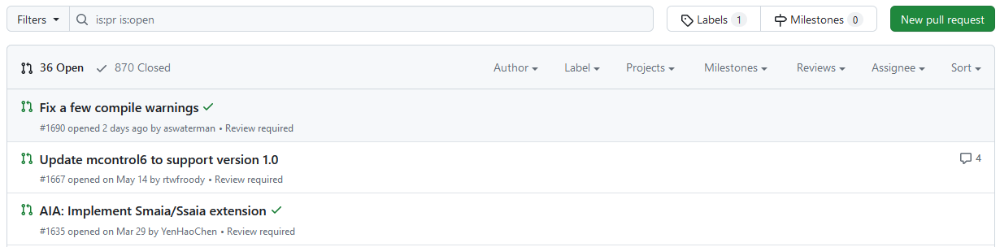
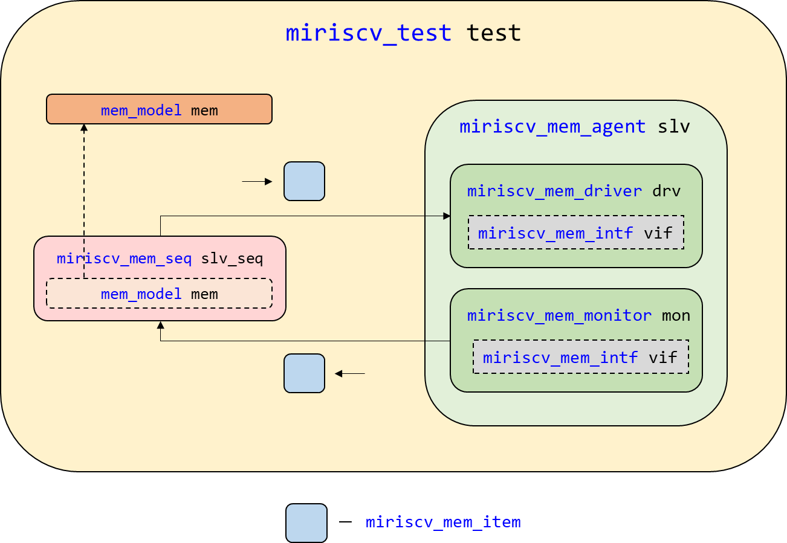
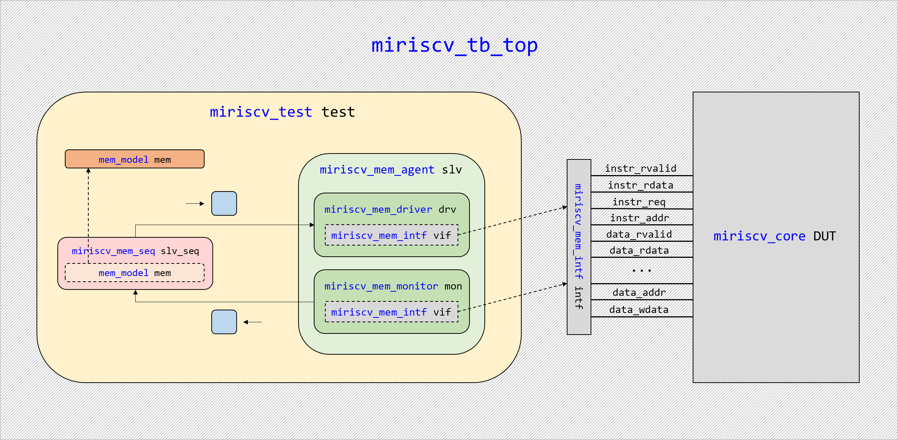
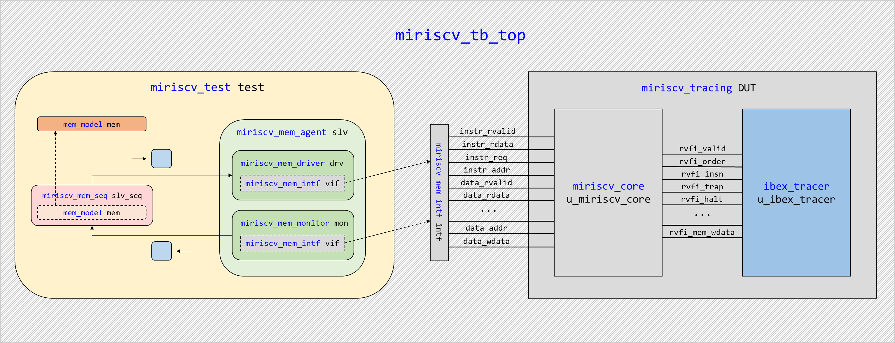
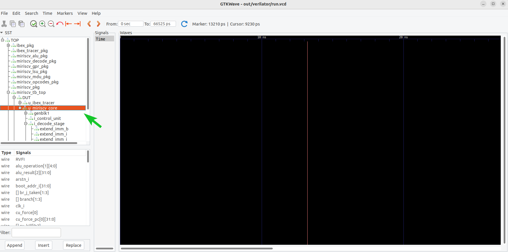
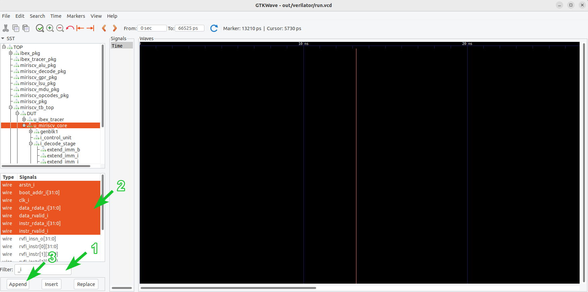
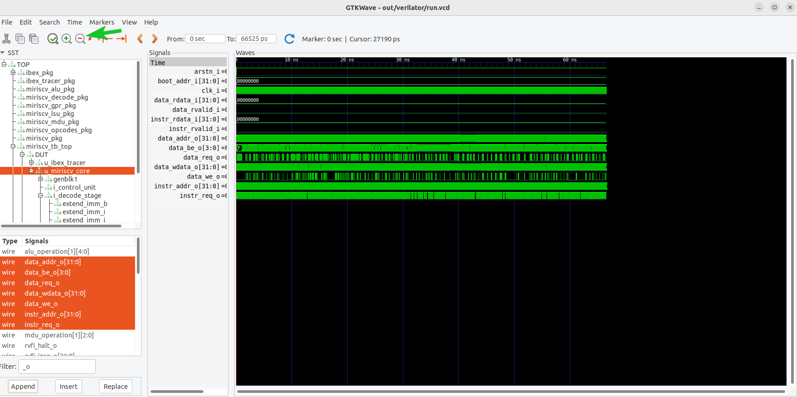
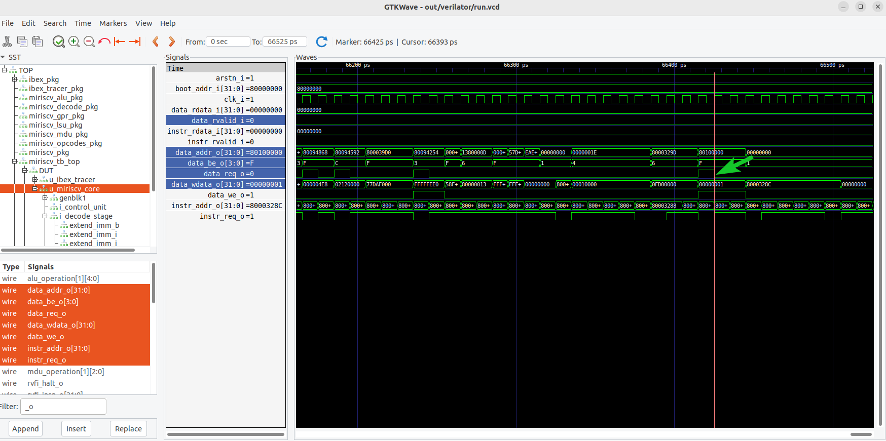
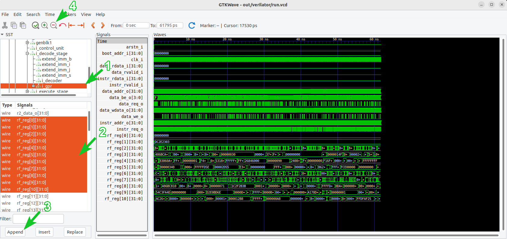

# Практическое занятие 02: Сравнение с эталонной моделью

- [Практическое занятие 02: Сравнение с эталонной моделью](#практическое-занятие-02-сравнение-с-эталонной-моделью)
  - [Необходимое ПО](#необходимое-по)
  - [Рекомендуемый материал](#рекомендуемый-материал)
  - [Краткое содержание](#краткое-содержание)
  - [Важные сведения](#важные-сведения)
  - [Тестируемое RISC-V ядро](#тестируемое-risc-v-ядро)
  - [Используемая эталонная модель Spike](#используемая-эталонная-модель-spike)
  - [Используемый генератор случайных инструкций AAPG](#используемый-генератор-случайных-инструкций-aapg)
  - [Работа с генератором случайных RISC-V инструкций AAPG](#работа-с-генератором-случайных-risc-v-инструкций-aapg)
    - [Подготовка](#подготовка)
    - [Создание файла конфигурации для тестируемого ядра](#создание-файла-конфигурации-для-тестируемого-ядра)
    - [Пробная генерация тестовой программы](#пробная-генерация-тестовой-программы)
    - [Анализ тестовой программы. Часть 1](#анализ-тестовой-программы-часть-1)
    - [Анализ тестовой программы. Часть 2](#анализ-тестовой-программы-часть-2)
    - [Модификация](#модификация)
    - [Сохранение изменений модификации](#сохранение-изменений-модификации)
  - [Работа с верификационным окружением](#работа-с-верификационным-окружением)
    - [Структура верификационного окружения](#структура-верификационного-окружения)
    - [Анализ главного модуля тестируемого ядра](#анализ-главного-модуля-тестируемого-ядра)
    - [Создание интерфейса `miriscv_mem_intf`](#создание-интерфейса-miriscv_mem_intf)
    - [Создание классов верификационного окружения](#создание-классов-верификационного-окружения)
      - [Модель памяти `mem_model`](#модель-памяти-mem_model)
      - [Транзакция `miriscv_mem_item`](#транзакция-miriscv_mem_item)
      - [Монитор `miriscv_mem_monitor`](#монитор-miriscv_mem_monitor)
      - [Драйвер `miriscv_mem_driver`](#драйвер-miriscv_mem_driver)
      - [Последовательность `miriscv_mem_seq`](#последовательность-miriscv_mem_seq)
      - [Агент `miriscv_mem_agent`](#агент-miriscv_mem_agent)
      - [Тест `miriscv_test`](#тест-miriscv_test)
    - [Создание пакета (package) теста `miriscv_test_pkg`](#создание-пакета-package-теста-miriscv_test_pkg)
    - [Создание главного модуля верификационного окружения `miriscv_tb_top`](#создание-главного-модуля-верификационного-окружения-miriscv_tb_top)
  - [Добавление трассировки тестируемого ядра](#добавление-трассировки-тестируемого-ядра)
    - [Общие сведения](#общие-сведения)
    - [Несинтезируемый модуль трассировки](#несинтезируемый-модуль-трассировки)
    - [Создание модуля-обертки трассировки](#создание-модуля-обертки-трассировки)
    - [Модификация главного модуля верификационного окружения](#модификация-главного-модуля-верификационного-окружения)
    - [Итоговая структура верификационного окружения](#итоговая-структура-верификационного-окружения)
  - [Сборка и запуск симуляции](#сборка-и-запуск-симуляции)
    - [Генерация тестовой программы](#генерация-тестовой-программы)
    - [Компиляция тестовой программы](#компиляция-тестовой-программы)
    - [Экспорт тестовой программы](#экспорт-тестовой-программы)
    - [Запуск эталонной модели](#запуск-эталонной-модели)
    - [Запуск симуляции](#запуск-симуляции)
  - [Анализ результатов](#анализ-результатов)
    - [Лог-файлы](#лог-файлы)
    - [Временные диаграммы](#временные-диаграммы)
    - [Сравнение с эталонной моделью](#сравнение-с-эталонной-моделью)
    - [Осознанное внедрение ошибок](#осознанное-внедрение-ошибок)
  - [Эталонная реализация](#эталонная-реализация)
  - [Выводы](#выводы)


## Необходимое ПО

Подразумевается, что **задание выполняется на:**
- [на предоставленной виртуальной машине](../../#использование-виртуальной-машины);
- на ином дистрибутиве Linux с [установленным необходимым ПО](../../#ручная-установка).


## Рекомендуемый материал

- [Тема 00: Вводная](../../theory/00_intro.md)
- [Тема 01: Функциональная верификация процессорных ядер](../../theory/01_basics.md)
- [Тема 02: Основные подходы к функциональной верификации RISC-V ядер](../../theory/02_approach.md)
- [Тема 03: Базовые подходы к симуляции RISC-V ядер](../../theory/03_func.md)
- [Тема 04: RISC-V верификация: сравнение с эталонной моделью](../../theory/04_rgen.md)


## Краткое содержание

Данное занятие воспроизводит маршрут подхода к верификации процессорных ядер [сравнение с эталонной моделью](../../theory/04_rgen.md) на примере RISC-V ядра с открытым исходным кодом [MIRISCV](https://github.com/riscv-tests-intro/MIRISCV/tree/b510b308addc4a7271e36f2a348bd18bf24c1d77). Занятие состоит из **5 основных этапов, выполняемых друг за другом.**

[Работа с генератором случайных RISC-V инструкций AAPG](#работа-с-генератором-случайных-risc-v-инструкций-aapg) - изучается и модифицируется генератор случайных RISC-V инструкций [AAPG](https://gitlab.com/shaktiproject/tools/aapg/-/tree/7ce4a9073a040bbc784edfd1c8a7b21f269f7766). [Работа с верификационным окружением](#работа-с-верификационным-окружением) - создаются и заполняются должным образом исходные файлы верификационного окружения. [Добавление трассировки тестируемого ядра](#добавление-трассировки-тестируемого-ядра) - подробно разбирается и производится интеграция функционала [трассировки](../../theory/04_rgen.md#описание-подхода-часть-1) тестируемого ядра в верификационное окружение. [Сборка и запуск симуляции](#сборка-и-запуск-симуляции) - генерируется, компилируется и экспортируется случайная тестовая программа, создаются необходимые директории и выполняются команды, необходимые для запуска симуляции на тестируемом ядре и этаолонной модели. [Анализ результатов](#анализ-результатов) - производится сравнение поведения процессора и модели, делается вывод о корректности его работы.


## Важные сведения

**Обратите внимание**, что в части файлов, которые разбираются в ходе занятия, часть кода осознанно пропущена, оставлена лишь значимая, необходимая для формирования общей картины.

Например:

```SystemVerilog
class miriscv_mem_monitor;

    ...

    virtual task get_data(miriscv_mem_item t);
        vif.get_bus_status(t);
    endtask
  
endclass
```

В данном файле пропущена часть кода между `class miriscv_mem_monitor;` и `virtual task get_data(miriscv_mem_item t);`.


## Тестируемое RISC-V ядро

В рамках курса будет тестироваться учебное ядро, разработанное в НИУ МИЭТ: [MIRISCV](https://github.com/riscv-tests-intro/MIRISCV/tree/b510b308addc4a7271e36f2a348bd18bf24c1d77). Процессор поддерживает расширения RV32I и RV32M и является четырехстадийным [in-order](https://en.wikipedia.org/wiki/Out-of-order_execution#In-order_processors) [конвейером](https://en.wikipedia.org/wiki/Instruction_pipelining). Ядро поддерживает только машинный уровень привилегий[^1].

<p align="center">
  </img>
</p>

Подробную документацию на процессор можно найти по [ссылке](https://github.com/riscv-tests-intro/MIRISCV/tree/b510b308addc4a7271e36f2a348bd18bf24c1d77/doc/miriscv/miriscv_scheme.md). В рамках курса его функциональные особенности подробно разбираться не будут, а необходимая для выполнения заданий информация будет даваться по ходу повествования.


## Используемая эталонная модель [Spike](https://github.com/riscv-software-src/riscv-isa-sim/tree/00dfa28cd71326a9b553052bf0160cb76f0e7e07)

Для тестирования процессорного ядра будет использоваться эталонная модель [Spike](https://github.com/riscv-software-src/riscv-isa-sim/tree/00dfa28cd71326a9b553052bf0160cb76f0e7e07), написанная на языке C. В настоящее время эта модель является самой популярной открытой моделью.

На момент создания данного практического задания в репозитории данного набора тестов присутствует 870 закрытых и 36 открытых pull requests, один из которых был создан 2 дня назад.




## Используемый генератор случайных инструкций [AAPG](https://gitlab.com/shaktiproject/tools/aapg/-/tree/7ce4a9073a040bbc784edfd1c8a7b21f269f7766)

Для тестирования процессорного ядра будет использоваться генератор случайных RISC-V инструкций [APPG](https://gitlab.com/shaktiproject/tools/aapg/-/tree/7ce4a9073a040bbc784edfd1c8a7b21f269f7766), написанный на языке Python. Генератор поддерживает набор расширений `RV32IMAFDC_Zb_Zicsr` для 32-битных машин и `RV64IMAFDC_Zb_Zicsr` для 64-битных машин. Документация на генератор доступна по [ссылке](https://gitlab.com/shaktiproject/tools/aapg/-/wikis/Wiki-AAPG-%5B2.2.2%5D).

В настоящее время самым популярным генератором случайных RISC-V инструкций является [RISCV-DV](https://github.com/chipsalliance/riscv-dv). Однако его использование возможно только при наличии доступа к коммерческим симуляторам, таким как [Mentor QuestaSim](https://eda.sw.siemens.com/en-US/ic/questa/simulation/advanced-simulator/), [Synopsys VCS](https://www.synopsys.com/verification/simulation/vcs.html), [Cadence Xcelium](https://www.cadence.com/en_US/home/tools/system-design-and-verification/simulation-and-testbench-verification/xcelium-simulator.html).

Одной из важных особенностей курса является **использование только открытого ПО**, так что в рамках данного занятия был сделан выбор в пользу менее совершенного, но полностью отрытого [AAPG](https://gitlab.com/shaktiproject/tools/aapg/-/tree/7ce4a9073a040bbc784edfd1c8a7b21f269f7766), обладающего, тем не менее внушительным набором поддерживаемых расширений.

В будущем, когда [Verilator](https://github.com/verilator/verilator/tree/522bead374d6b7b2adb316304126e5361b18bcf1) будет полностью поддерживать библиотеки [универсальной методолгии верификации (Universal Verification Methodology, UVM)](https://accellera.org/downloads/standards/uvm), генератор может быть заменен автором курса.

## Работа с генератором случайных RISC-V инструкций [AAPG](https://gitlab.com/shaktiproject/tools/aapg/-/tree/7ce4a9073a040bbc784edfd1c8a7b21f269f7766)

### Подготовка

**Подразумевается, что команды начинают выполняться в директории, в которой расположен данный файл с описанием занятия.** Для того, чтобы реализовать [сравнение с эталонной моделью](../../theory/04_rgen.md) нам для начала понадобятся две директории:

- `tb` - для исходных файлов верификационного окружения;
- `build` - для файлов сборки и запуска тестирования.

Создадим эти директории:

```bash
mkdir tb
mkdir build
```

### Создание файла конфигурации для тестируемого ядра

Перейдем в директорию для сборки и запуска:

```bash
cd build
```

Согласно [документации](https://gitlab.com/shaktiproject/tools/aapg/-/wikis/Wiki-AAPG-%5B2.2.2%5D#design) генератору необходим файл `config.yaml` определенного формата, в котором будут указаны настройки для создания программы.

Эмпирическим методом[^2] выясняем, что для генерации шаблона файла конфигурации необходимо выполнить команду:

```bash
aapg setup --setup_dir ./
```

Аргумент `--setup_dir ./` определяет текущую директорию выходной директорией артефактов запуска команды. В ней появится файл `config.yaml` и еще несколько директорий, которые не играют роли в текущем разделе, так что их можно удалить:

```bash
rm -r */
```

Откроем файл конфигурации `config.yaml` любым редактором:

```bash
gedit config.yaml
```

Подробное описание всех настроек файла конфигурации можно найти в [документации](https://gitlab.com/shaktiproject/tools/aapg/-/wikis/Wiki-AAPG-%5B2.2.2%5D#features). Мы же будем двигаться сверху вниз и корректировать лишь необходимые.

Изменим количество инструкций на 10000:

```yaml
total_instructions: 10000
```

Слова по типу `trap_handler` сразу должны нас настораживать, так как [MIRISCV](https://github.com/riscv-tests-intro/MIRISCV/tree/b510b308addc4a7271e36f2a348bd18bf24c1d77) не поддерживает CSR-инструкций. Отключаем генерацию пользовательского обработчика прерываний.


```yaml
custom_trap_handler: false
```

Обратим внимание на строку:

```yaml
code_start_address: 0x80000000
```

Нам важно ее не менять. Почему - узнаем позже в разделе [Запуск эталонной модели](#запуск-эталонной-модели).

Далее настроим распределение инструкций:

```yaml
rel_rv32i.ctrl: 1
rel_rv32i.compute: 10
rel_rv32i.data: 3
```

Инструкции условных и безусловных переходов будут происходить с вероятностью 1/14. Вычислительные инструкции с веротяностью 10/14, а инструкции чтения/записи данных с вероятностью 3/14. Остальные типы, в том числе `fence` и CSR-инструкции, которые не поддерживает тестируемое ядро - с вероятностью 0 ([cсылка на соответствующий раздел документации](https://gitlab.com/shaktiproject/tools/aapg/-/wikis/Wiki-AAPG-%5B2.2.2%5D#instruction-count-distribution)).

Добавим также рекурсивные функции:

```yaml
recursion-enable: true
```

Изменим также с 3 на 2 опцию `num_regs_lookbehind`:

```yaml
num_regs_lookbehind: 2
```

Простыми словами, эта опция отвечает за то, сколько последних регистров, к которым было обращение ранее во времени, использовать в ходе генерации инструкции, приводящей к конфликту по данным в конвейере. Конвейер MIRISCV на 1 стадию короче [классического RISC конвейера](https://en.wikipedia.org/wiki/Classic_RISC_pipeline), так что для повышения частоты конфликтов уменьшим значение этой опции.

Файл конфигурации `config.yaml` создан. Закроем его.

### Пробная генерация тестовой программы

Создадим директорию для сохранения артефактов генерации:

```
mkdir -p out/aapg
```

Инициализируем рабочую директорию:

```bash
aapg setup --setup_dir out/aapg &> out/aapg/gen.log
```
Аргумент `--setup_dir ./` определяет рабочей директорией `out/aapg`. Выражение `&> out/aapg/gen.log` перенаправляет поток вывода в файл `out/aapg/gen.log`. По сути этот файл будет являться лог-файлом.

Сгенерируем случайную программу:

```bash
aapg gen --config_file config.yaml --setup_dir out/aapg --output_dir \
	out/aapg/asm --asm_name program --seed $RANDOM &>> out/aapg/gen.log
```

Через аргумент `--config_file` используем файл конфигурации, созданный в разделе [Создание файла конфигурации для тестируемого ядра](#создание-файла-конфигурации-для-тестируемого-ядра). Рабочую и выходную директории определяем через `--setup_dir` и `--output_dir`. Зерно, инициализирующее рандомизацию определяем через `--seed`. Выражение `&>> out/aapg/gen.log` перенаправляет поток вывода в файл `out/aapg/gen.log`. По сути этот файл будет являться лог-файлом.

### Анализ тестовой программы. Часть 1

Эмпирическим методом выясняем, что ассемблер тестовой программы находится в директории `out/aapg/asm/program.S`. Откроем этот файл.

```bash
gedit out/aapg/asm/program.S
```

Обратите внимание, что синтаксис ассемблера RISC-V мы подробно рассматривать не будем, это отдельная объемная тема, которая выходит за рамки данного ознакомительного курса. Однако, предоставлю несколько полезных ссылок по этой теме[^3].

Нам необходимо переместиться в конец секций инструкций тестовой программы, то есть в начало секции `.data`. Но смотреть будем чуть выше - на конец секции инструкций.

Увидим что-то похожее на:

```assembly
        ...
        slt                 s11, t4, zero
        andi                s11, s2, 1238
        lh                  s4, -1844(sp)
        and                 s11, s9, s6
        lh                  s11, -1630(sp)
        li                  x24, 10
        ...
        jr                  ra                  
write_tohost:
        li                  t5, 1               
        sw                  t5, tohost, t4
        label: j label

    .data
    .align 1
    .globl begin_signature
begin_signature:
    .dword              0x5745a9b2a1fd8a8c
    .dword              0x11a9c4d630462645
    .dword              0x7cdf0256ed6da1e4

```

Видим, что выполнение программы будет завершаться интересной записью `sw t5, tohost, t4`. Такое написание инструкции сохранения данных означает, что значение в регистре `t5` должно быть записано по адресу, где расположен элемент `tohost`. При этом для формирования адреса будет участвовать регистр `t4` ([ссылка на разбор подобной записи](https://github.com/riscv-non-isa/riscv-asm-manual/issues/10)).

Закроем файл `out/aapg/asm/program.S`.

Эмпирическим методом выясняем, что скрипт линковки программы находится в директории `out/aapg/asm`. Откроем его. **Обратите внимание**, что в рамках данного курса синтаксис скрипта линковки будет разобран лишь косвенно. Эта тема выходит за рамки данного курса. Однако, предоставлю несколько полезных ссылок по этой теме[^4].

```bash
gedit out/aapg/asm/program.ld
```

Увидим:

```Linker Script
...

OUTPUT_ARCH( "riscv" )
ENTRY(_start)

...

SECTIONS
{

  /* text: test code section */
  . = 2147483648;
  .text.init : { *(.text.init) }
  .text : { *(.text) }

  /* data segment */
  . = 0x80091000;
  .data : { *(begin_signature*) }

  
  . = ALIGN(0x100000);
  .tohost : { *(.tohost) } 
  .rodata : { *(rodata) }

  /* End of uninitalized data segement */
  _end = .;
}
```

Видим, что секции начинают располагаться линковщиком начиная с адреса `2147483648`, что соответствует `80000000` в шестнадцатиричном представлении. Дело в том, что генератор формирует стартовый адрес в скрипте линковке исходя из настройки `code_start_address` в файле конфигурации. Эту настройку мы как раз оставили в базовом значении `0x80000000` в разделе [Создание файла конфигурации для тестируемого ядра](#создание-файла-конфигурации-для-тестируемого-ядра). Зачем нам нужно именно такое значение - узнаем позже в разделе [Запуск эталонной модели](#запуск-эталонной-модели).

Нам важно **обратить внимание** на секцию `.tohost`, она располагается по адресу `80000000` + `100000` = `80100000`. Запомним это и закроем скрипт линковки.

Эмпирическим методом выясняем, что секция `.tohost` располагается в сгенерированном файле `out/aapg/common/crt.S`.

Откроем сгенерированный файл:

```bash
gedit out/aapg/common/crt.S
```

Ищем секцию `.tohost` и видим что-то похожее на:

```assembly
...

.section ".tohost","aw",@progbits
.align 6
.globl tohost
tohost: .dword 0
.align 6
.globl fromhost
fromhost: .dword 0

...
```

В этой секции как раз объявляется метка `tohost`, по адресу расположения которой и будет производиться запись значения 1 в конце тестовой программы. 

Закроем файл `out/aapg/common/crt.S`.

Делаем вывод, что в **случае достижения процессором конца тестовой программы, в память по адресу `80100000` записывается значение 1.**

### Анализ тестовой программы. Часть 2

Еще раз откроем скрипт линковки:

```bash
gedit out/aapg/asm/program.ld
```

Рассмотрим код генерации секций кода:

```Linker Script
...

SECTIONS
{

  /* text: test code section */
  . = 2147483648;
  .text.init : { *(.text.init) }
  .text : { *(.text) }

  /* data segment */
  . = 0x80091000;
  .data : { *(begin_signature*) }

  
  . = ALIGN(0x100000);
  .tohost : { *(.tohost) } 
  .rodata : { *(rodata) }

  /* End of uninitalized data segement */
  _end = .;
}
```

Видим, что первым в тестовой программе будет выполняться код из секции `text.init`. Эмпирическим методом выясняем, что эта секция располагается в сгенерированном файле `out/aapg/common/crt.S`.

Закроем скрипт линковки и откроем сгенерированный файл:

```bash
gedit out/aapg/common/crt.S
```

Увидим что-то похожее на:

```assembly
...

  .section ".text.init"

  ...

  LREG  x1, 0*REGBYTES(sp)
  ...
  LREG  x31,29*REGBYTES(sp)

  # enable FPU and accelerator if present
  li t0, MSTATUS_FS | MSTATUS_XS
  csrs mstatus, t0

  ...

  # initialize trap vector
  la t0, trap_entry
  csrw mtvec, t0

  la  tp, _end + 63
  and tp, tp, -64

  # get core id
  csrr a0, mhartid
  # for now, assume only 1 core
  li a1, 1
1:bgeu a0, a1, 1b

  ...

  j main

...
```

Секция `.text.init` отвечает за начальную инициализацию перед запуском основной части посредством безусловного перехода к первой инструкции, расположенной после метки `main`: `j main`.

Видим, что в этой секции содержаться инструкции обращения к CSR, которые [MIRISCV](https://github.com/riscv-tests-intro/MIRISCV/tree/b510b308addc4a7271e36f2a348bd18bf24c1d77) не поддерживает. **Это значит, что нам придется модифицировать исходный код генератора для того, чтобы его использовать.** Ситуация достаточно типичная, особенно для проектов с открытым исходным кодом.

Закроем файл `out/aapg/common/crt.S`.

### Модификация

Код генерации файла `crt.S` находится в директории [`aapg/aapg/env/prelude`](https://gitlab.com/shaktiproject/tools/aapg/-/blob/7ce4a9073a040bbc784edfd1c8a7b21f269f7766/aapg/env/prelude.py).

Наша задача - удалить из файла все инструкции взаимодействия с CSR.

Сделать это можно при помощи выполнения команды:

```bash
sed -i '/csr/d' ../../../submodules/aapg/aapg/env/prelude.py
```

Также обратим в файле [`aapg/aapg/env/prelude`](https://gitlab.com/shaktiproject/tools/aapg/-/blob/7ce4a9073a040bbc784edfd1c8a7b21f269f7766/aapg/env/prelude.py) внимание на строки:

```assembly
  ...
  # get core id
  csrr a0, mhartid
  # for now, assume only 1 core
  li a1, 1
1:bgeu a0, a1, 1b
  ...

  # give each core 128KB of stack + TLS
#define STKSHIFT 17
  sll a2, a0, STKSHIFT
  add tp, tp, a2
  add sp, a0, 1
  sll sp, sp, STKSHIFT
  add sp, sp, tp

  j main
```

Инструкция `bgeu a0, a1, 1b` производит сравнение с 1 регистра общего назначения `a0`, в который выполняется чтение из CSR регистра `mhartid` при помощи `csrr a0, mhartid`. Так как после удаления этой CSR-инструкции регистр `a1` может содержать не 1, то эту инструкцию необходимо будет удалить. В этом случае выполнение программы продолжиться дальше так же, как если бы `a1` содержал 1.

Сделать это можно при помощи выполнения команды:

```bash
sed -i '/bgeu a0, a1, 1b/d' ../../../submodules/aapg/aapg/env/prelude.py
```

### Сохранение изменений модификации

Было бы хорошо сохранить все изменения, которые были внесены в тестовые сценарии в разделе [Модификация](#модификация). Сделаем это образом, негласно принятым в индустрии - при помощи создания `fork` основного репозитория, создания в нем новой ветки и сохранения изменений в ней. В случае с [AAPG](https://gitlab.com/shaktiproject/tools/aapg/-/tree/7ce4a9073a040bbc784edfd1c8a7b21f269f7766) термин `fork` употреблять некорректно, так как репозиторий находится на GitLab, а сохранить изменения мы хотим на GitHub. Будем называть его **копия**.

В рамках данного занятия сам маршрут сохранения изменений разобран не будет, а будет использован уже готовый репозиторий. **Автором была создана [копия](https://github.com/riscv-tests-intro/aapg/tree/2d7d40feb8ce7ae20ccbe8225ed9947c188e9cc3), в которой была создана ветка `miriscv` и в ней сохранены сделанные нами изменения.** Копия находится в директории `submodules/aapg-miriscv`. В ходе [установки ПО](../../doc/soft.md#генератор-случайных-инструкций-risc-v-aapg-7ce4a90) генератор собирается из этой директории. Также на [предоставляемой виртуальной машине](../../README.md#использование-виртуальной-машины) установлена именно измененная версия генератора.

Переходим на один уровень назад:

```bash
cd ..
```

Теперь мы в корневой директории практического занятия. **Приступаем к работе с верификационным окружением.**


## Работа с верификационным окружением

### Структура верификационного окружения

В ходе данного практического занятия верификационное **окружение будет спроектировано с использованием объектно-ориентированного программирования** (ООП)[^5]. Структура представлена на изображении ниже:

<p align="center">
  </img>
</p>

**В окружении используется популярный подход с обратной связью.** Класс [`miriscv_mem_monitor`](#монитор-miriscv_mem_monitor) отслеживает запросы ядра в память и отправляет информацию в класс последовательности [`miriscv_mem_seq`](#последовательность-miriscv_mem_seq), в которой находится указатель (object handle)[^6] на универсальную модель памяти [`mem_model`](#модель-памяти-mem_model). Последовательность в свою очередь формирует транзакции [`miriscv_mem_item`](#транзакция-miriscv_mem_item) для класса [`miriscv_mem_driver`](#драйвер-miriscv_mem_driver), который отвечает за взаимодействие окружения с сигналами процессорного ядра. Классы [`miriscv_mem_monitor`](#монитор-miriscv_mem_monitor) и [`miriscv_mem_driver`](#драйвер-miriscv_mem_driver) инкапсулированы в класс [`miriscv_mem_agent`](#агент-miriscvmemagent), который в свою очередь находится в классе [`miriscv_test`](#тест-miriscv_test), который создает и инициалиизрует модель памяти, определяет тестовый сценарий.

Проектированию каждого компонента далее будет отведен отдельный раздел. А теперь давайте рассмотрим более подробно рассмотрим механизм подключения тестового сценария к главному модулю верификационного окружения. Структура представлена на изображении ниже:

<p align="center">
  </img>
</p>

Компоненты окружения [`miriscv_mem_monitor`](#монитор-miriscv_mem_monitor) и [`miriscv_mem_driver`](#драйвер-miriscv_mem_driver) взаимодействуют с главным модулем ядра [`miriscv_core`](https://github.com/riscv-tests-intro/MIRISCV/tree/b510b308addc4a7271e36f2a348bd18bf24c1d77/miriscv/rtl/miriscv_core.sv) при помощи интерфейса[^7] [`miriscv_mem_intf`](#создание-интерфейса-miriscv_mem_intf). В топ-модуле верификационного окружения [miriscv_tb_top](#создание-главного-модуля-верификационного-окружения-miriscv_tb_top) интерфейс подключается к сигналам топ-модуля ядра, а ссылка на интерфейс передается в соответствующие компоненты окружения.

### Анализ главного модуля тестируемого ядра

И давайте сразу посмотрим на главный модуль (далее может применяться термин "топ-модуль") тестируемого ядра [`miriscv_core.sv`](https://github.com/riscv-tests-intro/MIRISCV/tree/b510b308addc4a7271e36f2a348bd18bf24c1d77/miriscv/rtl/miriscv_core.sv). Файл можно открыть в любом редакторе. Открываем при помощи gedit:

```bash
gedit ../../submodules/MIRISCV/miriscv/rtl/miriscv_core.sv
```

```SystemVerilog
module miriscv_core
  ...
  import miriscv_pkg::ILEN;
  ...
#(
  parameter bit RVFI = 1'b1
) (
  // Clock, reset
  input  logic              clk_i,
  input  logic              arstn_i,

  input  logic [XLEN-1:0]   boot_addr_i,

  // Instruction memory interface
  input  logic              instr_rvalid_i,
  input  logic [XLEN-1:0]   instr_rdata_i,
  output logic              instr_req_o,
  output logic [XLEN-1:0]   instr_addr_o,

  // Data memory interface
  input  logic              data_rvalid_i,
  input  logic [XLEN-1:0]   data_rdata_i,
  output logic              data_req_o,
  output logic              data_we_o,
  output logic [XLEN/8-1:0] data_be_o,
  output logic [XLEN-1:0]   data_addr_o,
  output logic [XLEN-1:0]   data_wdata_o,

  // RVFI
  ...
);
```

Прежде всего видим параметр, отвечающий за поддержку [интерфейса RVFI](../../theory/04_rgen.md#интерфейс-rvfi). По умолчанию его значение равно 1, запомним это.

Далее можем наблюдать тактовый сигнал `clk_i`, сигнал асинхронного сброса с негативным активным уровнем `arstn_i`, сигнал `boot_addr_i`, отвечающий за то, с какого адреса в памяти ядро начнет выполнять инструкции.

Также видим сигналы с `instr_rvalid` ... `instr_addr`, отвечающие за интерфейс инструкций и сигналы `data_rvalid` ... `data_be`, отвечающие за интерфейс данных. Более подробно про чтение инструкций из памяти ядром MIRISCV можно прочитать [тут](https://github.com/riscv-tests-intro/MIRISCV/tree/b510b308addc4a7271e36f2a348bd18bf24c1d77/doc/miriscv/fetch_stage.md#%D0%B7%D0%B0%D0%B3%D1%80%D1%83%D0%B7%D0%BA%D0%B0-%D0%B8%D0%BD%D1%81%D1%82%D1%80%D1%83%D0%BA%D1%86%D0%B8%D0%B9-%D0%B8%D0%B7-%D0%BF%D0%B0%D0%BC%D1%8F%D1%82%D0%B8-%D0%B8%D0%BD%D1%81%D1%82%D1%80%D1%83%D0%BA%D1%86%D0%B8%D0%B9). Про чтение(запись) данных из(в) памяти(ь) - [тут](https://github.com/riscv-tests-intro/MIRISCV/tree/b510b308addc4a7271e36f2a348bd18bf24c1d77/doc/miriscv/lsu.md).

### Создание интерфейса `miriscv_mem_intf`

Приступим к написанию исходных файлов верификационного окружения. Писать будем на языке описания и верификации аппаратуры [SystemVerilog](https://en.wikipedia.org/wiki/SystemVerilog). В настоящее время он является промышленным стандартом.

Начнем с интерфейса, при помощи которого будем взаимодействовать с тестируемым ядром (см. раздел [Структура верификационного окружения](#структура-верификационного-окружения)).

Перейдем в директорию исходных файлов верификационного окружения:

```bash
cd tb
```

Создадим необходимый файл:

```bash
touch miriscv_mem_intf.sv
```

Файл можно открыть в любом редакторе. Открываем при помощи gedit:

```bash
gedit miriscv_mem_intf.sv
```

Заполним файл следующим кодом:

```SystemVerilog
interface miriscv_mem_intf (
    input logic clk,
    input logic arst_n
);

    // Instruction memory signals
    logic        instr_rvalid;
    logic [31:0] instr_rdata;
    logic        instr_req;
    logic [31:0] instr_addr;

    // Data memory signals
    logic        data_rvalid;
    logic [31:0] data_rdata;
    logic        data_req;
    logic [31:0] data_wdata;
    logic [31:0] data_addr;
    logic        data_we;
    logic [ 3:0] data_be;

    task wait_clks(input int num);
      repeat (num) @(posedge clk);
    endtask

    task wait_neg_clks(input int num);
      repeat (num) @(negedge clk);
    endtask
  
endinterface
```

В интерфейсе определен необходимый набор сигналов для взаимодействия с ядром. Они будут подключаться к сигналам сигналам ядра, которые мы видели в разделе [Анализ главного модуля тестируемого ядра](#анализ-главного-модуля-тестируемого-ядра). Также в интерефейсе определено несколько вспомагательных задач для ожидания определенного количества позитивных или негативных фронтов тактового сигнала `clk`. Эти задачи могут быть вызваны компонентами окружения, например: `vif.wait_clks(10)`.

Закроем файл `miriscv_mem_intf.sv`.

### Создание классов верификационного окружения

#### Модель памяти `mem_model`

Теперь создадим класс модели памяти которая будет находиться в классе последовательности (см. раздел [Структура верификационного окружения](#структура-верификационного-окружения)) и с к которой будет взаимодействовать ядро. Взаимодействовать косвенно, читая инструкции/данные и записывая данные. Класс будет написан в универсальной манере.

Создадим необходимый файл:

```bash
touch mem_model.sv
```

Файл можно открыть в любом редакторе. Открываем при помощи gedit:

```bash
gedit mem_model.sv
```

Заполним файл следующим кодом:

```SystemVerilog
class mem_model #(parameter ADDR_WIDTH = 32, parameter DATA_WIDTH = 32);

    typedef bit [ADDR_WIDTH-1:0] mem_addr_t;
    typedef bit [DATA_WIDTH-1:0] mem_data_t;

    bit [7:0] system_memory [mem_addr_t];

endclass
```

**Обратите внимание**, что класс в классе парамеризованы ширина данных и адреса с целью универсальности.

<details>
  <summary>Зачем параметризация, если у тестируемого ядра все равно фиксированные ширины шин?</summary>

---

Действительно, параметризация здесь является избыточной, однако автором было принято решение создания универсальной модели, которая может использоваться для тестирования ядер с различными ширинами шин.

---

</details>

Для начала из соображений удобства в теле класса мы объявили типы `mem_addr_t` и `mem_data_t`, а также ассоциативный массив `system_memory`, место в котором выделяется по мере обращения к нему. Таким образом, его размер будет определяться размером тестовой программы. Память будет содержать элементы ширины 8, то есть будет являться побайтовой.

<details>
  <summary>Расшифровка объявления памяти</summary>

---

Объявляется массив, состоящий из элементов типа `bit [7:0]` с именем `system_memory`, который индексируется значениями типа `addr_t`, то есть `bit [ADDR_WIDTH-1:0]`. Пример взаимодействия с элементом массива, если `ADDR_WIDTH` равно 32:

```SystemVerilog
bit [31:0] addr;
bit [ 7:0] data;

initial begin
    addr = 8'hABCD_1234;
    mem[addr] = 4;
    data = mem[addr]; // data = 4
end
```

---

</details>

Дополним класс функциями чтения и записи байта:

```SystemVerilog
class mem_model #(parameter ADDR_WIDTH = 32, parameter DATA_WIDTH = 32);

    ...

    function bit [7:0] read_byte(mem_addr_t addr);
        bit [7:0] data;
        if(system_memory.exists(addr)) begin
        data = system_memory[addr];
            `ifdef MEM_DEBUG
               $display("%0t Read Mem  : Addr[0x%0h], Data[0x%0h]", $time(), addr, data);
            `endif
        end
        else begin
            data = 'x;
            `ifdef READ_UNINIT
                $display("%0t Read by uninitialzed address 0x%0h", $time(), addr);
            `endif
        end
        return data;
    endfunction

    function void write_byte(mem_addr_t addr, bit[7:0] data);
        `ifdef MEM_DEBUG
            $display("%0t Write Mem : Addr[0x%0h], Data[0x%0h]", $time(), addr, data);
        `endif
        system_memory[addr] = data;
    endfunction

endclass
```

**Обратите внимание** на `MEM_DEBUG`. Если в ходе компиляции симулятору передать аргумент `+define+MEM_DEBUG`, то в лог симуляции будет выводиться информация о записи в память и чтении из нее. Также обратите внимание на `READ_UNINIT`. Если в ходе компиляции симулятору передать аргумент `+define+READ_UNINIT`, то при чтении из непроинициализированной ячейки памяти в лог симуляции будет выводиться предупреждение об этом.

Дополним класс функциями чтения и записи слова:

```SystemVerilog
class mem_model #(parameter ADDR_WIDTH = 32, parameter DATA_WIDTH = 32);

    ...

    function void write(input mem_addr_t addr, mem_data_t data);
        bit [7:0] byte_data;
        for(int i=0; i<DATA_WIDTH/8; i++) begin
            byte_data = data[7:0];
            write_byte(addr+i, byte_data);
            data = data >> 8;
        end
    endfunction

    function mem_data_t read(mem_addr_t addr);
        mem_data_t data;
        for(int i=DATA_WIDTH/8-1; i>=0;  i--) begin
            data = data << 8;
            data[7:0] = read_byte(addr+i);
        end
        return data;
    endfunction

endclass
```

По своей сути эти функции просто циклически вызывают чтение/запись байта, пока не будет сччитано/записано целое слово.

Закроем файл `mem_model.sv`.

#### Транзакция `miriscv_mem_item`

Далее создадим класс транзакции, при помощи которого компоненты окружения будут обмениваться между собой информацией (см. раздел [Структура верификационного окружения](#структура-верификационного-окружения)).

Создадим необходимый файл:

```bash
touch miriscv_mem_item.sv
```

Файл можно открыть в любом редакторе. Открываем при помощи gedit:

```bash
gedit miriscv_mem_item.sv
```

Заполним файл следующим кодом:

```SystemVerilog
class miriscv_mem_item;

    logic        instr_rvalid;
    logic [31:0] instr_rdata;
    logic        instr_req;
    logic [31:0] instr_addr;

    logic        data_rvalid;
    logic [31:0] data_rdata;
    logic        data_req;
    logic [31:0] data_wdata;
    logic [31:0] data_addr;
    logic        data_we;
    logic [ 3:0] data_be;

endclass
```

В большинстве случаев класс транзакции содержит только поля с полезной нагрузкой, однако в нашем случае поля управляющих сигналов `instr_rvalid` и `data_rvalid` будут использоваться компонентами окружения для корректного взаимодействия друг с другом. Это мы увидим в разделах ниже.

Закроем файл `miriscv_mem_item.sv`.

#### Монитор `miriscv_mem_monitor`

Cоздадим класс монитора, который будет отслеживать сигналы процессорного ядра и отправлять текущее состояние этих сигналов в класс последовательности (см. раздел [Структура верификационного окружения](#структура-верификационного-окружения)).

Создадим необходимый файл:

```bash
touch miriscv_mem_monitor.sv
```

Файл можно открыть в любом редакторе. Открываем при помощи gedit:

```bash
gedit miriscv_mem_monitor.sv
```

Заполним файл следующим кодом:

```SystemVerilog
class miriscv_mem_monitor;

    virtual miriscv_mem_intf vif;

    mailbox#(miriscv_mem_item) mbx;

    function new(virtual miriscv_mem_intf vif);
        this.vif = vif;
    endfunction
  
    virtual task run();
        wait(vif.arst_n === 1'b1);
        forever begin
            vif.wait_clks(1);
            get_and_put();
        end
    endtask

    virtual task get_and_put();
      miriscv_mem_item t = new();
      get_data(t);
      mbx.put(t);
    endtask
  
endclass
```

Класс содержит в себе указатель на интерфейс `virtual miriscv_mem_intf vif`, `mailbox` для отправки данных в класс последовательности (или, возможно, в другие классы окружения) `mailbox#(miriscv_mem_item) mbx`.

**Обратите внимание** на конструктор. В качестве аргумента в него передается указатель на интерфейс. Без передачи этого аргумента объект класса не может быть создан.

Основной задачей класса является `run()`, которая каждый такт (`forever vif.wait_clks(1)`) получает информацию о сигналах ядра и отправляет информацию в `mailbox` (`get_and_put()`). Задача `get_and_put()` получает значения сигналов ядра при помощи `get_data()` и отправляет информацию в `mailbox` при помощи `mbx.put()`.

**Обратите внимание**, что задача `get_data()` пока не определена. Давайте на некоторое время вернемся к файлу интерфейса

```bash
gedit miriscv_mem_intf.sv
```

и дополним его вспомогательной функцией:

```SystemVerilog
interface miriscv_mem_intf (
    input logic clk,
    input logic arst_n
);

    ...

    function void get_bus_status (
        miriscv_test_pkg::miriscv_mem_item t
    );
        t.instr_rvalid = instr_rvalid;
        t.instr_rdata  = instr_rdata;
        t.instr_req    = instr_req;
        t.instr_addr   = instr_addr;
        t.data_rvalid  = data_rvalid;
        t.data_rdata   = data_rdata;
        t.data_req     = data_req;
        t.data_wdata   = data_wdata;
        t.data_addr    = data_addr;
        t.data_we      = data_we;
        t.data_be      = data_be;
    endfunction
  
endinterface
```

Функция `get_bus_status()` сохраняет текущие значения сигналов интерфейса в объект транзакции `t`. То, почему перед типом `miriscv_mem_item` написано `miriscv_test_pkg::` подробно объясняется в разделе [Создание пакета (package) теста `miriscv_test_pkg`](#создание-пакета-package-теста-miriscv_test_pkg).

Закроем файл `miriscv_mem_intf.sv` и вернемся к `miriscv_mem_monitor.sv`.

Определим функцию `get_data()`:

```SystemVerilog
class miriscv_mem_monitor;

    ...

    virtual task get_data(miriscv_mem_item t);
        vif.get_bus_status(t);
    endtask
  
endclass
```

Здесь все просто, вызываем добавленную ранее в интерфейс функцию `get_bus_status()`.

<details>
  <summary>Почему get_data() - задача, а не функция</summary>

---

Вопрос резонный, ведь `get_data()` вызывает только функцию `get_bus_status()`. Однако, в будущем, вдруг мы захотим переопределить `get_data()` в классе наследнике, причем так, что вызов будет потреблять время. Так что с целью универсальности используется `task`.

---

</details>

Закроем файл `miriscv_mem_monitor.sv`.

#### Драйвер `miriscv_mem_driver`

Далее создадим класс драйвера, который отвечает за получение транзакций от класса последовательности и выставление управляющих сигналов и информационных сигналов на входы тестируемого ядра (см. раздел [Структура верификационного окружения](#структура-верификационного-окружения)). По своей сути класс драйвера отвечает за реализацию чтения инструкций и чтения/записи данных на протокольном уровне.

Создадим необходимый файл:

```bash
touch miriscv_mem_driver.sv
```

Файл можно открыть в любом редакторе. Открываем при помощи gedit:

```bash
gedit miriscv_mem_driver.sv
```

Заполним файл следующим кодом:

```SystemVerilog
class miriscv_mem_driver;

    virtual miriscv_mem_intf vif;

    mailbox #(miriscv_mem_item) mbx;
  
    function new(virtual miriscv_mem_intf vif);
        this.vif = vif;
    endfunction
  
    virtual task run();
      wait (vif.arst_n === 1'b0);
      reset();
      wait (vif.arst_n === 1'b1);
      forever begin
          vif.wait_clks(1);
          get_and_drive();
      end
    endtask
  
    virtual task reset();
      vif.instr_rvalid <= 'b0;
      vif.instr_rdata  <= 'b0;
      vif.data_rvalid  <= 'b0;
      vif.data_rdata   <= 'b0;
    endtask
  
    virtual task get_and_drive();
      miriscv_mem_item t;
      mbx.get(t);
      drive_data(t);
    endtask
  
    virtual task drive_data(miriscv_mem_item t);
        vif.instr_rvalid <= t.instr_rvalid;
        vif.instr_rdata  <= t.instr_rdata;
        vif.data_rvalid  <= t.data_rvalid;
        vif.data_rdata   <= t.data_rdata;
    endtask
  
endclass
```

Класс содержит в себе указатель на интерфейс `virtual miriscv_mem_intf vif`, `mailbox` для получения данных из класса последовательности `mailbox#(miriscv_mem_item) mbx`.

Основной задачей класса является `run()`, которая "дожидается" активного уровня сигнала сброса, при помощи задачи `reset()` сбрасывает управляющие сигналы в неактивный уровень (информационные сигналы `instr_rdata` и `data_rdata` тоже сбрасываются, но это не является обязательным, т.к. не должно влиять на работу ядра).

Далее задача "дожидается" неактивного уровня сигнала сброса и каждый такт (`forever vif.wait_clks(1)`) получает информацию получает информацию от класса последовательности (`mbx.get(t)`) и выставляет значения полей транзакции на одноименные провода интерфейса, которые подключены к одноименным портам тестируемого ядра (`drive_data()`).

Закроем файл `miriscv_mem_driver.sv`.

#### Последовательность `miriscv_mem_seq`

Далее создадим класс последовательности, получает информацию о сигналах на интерфейсе, подключенном к портам ядра от класса монитора (см. раздел [Монитор `miriscv_mem_monitor`](#монитор-miriscv_mem_monitor)). На основании этих сингналов класс последовательности записывает данные в модель памяти (см. раздел []()) и/или считывает инструкцию или данные из памяти и отправляет в виде транзакции в класс драйвера (см. раздел [Драйвер `miriscv_mem_driver`](#драйвер-miriscv_mem_driver)). Этот класс один из самых сложных в реализации, так что **обратите на него свое пристальное внимание**.

Создадим необходимый файл:

```bash
touch miriscv_mem_seq.sv
```

Файл можно открыть в любом редакторе. Открываем при помощи gedit:

```bash
gedit miriscv_mem_seq.sv
```

Заполним файл следующим кодом:

```SystemVerilog
class miriscv_mem_seq;

    mailbox#(miriscv_mem_item) reactive_mbx;
    mailbox#(miriscv_mem_item) mbx;

    mem_model mem;

endclass
```

В классе последовательности объявлен `mailbox` для получения информации от класса монитора `mailbox#(miriscv_mem_item) reactive_mbx`[^8] и `mailbox` для отправки транзакций в класс драйвера `mailbox#(miriscv_mem_item) mbx`. Также в классе последовательности определен указатель на класс [модели памяти](#модель-памяти-mem_model) `mem`.

Далее напишем код основной задачи `run()`:

```SystemVerilog
class miriscv_mem_seq;

    ...

    virtual task run();

        miriscv_mem_item t, t_;

        bit [31:0] data_wdata;
        bit [31:0] data_aligned_addr;

        forever begin

            t_ = new();
            t_.data_rvalid  = 0;
            t_.instr_rvalid = 0;

            reactive_mbx.get(t);

            if(t.instr_req) begin
                t_.instr_rdata = mem.read(t.instr_addr);
                t_.instr_rvalid = 1;
            end

            if(t.data_req) begin
                data_aligned_addr = {t.data_addr[31:2], 2'b00};
                if (t.data_we) begin
                    data_wdata = t.data_wdata;
                    for (int i = 0; i < 4; i++) begin
                        if (t.data_be[i])
                            mem.write_byte(data_aligned_addr + i, data_wdata[7:0]);
                        data_wdata = data_wdata >> 8;
                    end
                end
                else begin
                    t_.data_rdata = mem.read(data_aligned_addr);
                end
                t_.data_rvalid = 1;
            end

            mbx.put(t_);

        end 

    endtask

end
```

В начале задачи объявляются вспомогательные переменные транзакций:  `t` для получения информации от класса монитора и `t_` для отправки в класс драйвера.

События, описанные далее, повторяются бесконечном цикле `forever begin`:

1. создается транзакция для драйвера и инициализирует поля `instr_rvalid` и `data_rvalid` нулевыми значениями;
2. происходит получение значений сигналов ядра от монитора при помощи `reactive_mbx.get()`;
3. если ядро запрашивает чтение инструкции (`t.instr_req` в активном уровне), то по адресу `t.instr_addr` считывается значение из памяти `system_mem` в поле класса транзакции `t_.instr_rdata`, а также значение поля `t_.instr_rvalid` выставляется в активное;
    <details>
    <summary>Что за t и t_?</summary>

    ---

    `t` - транзакция от монитора, показывающая какие значения на портах тестируемого ядра. Если `t_instr_req` равно 1, то порт `instr_req_o` ядра равен 1 (см. раздел [Анализ главного модуля тестируемого ядра](#анализ-главного-модуля-тестируемого-ядра)).

    `t_` - транзакция, предназначенная для драйвера. Если `t.instr_rvalid` равно 1, то на порт `instr_rvalid_i` драйвером тоже будет выставлено значение 1 (см. раздел [Драйвер `miriscv_mem_driver`](#драйвер-miriscv_mem_driver))

    ---

    </details>
4. если ядро запрашивает чтение или запись инструкции (`t.data_req`  в активном уровне):
  - в переменную `data_aligned_addr` записывается значение `t.data_addr`, выровненное по границе 4 байт.
  - если ядро запрашивает запись, то в память `system_memory` по выровненному адресу `data_aligned_addr` записывается каждый байт слова `t.data_wdata`, соответствующее значение `t.data_be` которого имеет активный уровень;
  - если ядро запрашивает чтение, из памяти `system_memory` по выровненному адресу `data_aligned_addr` в `t_.data_rdata` считывается слово;
  - в `t_.data_rvalid` записывается активный уровень.\

**Обратим внимание** на выравнивание адреса данных:

```SystemVerilog
data_aligned_addr = {t.data_addr[31:2], 2'b00};
```

**MIRISCV не поддерживает чтение и запись данных по невыровненному адресу.** Плюс ко всему особенностью протокола чтения/записи данных является то, что любой адрес данных, который ядро выставляет на шину `data_addr_o` (в контексте [`miriscv_mem_seq`](#последовательность-miriscv_mem_seq) это переменная `t.data_addr`) должен интерпретироваться как выровненный, даже если таковым не является. Именно по этой причине адрес дополнительно выравнивается верификационным окружением. Более подробно про чтение(запись) данных из(в) памяти(ь) ядром MIRISCV можно прочитать [тут](https://github.com/riscv-tests-intro/MIRISCV/tree/b510b308addc4a7271e36f2a348bd18bf24c1d77/doc/miriscv/lsu.md).

Закроем файл `miriscv_mem_seq.sv`.

#### Агент `miriscv_mem_agent`

Далее создадим класс агента, функцией которого является инкапсуляция классов монитора и драйвера. (см. раздел [Структура верификационного окружения](#структура-верификационного-окружения)).

Создадим необходимый файл:

```bash
touch miriscv_mem_agent.sv
```

Файл можно открыть в любом редакторе. Открываем при помощи gedit:

```bash
gedit miriscv_mem_agent.sv
```

Заполним файл следующим кодом:

```SystemVerilog
class miriscv_mem_agent;

    miriscv_mem_driver  drv;
    miriscv_mem_monitor mon;

    function new(virtual miriscv_mem_intf vif);
        drv = new(vif);
        mon = new(vif);
    endfunction

    virtual task run();
        fork
            drv.run();
            mon.run();
        join
    endtask
  
endclass  
```

В теле класса объявлены поля драйвера и монитора `miriscv_mem_driver drv` и `miriscv_mem_monitor mon`. В конструкторе `new()` класса агента создаются экземпляры драйвера и монитора, а в задаче `run()` при помощи `fork-join` запускается совместное выполнение их основных задач `run()`.

Закроем файл `miriscv_mem_agent.sv`.

#### Тест `miriscv_test`

Далее создадим класс теста, который содержит в себе класс агента и класс последовательности. (см. раздел [Структура верификационного окружения](#структура-верификационного-окружения)). Также класс "отвечает" за различные функциональные настройки и условия завершения. Но обо всем по порядку.

**Обратите внимание**, что часть кода разбираемых ниже задач и функций эквивалентна задачам и функциям раздела [Работа с верификационным окружением](../01_riscv_tests/README.md#работа-с-верификационным-окружением) занятия 01. Поэтому часть описания ниже скрыта в свернутые участки. Но вы всегда можете их посмотреть.

Создадим необходимый файл:

```bash
touch miriscv_test.sv
```

Файл можно открыть в любом редакторе. Открываем при помощи gedit:

```bash
gedit miriscv_test.sv
```

Заполним файл следующим кодом:

```SystemVerilog
class miriscv_test;

            bit               [31:0] signature_addr;
            int unsigned             timeout_in_cycles = 1000000;
            miriscv_mem_agent        slv;
            mem_model                mem;
            miriscv_mem_seq          slv_seq;
    virtual miriscv_mem_intf         vif;

endclass
```

Из подразделе [Изучение исходных файлов](#изучение-исходных-файлов) раздела [Работа с генератором случайных RISC-V инструкций AAPG](#работа-с-генератором-случайных-risc-v-инструкций-aapg) мы определили, что в случае достижения процессором конца тестовой программы, в память по адресу `80100000` записывается 1. Переменная `signature_addr` будет хранить адрес в памяти, куда будет записываться результат тестирования.

Также предусмотрим в нашем тестовом сценарии возможность завершения по истечению времени, как мы это [делали в занятии 01](../01_riscv_tests/README.md#завершение-тестирования-по-истечению-времени-timeout). Переменная `timeout_in_cycles` будет хранить количество положительных фронтов тактового сигнала `clk`, по прошествию которых тест завершится по истечению времени.

Также в классе теста располагаются модель памяти `mem_model mem`, агент `miriscv_mem_agent slv`, последовательность `miriscv_mem_seq slv_seq` и указатель на интерфейс `virtual miriscv_mem_intf vif`.

Напишем конструктор класса:

```SystemVerilog
class miriscv_test;

    ...

    function new(virtual miriscv_mem_intf vif);
        mailbox#(miriscv_mem_item) reactive_mbx;
        mailbox#(miriscv_mem_item) slv_mbx;
        this.vif             = vif;
        slv                  = new(vif);
        mem                  = new();
        slv_seq              = new();
        reactive_mbx         = new();
        slv_mbx              = new();
        slv.mon.mbx          = reactive_mbx;
        slv_seq.reactive_mbx = reactive_mbx;
        slv_seq.mem          = mem;
        slv.drv.mbx          = slv_mbx;
        slv_seq.mbx          = slv_mbx;
    endfunction

endclass
```

В качестве аргумента в него передается указатель на интерфейс. Без передачи этого аргумента объект класса не может быть создан. В начале констурктора объявляются `mailbox` для соединения классов монитора, последовательности и драйвера (см. раздел [Структура верификационного окружения](#структура-верификационного-окружения)).

Далее при помощи `new()` создаются агент, модель памяти, последовательность и `mailbox`'ы. После чего последовательность соединяется с монитором при помощи `slv.mon.mbx = reactive_mbx` и `slv_seq.reactive_mbx = reactive_mbx`. `mailbox`'ы в классах последовательности и монитора "указывают" на один и тот же `mailbox`, созданный в конструкторе[^5]. Далее модель памяти в классе последовательности инициализируется при помощи `slv_seq.mem = mem`, а последовательность соединяется с драйвером так же, как и с монитором.

Нам необходимо загрузить инструкции и данные в память из некоторого файла. Давайте создадим для этого специальную функцию `load_binary_to_mem()`:

```SystemVerilog
class miriscv_test;

    ...

    function void load_binary_to_mem();
        string      bin;
        bit [ 7:0]  r8;
        bit [31:0]  addr = `BOOT_ADDR;
        int         f_bin;
        void'($value$plusargs("bin=%0s", bin));
        f_bin = $fopen(bin, "rb");
        if (!f_bin) $fatal("Cannot open file %0s", bin);
        while ($fread(r8, f_bin)) begin
            `ifdef MEM_DEBUG
                $display("Init mem [0x%h] = 0x%0h", addr, r8);
            `endif
            mem.write(addr, r8);
            addr++;
        end
    endfunction

endclass
```

<details>
  <summary>Описание работы функции</summary>

---

Через системную функцию `$value$plusargs()` в переменную `bin` считываем имя файла, откуда будет проинициализирована память. Далее открываем файл с именем, которое находится в переменной `bin` при помощи системной функции `$fopen()`. **Обратите внимание**, что для использования `$fopen` необходима переменная типа `int`, которая хранит в себе идентификатор файла, который открыт. Не забываем вызвать системную функцию `$fatal()`, которая сразу завершит симуляцию, если файл невозможно будет открыть по какой-либо причине (`f_bin` после вызова `$fopen()` в этом случае будет равен 0).

Пока системная функция `$fread()` возвращает статус 1, считываем байт в переменную `r8` и записываем в память при помощи `mem[addr] = r8`. Переменная `addr` содержит в себе адрес, по которому идет запись в память. После каждой записи они инкрементируется. По умолчанию значение `addr` равно 0, т.к. это переменная типа `bit`. **Обратите внимание** на `MEM_DEBUG`. Если в ходе компиляции симулятору передать аргумент `+define+MEM_DEBUG`, то в лог симуляции будет выводиться информация об инициализации памяти.

---

</details>

**Обратите внимание**, что значение адреса, начиная с которого будет проинициализирована память, определяется через `BOOT_ADDR`. Для чего это необходимо - вы узнаете в разделе [Запуск симуляции](#запуск-симуляции).

Реализуем специализированную задачу для завершения тестирования по истечению времени:

```SystemVerilog
class miriscv_test;

    ...

    virtual task timeout();
        string timeout;
        if($value$plusargs("timeout_in_cycles=%0s", timeout)) begin
          timeout_in_cycles = timeout.atoi();
        end
        repeat(timeout_in_cycles) vif.wait_clks(1);
        $display("%0t Test was finished by timeout", $time());
        $finish();
    endtask

endclass
```

<details>
  <summary>Описание работы задачи</summary>

---

Предусмотрим возможность определять время ожидания в тактах из командной строки при помощи `$value$plusargs()`, т.к. время тестирования для различных тестовых сценариев может отличаться. Задача будет завершаться по прошествию `timeout_in_cycles` положительных фронтов тактового сигнала `clk`.

---

</details>

Создадим специализированную функцию для получения адреса завершения тестового сценария из командной строки:

```SystemVerilog
class miriscv_test;

    ...

    function void get_signature_addr();
        if(!$value$plusargs("signature_addr=%0h", signature_addr))
            $fatal("You must provide 'signature_addr' via commandline!");
    endfunction

endclass
```

Мы знаем, что в нашем случае явно определен адрес `80100000`, так что можно было бы обойтись и без специальной переменной, однако почему бы не сделать код чуть более универсальным, а при запуске симуляции просто передавать дополнительный аргумент `+signature_addr=80100000`.

Далее определим функцию, определяющую условие завершения тестирования:

```SystemVerilog
class miriscv_test;

    ...

    virtual function bit test_done_cond(miriscv_mem_item t);
        return (
            (t.data_req   ==           1'b1) && 
            (t.data_addr  == signature_addr) && 
            (t.data_we    ==           1'b1) && 
            (t.data_wdata ==          32'b1)
        );
    endfunction

endclass
```

<details>
  <summary>Описание работы функции</summary>

---

Функция опирается на сигналы чтения/записи данных и возвращает 1, если в момент времени ее вызова происходит запрос записи в память значения 1 по адресу `signature_addr`, который в нашем случае равен `80100000`. Более подробно про чтение(запись) данных из(в) памяти(ь) ядром MIRISCV можно прочитать [тут](https://github.com/riscv-tests-intro/MIRISCV/tree/b510b308addc4a7271e36f2a348bd18bf24c1d77/doc/miriscv/lsu.md).

---

</details>

Определим задачу, которая будет завершаться, если в текущий момент времени выполняется условие из `test_done_cond()`:

```SystemVerilog
class miriscv_test;

    ...

    virtual task wait_for_test_done();
        miriscv_mem_item t = new();
        wait(vif.arst_n === 1);
        forever begin
            vif.wait_clks(1);
            slv.mon.get_data(t);
            if(test_done_cond(t) == 1) break;
        end
        repeat(10) vif.wait_clks(1);
        $display("Test end condition was detected. Test done!");
        $finish();
    endtask

endclass
```

Далее напишем основную задачу тестового сценария `run()`, которая будет отвечать за:

- получение адреса условия завершения тестирования;
- инициализацию памяти;
- запуск основной задачи класса агента;
- запуск основной задачи класса последовательности;
- ожидание завершения тестирования по истечению времени;
- ожидание завершения тестирования по условию.

```SystemVerilog
class miriscv_test;

    ...

    virtual task run();
        get_signature_addr();
        load_binary_to_mem();
        fork
            slv.run();
            slv_seq.run();
            timeout();
            wait_for_test_done();
        join
    endtask

endclass
```

В начале задачи происходит получение адреса условия завершения тестирования при помощи `get_signature_addr()` и инициализация памяти при помощи функции `load_binary_to_mem()`.

Далее идет совместный запуск основных задач агента и последовательности, а также ожидания завершения тестирования по истечению времени и по условию. Это делается при помощи при помощи конструкции `fork-join` и вызова задач `slv.run()`, `slv_seq.run()`, `timeout()`, `wait_for_test_done()`.

Закроем файл `miriscv_test.sv`.

### Создание пакета (package) теста `miriscv_test_pkg`

Часто используемым подходом при проектировании объекто-ориентированного верификационного окружения является объединение исходного кода классов в единый пакет (package)[^10].

Создадим необходимый файл:

```bash
touch miriscv_test_pkg.sv
```

Файл можно открыть в любом редакторе. Открываем при помощи gedit:

```bash
gedit miriscv_test_pkg.sv
```

Заполним файл следующим кодом:

```SystemVerilog
package miriscv_test_pkg;

    `include "mem_model.sv"
    `include "miriscv_mem_item.sv"
    `include "miriscv_mem_seq.sv"
    `include "miriscv_mem_monitor.sv"
    `include "miriscv_mem_driver.sv"
    `include "miriscv_mem_agent.sv"
    `include "miriscv_test.sv"

endpackage
```

Файл содержит ни больше, ни меньше - подключение исходного кода спроектированнных ранее компонентов окружения. Использование пакета упрощает переиспользование компонентов и уменьшает количество аргументов в ходе процесса компиляции.

**Обратим внимание**, что пакет не содержит в себе подключение файла интерфейса `miriscv_mem_intf.sv`. Это специфичное ограничение языка SystemVerilog. О причинах можно почитать [по ссылке](https://stackoverflow.com/questions/25208857/defining-interface-inside-a-package).


Закроем файл `miriscv_test_pkg.sv`.

Откроем файл интерфейса `miriscv_mem_intf.sv`:

```bash
gedit miriscv_mem_intf.sv
```

**Обратим внимание** на функцию `get_bus_status()`:

```SystemVerilog
interface miriscv_mem_intf (
    input logic clk,
    input logic arst_n
);

    ...

    function void get_bus_status (
        miriscv_test_pkg::miriscv_mem_item t
    );
        t.instr_rvalid = instr_rvalid;
        t.instr_rdata  = instr_rdata;
        t.instr_req    = instr_req;
        t.instr_addr   = instr_addr;
        t.data_rvalid  = data_rvalid;
        t.data_rdata   = data_rdata;
        t.data_req     = data_req;
        t.data_wdata   = data_wdata;
        t.data_addr    = data_addr;
        t.data_we      = data_we;
        t.data_be      = data_be;
    endfunction
  
endinterface
```

**Обратите внимание**, что так как пакет и интерфейс компилируются независимо, то в момент компиляции интерфейса компилятор не будет ничего "знать" про тип `miriscv_mem_item`, который был определен в пакете `miriscv_test_pkg`. Нам необходимо указать ему, где конкретно определен этот тип при помощи оператора глобального доступа `::`.Конструкция `miriscv_test_pkg::miriscv_mem_item t` буквально означает "определи переменную `t` типа `miriscv_mem_item`, который определен в пакете `miriscv_test_pkg`.

Интересная ремарка: выражение `miriscv_test_pkg::miriscv_mem_item` целиком является определением типа. То есть потеницально мы можем определить класс с одинаковым именем в разных пакетах, но в ходе компиляции эти классы будут разных типов. Например, `miriscv_test_pkg_1::miriscv_mem_item` и `miriscv_test_pkg_2::miriscv_mem_item` - разные типы. Но это уже совсем другая история.

Закроем файл `miriscv_mem_intf.sv`.

### Создание главного модуля верификационного окружения `miriscv_tb_top`

В конце концов топ-модуль верификационного окружения, который содержит экземпляр тестируемого ядра и интерфейс, подключенный к нему. В топ-модуле создается класс тестового сценария, ссылка на интерфейс при этом иерархически отправляется во все компоненты. После чего тестовый сценарий запускается при помощи его главной задачи `run()`. (см. раздел [Структура верификационного окружения](#структура-верификационного-окружения)).

Создадим необходимый файл:

```bash
touch miriscv_tb_top.sv
```

Файл можно открыть в любом редакторе. Открываем при помощи gedit:

```bash
gedit miriscv_tb_top.sv
```

Для начала определим тело верхнего модуля (топ-модуля) верификации:

```SystemVerilog
module miriscv_tb_top;

endmodule
```

Импортируем все компоненты из тестового пакета (`import miriscv_test_pkg::*`):

```SystemVerilog
module miriscv_tb_top;

    import miriscv_test_pkg::*;

endmodule
```

Определим:
- тактовый сигнал;
- сигнал сброса;
- интерфейс для взаимодействия с ядром.

```SystemVerilog
module miriscv_tb_top;

    import miriscv_test_pkg::*;

    // Clock period
    parameter CLK_PERIOD = 10;

    // Clock and reset
    logic clk;
    logic arstn;

    // Interface
    miriscv_mem_intf intf(clk, arstn);

endmodule
```

Сгенерируем тактовый сигнал и сигнал сброса:

```SystemVerilog
initial begin
    clk <= 0;
    forever begin
        #(CLK_PERIOD/2) clk = ~clk;
    end
end

initial begin
    arstn <= 0;
    repeat(10) @(posedge clk);
    arstn <= 1;
end
```

Подключим необходимые сигналы тестируемому ядру. Код будет выглядеть так:

```SystemVerilog
module miriscv_tb_top;

    import miriscv_test_pkg::*;

    // Clock period
    parameter CLK_PERIOD = 10;

    // Clock and reset
    logic clk;
    logic arstn;

    // Interface
    miriscv_mem_intf intf(clk, arstn);

    initial begin
        clk <= 0;
        forever begin
            #(CLK_PERIOD/2) clk = ~clk;
        end
    end

    initial begin
        arstn <= 0;
        repeat(10) @(posedge clk);
        arstn <= 1;
    end

    // DUT
    miriscv_core #(
        .RVFI            ( 0                )
    ) DUT (

        // Clock and Reset
        .clk_i          ( clk               ),
        .arstn_i        ( arstn             ),

        // Boot address
        .boot_addr_i    ( `BOOT_ADDR        ),

        // Instruction memory interface
        .instr_rvalid_i ( intf.instr_rvalid ),
        .instr_rdata_i  ( intf.instr_rdata  ),
        .instr_req_o    ( intf.instr_req    ),
        .instr_addr_o   ( intf.instr_addr   ),

        // Data memory interface
        .data_rvalid_i  ( intf.data_rvalid ),
        .data_rdata_i   ( intf.data_rdata  ),
        .data_req_o     ( intf.data_req    ),
        .data_we_o      ( intf.data_we     ),
        .data_be_o      ( intf.data_be     ),
        .data_addr_o    ( intf.data_addr   ),
        .data_wdata_o   ( intf.data_wdata  )

    );

endmodule
```

**Обратите внимание**, что значение адреса, с которого будет ядро начнет исполнять инструкции, определяется через `BOOT_ADDR`. Для чего это необходимо - вы узнаете в разделе [Запуск симуляции](#запуск-симуляции).

Далее напишем блок основного тестового сценария, который будет выполняться в начале симуляции и отвечать за:

- сохранение сигналов на временную диаграмму;
- создание и запуск тестового сценария.

```SystemVerilog
initial begin
    string       dump;
    miriscv_test test;
    // Save waveforms
    if(!$value$plusargs("dump=%s", dump)) begin
        dump = "waves.vcd";
    end
    $dumpfile(dump);
    $dumpvars;
    // Create and run test
    test = new(intf);
    test.run();
end
```

В этом блоке мы опционально получаем через `$value$plusargs()` аргумент `dump`, указывающий имя файла для сохранения изменения сигналов во времени (временная диаграмма). Далее определяем файл и сохраняем сигналы при помощи `$dumpfile()` и `$dumpvars()`.

<details>
  <summary>Чуть подробнее про сохранение сигналов</summary>

---

Вызов `$dumpvars()` без аргументов сохраняет изменение всех сигналов (топ-модуля и всех модулей, включенных в топ-модуль и так далее по иерархии) в течение всего времени симуляции (если в ходе симуляции в коде далее не будет выполнена системная функция `$dumpoff`). Подробнее про `$dumpfile()` и `$dumpvars()` можно прочитать по [ссылке](https://referencedesigner.com/tutorials/verilog/verilog_62.php).

---

</details>

После этого создается и запускается [тестовый сценарий](#тест-miriscv_test) при помощи конструктора, в который передается указатель на интерфейс `test = new(intf)` и запуск основной задачи класса теста `test.run()`.

Закроем файл `miriscv_tb_top.sv`.

Автор бы солгал, если бы сказал, что проектирование окружения завершено. Казалось бы, все компоненты спроектированы, топ-модуль написан. **Но есть нюанс.**


## Добавление трассировки тестируемого ядра

### Общие сведения

В подходе к верификации процессорных ядер, основанном на [сравнении с эталонной моделью](../../theory/04_rgen.md) необходимо иметь возможность получать лог исполнения команд процессорным ядром. Один из возможных подходов - использование интерфейса [RVFI](../../theory/04_rgen.md#интерфейс-rvfi) и [несинтезируемого модуля трассировки](../../theory/04_rgen.md#описание-подхода-часть-1).

Необходимо добавить поддержку данного функционала в верификационное окружение.

### Несинтезируемый модуль трассировки

Создание модуля трассировки - сложная и кропотливая работа, особенно если есть необходимость поддержки трассировки инструкций большого количества расширений RISC-V. **Обратите внимание**, что в рамках данного курса проектирование модуля трассировки производиться не будет, будет использован готовый от ядра [Ibex](https://github.com/lowRISC/ibex/tree/eea2bf0c1c62bbd676edf69cc60a56041d53b669) - [ibex_tracer.sv](https://github.com/lowRISC/ibex/blob/eea2bf0c1c62bbd676edf69cc60a56041d53b669/rtl/ibex_tracer.sv).

Данный модуль трассировки поддерживает расширения `RV32IMCB_Zicsr` и использует интерфейс RVFI. [MIRISCV](https://github.com/riscv-tests-intro/MIRISCV/tree/b510b308addc4a7271e36f2a348bd18bf24c1d77) поддерживает RV32IM и также поддерживает RVFI. Модуль трассировки и ядро совместимы.

Модуль трассировки генерирует лог-файл исполнения команд с именем, переданным через аргумент командной строки `ibex_tracer_file_base`, например при передаче аргумента `+ibex_tracer_file_base=rtl_log` в команду симуляции сохранит лог в файл `rtl_log_<id>`, где `<id>` - шестадцатиричное представление значения на входе `hart_id_i` модуля трассировки [`ibex_traser.sv`](https://github.com/lowRISC/ibex/blob/eea2bf0c1c62bbd676edf69cc60a56041d53b669/rtl/ibex_tracer.sv). С документацией на модуль трассировки от Ibex можно ознакомиться [по этой ссылке](https://github.com/lowRISC/ibex/blob/eea2bf0c1c62bbd676edf69cc60a56041d53b669/doc/03_reference/tracer.rst).


### Создание модуля-обертки трассировки

Создадим модуль-обертку для трассировки ядра `miriscv_tracing.sv`:

```bash
touch miriscv_tracing.sv
```

Файл можно открыть в любом редакторе. Открываем при помощи gedit:

```bash
gedit miriscv_tracing.sv
```

Заполним файл следующим кодом:

```SystemVerilog
module miriscv_tracing (

    // Clock and Reset
    input  logic         clk_i,
    input  logic         arstn_i,

    // Boot address
    input  logic  [31:0] boot_addr_i,

    // Instruction memory interface
    input  logic         instr_rvalid_i,
    input  logic  [31:0] instr_rdata_i,
    output logic         instr_req_o,
    output logic  [31:0] instr_addr_o,

    // Data memory interface
    input   logic        data_rvalid_i,
    input   logic [31:0] data_rdata_i,
    output  logic        data_req_o,
    output  logic        data_we_o,
    output  logic [ 3:0] data_be_o,
    output  logic [31:0] data_addr_o,
    output  logic [31:0] data_wdata_o
);

    logic [ 1 - 1:0] rvfi_valid;
    logic [64 - 1:0] rvfi_order;
    logic [32 - 1:0] rvfi_insn;
    logic [ 1 - 1:0] rvfi_trap;
    logic [ 1 - 1:0] rvfi_halt;
    logic [ 1 - 1:0] rvfi_intr;
    logic [ 2 - 1:0] rvfi_mode;
    logic [ 2 - 1:0] rvfi_ixl;
    logic [ 5 - 1:0] rvfi_rs1_addr;
    logic [ 5 - 1:0] rvfi_rs2_addr;
    logic [ 5 - 1:0] rvfi_rs3_addr;
    logic [32 - 1:0] rvfi_rs1_rdata;
    logic [32 - 1:0] rvfi_rs2_rdata;
    logic [32 - 1:0] rvfi_rs3_rdata;
    logic [ 5 - 1:0] rvfi_rd_addr;
    logic [32 - 1:0] rvfi_rd_wdata;
    logic [32 - 1:0] rvfi_pc_rdata;
    logic [32 - 1:0] rvfi_pc_wdata;
    logic [32 - 1:0] rvfi_mem_addr;
    logic [ 4 - 1:0] rvfi_mem_rmask;
    logic [ 4 - 1:0] rvfi_mem_wmask;
    logic [32 - 1:0] rvfi_mem_rdata;
    logic [32 - 1:0] rvfi_mem_wdata;

endmodule
```

В данный модуль содержит те же самые порты, что и тестируемое ядро, а также объявления сигналов интерфейса [RVFI](../../theory/04_rgen.md#интерфейс-rvfi).

Все, что необходимо еще добавить в данный модуль - это само тестируемое ядро и модуль трассировки. Также необходимо корректно подключить к ним все требуемые сигналы.

```SystemVerilog
module miriscv_tracing;

    ...

    miriscv_core #(
      .RVFI                   ( 1              )
    ) u_miriscv_core (

        // Clock and Reset
        .clk_i                ( clk_i          ),
        .arstn_i              ( arstn_i        ),

        // Boot address
        .boot_addr_i          ( boot_addr_i    ),

        // Instruction memory interface
        .instr_rvalid_i       ( instr_rvalid_i ),
        .instr_rdata_i        ( instr_rdata_i  ),
        .instr_req_o          ( instr_req_o    ),
        .instr_addr_o         ( instr_addr_o   ),

        // Data memory interface
        .data_rvalid_i        ( data_rvalid_i  ),
        .data_rdata_i         ( data_rdata_i   ),
        .data_req_o           ( data_req_o     ),
        .data_we_o            ( data_we_o      ),
        .data_be_o            ( data_be_o      ),
        .data_addr_o          ( data_addr_o    ),
        .data_wdata_o         ( data_wdata_o   ),

        // RVFI
        .rvfi_valid_o         ( rvfi_valid     ),
        .rvfi_order_o         ( rvfi_order     ),
        .rvfi_insn_o          ( rvfi_insn      ),
        .rvfi_trap_o          ( rvfi_trap      ),
        .rvfi_halt_o          ( rvfi_halt      ),
        .rvfi_intr_o          ( rvfi_intr      ),
        .rvfi_mode_o          ( rvfi_mode      ),
        .rvfi_ixl_o           ( rvfi_ixl       ),
        .rvfi_rs1_addr_o      ( rvfi_rs1_addr  ),
        .rvfi_rs2_addr_o      ( rvfi_rs2_addr  ),
        .rvfi_rs1_rdata_o     ( rvfi_rs1_rdata ),
        .rvfi_rs2_rdata_o     ( rvfi_rs2_rdata ),
        .rvfi_rd_addr_o       ( rvfi_rd_addr   ),
        .rvfi_rd_wdata_o      ( rvfi_rd_wdata  ),
        .rvfi_pc_rdata_o      ( rvfi_pc_rdata  ),
        .rvfi_pc_wdata_o      ( rvfi_pc_wdata  ),
        .rvfi_mem_addr_o      ( rvfi_mem_addr  ),
        .rvfi_mem_rmask_o     ( rvfi_mem_rmask ),
        .rvfi_mem_wmask_o     ( rvfi_mem_wmask ),
        .rvfi_mem_rdata_o     ( rvfi_mem_rdata ),
        .rvfi_mem_wdata_o     ( rvfi_mem_wdata )

    );

    ibex_tracer u_ibex_tracer (

        .clk_i          ( clk_i          ),
        .rst_ni         ( arstn_i        ),

        .hart_id_i      ( 'b0            ),

        .rvfi_valid     ( rvfi_valid     ),
        .rvfi_order     ( rvfi_order     ),
        .rvfi_insn      ( rvfi_insn      ),
        .rvfi_trap      ( rvfi_trap      ),
        .rvfi_halt      ( rvfi_halt      ),
        .rvfi_intr      ( rvfi_intr      ),
        .rvfi_mode      ( rvfi_mode      ),
        .rvfi_ixl       ( rvfi_ixl       ),
        .rvfi_rs1_addr  ( rvfi_rs1_addr  ),
        .rvfi_rs2_addr  ( rvfi_rs2_addr  ),
        .rvfi_rs3_addr  (                ),
        .rvfi_rs1_rdata ( rvfi_rs1_rdata ),
        .rvfi_rs2_rdata ( rvfi_rs2_rdata ),
        .rvfi_rs3_rdata (                ),
        .rvfi_rd_addr   ( rvfi_rd_addr   ),
        .rvfi_rd_wdata  ( rvfi_rd_wdata  ),
        .rvfi_pc_rdata  ( rvfi_pc_rdata  ),
        .rvfi_pc_wdata  ( rvfi_pc_wdata  ),
        .rvfi_mem_addr  ( rvfi_mem_addr  ),
        .rvfi_mem_rmask ( rvfi_mem_rmask ),
        .rvfi_mem_wmask ( rvfi_mem_wmask ),
        .rvfi_mem_rdata ( rvfi_mem_rdata ),
        .rvfi_mem_wdata ( rvfi_mem_wdata )

    );

endmodule
```

При подключении ядра для наглядности явно прописываем включение RVFI (`.RVFI(1)`), хоть параметр и имеет значение по умолчанию 1. Одноименные порты `miriscv_tracing` подключаем к одноименным порты тестируемого ядра `miriscv_core`. Соединяем одноименные порты с префиксом `rvfi` модуля трассировки `ibex_tracer` с одноименными портами тестируемого ядра `miriscv_core`. На вход `hart_id_i` модуля трассировки подаем значение 0. Теперь модуль трассировки будет записывать лог в файл `<название>_00000000`, где `<название>` - значение переданной аргументом командной строки `+ibex_tracer_file_base=<название>`. К обоим модулям подключаем тактовый сигнал и сигнал сброса. 

Закроем файл `miriscv_tracing.sv`.

### Модификация главного модуля верификационного окружения

Откроем файл главного модуля верификационного окружения в любом редакторе. Открываем при помощи gedit:

```bash
gedit miriscv_tb_top.sv
```

Теперь в главный модуль трассировки вместо проверяемого ядра будет подключаться модуль обертка для трассировки `miriscv_tracing`:

```SystemVerilog
module miriscv_tb_top;

    import miriscv_test_pkg::*;

    // Clock period
    parameter CLK_PERIOD = 10;

    // Clock and reset
    logic clk;
    logic arstn;

    // Interface
    miriscv_mem_intf intf(clk, arstn);

    // DUT
    miriscv_tracing DUT (

        // Clock and Reset
        .clk_i          ( clk               ),
        .arstn_i        ( arstn             ),

        // Boot address
        .boot_addr_i    ( `BOOT_ADDR        ),

        // Instruction memory interface
        .instr_rvalid_i ( intf.instr_rvalid ),
        .instr_rdata_i  ( intf.instr_rdata  ),
        .instr_req_o    ( intf.instr_req    ),
        .instr_addr_o   ( intf.instr_addr   ),

        // Data memory interface
        .data_rvalid_i  ( intf.data_rvalid ),
        .data_rdata_i   ( intf.data_rdata  ),
        .data_req_o     ( intf.data_req    ),
        .data_we_o      ( intf.data_we     ),
        .data_be_o      ( intf.data_be     ),
        .data_addr_o    ( intf.data_addr   ),
        .data_wdata_o   ( intf.data_wdata  )

    );

    ...

endmodule
```

Достаточно убрать определение параметра `RVFI` и заменить `miriscv_core DUT` на `miriscv_tracing DUT` (так как названия сигналов модулей идентичны).


### Итоговая структура верификационного окружения

Итоговая структура окружения представлена на рисунке ниже.



Итак, проектирование окружения завершено. Сохраняем и закрываем файл `miriscv_tb_top.sv`.

Переходим на один уровень назад:

```bash
cd ..
```

Теперь мы в корневой директории практического занятия. **Приступаем к сборке и запуску симуляции.**

## Сборка и запуск симуляции

Перейдем в директорию для сборки и запуска:

```bash
cd build
```

### Генерация тестовой программы

**Обратите внимание**, что в данном разделе команды приведены без подробных комментариев, т.к. они уже были даны в разделе [Пробная генерация тестовой программы](#пробная-генерация-тестовой-программы).

Создадим директорию для сохранения артефактов генерации:

```
mkdir -p out/aapg
```

Инициализируем рабочую директорию:

```bash
aapg setup --setup_dir out/aapg &> out/aapg/gen.log
```
Выражение `&>> out/aapg/gen.log` перенаправляет поток вывода в файл `out/aapg/gen.log`. По сути этот файл будет являться лог-файлом.

Сгенерируем случайную программу:

```bash
aapg gen --config_file config.yaml --setup_dir out/aapg --output_dir \
	out/aapg/asm --asm_name program --seed $RANDOM &>> out/aapg/gen.log
```

### Компиляция тестовой программы

Эмпирическим методом выясним, что [AAPG](https://gitlab.com/shaktiproject/tools/aapg/-/tree/7ce4a9073a040bbc784edfd1c8a7b21f269f7766) предоставляет возможность компиляции и дизассемблирования программы после ее генерации.

Выполним соответствующую команду:

```bash
make -C out/aapg build objdump RISCVPREFIX=riscv32-unknown-elf ISA=rv32im_zicsr &>> out/aapg/gen.log
```

Обратим внимание, что целевой расширений указан как `rv32im_zicsr`. [MIRISCV](https://github.com/riscv-tests-intro/MIRISCV/tree/b510b308addc4a7271e36f2a348bd18bf24c1d77) не поддерживает `Zicsr`, однако в некоторых частях сгенерированной программы все еще остались CSR-инструкции. Например, в обработчкиках исключений. В корректного выполнения программы не столкнется с CSR-инструкциями, однако для того, чтобы ее скомпилировать все еще необходимо расширение `Zicsr`. По этой же причине [riscv-gnu-toolchain](https://github.com/riscv-collab/riscv-gnu-toolchain/tree/6d7b5b720f6c6a89b4f22c62b22c1d0ebc2dc353) для данного курса собирался с поддержкой `Zicsr`. Выражение `&>> out/aapg/gen.log` перенаправляет поток вывода в файл `out/aapg/gen.log`. По сути этот файл будет являться лог-файлом.

### Экспорт тестовой программы

Эмпирическим методом выясним, что скомпилированный `elf`-файл[^11] тестовой программы находится в директории `out/aapg/bin` и имеет имя `program.riscv`. Имя ассемблерного файла было указано в аргументе команды генерации `--asm_name program`. `elf`-файл имеет такое же имя, но отличается постфиксом.

Выполним команду для экспорта:

```bash
riscv32-unknown-elf-objcopy -O binary out/aapg/bin/program.riscv \
    out/aapg/bin/program.bin &>> out/aapg/gen.log
```

Аргумент `-O binary` определяет формат вывода. Выражение `&>> out/aapg/gen.log` перенаправляет поток вывода в файл `out/aapg/gen.log`. По сути этот файл будет являться лог-файлом экспорт.

### Запуск эталонной модели

Для тестирования процессорного ядра будет использоваться эталонная модель [Spike](https://github.com/riscv-software-src/riscv-isa-sim/tree/00dfa28cd71326a9b553052bf0160cb76f0e7e07), написанная на языке C.

Создадим директорию для сохранения артефактов запуска эталонной модели:

```bash
mkdir -p out/spike
```

Запустим симуляцию:

```bash
spike --log-commits --isa=rv32im_zicsr \
    -l out/aapg/bin/program.riscv &> out/spike/iss_log.log
```

Выражение `&> out/spike/iss_log.log` перенаправляет поток вывода в файл `out/spike/iss_log.log`. Ход выполнения программы эталонной моделью будет сохранен в этом файле.

Откроем файл `out/spike/iss_log.log`:

```bash
gedit out/spike/iss_log.log
```

Увидим что-то похожее на:

```bash
core   0: 0x00001000 (0x00000297) auipc   t0, 0x0
core   0: 3 0x00001000 (0x00000297) x5  0x00001000
...
core   0: 0x00001010 (0x00028067) jr      t0
core   0: 3 0x00001010 (0x00028067)
core   0: 0x80000000 (0x00091117) auipc   sp, 0x91
core   0: 3 0x80000000 (0x00091117) x2  0x80091000
core   0: 0x80000004 (0x00010113) mv      sp, sp
core   0: 3 0x80000004 (0x00010113) x2  0x80091000
core   0: 0x80000008 (0x00012083) lw      ra, 0(sp)
core   0: 3 0x80000008 (0x00012083) x1  0x5c5266b4 mem 0x80091000
...
```

Обратим внимание, что после некоторой специфичной начальной инициализации (по адресам `000010xx`) Spike начинает выполнять код программы с адреса `80000000`. Дело в том, исходный код модели написан так, что начало программы ожидается по этому адресу.

Откроем скрипт линковки тестовой программы:

```bash
gedit out/aapg/asm/program.ld
```

Увидим:

```Linker Script
...

OUTPUT_ARCH( "riscv" )
ENTRY(_start)

...

SECTIONS
{

  /* text: test code section */
  . = 2147483648;
  .text.init : { *(.text.init) }
  .text : { *(.text) }

  ...
}
```

Видим, что расположение кода программы в памяти начинается с адреса `2147483648`, что как раз равно `80000000` в шестнадцатиричном представлении. Генератор инструкций формирует стартовый адрес исходя из настройки `code_start_address` в файле конфигурации. Эту настройку мы как раз оставили в базовом значении `0x80000000` в разделе [Создание файла конфигурации для тестируемого ядра](#создание-файла-конфигурации-для-тестируемого-ядра). Отлично, тестовая программа и эталонная модель согласованы в этом аспекте.

### Запуск симуляции

Запускать симуляцию будем при помощи [Verilator 5.024](https://github.com/verilator/verilator/tree/522bead374d6b7b2adb316304126e5361b18bcf1).

Создадим директорию для сохранения артефактов симуляции:

```
mkdir -p out/verilator
```

**Скомпилируем RTL тестируемого ядра и необходимые файлы верификационного окружения** при помощи Verilator (команда содержит большое количество аргументов, ниже разберем их значение):

```bash
verilator -Wno-WIDTHEXPAND -Wno-WIDTHTRUNC -Wno-UNUSEDSIGNAL -Wno-UNUSEDPARAM \
-Wno-GENUNNAMED -Wno-CASEINCOMPLETE -Wno-UNOPTFLAT -Wno-INFINITELOOP \
-Wno-MULTIDRIVEN -Wno-INITIALDLY -j 1 --threads 1 --binary \
../../../submodules/MIRISCV/miriscv/rtl/include/*.sv ../../../submodules/MIRISCV/miriscv/rtl/*.sv \
../tb/miriscv_test_pkg.sv ../tb/miriscv_mem_intf.sv  ../../../submodules/ibex/rtl/ibex_pkg.sv \
../../../submodules/ibex/rtl/ibex_tracer_pkg.sv ../../../submodules/ibex/rtl/ibex_tracer.sv  \
../tb/miriscv_tracing.sv ../tb/miriscv_tb_top.sv  +incdir+../tb/ +define+BOOT_ADDR=2147483648 \
	--trace --trace-params --trace-structs --x-assign 0 -top-module miriscv_tb_top \
  -Mdir out/verilator &> out/verilator/compile.log
```

**Обратим внимание** на аргументы  `../../../submodules/MIRISCV/miriscv/rtl/include/*.sv` и `../../../submodules/MIRISCV/miriscv/rtl/*.sv`. Они являются регулярными выражениями для определения исходных файлов RTL ядра. Аргумент `../tb/miriscv_test_pkg.sv` определяет [пакет теста](#создание-пакета-package-теста-miriscv_test_pkg). Аргумент `../tb/miriscv_mem_intf.sv` определяет [интерфейс](#создание-интерфейса-miriscv_mem_intf), который должен быть скомпилирован отдельно после компиляции пакета теста, так как согласно стандарту SystemVerilog не может быть в него включен. Все аргументы с префиксом `../../../submodules/ibex` являются определением исходных файлов ядра Ibex, необходимых для [использования модуля трассировки](#несинтезируемый-модуль-трассировки).
Аргументы `../tb/miriscv_tracing.sv` и `../tb/miriscv_tb_top.sv` являются [модулем-оберткой для трассировки](#создание-модуля-обертки-трассировки) и [топ-модулем верификационного окружения](#создание-главного-модуля-верификационного-окружения-miriscv_tb_top) соответственно.

Аргумент `-top-module miriscv_tb_top` определяет топ-модуль для симуляции. Иначе говоря определяет точку входа. Аргумент `-Mdir out/verilator` определяет выходную директорию артефактов компиляции. Выражение `&> out/verilator/compile.log` перенаправляет поток вывода в файл `out/verilator/compile.log`. По сути этот файл будет являться лог-файлом компиляции.

**Особое внимание стоит обратить** на аргумент `+define+BOOT_ADDR=2147483648`. В разделах [Тест `miriscv_test`](#тест-miriscvtest) и [Создание главного модуля верификационного окружения `miriscv_tb_top`](#создание-главного-модуля-верификационного-окружения-miriscv_tb_top) указывалось, что загрузка данных в память и стартовый адрес выполнения инструкций ядром будут определяться при помощи `BOOT_ADDR`. Теперь, для корректного сравнения лог-файлов модели и тестируемого ядра необходимо, чтобы ядро так же начало выполнение программы с адреса `80000000` (`2147483648` в десятичном формате). Для этого `BOOT_ADDR` определяется этим значением. Теперь память будет инициализироваться, начиная с этого адреса, и ядро будет начинать выполнение с него же.

<details>
  <summary>Если вам интересен разбор всех аргументов, переданных в Verilator в ходе компиляции</summary>

---

Разберем аргументы команды `verilator` подробнее:

- `-Wno-WIDTHEXPAND -Wno-WIDTHTRUNC -Wno-UNUSEDSIGNAL -Wno-UNUSEDPARAM
-Wno-GENUNNAMED -Wno-CASEINCOMPLETE -Wno-UNOPTFLAT -Wno-INFINITELOOP
-Wno-MULTIDRIVEN -Wno-INITIALDLY` - аргумент `Wno-<название>` отключает вывод предупреждения с названием `<название>`. Например, `-Wno-UNUSEDSIGNAL` отключает информирование о том, что сигнал был объявлен в контексте компиляции, но не был ни разу использован. Если вы хотите получить информацию о каждом предупреждении, то это можно сделать [в соответствующем разделе документации](https://verilator.org/guide/latest/warnings.html#list-of-warnings) на Verilator.
  <details>
    <summary>Почему бы тогда не писать "чистый" код?</summary>
  Очевидно, что в идеальном случае, при отсутствии "вольностей" в коде, в ходе компиляции предупреждений возникать не должно. Подавляющая часть предупреждений в данном случае возникает в исходных файлах тестируемого ядра, было принято решение не модифицировать оригинальный RTL и использовать его "как есть", а предупреждения отключать при помощи аргументов.
  </details>
- `-cc -O2` - задает уровень оптимизации в ходе компиляции;
- `-j 1` - задание количества потоков для компиляции;
- `--threads 1` - задание количества потоков для симуляции;
- `--binary` - указание на то, что результатом компиляции будет бинарный файл;
- `../../../submodules/MIRISCV/miriscv/rtl/include/*.sv ../../../submodules/MIRISCV/miriscv/rtl/*.sv ../tb/miriscv_tb_top.sv` - wildcard файлов для компиляции исходных файлов RTL ядра и файл верификационного окружения;
-  `../tb/miriscv_tracing.sv` - [модуль-обертка для трассировки](#создание-модуля-обертки-трассировки);
- `../../../submodules/ibex/rtl/ibex_pkg.sv ../../../submodules/ibex/rtl/ibex_tracer_pkg.sv ../../../submodules/ibex/rtl/ibex_tracer.sv` - исходные файлы ядра Ibex, необходимые для [использования модуля трассировки](#несинтезируемый-модуль-трассировки);
- ` +incdir+../tb/` - директория для поиска файлоа директивы \`include;
- `--trace --trace-params` - включение сохранения изменения сигналов (временных диаграмм) и включение сохранения значений параметров;
- `--trace-structs` - включение поэлементного сохранения элементов упакованных и распакованных массивов (с целью удобства восприятия временной диаграммы);
- `--x-assign 0` - Verilator поддерживает только два состояния переменных симулируемой системы: 0 и 1 (не поддерживает X и Z). Флаг указывает на то, чтобы переменные, которые могут принимать X-состоянеи в начале симуляции, принимали значение 0;
- `-top-module miriscv_tb_top` - определение топ-модуля для симуляции (в нашем случае это топ-файл верификационного окружения). Иначе говоря определяет точку входа.
- `-Mdir out/verilator` определяет выходную директорию артефактов компиляции.

---

</details>

Откроем файл лог-файл компиляции `out/verilator/compile.log` любым редактором:

```bash
gedit out/verilator/compile.log
```

Увидим что-то похожее на:

```bash
- V e r i l a t i o n   R e p o r t:
- Verilator: Built from 4.337 MB sources in 45 modules, into 3.619 MB in 78 C++ files needing 0.002 MB
- Verilator: Walltime 3.325 s (elab=0.016, cvt=0.250, bld=2.976); cpu 0.000 s on 1 threads; alloced 45.793 MB

```

Компиляция завершилась успешно. В этом случае в директории `out/verilator` появится большое количество файлов, в том числе файл `Vmiriscv_tb_top`, который нам и нужен. Для запуска симуляции Verilator 5.024 создает файл с названием `V<имя-топ-модуля>`, где `<имя-топ-модуля>` - имя модуля, указанное в аргументе `-top-module`.

Запустим симуляцию:

```bash
out/verilator/Vmiriscv_tb_top +bin=out/aapg/bin/program.bin \
    +timeout_in_cycles=100000 +ibex_tracer_file_base=out/verilator/rtl_log \
        rtl_log +dump=out/verilator/run.vcd +signature_addr=80100000 \
            &> out/verilator/run.log
```

Аргумент `+bin=out/aapg/bin/program.bin` определяет имя файла с тестовой программой, которая будет загружаться в память, с которой будет взаимодействовать ядро. Иницилизация памяти подробно разбиралась в разделе [Модель памяти `mem_model`](#модель-памяти-mem_model).

Аргументы `+timeout_in_cycles=10000` и `+signature_addr=80100000` определяют время завершения теста по истечению времени и адрес, по которому ядро будет сигнализировать о завершении тестирования. Они подробно разбирались в разделе [Тест `miriscv_test`](#тест-miriscv_test).

Аргумент `+dump=out/verilator/run.vcd` определяет имя файла для сохранения изменения сигналов (временной диаграммы). Выражение `&> out/verilator/run.log` перенаправляет поток вывода в файл `out/verilator/run.log`. По сути этот файл будет являться лог-файлом симуляции.

Аргумент `+ibex_tracer_file_base=out/verilator/rtl_log` определяет префикс лог-файла трассировки тестового ядра. Подробнее про формирование лог-файла было написано в разделе [Несинтезируемый модуль трассировки](#несинтезируемый-модуль-трассировки).

Итак, симуляция завершена. **Переходим к анализу результатов!**

## Анализ результатов

### Лог-файлы

Любым редактором откроем лог-файл симуляции для тестов инструкции `add`: `out/verilator/run.log`:

```bash
gedit out/verilator/run.log
```

Увидим что-то похожее на:

```bash
TOP.miriscv_tb_top.DUT.u_ibex_tracer.unnamedblk2.unnamedblk3: Writing execution trace to out/verilator/rtl_log_00000000.log
Test end condition was detected. Test done!
- ../tb/miriscv_test.sv:77: Verilog $finish
- S i m u l a t i o n   R e p o r t: Verilator 5.025 devel
- Verilator: $finish at 67ns; walltime 0.985 s; speed 0.000 s/s
- Verilator: cpu 0.000 s on 1 threads; alloced 106 MB
```

Отчет информирует нас о том, что симуляция завершилась вызовом `$finish()` на определенной строке файла `miriscv_test.sv`. При этом присутствует вывод сообщения о том, что условие успешного завершения тестирования было обнаружено. Это дает нам основания полагать, что ядро "дошло" до конца выполнения тестовой программы. **Обратите внимание**, что это не является доказательством корректности его работы. Для доказательства корректности ход выполнения программы необходимо сравнить с ходом выполненя программы эталонной модели.

Также видим, что модуль трассировки записал лог выполнения программы ядром в файл `out/verilator/rtl_log_00000000.log`.

Откроем файл `out/verilator/rtl_log_00000000.log`:

```bash
gedit out/verilator/rtl_log_00000000.log
```

Увидим что-то похожее на:

```bash
Time    Cycle    PC         Insn        Decoded instruction	  Register and memory contents
165     7        80000000   00091117    auipc x2,0x91         x2=0x80091000
195     10       80000004   00010113    addi x2,x2,0          x2:0x80091000  x2=0x80091000
235     14       80000008   00012083    lw x1,0(x2)           x2:0x80091000  x1=0xc69c0006 PA:0x80091000 load:0xc69c0006
265     17       8000000c   00412183    lw x3,4(x2)           x2:0x80091000  x3=0x487fdc28 PA:0x80091004 load:0x487fdc28
...
```

Делаем вывод, что ядро начало выполнять тестовую программу, начиная с адреса `80000000`, как мы этого и ожидали.

### Временные диаграммы

Теперь можно анализировать временную диаграмму, расположенную в директории `out/verilator/`.

Откроем временную диаграмму при помощи GTKWave:

```bash
gtkwave out/verilator/run.vcd
```

Как мы помним, тестируемое ядро находится в модуле-обертке для трассировке, который в свою очередь, находится в главном модуле верификационного окружения. Теперь в GTKWave мы иерархически обращаемся к этому модулю для получения и информации об изменении его сигналов. В иерархии слева вверху выберем `TOP` -> `miriscv_tb_top` -> `DUT` -> `u_miriscv_core`. **Обратите внимание**, что имя `DUT` имеет экземпляр модуля-обертки, а экземпляр тестируемого ядра имеет имя `u_miriscv_core`.



Далее в строке слева внизу `Filter` напишем `_i` (1) для того, чтобы отфильтровать сигналы по наличию этой части в имени. Так мы сможем быстро найти входные сигналы ядра по соответствующему постфиксу. После чего выделим необходимые сигналы (2) и слева внизу нажмем `Append` (3), чтобы добавить сигналы на временную диаграмму.



Тоже самое проделаем для постфикса `_o`, чтобы добавить на временную диаграмму выходные сигналы. Отдалим временную диаграмму при помощи кнопки в верхнем левом углу.



Из подраздела [Анализ тестовой программы. Часть 1](#анализ-тестовой-программы-часть-1) раздела [Работа с генератором случайных RISC-V инструкций AAPG](#работа-с-генератором-случайных-risc-v-инструкций-aapg) мы определили, что в случае достижения процессором конца тестовой программы, в память по адресу `80100000` записывается 1.

Давайте найдем на временной диаграмме момент обращения в память. Он должен быть в конце временной диаграммы.



Видим, что сигнал `data_wdata` имеет значение 1, `data_addr` значение `80100000`, `data_we` значение 1. Данное сочетание сигналов в рамках одного такта говорит и записи значения 1 по адресу `80100000`.

Также можем **обратить внимание**, что сигнал `data_be` равен `f`, что в двоичном формате равно 1111, что в свою очередь означает, что в память производится запись целого слова шины `data_wdata`. Это соответствует истине, так операция записи в память в тестовой программе производится при помощи инструкции `sw t5, tohost, t4`, которая по спецификации RISC-V (ее можно найти в разделе [Минимальные требования к знаниям](../../README.md#минимальные-требования-к-знаниям) в корне репозитория) записывает в память 32-битное слово.

Более подробно про чтение(запись) данных из(в) памяти(ь) ядром MIRISCV можно прочитать [тут](https://github.com/riscv-tests-intro/MIRISCV/tree/b510b308addc4a7271e36f2a348bd18bf24c1d77/doc/miriscv/lsu.md).

Отправим на временную диаграмму сигналы регистрового файла ядра. Для этого в иерархии выберем модуль регистров общего назначения: `TOP` -> `miriscv_tb_top` -> `DUT` -> `u_miriscv_core` -> `i_decode_stage` -> `i_gpr` (1). **Не забудьте убрать `_o` в строке `Filter` слева внизу.** После чего в списке сигналов выберем регистры `rf_reg` с 0 по 10 (2). Добавим их на временную диаграмму при помощи `Append` (3). Отдалим временную диаграмму при помощи кнопки в верхнем левом углу (4).



Обратим внимание, насколько часто меняется практически каждый регистр (кроме 0 и 1). В случае генерации случайной программы по временной диаграмме практически невозможно обнаружить ошибку. Тест может содержать десятки тысяч уникальных инструкций, комбинации которых приводятк различным микроархитектурным изменениям. Именно здесь и приходит на помощь сравнение с эталонной моделью.

### Сравнение с эталонной моделью

После запуска тестовой программы [на тестируемом ядре](#запуск-симуляции) и на [эталонной модели](#запуск-эталонной-модели) были сгенерированы два лог-файла: `out/verilator/rtl_log_00000000.log` и `out/spike/iss_log.log`. Их необходимо сравнить. Но для начала их необходимо привести к общему формату.

Эмпирическим методом выясним, что в самым популярным в настоящее время генератором случайных RISC-V инструкций [RISCV-DV](https://github.com/chipsalliance/riscv-dv) ([о причинах отказа от него в рамках данного курса](#используемый-генератор-случайных-инструкций-aapg)) предоставляет средства конвертации лог-файлов Spike в `csv`-файл определенного формата. Данные средства расположены в файле [`ibex/vendor/google_riscv-dv/scripts/spike_log_to_trace_csv.py`](https://github.com/lowRISC/ibex/blob/eea2bf0c1c62bbd676edf69cc60a56041d53b669/vendor/google_riscv-dv/scripts/spike_log_to_trace_csv.py).

Также выясним, что [Ibex](https://github.com/lowRISC/ibex/tree/eea2bf0c1c62bbd676edf69cc60a56041d53b669) предоставляет средства конвертации лог-файла [модуля трассировки](#несинтезируемый-модуль-трассировки) в `csv`-файл идентичного формата. Данные средства расположены в файле [`ibex/dv/uvm/core_ibex/riscv_dv_extension/ibex_log_to_trace_csv.py`](https://github.com/lowRISC/ibex/blob/eea2bf0c1c62bbd676edf69cc60a56041d53b669/dv/uvm/core_ibex/riscv_dv_extension/ibex_log_to_trace_csv.py).

Плюс ко всему [RISCV-DV](https://github.com/chipsalliance/riscv-dv) предоставляет средства сравнения двух `csv`-файлов. Данные средства расположены в файле [`ibex/vendor/google_riscv-dv/scripts/instr_trace_compare.py`](https://github.com/lowRISC/ibex/blob/eea2bf0c1c62bbd676edf69cc60a56041d53b669/vendor/google_riscv-dv/scripts/instr_trace_compare.py).


Напишем простейший python-скрипт для сравнения лог-файлов эталонной модели и тестируемого ядра.

Создадим необходимый файл:

```bash
touch compare.py
```

Файл можно открыть в любом редакторе. Открываем при помощи gedit:

```bash
gedit compare.py
```

Далее пишем код в этом файле. **Обратите внимание**, что синтаксис языка Python не будет подробно разбираться.

Для начала импортируем необходимые модули:

```python
import argparse
import sys
import os

from ibex_log_to_trace_csv  import process_ibex_sim_log
from spike_log_to_trace_csv import process_spike_sim_log
from instr_trace_compare    import compare_trace_csv
```

Далее добавим к нашему python-скрипту аргументы:

```python
parser = argparse.ArgumentParser()

parser.add_argument('--iss_log', required=True)
parser.add_argument('--rtl_log', required=True)
parser.add_argument('--out',     required=True)

args = parser.parse_args()
```
Аргумент `--iss_log` будет отвечать за лог-файл эталонной модели,  `--rtl_log` за лог-файл тестируемого ядра, а `--out` за файл, в который будет записан результат сравнения.

Конвертируем лог-файлы в `csv`-файлы:

```python
rtl_csv = os.path.splitext(args.rtl_log)[0] + ".csv"
iss_csv = os.path.splitext(args.iss_log)[0] + ".csv"

process_ibex_sim_log (args.rtl_log, rtl_csv, 1)
process_spike_sim_log(args.iss_log, iss_csv, 1)
```

Cравним `csv`-файлы:

```python
compare_result = compare_trace_csv(rtl_csv, iss_csv, "DUT", "ISS", args.out)

print(compare_result)
```

Закроем файл `compare.py` и выполним команду:

```bash
PYTHONPATH=../../../submodules/ibex/dv/uvm/core_ibex/riscv_dv_extension:$PYTHONPATH \
PYTHONPATH=../../../submodules/ibex/vendor/google_riscv-dv/scripts:$PYTHONPATH \
PYTHONPATH=../../../submodules/ibex/dv/uvm/core_ibex/scripts:$PYTHONPATH \
python3 compare.py --rtl_log=out/verilator/rtl_log_00000000.log --iss_log=out/spike/iss_log.log --out=out/compare.log
```

Так как файлы `ibex_log_to_trace_csv.py`, `spike_log_to_trace_csv` и
`instr_trace_compare.py` находятся не в директории запуска, то необходимо обновить переменную среды `PYTHONPATH` для текущего запуска `compare.py`.

Результатом вывода будет:

```bash
[PASSED]: 2214 matched
```

Сравнение было завершено успешно. Ходы выполнения программы тестируемым ядром и эталонной моделью совпали. Процессор верно выполняет тестовую программу.

**Стоит заметить**, что в данном подходе особенно явно проявляется суть верификации - [независимый взгляд с разных сторон](../../theory/01_basics.md#спецификация-процессорного-ядра). Производится сравнение синтезируемого RTL и программной модели высокого уровня.

### Осознанное внедрение ошибок

Зачастую после проектирования окружения инженер относится с некоторой степенью скептицизма к первой версии, и очень настораживается, когда симуляция завершается успешно без единой ошибки. Мы имеем редкую ситуацию, когда и верификационное окружение окружение, и проверяемый дизайн не содержат ошибок. Однако в реальности так бывает редко.

Часто на начальном этапе, чтобы проверить самого себя, верификатор осознанно "ломает" RTL, чтобы убедиться, что окружение находит ошибку.

Откроем исходный файл арифметико-логического устройства (АЛУ) тестируемого ядра [`miriscv_alu.sv`](https://github.com/riscv-tests-intro/MIRISCV/tree/b510b308addc4a7271e36f2a348bd18bf24c1d77/miriscv/rtl/miriscv_alu.sv):


```bash
gedit ../../../submodules/MIRISCV/miriscv/rtl/miriscv_alu.sv
```

Заменим строчку

```SystemVerilog
ALU_SLL: alu_shift = alu_port_a_i << shift;
```

на

```SystemVerilog
ALU_SLL: alu_shift = alu_port_a_i >> shift;
```

Сохраним и закроем файл. Теперь ядро при получении инструкции сдвига влево (`sll`, `slli`) будет выполнять сдвиг вправо. Еще раз выполним команды для верификации.

Генерация тестовой программы:

```bash
make -C out/aapg build objdump RISCVPREFIX=riscv32-unknown-elf ISA=rv32im_zicsr &>> out/aapg/gen.log
```

Экспорт тестовой программы:

```bash
riscv32-unknown-elf-objcopy -O binary out/aapg/bin/program.riscv \
    out/aapg/bin/program.bin &>> out/aapg/gen.log
```

Запуск эталонной модели:

```bash
spike --log-commits --isa=rv32im_zicsr \
    -l out/aapg/bin/program.riscv &> out/spike/iss_log.log
```

Компиляция RTL и тестового окружения:

```bash
verilator -Wno-WIDTHEXPAND -Wno-WIDTHTRUNC -Wno-UNUSEDSIGNAL -Wno-UNUSEDPARAM \
-Wno-GENUNNAMED -Wno-CASEINCOMPLETE -Wno-UNOPTFLAT -Wno-INFINITELOOP \
-Wno-MULTIDRIVEN -Wno-INITIALDLY -j 1 --threads 1 --binary \
../../../submodules/MIRISCV/miriscv/rtl/include/*.sv ../../../submodules/MIRISCV/miriscv/rtl/*.sv \
../tb/miriscv_test_pkg.sv ../tb/miriscv_mem_intf.sv  ../../../submodules/ibex/rtl/ibex_pkg.sv \
../../../submodules/ibex/rtl/ibex_tracer_pkg.sv ../../../submodules/ibex/rtl/ibex_tracer.sv  \
../tb/miriscv_tracing.sv ../tb/miriscv_tb_top.sv  +incdir+../tb/ +define+BOOT_ADDR=2147483648 \
	--trace --trace-params --trace-structs --x-assign 0 -top-module miriscv_tb_top \
  -Mdir out/verilator &> out/verilator/compile.log
```

Запуск симуляции:

```bash
out/verilator/Vmiriscv_tb_top +bin=out/aapg/bin/program.bin \
    +timeout_in_cycles=100000 +ibex_tracer_file_base=out/verilator/rtl_log \
        rtl_log +dump=out/verilator/run.vcd +signature_addr=80100000 \
            &> out/verilator/run.log
```

Сравнение с эталонной моделью

```bash
PYTHONPATH=../../../submodules/ibex/dv/uvm/core_ibex/riscv_dv_extension:$PYTHONPATH \
PYTHONPATH=../../../submodules/ibex/vendor/google_riscv-dv/scripts:$PYTHONPATH \
PYTHONPATH=../../../submodules/ibex/dv/uvm/core_ibex/scripts:$PYTHONPATH \
python3 compare.py --rtl_log=out/verilator/rtl_log_00000000.log --iss_log=out/spike/iss_log.log --out=out/compare.log
```

Результатом будет:

```bash
[FAILED]: 33 matched, 3368 mismatch
```

Откроем файл результата сравнения:

```bash
gedit out/compare.log
```

Увидим что-то похожее на:

```bash
DUT : out/verilator/rtl_log_00000000.csv
ISS : out/spike/iss_log.csv
Mismatch[1]:
DUT[34] : pc[80000088] slli x5,x5,0x1f: t0:00000000 
ISS[34] : pc[80000088] slli    t0, t0, 31: t0:80000000 
Mismatch[2]:
DUT[36] : pc[80000090] addi x10,x0,1: a0:00000001 
ISS[36] : pc[800000a0] auipc   t0, 0x0: t0:800000a0 
Mismatch[3]:
DUT[37] : pc[80000094] auipc x5,0x100: t0:80100094 
ISS[37] : pc[800000a4] addi    t0, t0, 48: t0:800000d0 
3365 instructions left in trace ISS
[FAILED]: 33 matched, 3368 mismatch
```

Бинго! Первая не совпавшая c эталонной моделью инструкция - `slli` - инструкция сдвига влево, которую мы и "сломали".

Откатим изменения в файле [`miriscv_alu.sv`](https://github.com/riscv-tests-intro/MIRISCV/tree/b510b308addc4a7271e36f2a348bd18bf24c1d77/miriscv/rtl/miriscv_alu.sv):

```bash
git checkout ../../submodules/MIRISCV/miriscv/rtl/miriscv_alu.sv
```

Переходим на один уровень назад:

```bash
cd ..
```

Теперь мы в корневой директории практического занятия.

## Эталонная реализация

Эталонная реализация данного практического занятия находится в директории [`golden`](./golden/). В директории находятся заполненные должным образом директории `build` и `tb`. Все команды для запуска из раздела [Сборка и запуск симуляции](#сборка-и-запуск-симуляции) могут быть выполнены без необходимости создания и заполнения файлов из разделов [Работа с верификационным окружением](#работа-с-верификационным-окружением). После выполнения команд можно будет выполнить шаги из раздела [Анализ результатов](#анализ-результатов). 

Также в качестве альтернативы в директории [`golden/build`](./golden/build/) может быть запущена команда

```bash
make clean && make -s
```

которая друг за другом выполнит все команды из раздела [Сборка и запуск симуляции](#сборка-и-запуск-симуляции). Далее можно будет выполнить шаги из раздела [Анализ результатов](#анализ-результатов). 

## Выводы

В ходе данного практического занятия был освоен подход к верификации процессорных ядер, основанный на [сравнении с эталонной моделью](../../theory/04_rgen.md) на примере RISC-V ядра с открытым исходным кодом [MIRISCV](https://github.com/riscv-tests-intro/MIRISCV/tree/b510b308addc4a7271e36f2a348bd18bf24c1d77).

[^1]: Хороший ознакомительный материал об уровнях привилегий в RISC-V расположен по [ссылке](https://danielmangum.com/posts/risc-v-bytes-privilege-levels/).

[^2]: Зачастую в проектах с открытым исходным кодом документация не является достаточно исчерпывающей, так что пользователю приходится действовать методом "проб и ошибок" и эмпирически получать нужный ему результат.

[^3]: Исчерпывающий документ по ассемблеру RISC-V доступен по [ссылке](https://github.com/riscv-non-isa/riscv-asm-manual/blob/main/riscv-asm.md). Статья для начинающих по ассемблеру RISC-V доступна по [ссылке](https://habr.com/en/articles/558706/). Если хотите погрузиться максимально глубоко - [Assembler Language Reference](https://www.ibm.com/docs/en/ssw_aix_71/assembler/assembler_pdf.pdf) то, что нужно.

[^4]: В одной из лабораторных работ открытого курса [Архитектуры процессорных систем](https://github.com/MPSU/APS) НИУ МИЭТ представлен [отличный пример скрипта линковки с подробными комментариями](https://github.com/MPSU/APS/tree/master/Labs/14.%20Programming#%D1%84%D0%B0%D0%B9%D0%BB-%D0%BF%D0%B5%D1%80%D0%B2%D0%B8%D1%87%D0%BD%D1%8B%D1%85-%D0%BA%D0%BE%D0%BC%D0%B0%D0%BD%D0%B4-%D0%BF%D1%80%D0%B8-%D0%B7%D0%B0%D0%B3%D1%80%D1%83%D0%B7%D0%BA%D0%B5-startups). Также вы можете ознакомится с [открытым обучающим ресурсом по линкер скриптам](https://users.informatik.haw-hamburg.de/~krabat/FH-Labor/gnupro/5_GNUPro_Utilities/c_Using_LD/ldLinker_scripts.html).

[^5]: Для ознакомления с ООП в SystemVerilog рекомендуется ознакомится с лекциями автора в Школе синтеза цифровых схем: [ООП в функциональной верификации. Транзакционная модель тестирования](https://www.youtube.com/watch?v=HRqS_vmi45w&t=3021s) и [Типовая структура верификационного ООП-окружения](https://www.youtube.com/watch?v=6WqGzAssEIU&t=2922s).

[^6]: Для ознакомления с object handle в SystemVerilog рекомендуется ознакомится с лекцией автора в Школе синтеза цифровых схем: [Типовая структура верификационного ООП-окружения  (ссылка с таймкодом)](https://youtu.be/HRqS_vmi45w?t=2040).

[^7]: Для ознакомления с конструкцией интерфейса в SystemVerilog и концепцией виртуального интерфейса в объектно-ориентированном подходе к верификации рекомендуется ознакомится с лекцией автора в Школе синтеза цифровых схем: [Типовая структура верификационного ООП-окружения  (ссылка с таймкодом)](https://youtu.be/6WqGzAssEIU?t=3449).

[^8]: Название `reactive_mbx` выбрано не случайно. В англоязычной литературе подход, при котором входные воздействия зависят от поведения тестового дизайна называется Reactive Stimulus. [Ссылка](http://www.sunburst-design.com/papers/CummingsDVCon2020_UVM_ReactiveStimulus.pdf) на хорошую статью по теме.

[^9]: Более подробно про ассоциативные массивы можно почитать, например, [тут](https://www.chipverify.com/systemverilog/systemverilog-associative-array), [тут](https://verificationguide.com/systemverilog/systemverilog-associative-array/) или [тут](https://vlsiverify.com/system-verilog/associative-array-in-systemverilog/), а также в разделе 7.8 [стандарта SystemVerilog 2023](https://standards.ieee.org/ieee/1800/7743/).

[^10]: Для ознакомления с пакетами (package) в SystemVerilog в объектно-ориентированном подходе к верификации рекомендуется ознакомится с лекцией автора в Школе синтеза цифровых схем: [Типовая структура верификационного ООП-окружения  (ссылка с таймкодом)](https://youtu.be/6WqGzAssEIU?t=2894).

[^11]: `elf` - формат исполняемого двоичного файла [UNIX-подобных](https://en.wikipedia.org/wiki/Unix-like) операционных систем.
