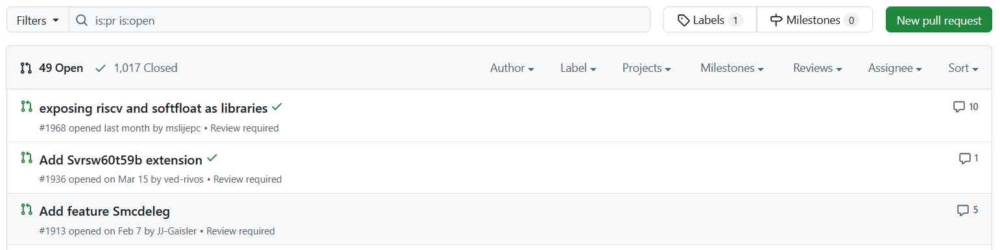
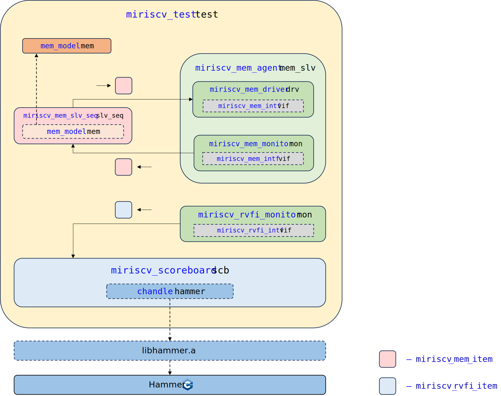
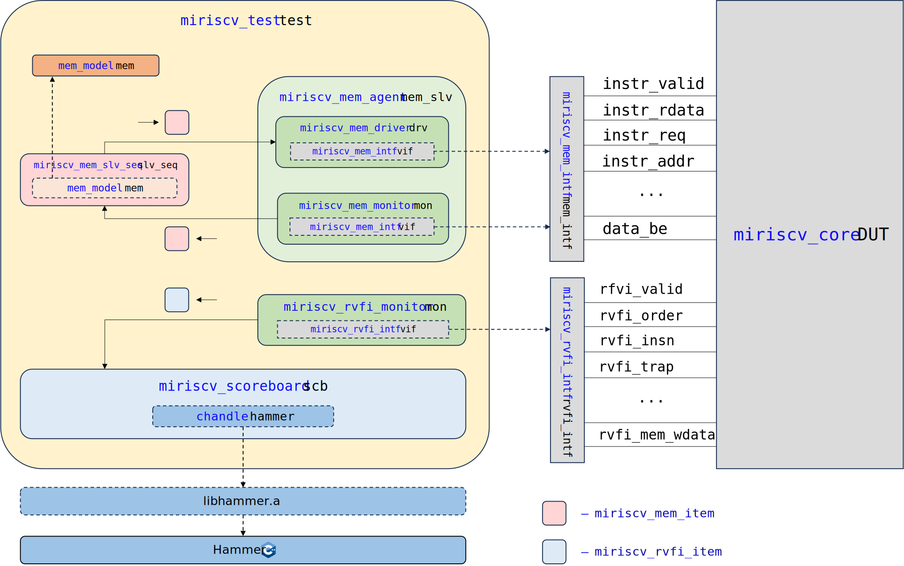

# Практическое занятие 03: Синхронное сравнение с эталонной моделью

- [Практическое занятие 03: Синхронное сравнение с эталонной моделью](#практическое-занятие-03-синхронное-сравнение-с-эталонной-моделью)
  - [Необходимое ПО](#необходимое-по)
  - [Рекомендуемый материал](#рекомендуемый-материал)
  - [Краткое содержание](#краткое-содержание)
  - [Важные сведения](#важные-сведения)
  - [Тестируемое RISC-V ядро](#тестируемое-risc-v-ядро)
  - [Используемая эталонная модель Spike и генератор случайных инструкций AAPG](#используемая-эталонная-модель-spike-и-генератор-случайных-инструкций-aapg)
  - [Используемая библиотека для взаимодействия со Spike Hammer](#используемая-библиотека-для-взаимодействия-со-spike-hammer)
  - [Смотрим в будущее](#смотрим-в-будущее)
  - [Структура верификационного окружения](#структура-верификационного-окружения)
  - [Подготовка](#подготовка)
  - [Удаление модуля трассировки и связанной с ним логики](#удаление-модуля-трассировки-и-связанной-с-ним-логики)
  - [Реализация получения информации с RVFI и ее подготовки для обработки](#реализация-получения-информации-с-rvfi-и-ее-подготовки-для-обработки)
    - [Транзакция `miriscv_rvfi_item`](#транзакция-miriscv_rvfi_item)
    - [Интерфейс `miriscv_rvfi_intf`](#интерфейс-miriscv_rvfi_intf)
    - [Монитор `miriscv_rvfi_monitor`](#монитор-miriscv_rvfi_monitor)
  - [Анализ библиотеки для взаимодействия со Spike `Hammer`](#анализ-библиотеки-для-взаимодействия-со-spike-hammer)
    - [Анализ исходного кода](#анализ-исходного-кода)
    - [Модификация](#модификация)
    - [Сохранение изменений модификации](#сохранение-изменений-модификации)
    - [Компиляция](#компиляция)
  - [Определение API для взаимодействия со Spike при помощи библиотеки `Hammer` через DPI-C](#определение-api-для-взаимодействия-со-spike-при-помощи-библиотеки-hammer-через-dpi-c)
    - [Введение в DPI-C](#введение-в-dpi-c)
    - [DPI-C и Verilator + пример](#dpi-c-и-verilator--пример)
    - [Определение API со стороны SystemVerilog](#определение-api-со-стороны-systemverilog)
    - [Определение API со стороны C++](#определение-api-со-стороны-c)
  - [Реализация обработки информации с RVFI и сравнения с эталонной моделью](#реализация-обработки-информации-с-rvfi-и-сравнения-с-эталонной-моделью)
    - [Класс проверки `miriscv_scoreboard`](#класс-проверки-miriscv_scoreboard)
    - [Тест `miriscv_test`](#тест-miriscv_test)
    - [Главный модуль верификационного окружения `miriscv_tb_top`](#главный-модуль-верификационного-окружения-miriscv_tb_top)
    - [Пакет (package) теста `miriscv_test_pkg`](#пакет-package-теста-miriscv_test_pkg)
  - [Сборка и запуск симуляции](#сборка-и-запуск-симуляции)
    - [Генерация тестовой программы](#генерация-тестовой-программы)
    - [Компиляция тестовой программы](#компиляция-тестовой-программы)
    - [Экспорт тестовой программы](#экспорт-тестовой-программы)
    - [Запуск симуляции](#запуск-симуляции)
  - [Анализ результатов](#анализ-результатов)
    - [Лог-файлы](#лог-файлы)
    - [Добавление отладочной информации](#добавление-отладочной-информации)
      - [Класс `miriscv_compare_logger`](#класс-miriscv_compare_logger)
      - [Добавление `miriscv_compare_logger` в класс проверки](#добавление-miriscv_compare_logger-в-класс-проверки)
      - [Добавление `miriscv_compare_logger` в пакет теста `miriscv_test_pkg`](#добавление-miriscv_compare_logger-в-пакет-теста-miriscv_test_pkg)
    - [Осознанное внедрение ошибок](#осознанное-внедрение-ошибок)
      - [Модификация RTL MIRISCV](#модификация-rtl-miriscv)
      - [Повторный запуск](#повторный-запуск)
      - [Анализ лог-файлов](#анализ-лог-файлов)
      - [Анализ тестовой программы](#анализ-тестовой-программы)
  - [Эталонная реализация](#эталонная-реализация)
  - [Выводы](#выводы)


## Необходимое ПО

Подразумевается, что **задание выполняется на:**
- [предоставленной виртуальной машине](../../#использование-виртуальной-машины);
- ином дистрибутиве Linux с [установленным необходимым ПО](../../#ручная-установка).


## Рекомендуемый материал

- [Тема 00: Вводная](../../theory/00_intro.md)
- [Тема 01: Функциональная верификация процессорных ядер](../../theory/01_basics.md)
- [Тема 02: Основные подходы к функциональной верификации RISC-V ядер](../../theory/02_approach.md)
- [Тема 03: Базовые подходы к симуляции RISC-V ядер](../../theory/03_func.md)
- [Тема 04: RISC-V верификация: сравнение с эталонной моделью](../../theory/04_rgen.md)
- [Тема 05: RISC-V верификация: модифицированное сравнение с эталонной моделью](../../theory/05_advanced.md)


## Краткое содержание

Данное занятие воспроизводит маршрут подхода к верификации процессорных ядер [при помощи синхронного сравнения с эталонной моделью](../../theory/05_advanced.md#синхронное-сравнение) на примере RISC-V ядра с открытым исходным кодом [MIRISCV](https://github.com/riscv-tests-intro/MIRISCV/tree/b510b308addc4a7271e36f2a348bd18bf24c1d77). Занятие дополняет подход из занятия [Практическое занятие 02: Сравнение с эталонной моделью](../02_aapg). Его выполнение обязательно для того, чтобы приступить к данному занятию.

Текущее занятие будет состоять из **6 основных этапов, выполняемых друг за другом:**
- [Реализация получения информации с RVFI и ее подготовки для обработки](#реализация-получения-информации-с-rvfi-и-ее-подготовки-для-обработки) – создаются или модифицируются классы верификационного окружения для получения информации с [интерфейса RVFI](../../theory/04_rgen.md#интерфейс-rvfi) и ее конвертации в транзакционные классы для их последующего анализа другими компонентами;
- [Анализ библиотеки для взаимодействия со Spike `Hammer`](#анализ-библиотеки-для-взаимодействия-со-spike-hammer) – анализируется и функционально дополняется код библиотеки [Hammer](#используемая-библиотека-для-взаимодействия-со-spike-hammer);
- [Определение API для взаимодействия со Spike при помощи библиотеки `Hammer` через DPI-C](#определение-api-для-взаимодействия-со-spike-при-помощи-библиотеки-hammer-через-dpi-c) – комплексный этап, включающий в себя введение в DPI-C[^1], разбор простейшего примера с DPI-C, а также определения методов для взаимодействия верификационного окружения на SystemVerilog со Spike при помощи библиотеки Hammer;
- [Реализация обработки информации с RVFI и сравнения с эталонной моделью](#реализация-обработки-информации-с-rvfi-и-сравнения-с-эталонной-моделью) – создаются или модифицируются классы верификационного окружения для обработки информации с интерфейса RVFI и [синхронного сравнения](../../theory/05_advanced.md#синхронное-сравнение) поведения тестируемого ядра со [Spike](#используемая-эталонная-модель-spike-и-генератор-случайных-инструкций-aapg) при помощи Hammer;
- [Сборка и запуск симуляции](#сборка-и-запуск-симуляции) – генерируется, компилируется и экспортируется случайная тестовая программа, создаются необходимые директории, и выполняются команды, необходимые для запуска симуляции;
- [Анализ результатов](#анализ-результатов) – производится сравнение поведения процессора и модели, делается вывод о корректности его работы.


## Важные сведения

**Обратите внимание**, что в части файлов, которые разбираются в ходе занятия, часть кода осознанно пропущена, оставлена лишь значимая, необходимая для формирования общей картины.

Например:

```SystemVerilog
class miriscv_rvfi_monitor;

    ...
  
    virtual task run();
      wait(vif.arst_n === 1'b1);
      forever begin
        do begin
            vif.wait_clks(1);
        end
        while(vif.rvfi_valid === 1'b0);
        get_and_put();
      end
    endtask

    ...

endclass
```

В данном файле пропущена часть кода между `class miriscv_rvfi_monitor;` и `virtual task run();`, а также между `endtask` и `endclass`.


## Тестируемое RISC-V ядро

В рамках курса будет тестироваться учебное ядро, разработанное [НИЛ ЭСК](https://miet.ru/structure/s/3812) НИУ МИЭТ: [MIRISCV](https://github.com/riscv-tests-intro/MIRISCV/tree/b510b308addc4a7271e36f2a348bd18bf24c1d77). Процессор поддерживает расширения RV32I и RV32M и является четырехстадийным [in-order](https://en.wikipedia.org/wiki/Out-of-order_execution#In-order_processors) [конвейером](https://en.wikipedia.org/wiki/Instruction_pipelining). Ядро поддерживает только машинный уровень привилегий[^2].

<p align="center">
  </img>
</p>

Подробную документацию на процессор можно найти по [ссылке](https://github.com/riscv-tests-intro/MIRISCV/tree/b510b308addc4a7271e36f2a348bd18bf24c1d77/doc/miriscv/miriscv_scheme.md). В рамках курса его функциональные особенности подробно разбираться не будут, а необходимая для выполнения заданий информация будет даваться по ходу повествования.


## Используемая эталонная модель [Spike](https://github.com/riscv-software-src/riscv-isa-sim/tree/887d02e42124ddc86476dfdf4aad4be8ba7f0aef) и генератор случайных инструкций [AAPG](https://gitlab.com/shaktiproject/tools/aapg/-/tree/7ce4a9073a040bbc784edfd1c8a7b21f269f7766)

Используются эталонная модель Spike и генератор случайных инструкций AAPG такие же, как в [предыдущем занятии](../02_aapg). Для получения подробной информации раскройте спойлер ниже.

<details>
  <summary>Подробно про Spike и AAPG</summary>

---

Для тестирования процессорного ядра будет использоваться эталонная модель [Spike](https://github.com/riscv-software-src/riscv-isa-sim/tree/887d02e42124ddc86476dfdf4aad4be8ba7f0aef), написанная на языке C. В настоящее время эта модель является самой популярной открытой моделью.

На момент создания данного практического задания в репозитории набора тестов присутствует 1017 закрытых и 49 открытых pull requests, последний из которых был создан меньше месяца назад.



Для тестирования процессорного ядра будет использоваться генератор случайных RISC-V инструкций [APPG](https://gitlab.com/shaktiproject/tools/aapg/-/tree/7ce4a9073a040bbc784edfd1c8a7b21f269f7766), написанный на языке Python. Генератор поддерживает набор расширений `RV32IMAFDC_Zb_Zicsr` для 32-битных машин и `RV64IMAFDC_Zb_Zicsr` для 64-битных машин. Документация на генератор доступна по [ссылке](https://gitlab.com/shaktiproject/tools/aapg/-/wikis/Wiki-AAPG-%5B2.2.2%5D).

В настоящее время самым популярным генератором случайных RISC-V инструкций является [RISCV-DV](https://github.com/chipsalliance/riscv-dv). Однако его использование возможно только при наличии доступа к коммерческим симуляторам, таким как [Mentor QuestaSim](https://eda.sw.siemens.com/en-US/ic/questa/simulation/advanced-simulator/), [Synopsys VCS](https://www.synopsys.com/verification/simulation/vcs.html), [Cadence Xcelium](https://www.cadence.com/en_US/home/tools/system-design-and-verification/simulation-and-testbench-verification/xcelium-simulator.html).

Одной из важных особенностей курса является **использование только открытого ПО**, так что в рамках данного занятия был сделан выбор в пользу менее совершенного, но полностью отрытого [AAPG](https://gitlab.com/shaktiproject/tools/aapg/-/tree/7ce4a9073a040bbc784edfd1c8a7b21f269f7766), обладающего, тем не менее, внушительным набором поддерживаемых расширений.

В будущем, когда [Verilator](https://github.com/verilator/verilator/tree/522bead374d6b7b2adb316304126e5361b18bcf1) будет полностью поддерживать библиотеки [универсальной методолгии верификации (Universal Verification Methodology, UVM)](https://accellera.org/downloads/standards/uvm), генератор может быть заменен автором курса.

---

</details>


## Используемая библиотека для взаимодействия со Spike [Hammer](https://github.com/rivosinc/hammer/tree/6d9fac96407149a1a533cdd3f63f6bbd96614ffa)

На момент написания статьи в открытом доступе существует несколько библиотек для запуска Spike в окружении с [использованием синхронного сравнения](../../theory/05_advanced.md#синхронное-сравнение). Например, [spike_model](https://gitlab.com/incoresemi/river-framework/verif-ips/common-vip/-/tree/master/spike_model), [ibex_cosim](https://github.com/lowRISC/riscv-isa-sim/tree/ibex_cosim), [Hammer](https://github.com/rivosinc/hammer/tree/6d9fac96407149a1a533cdd3f63f6bbd96614ffa), [testchipip](https://github.com/ucb-bar/testchipip/blob/master/src/main/resources/testchipip/csrc/cospike_impl.cc).

В данном занятии будет использована библиотека [Hammer](https://github.com/rivosinc/hammer/tree/6d9fac96407149a1a533cdd3f63f6bbd96614ffa), разработанная компанией [Rivos Inc.](https://www.rivosinc.com/), так как по субъективному мнению автора из всех представленных выше она является самой простой в использовании.


## Смотрим в будущее

В [предыдущем занятии](../02_aapg) для реализации подхода [сравнения с эталонной моделью](../../theory/04_rgen.md#описание-подхода-часть-1) было разработано [верификационное окружение](../../practice/02_aapg/README.md#итоговая-структура-верификационного-окружения) с использованием объектно-ориентированного программирования (ООП)[^3].

Большая часть компонентов данного окружения может быть переиспользована при реализации подхода с использованием [синхронного сравнения с эталонной моделью](../../theory/05_advanced.md#синхронное-сравнение). Однако окружение должно быть значительно изменено. Каким образом – узнаем уже в следующем разделе!

Для формирования списка доработок необходимо освежить знания о подходе, основанном на синхронном сравнении. Он похож на [классический подход сравнения с моделью](./04_rgen.md#описание-подхода-часть-1), однако имеет свои особенности.

Дело в том, что в подходе, основанном на синхронном сравнении, также используется эталонная модель, и изменение состояния ядра отслеживается при помощи того же [интерфейса RVFI](../../theory/04_rgen.md#интерфейс-rvfi). Однако сравнение результатов работы происходит в ходе HDL-симуляции.

При изменении состояния ядра (в большинстве случаев при выполнении инструкции) верификационное окружение генерирует запрос на изменение состояния эталонной модели (в большинстве случаев это запрос на выполнение инструкции). После чего выполняется запрос на получение информации о состоянии модели. Запросы реализуются при помощи набора высокоуровневых методов (Application Level Interface, API), которые являются методами SystemVerilog DPI-C[^1]. Информация о состоянии модели попадает в окружение, и производится сравнение с состоянием тестируемого процессорного ядра.


Что же подразумевается под сравнением состояний? **В большинстве случаев производится сравнение регистров общего назначения (General Purpose Registers, GPR)**. Не всех, а тех, с которыми взаимодействовала инструкция, после выполнения которой производится сравнение. В некоторых случаях производится сравнение регистров контроля и статуса (Control Status Registers, CSR).

На основании информации выше сформируем список задач для реализации необходимых изменений:
- [удаление модуля трассировки и связанной с ним логики](#удаление-модуля-трассировки-и-связанной-с-ним-логики);
- [реализация получения информации с RVFI и ее подготовки для обработки](#реализация-получения-информации-с-rvfi-и-ее-подготовки-для-обработки);
- [анализ библиотеки для взаимодействия со Spike `Hammer`](#анализ-библиотеки-для-взаимодействия-со-spike-hammer);
- [определение API для взаимодействия со Spike при помощи библиотеки `Hammer` через DPI-C](#определение-api-для-взаимодействия-со-spike-при-помощи-библиотеки-hammer-через-dpi-c);
- [реализация обработки информации с RVFI и сравнения с эталонной моделью](#реализация-обработки-информации-с-rvfi-и-сравнения-с-эталонной-моделью).

Выполнение данных задач будет рассмотрено в разделах ниже.


## Структура верификационного окружения

Верификационное окружение данного практического занятия представляет собой модифицированное окружение из предыдущего занятия [Практическое занятие 02: Сравнение с эталонной моделью](../02_aapg). Окружение будет спроектировано с использованием объектно-ориентированного программирования. Структура представлена на изображении ниже:

<p align="center">
  </img>
</p>

Класс [`miriscv_mem_monitor`](#монитор-miriscv_mem_monitor) отслеживает запросы ядра в память и отправляет информацию в класс последовательности [`miriscv_mem_seq`](#последовательность-miriscv_mem_seq), в которой находится указатель (object handle)[^4] на универсальную модель памяти [`mem_model`](#модель-памяти-mem_model). Последовательность, в свою очередь, формирует транзакции [`miriscv_mem_item`](#транзакция-miriscv_mem_item) для класса [`miriscv_mem_driver`](#драйвер-miriscv_mem_driver), который отвечает за взаимодействие окружения с сигналами процессорного ядра.

Классы [`miriscv_mem_monitor`](#монитор-miriscv_mem_monitor) и [`miriscv_mem_driver`](#драйвер-miriscv_mem_driver) инкапсулированы в класс [`miriscv_mem_agent`](#агент-miriscv_mem_agent), который, в свою очередь, находится в классе [`miriscv_test`](#тест-miriscv_test), который создает и инициализирует модель памяти, определяет тестовый сценарий.

Также класс теста содержит в себе монитор интерфейса RVFI [`miriscv_rvfi_monitor`](#монитор-miriscv_rvfi_monitor) и класс проверки [`miriscv_scoreboard`](#класс-проверки-miriscv_scoreboard). Класс проверки содержит в себе указатель на модель, с которым при помощи [библиотеки `Hammer`](https://github.com/rivosinc/hammer/tree/6d9fac96407149a1a533cdd3f63f6bbd96614ffa) через DPI-C методы взаимодействует с [эталонной моделью Spike](#используемая-эталонная-модель-spike).

Проектированию новых компонентов (относительно окружения из [предыдущего занятия](../02_aapg)) далее будут отведены отдельные разделы. А теперь давайте рассмотрим более подробно механизм подключения тестового сценария к главному модулю верификационного окружения. Структура представлена на изображении ниже:

<p align="center">
  </img>
</p>

Компоненты окружения [`miriscv_mem_monitor`](#монитор-miriscv_mem_monitor) и [`miriscv_mem_driver`](#драйвер-miriscv_mem_driver) взаимодействуют с главным модулем ядра [`miriscv_core`](https://github.com/riscv-tests-intro/MIRISCV/tree/b510b308addc4a7271e36f2a348bd18bf24c1d77/miriscv/rtl/miriscv_core.sv) при помощи интерфейса[^5] `miriscv_mem_intf`. Компонент [`miriscv_rvfi_monitor`](#монитор-miriscv_rvfi_monitor) взаимодействует с главным модулем ядра при помощи интерфейса [`miriscv_rvfi_intf`](#интерфейс-miriscv_rvfi_intf). В топ-модуле верификационного окружения `miriscv_tb_top` интерфейсы подключаются к сигналам топ-модуля ядра, а ссылки на интерфейсы передаются в соответствующие компоненты окружения.


## Подготовка

**Подразумевается, что команды начинают выполняться в директории, в которой расположен данный файл с описанием занятия.** Для того чтобы реализовать [синхронное сравнение с эталонной моделью](../../theory/05_advanced.md#синхронное-сравнение), нам для начала понадобятся две директории:

- `tb` – для исходных файлов верификационного окружения;
- `build` – для файлов сборки и запуска тестирования.

**Директорию `tb` вместе со всем ее содержимым скопируем из эталонной реализации предыдущего занятия:**

```bash
cp -r ../02_aapg/golden/tb ./
```

**Обратите внимание**, что директория `tb` теперь содержит исходные файлы предыдущего занятия, которые будут модифицироваться в ходе текущего занятия.

Директорию `build` копировать не будем, просто создадим:

```bash
mkdir build
```


## Удаление модуля трассировки и связанной с ним логики

Перейдем в директорию исходных файлов верификационного окружения:

```bash
cd tb
```

Удалим модуль-обертку для трассировки ядра `miriscv_tracing.sv`:

```bash
rm miriscv_tracing.sv
```

Откроем файл главного модуля верификационного окружения в любом редакторе. Открываем при помощи gedit:

```bash
gedit miriscv_tb_top.sv
```

Вместо модуля-обертки для трассировки ядра к интерфейсам подключим главный модуль процессорного ядра:

```SystemVerilog
module miriscv_tb_top;

    ...

    // DUT
    miriscv_core #(
      .RVFI                 ( 1                        )
    ) DUT (

      // Clock and Reset
      .clk_i                ( clk                      ),
      .arstn_i              ( arstn                    ),

      // Boot address
      .boot_addr_i          ( `BOOT_ADDR               ),

      // Instruction memory interface
      .instr_rvalid_i       ( intf.instr_rvalid        ),
      .instr_rdata_i        ( intf.instr_rdata         ),
      .instr_req_o          ( intf.instr_req           ),
      .instr_addr_o         ( intf.instr_addr          ),

      // Data memory interface
      .data_rvalid_i        ( intf.data_rvalid         ),
      .data_rdata_i         ( intf.data_rdata          ),
      .data_req_o           ( intf.data_req            ),
      .data_we_o            ( intf.data_we             ),
      .data_be_o            ( intf.data_be             ),
      .data_addr_o          ( intf.data_addr           ),
      .data_wdata_o         ( intf.data_wdata          ),

      // RVFI
      .rvfi_valid_o         (                          ),
      .rvfi_order_o         (                          ),
      .rvfi_insn_o          (                          ),
      .rvfi_trap_o          (                          ),
      .rvfi_halt_o          (                          ),
      .rvfi_intr_o          (                          ),
      .rvfi_mode_o          (                          ),
      .rvfi_ixl_o           (                          ),
      .rvfi_rs1_addr_o      (                          ),
      .rvfi_rs2_addr_o      (                          ),
      .rvfi_rs1_rdata_o     (                          ),
      .rvfi_rs2_rdata_o     (                          ),
      .rvfi_rd_addr_o       (                          ),
      .rvfi_rd_wdata_o      (                          ),
      .rvfi_pc_rdata_o      (                          ),
      .rvfi_pc_wdata_o      (                          ),
      .rvfi_mem_addr_o      (                          ),
      .rvfi_mem_rmask_o     (                          ),
      .rvfi_mem_wmask_o     (                          ),
      .rvfi_mem_rdata_o     (                          ),
      .rvfi_mem_wdata_o     (                          )

    );

    ...

endmodule
```

**Обратите внимание**, что значение адреса, с которого будет ядро начнет исполнять инструкции, определяется через `BOOT_ADDR`.

Сигналы RVFI оставим неподключенными, так как в окружении пока отсутствует логика получения информации с RVFI. Она будет добавлена в следующем разделе.

Закроем файл `miriscv_tb_top.sv`.


## Реализация получения информации с RVFI и ее подготовки для обработки

### Транзакция `miriscv_rvfi_item`

Создадим класс транзакции интерфейса RVFI (RVFI транзакции), при помощи которого компоненты окружения будут обмениваться между собой информацией о состоянии процессорного ядра.

Создадим необходимый файл:

```bash
touch miriscv_rvfi_item.sv
```

Файл можно открыть в любом редакторе. Открываем при помощи gedit:

```bash
gedit miriscv_rvfi_item.sv
```

Заполним файл следующим кодом:

```SystemVerilog
class miriscv_rvfi_item;

    logic [ 1 - 1:0] rvfi_valid;
    logic [64 - 1:0] rvfi_order;
    logic [32 - 1:0] rvfi_insn;
    logic [ 1 - 1:0] rvfi_trap;
    logic [ 1 - 1:0] rvfi_halt;
    logic [ 1 - 1:0] rvfi_intr;
    logic [ 2 - 1:0] rvfi_mode;
    logic [ 2 - 1:0] rvfi_ixl;
    logic [ 5 - 1:0] rvfi_rs1_addr;
    logic [ 5 - 1:0] rvfi_rs2_addr;
    logic [ 5 - 1:0] rvfi_rs3_addr;
    logic [32 - 1:0] rvfi_rs1_rdata;
    logic [32 - 1:0] rvfi_rs2_rdata;
    logic [32 - 1:0] rvfi_rs3_rdata;
    logic [ 5 - 1:0] rvfi_rd_addr;
    logic [32 - 1:0] rvfi_rd_wdata;
    logic [32 - 1:0] rvfi_pc_rdata;
    logic [32 - 1:0] rvfi_pc_wdata;
    logic [32 - 1:0] rvfi_mem_addr;
    logic [ 4 - 1:0] rvfi_mem_rmask;
    logic [ 4 - 1:0] rvfi_mem_wmask;
    logic [32 - 1:0] rvfi_mem_rdata;
    logic [32 - 1:0] rvfi_mem_wdata;

endclass
```

Класс будет содержать поля, соответствующие проводам интерфейса RVFI, согласно [спецификации]((https://github.com/YosysHQ/riscv-formal/blob/main/docs/source/rvfi.rst)) данного интерфейса.

Закроем файл `miriscv_rvfi_item.sv`.

### Интерфейс `miriscv_rvfi_intf`

Создадим интерфейс RVFI, который в будущем подключим к портам RVFI процессорного ядра для получения информации о его состоянии.

Создадим необходимый файл:

```bash
touch miriscv_rvfi_intf.sv
```

Файл можно открыть в любом редакторе. Открываем при помощи gedit:

```bash
gedit miriscv_rvfi_intf.sv
```

Заполним файл следующим кодом:

```SystemVerilog
interface miriscv_rvfi_intf (
    input logic clk,
    input logic arst_n
);

    // RVFI signals
    logic [ 1 - 1:0] rvfi_valid;
    logic [64 - 1:0] rvfi_order;
    logic [32 - 1:0] rvfi_insn;
    logic [ 1 - 1:0] rvfi_trap;
    logic [ 1 - 1:0] rvfi_halt;
    logic [ 1 - 1:0] rvfi_intr;
    logic [ 2 - 1:0] rvfi_mode;
    logic [ 2 - 1:0] rvfi_ixl;
    logic [ 5 - 1:0] rvfi_rs1_addr;
    logic [ 5 - 1:0] rvfi_rs2_addr;
    logic [ 5 - 1:0] rvfi_rs3_addr;
    logic [32 - 1:0] rvfi_rs1_rdata;
    logic [32 - 1:0] rvfi_rs2_rdata;
    logic [32 - 1:0] rvfi_rs3_rdata;
    logic [ 5 - 1:0] rvfi_rd_addr;
    logic [32 - 1:0] rvfi_rd_wdata;
    logic [32 - 1:0] rvfi_pc_rdata;
    logic [32 - 1:0] rvfi_pc_wdata;
    logic [32 - 1:0] rvfi_mem_addr;
    logic [ 4 - 1:0] rvfi_mem_rmask;
    logic [ 4 - 1:0] rvfi_mem_wmask;
    logic [32 - 1:0] rvfi_mem_rdata;
    logic [32 - 1:0] rvfi_mem_wdata;

    function void get_bus_status (
        miriscv_test_pkg::miriscv_rvfi_item t
    );
        t.rvfi_valid      = rvfi_valid;
        t.rvfi_order      = rvfi_order;
        t.rvfi_insn       = rvfi_insn;
        t.rvfi_trap       = rvfi_trap;
        t.rvfi_halt       = rvfi_halt;
        t.rvfi_intr       = rvfi_intr;
        t.rvfi_mode       = rvfi_mode;
        t.rvfi_ixl        = rvfi_ixl;
        t.rvfi_rs1_addr   = rvfi_rs1_addr;
        t.rvfi_rs2_addr   = rvfi_rs2_addr;
        t.rvfi_rs3_addr   = rvfi_rs3_addr;
        t.rvfi_rs1_rdata  = rvfi_rs1_rdata;
        t.rvfi_rs2_rdata  = rvfi_rs2_rdata;
        t.rvfi_rs3_rdata  = rvfi_rs3_rdata;
        t.rvfi_rd_addr    = rvfi_rd_addr;
        t.rvfi_rd_wdata   = rvfi_rd_wdata;
        t.rvfi_pc_rdata   = rvfi_pc_rdata;
        t.rvfi_pc_wdata   = rvfi_pc_wdata;
        t.rvfi_mem_addr   = rvfi_mem_addr;
        t.rvfi_mem_rmask  = rvfi_mem_rmask;
        t.rvfi_mem_wmask  = rvfi_mem_wmask;
        t.rvfi_mem_rdata  = rvfi_mem_rdata;
        t.rvfi_mem_wdata  = rvfi_mem_wdata;
    endfunction

    task wait_clks(input int num);
        repeat (num) @(posedge clk);
    endtask

    task wait_neg_clks(input int num);
        repeat (num) @(negedge clk);
    endtask
  
endinterface
```

В интерфейсе объявлены сигналы RVFI. Также объявлена задача `get_bus_status()` для получения информации о состоянии проводов интерфейса в поля класса RVFI транзации. Также в интерфейсе определено несколько вспомогательных задач для ожидания определенного количества позитивных или негативных фронтов тактового сигнала `clk`. Эти задачи могут быть вызваны компонентами окружения, например: `vif.wait_clks(10)`.

Закроем файл `miriscv_rvfi_intf.sv`.

### Монитор `miriscv_rvfi_monitor`

Создадим класс монитора RVFI, который будет отслеживать сигналы RVFI, генерируемые процессорным ядром, и отправлять текущее состояние этих сигналов в [класс проверки](#класс-проверки-miriscv_scoreboard) (см. раздел [Структура верификационного окружения](#структура-верификационного-окружения)).

Создадим необходимый файл:

```bash
touch miriscv_rvfi_monitor.sv
```

Файл можно открыть в любом редакторе. Открываем при помощи gedit:

```bash
gedit miriscv_rvfi_monitor.sv
```

Заполним файл следующим кодом:

```SystemVerilog
class miriscv_rvfi_monitor;

    virtual miriscv_rvfi_intf vif;

    mailbox#(miriscv_rvfi_item) mbx;

    function new(virtual miriscv_rvfi_intf vif);
      this.vif = vif;
    endfunction
  
    virtual task run();
      wait(vif.arst_n === 1'b1);
      forever begin
        do begin
            vif.wait_clks(1);
        end
        while(vif.rvfi_valid === 1'b0);
        get_and_put();
      end
    endtask

    virtual task get_and_put();
      miriscv_rvfi_item t = new();
      get_data(t);
      mbx.put(t);
    endtask

    virtual task get_data(miriscv_rvfi_item t);
      vif.get_bus_status (t);
    endtask
  
endclass
```

Класс содержит в себе указатель на интерфейс `virtual miriscv_rvfi_intf vif`, `mailbox` для отправки данных в другие классы окружения (а если конкретно, то в класс проверки) `mailbox#(miriscv_rvfi_item) mbx`.

**Обратите внимание** на конструктор `new()`. В качестве аргумента в него передается указатель на интерфейс. Без передачи этого аргумента объект класса не может быть создан.

Основной задачей класса является `run()`, которая отвечает за получение информации о состоянии интерфейса RVFI и отправляет информацию в `mailbox` (`get_and_put()`). Задача `get_and_put()` получает значения с интерфейса RVFI ядра при помощи `get_data()` (объявлен в интерфейсе [`miriscv_rvfi_intf`](#интерфейс-miriscv_rvfi_intf)) и отправляет информацию в `mailbox` при помощи `mbx.put()`.

Стоит обратить внимание на момент, в который вызывается задача `get_and_put()`. Вызов происходит после того, как выполнится следующий участок кода:

```SystemVerilog
do begin
    vif.wait_clks(1);
end
while(vif.rvfi_valid === 1'b0);
```

Иными словами, считывание сигналов с интерфейса RVFI происходит при активном уровне сигнала `rvfi_valid`. Ведь, согласно спецификации на RVFI, сигналы интерфейса являются актуальными [только в случае активного уровня данного сигнала](https://github.com/YosysHQ/riscv-formal/blob/6141ed8f4ecac24a7c9298bd970822274b0e2865/docs/source/rvfi.rst?plain=1#L35).

Закроем файл `miriscv_rvfi_monitor.sv`.

Переходим на один уровень назад:

```bash
cd ..
```


## Анализ библиотеки для взаимодействия со Spike `Hammer`

Данный раздел посвящен анализу библиотеки [Hammer](https://github.com/rivosinc/hammer/tree/6d9fac96407149a1a533cdd3f63f6bbd96614ffa), разработанной компанией [Rivos Inc.](https://www.rivosinc.com/) Библиотека написана на языке высокого уровня C++. 

### Анализ исходного кода

Откроем заголовочный файл [`hammer/hammer.h`](https://github.com/rivosinc/hammer/blob/6d9fac96407149a1a533cdd3f63f6bbd96614ffa/hammer.h):

```c++
class Hammer {
 public:
  Hammer(const char *isa, const char *privilege_levels, ...);
  ~Hammer();
  ...
  reg_t get_gpr(uint8_t hart_id, uint8_t gpr_id);
  void set_gpr(uint8_t hart_id, uint8_t gpr_id, reg_t new_gpr_value);
  ...
  reg_t get_PC(uint8_t hart_id);
  void set_PC(uint8_t hart_id, reg_t new_pc_value);
  ...
  void single_step(uint8_t hart_id);
  ...
}
```

Нас интересуют прежде всего методы `*_gpr()`, `*_PC()`, которые позволяют получать и изменять значения регистров общего назначения и счетчика команд соответственно. Также нас интересует метод `single_step()`, который приводит к выполнению инструкции.

Основным типом аргументов является беззнаковый байт (`uint8_t`). Важно определить, каким типом является `reg_t`. Он объявлен в файле [riscv-isa-sim/riscv/decode.h](https://github.com/riscv-software-src/riscv-isa-sim/blob/887d02e42124ddc86476dfdf4aad4be8ba7f0aef/riscv/decode.h#L19) и представляет собой 64-битное беззнаковое целое число `uint64_t`.

Реализация упомянутых выше методов расположена в файле [`hammer/hammer.cpp`](https://github.com/rivosinc/hammer/blob/6d9fac96407149a1a533cdd3f63f6bbd96614ffa/hammer.cpp). Подробно она разбираться не будет.

### Модификация

Если проанализировать файлы [`hammer/hammer.h`](https://github.com/rivosinc/hammer/blob/6d9fac96407149a1a533cdd3f63f6bbd96614ffa/hammer.h) и [`hammer/hammer.cpp`](https://github.com/rivosinc/hammer/blob/6d9fac96407149a1a533cdd3f63f6bbd96614ffa/hammer.cpp), то можно заметить отсутствие метода для получения инструкции, которая выполняется Spike на текущем счетчике команд. Добавим этот метод.

Добавим определение метода. Откроем заголовочный файл [`hammer/hammer.h`](https://github.com/rivosinc/hammer/blob/6d9fac96407149a1a533cdd3f63f6bbd96614ffa/hammer.h). Файл можно открыть в любом редакторе. Открываем при помощи gedit:

```bash
gedit ../../submodules/hammer/hammer.h
```

Добавим после 37 строки определение метода:

```c++
...
std::vector<uint64_t> get_vector_reg(uint8_t hart_id, uint8_t vector_reg_id);

uint64_t get_insn_bits(uint8_t hart_id);
...
```

Метод принимает идентификатор ядра `hart_id` в качестве аргумента (по образу и подобию иных методов, объявленных в файле) и возвращает 64-битное беззнаковое целое число `uint64_t` (почему возвращаемый тип аргумента именно такой, см. в подробном разборе реализации метода ниже).

Закроем файл `hammer/hammer.h`.

Теперь добавим реализацию метода. Откроем файл [`hammer/hammer.cpp`](https://github.com/rivosinc/hammer/blob/6d9fac96407149a1a533cdd3f63f6bbd96614ffa/hammer.cpp). Файл можно открыть в любом редакторе. Открываем при помощи gedit:

```bash
gedit ../../submodules/hammer/hammer.cpp
```

Добавим после 157 строки реализацию метода:

```c++
...
  return vector_reg_value;
}

uint64_t Hammer::get_insn_bits(uint8_t hart_id) {
  processor_t *hart = simulator->get_core(hart_id);
  mmu_t *mmu = hart->get_mmu();
  reg_t pc = hart->get_state()->pc;
  insn_fetch_t fetch = mmu->load_insn(pc);
  insn_t insn = fetch.insn;
  return insn.bits();
}
...
```

<details>
  <summary>Подробный разбор реализации метода</summary>

---

Строка `processor_t *hart = simulator->get_core(hart_id);` необходима для получения указателя на ядро процессора с идентификатором `hard_id`. Так как Spike может эмулировать поведение многоядерного процессора, доступ к конкретному ядру осуществляется при помощи метода `simulator->get_core()`. `simulator` – указатель на Spike, который создается выше в рассматриваемом файле. Тип `processor_t` подробно разбираться не будет.

Строка `mmu_t *mmu = hart->get_mmu();` необходима для получения указателя на модуль управления памятью (Memory Management Unit, MMU) конкретного ядра. Тип `mmu_t` подробно разбираться не будет.

Строка `reg_t pc = hart->get_state()->pc;` необходима для получения текущего счетчика команд ядра. Тип `reg_t` – это тип `uint64_t`, как было определено ранее.

Строка `insn_fetch_t fetch = mmu->load_insn(pc);` необходима для получения структуры текущей инструкции `fetch` при помощи метода `mmu->load_insn()`. Инструкция загружается по адресу, который определяется счетчиком команд `pc`.

Структура `insn_fetch_t` определена в файле [`riscv-isa-sim/riscv/mmu.h`](https://github.com/riscv-software-src/riscv-isa-sim/blob/887d02e42124ddc86476dfdf4aad4be8ba7f0aef/riscv/mmu.h#L24):

```c++
struct insn_fetch_t
{
  insn_func_t func;
  insn_t insn;
};
```

**Обратим внимание** на поле `insn_t`. Тип класса `insn_t` объявлен в файле [`riscv-isa-sim/riscv/decode.h`](https://github.com/riscv-software-src/riscv-isa-sim/blob/887d02e42124ddc86476dfdf4aad4be8ba7f0aef/riscv/decode.h#L79):

```c++
typedef uint64_t insn_bits_t;
class insn_t
{
public:
  ...
  insn_bits_t bits() { return b; }
  ...
```

Нас интересует метод `bits()`, который возвращает битовое представление инструкции через тип `insn_bits_t`, который является типом `uint64_t`. Метод возвращает поле `b`, объявленное ниже в этом же файле:

```c++
...
private:
  insn_bits_t b;
  ...
```

Вернемся к файлу `hammer/hammer.cpp`, открытому в редакторе. Строки `insn_t insn = fetch.insn;` и `return insn.bits();` необходимы для получения доступа к классу инструкции и получения битового представления этой инструкции при помощи вызова метода `bits()`. Этот метод возвращает значение типа `uint64_t`, следовательно реализация созданного метода также должна возвращать значение этого типа.

---

</details>

Закроем файл `hammer/hammer.cpp`.

### Сохранение изменений модификации

Было бы хорошо сохранить все изменения, которые были внесены в тестовые сценарии в разделе [Модификация](#модификация). Сделаем это образом, негласно принятым в индустрии – при помощи создания `fork` основного репозитория, создания в нем новой ветки и сохранения изменений в ней.

В рамках данного занятия сам маршрут сохранения изменений разобран не будет, а будет использован уже готовый репозиторий. **Автором был создан [`fork`](https://github.com/riscv-tests-intro/hammer/tree/cf113231aff5a9f6cb0f58535e589c8f69a7293f), и в нем сохранены сделанные нами изменения.** `fork` находится в директории `submodules/hammer-miriscv`. Для сборки и запуска тестовых программ в ходе практического занятия будет использоваться именно он.

### Компиляция

Для компиляции `Hammer` перейдем в директорию сборки и запуска:

```bash
cd build
```

Создадим директорию для сохранения артефактов генерации:

```bash
mkdir -p out/hammer
```

Выполним сборку библиотеки согласно [инструкции из официального репозитория](https://github.com/rivosinc/hammer/tree/6d9fac96407149a1a533cdd3f63f6bbd96614ffa?tab=readme-ov-file#building-hammer-and-running-tests):

```bash
spike_install_dir=$(dirname "$(which spike)")/..
meson setup ./out/hammer ../../../submodules/hammer-miriscv \
  --native-file ../../../submodules/hammer-miriscv/native-file.txt \
   --buildtype release -Dspike_install_dir=${spike_install_dir} &> \
    ./out/hammer/compile.log
meson compile -C ./out/hammer &>> ./out/hammer/compile.log
```

После выполнения представленных выше команд в директории `build/out/hammer` появится скомпилированная библиотека `libhammer.a`.

Переходим на один уровень назад:

```bash
cd ..
```

## Определение API для взаимодействия со Spike при помощи библиотеки `Hammer` через DPI-C

### Введение в DPI-C

Для взаимодействия SystemVerilog окружения с библиотеками, скомпилированными из C или C++ кода, в SystemVerilog присутствует механизм DPI-C. Автор рекомендует хороший открытый ознакомительный материал о SystemVerilog DPI-C: [SystemVerilog DPI Tutorial](https://www.doulos.com/knowhow/systemverilog/systemverilog-tutorials/systemverilog-dpi-tutorial/) от компании Doulos.

Для вызова C/C++ из SystemVerilog метод должен быть объявлен на стороне SystemVerilog, а также объявлен и реализован на стороне C/C++. Камнем преткновения чаще всего является совместимость типов SystemVerilog и C/C++. Инженеру не всегда является очевидным какой тип в C/C++ соответствует типу в SystemVerilog. Решение данной проблемы в том числе будет рассмотрено далее.

### DPI-C и Verilator + пример

Для поддержки симулятором SystemVerilog DPI-C, его разработчиками должны быть реализованы методы заголовочного файла `svdpi.h`, расположенного в Annex I [стандарта SystemVerilog 2023](https://standards.ieee.org/ieee/1800/7743/). Применительно к симулятору Verilator, используемому в рамках данного курса, заголовочный файл и файл релизации расположены в официальном репозитории соответственно по ссылкам: [`svdpi.h`](https://github.com/verilator/verilator/blob/522bead374d6b7b2adb316304126e5361b18bcf1/include/vltstd/svdpi.h) и [`verilated_dpi.cpp`](https://github.com/verilator/verilator/blob/522bead374d6b7b2adb316304126e5361b18bcf1/include/verilated_dpi.cpp).

Для примера с DPI-C создадим директорию:

```bash
mkdir -p dpi_c_test
cd dpi_c_test
```

Создадим тренировочный файл:

```bash
touch tb_dpi_c.sv
```

Файл можно открыть в любом редакторе. Открываем при помощи gedit:

```bash
gedit tb_dpi_c.sv
```

Заполним файл следующим кодом:

```SystemVerilog
module tb_dpi_c;

    import "DPI-C" function void print(string msg);

    initial begin
        print("Hello world!");
        $finish();
    end

endmodule
```

Закроем файл `tb_dpi_c.sv`.

Большинство симуляторов имеют опцию генерации заголовочного C/C++ файла на основе SystemVerilog файла с объявленными функциями DPI-C. Такой подход решает проблему совместимости типов SystemVerilog и C/C++, о которой упоминалось в прошлом разделе. Выполним генерацию в Verilator при помощи флага `--dpi-hdr-only`:

```bash
verilator tb_dpi_c.sv -Mdir ./ --dpi-hdr-only
```

В версии Verilator, используемой в курсе ([5.024(`522bead`)](https://github.com/verilator/verilator/tree/522bead374d6b7b2adb316304126e5361b18bcf1)) название генерируемого заголовочного файла имеет вид `V<топ-модуль>__Dpi.h`. Откроем файл `Vtb_dpi_c__Dpi.h`:

```bash
gedit Vtb_dpi_c__Dpi.h
```

Увидим что-то похожее на:

```c++
...
#include "svdpi.h"
...
    // DPI IMPORTS
    // DPI import at tb_dpi_c:3:34
    extern void print(const char* msg);
...
```

Закроем файл `Vtb_dpi_c__Dpi.h`

Теперь реализуем данную функцию. Создадим файл:

```bash
touch tb_dpi_c.cpp
```

Файл можно открыть в любом редакторе. Открываем при помощи gedit:

```bash
gedit tb_dpi_c.cpp
```

Заполним файл следующим кодом:

```c++
#include "Vtb_dpi_c__Dpi.h"
#include <stdio.h>

void print(const char* msg) {
    printf(msg);
};
```

Закроем файл `tb_dpi_c.cpp`.

Скомпилируем все файлы в исполняемый в Verilator и запустим симуляцию:

```
verilator --binary tb_dpi_c.sv tb_dpi_c.cpp -Mdir ./
./Vtb_dpi_c
```

Увидим что-то похожее на:

```bash
Hello world!- tb_dpi_c.sv:7: Verilog $finish
- S i m u l a t i o n   R e p o r t: Verilator 5.024 2024-04-05
- Verilator: $finish at 1ps; walltime 0.001 s; speed 0.000 s/s
- Verilator: cpu 0.000 s on 1 threads; alloced 120 MB
```

Отлично! Получили заветный вывод `Hello world!`. Вернемся обратно и удалим все тренировочные файлы:

```bash
cd ..
rm -rf dpi_c_test
```

Далее приступим к определению API для взаимодействия со Spike при помощи библиотеки `Hammer`.

### Определение API со стороны SystemVerilog

Перейдем в директорию исходных файлов верификационного окружения:

```bash
cd tb
```

Создадим заголовочный файл `miriscv_hammer_dpi.svh`, в котором будут объявлены методы DPI-C API для взаимодействия c библиотекой `Hammer`. Методы будут вызываться в [классе проверки](#класс-проверки-miriscv_scoreboard) (см. раздел [Структура верификационного окружения](#структура-верификационного-окружения)).

Создадим необходимый файл:

```bash
touch miriscv_hammer_dpi.svh
```

Файл можно открыть в любом редакторе. Открываем при помощи gedit:

```bash
gedit miriscv_hammer_dpi.svh
```

Заполним файл следующим кодом:

```SystemVerilog
import "DPI-C" function chandle hammer_init(
    string target_binary
);

import "DPI-C" function void hammer_release(
    chandle hammer
);

import "DPI-C" function void hammer_single_step(
    chandle hammer
);

import "DPI-C" function bit [31:0] hammer_get_PC(
    chandle hammer
);

import "DPI-C" function void hammer_set_PC(
    chandle    hammer,
    bit [31:0] new_pc_value
);

import "DPI-C" function string hammer_get_insn_str(
    chandle hammer
);

import "DPI-C" function bit [31:0] hammer_get_insn_bits(
    chandle hammer
);

import "DPI-C" function bit [31:0] hammer_get_gpr(
    chandle   hammer,
    bit [4:0] gpr_id
);
```

Немного остановимся на каждом из DPI-C методов. Ниже представлена таблица с кратким описанием каждого.

| Название                 | Описание                                                                                                                    |
|:-------------------------|:----------------------------------------------------------------------------------------------------------------------------|
| `hammer_init()`          | Создание объекта типа `Hammer` и возвращение указателя на него.                                                             |
| `hammer_release()`       | Удаление объекта типа `Hammer`.                                                                                             |
| `hammer_single_step()`   | Выполнение одной инструкции.                                                                                                |
| `hammer_get_PC()`        | Получение текущего значения счетчика команд.                                                                                |
| `hammer_set_PC()`        | Установка значения счетчика команд.                                                                                         |
| `hammer_get_insn_str()`  | Получение строкового ассемблерного представления инструкции, которая находится в памяти по адресу текущего счетчика команд. |
| `hammer_get_insn_bits()` | Получение инструкции, которая находится в памяти по адресу текущего счетчика команд.                                        |
| `hammer_get_gpr()`       | Получение текущего значения регистра общего назначения.                                                                     |

**Обратим внимание** на то, что для взаимодействия со Spike в библиотеке `Hammer` создается класс типа `Hammer` (класс был более подробно разобран в разделе [Анализ и подключение библиотеки `Hammer` в верификационное окружение](#анализ-исходного-кода)). Метод `hammer_init()` спроектирован таким образом, что возвращает указатель на область памяти, где будет располагаться объект созданного класса. Указатель возвращается через тип SystemVerilog `chandle`. SystemVerilog окружение далее может обращаться к объекту типа `Hammer` при помощи этого указателя.

Заметим, что этот указатель передается в остальные методы в качестве аргумента с названием `hammer`. Метод `hammer_release()` создан для уничтожения объекта типа `Hammer`. Другие методы – для взаимодействия с объектом типа `Hammer` с целью получения состояния Spike в текущий момент времени симуляции, а также изменения его состояния через выполнение инструкции (`hammer_single_step()`).

Также заметим, что методы для получения и установки значений регистров возвращают и принимают значения типа `bit [31:0]`, так как в тестируемом ядре [MIRISCV](https://github.com/riscv-tests-intro/MIRISCV/tree/b510b308addc4a7271e36f2a348bd18bf24c1d77) счетчик команд и регистры общего назначения 32-битные. Также тестируемое ядро содержит 32 регистра общего назначения, вследствие чего тип аргумента `gpr_id` метода `hammer_get_gpr()` имеет ширину 5 бит.

<details>
  <summary>Подробнее про тип chandle</summary>

---

Тип `chandle` описан в [стандарте SystemVerilog 2023](https://standards.ieee.org/ieee/1800/7743/) следующим образом:

```
The chandle data type represents storage for pointers passed using the DPI.
...
Chandles shall always be initialized to the value null, which has a value of 0 on the C side.
...
— Only the following assignments can be made to a chandle:
  • Assignment from another chandle
  • Assignment to null
```

Применение `chandle` достаточно ограничено стандартом. Тип используется только для хранения указателей на объекты, полученные через DPI-C. Присвоение переменной типа `chandle` может быть выполнено только к другой переменной типа `chandle` или к значеню `null`, которое является также значением по умолчанию.

---

</details>

Закроем файл `miriscv_hammer_dpi.svh`.


Перейдем на один уровень назад:

```bash
cd ..
```

### Определение API со стороны C++

Перейдем в директорию для сборки и запуска:

```bash
cd build
```

При помощи Verilator сгенерируем C/C++ заголовочный файл (мы это уже делали в разделе [DPI-C и Verilator + пример](#dpi-c-и-verilator--пример)).

Выполним команду:

```bash
verilator ../tb/miriscv_hammer_dpi.svh -Mdir ./ --dpi-hdr-only
```

Откроем файл `Vmiriscv_hammer_dpi__Dpi.h`:

```bash
gedit Vmiriscv_hammer_dpi__Dpi.h
```

Увидим что-то похожее на:

```c++
...
#include "svdpi.h"
...
    // DPI IMPORTS
    // DPI import at ../tb/miriscv_hammer_dpi.svh:13:36
    extern svBitVecVal hammer_get_PC(void* hammer);
    // DPI import at ../tb/miriscv_hammer_dpi.svh:30:36
    extern svBitVecVal hammer_get_gpr(void* hammer, const svBitVecVal* gpr_id);
    // DPI import at ../tb/miriscv_hammer_dpi.svh:26:36
    extern svBitVecVal hammer_get_insn_bits(void* hammer);
    // DPI import at ../tb/miriscv_hammer_dpi.svh:22:32
    extern const char* hammer_get_insn_str(void* hammer);
    // DPI import at ../tb/miriscv_hammer_dpi.svh:1:33
    extern void* hammer_init(const char* target_binary);
    // DPI import at ../tb/miriscv_hammer_dpi.svh:5:30
    extern void hammer_release(void* hammer);
    // DPI import at ../tb/miriscv_hammer_dpi.svh:17:30
    extern void hammer_set_PC(void* hammer, const svBitVecVal* new_pc_value);
    // DPI import at ../tb/miriscv_hammer_dpi.svh:9:30
    extern void hammer_single_step(void* hammer);
...
```

Чуть подробнее остановимся на сгенерированном коде. Видим, что типу `chandle` из SystemVerilog соответствует тип универсального указателя `void*`. Разыменовывание такого указателя требует явного преобразования типов. Обратим также внимание, что типу `string` соответствует тип `const char*`, а типу `bit [31:0]` соответствует `svBitVecVal*`. Объявление типа `svBitVecVal` в Verilator производится в файле [`svdpi.h`](https://github.com/verilator/verilator/blob/522bead374d6b7b2adb316304126e5361b18bcf1/include/vltstd/svdpi.h#L96) и представляет собой `uint32_t`. То есть `svBitVecVal*` – указатель на 32-битное беззнаковое целое число.

Закроем файл `Vmiriscv_hammer_dpi__Dpi.h`.

Теперь определим реализацию каждого из методов на стороне C++. Создадим необходимый файл:

```bash
touch hammer_dpi.cpp
```

Файл можно открыть в любом редакторе. Открываем при помощи gedit:

```bash
gedit hammer_dpi.cpp
```

Заполним файл следующим кодом:

```c++
#include <svdpi.h>
#include <vector>
#include "Vmiriscv_hammer_dpi__Dpi.h"
#include "hammer.h"

void* hammer_init(const char* target_binary) {
    std::vector<mem_cfg_t> memory_layout;
    memory_layout.push_back(mem_cfg_t(reg_t(DRAM_BASE), reg_t(2048) << 20));

    std::vector<size_t> hart_ids{0};

    Hammer *hammer = new Hammer("RV32I", "M", "vlen:512,elen:32",
        hart_ids, memory_layout, target_binary, std::nullopt);

    return hammer;
}
```

В первых 4 строках мы подключили необходимые заголовочные файлы. **Обратите внимание** на файл `Vmiriscv_hammer_dpi__Dpi.h`. Этот файл мы сгенерировали при помощи Verilator ранее, он содержит объявления тех методов, которые мы хотим реализовать. Далее представлена реализация метода `hammer_init()` для создания объекта типа `Hammer`, который был разобран в разделе [Анализ исходного кода](#анализ-исходного-кода).

<details>
  <summary>Подробный разбор реализации метода</summary>

---

Наибольший интерес представляет собой код создания объекта:

```c++
    Hammer *hammer = new Hammer("RV32I", "M", "vlen:512,elen:32",
        hart_ids, memory_layout, target_binary, std::nullopt);
```

Первый аргумент отвечает за расширения инструкций, которые будет поддерживать модель. Определяем только базовый набор `RV32I`. Второй аргумент отвечает за уровни привилегий, которые будет поддерживать модель. Определяем самый высокий уровень – машинный (`M`). Следующим идет аргумент настроек векторного расширения, его определяем таким же, как в [официальных примерах использования модели](https://github.com/rivosinc/hammer/blob/6d9fac96407149a1a533cdd3f63f6bbd96614ffa/tests/test000.cpp#L17), так как тестируемое процессорное ядро MIRISCV не поддерживает векторное расширение.

В следующий аргумент при помощи переменной `hart_ids` передаются идентификаторы ядер. Передаем один единственный, равный 0, т.к. тестируемый процессор – одноядерный. Следующий аргумент – настройки памяти. Определяем такие же, как в [официальных примерах использования модели](https://github.com/rivosinc/hammer/blob/6d9fac96407149a1a533cdd3f63f6bbd96614ffa/tests/test000.cpp#L11). Интересно, что в комментариях к коду в примерах использования создатели пишут, что настраивают память так же, как это делается непосредственно в Spike. Как итог – мы повторяем за создателями `Hammer`, а они – за создателями Spike.

Особенно **обратим внимание** на следующий аргумент, в который при помощи переменной `target_binary` будет передаваться путь до исполняемой программы. Данный аргумент будет передаваться в метод `hammer_init()` из SystemVerilog. Как этот аргумент будет обрабатываться в SystemVerilog – написано в следующем разделе [Реализация обработки информации с RVFI и сравнения с эталонной моделью](#реализация-обработки-информации-с-rvfi-и-сравнения-с-эталонной-моделью)

---

</details>

В конце выполнения метод возвращает указатель на объект типа `Hammer` при помощи `return hammer`. Заметим, что возвращаемый методом тип – `void*`. При возврате выполняется неявное приведение указателя на тип `Hammer` к универсальному указателю `void*`.

Добавим в файл следующий код:

```c++
void hammer_release(void* hammer) {
    Hammer *hammer_ptr;
    hammer_ptr = static_cast<Hammer*>(hammer);
    delete hammer_ptr;
}
```

Разберем подробнее метод `hammer_release()`. Он служит для уничтожения объекта типа `Hammer`. Создание указателя на тип `Hammer` и явное приведение типов при помощи `static_cast<Hammer*>` необходимы перед удалением объекта, так как компилятору необходимо знать размер памяти, который занимает объект.

Добавим в файл следующий код:

```c++
svBitVecVal hammer_get_PC(void* hammer) {
    Hammer *hammer_ptr;
    hammer_ptr = static_cast<Hammer*>(hammer);
    reg_t current_pc = hammer_ptr->get_PC(0);
    return static_cast<svBitVecVal>(current_pc);
}

void hammer_set_PC(void* hammer, const svBitVecVal* new_pc_value) {
    Hammer *hammer_ptr;
    hammer_ptr = static_cast<Hammer*>(hammer);
    reg_t pc_value = static_cast<uint64_t>(*new_pc_value);
    hammer_ptr->set_PC(0, pc_value);
}
```

Добавленные методы необходимы для получения текущего счетчика команд (`hammer_get_PC()`) и установки счетчика команд в определенное значение (`hammer_set_PC()`). А теперь взглянем чуть внимательнее!

Первый метод получает доступ к объекту типа `Hammer` (аналогично с `hammer_release()`). Далее в переменную типа `reg_t` записывается результат вызова метода `get_PC()` объекта типа `Hammer`. Вспомним, что ранее в методе `hammer_init()` мы определили идентификатор нашего единственного процессорного ядра значением `0`. Именно поэтому в качестве входного аргумента подается теперь это значение. `get_PC()` возвращает значение типа `reg_t`, то есть `uint64_t`. Итоговый результат получается при помощи приведения типа `reg_t` (`uint64_t`) к типу `svBitVecVal` (`uint32_t`).

Во втором методе производится вызов метода `set_PC()` объекта типа `Hammer` с предварительным приведением к типу `reg_t` (такой тип у второго входного аргумента `set_PC()`).

<details>
  <summary>Зачем используется приведение к типу</summary>

---

Рассмотрим метод `hammer_get_PC()`. Он возвращает значение типа `svBitVecVal` (`uint32_t`). В SystemVerilog тип объявлен, как `bit [31:0]`. Метод же `get_PC()` возвращает значение типа `reg_t` (`uint64_t`). Spike в библиотеке `Hammer` может быть сконфигурирован, как 64-битный процессор, счетчик команд которого согласно спецификации[^6] имеет ширину 64 бита. Поэтому метод `get_PC()` возвращает 64-битное значение. Тестируемое же ядро является 32-битным, вследствие чего значение, возвращаемое методом `get_PC()` должно быть усечено до 32 бит.

Аналогичная ситуация с методом `hammer_set_PC()`, однако значение наоборот расширяется до 64 бит для передачи в метод `set_PC()`.

---

</details>

Окончательно дополним файл кодом:

```c++
void hammer_single_step(void* hammer) {
    Hammer *hammer_ptr;
    hammer_ptr = static_cast<Hammer*>(hammer);
    hammer_ptr->single_step(0);
}

std::string insn;
const char* hammer_get_insn_str(void* hammer) {
    Hammer *hammer_ptr;
    hammer_ptr = static_cast<Hammer *>(hammer);
    insn = hammer_ptr->get_insn_str(0);
    return insn.c_str();
}

svBitVecVal hammer_get_insn_bits(void* hammer) {
    Hammer *hammer_ptr;
    hammer_ptr = static_cast<Hammer*>(hammer);
    return hammer_ptr->get_insn_bits(0);
}

svBitVecVal hammer_get_gpr(void* hammer, const svBitVecVal* gpr_id) {
    Hammer *hammer_ptr;
    hammer_ptr = static_cast<Hammer *>(hammer);
    uint8_t id = static_cast<uint8_t>(*gpr_id);
    return hammer_ptr->get_gpr(0, id);
}
```

Добавленные методы взаимодействуют с библиотекой `Hammer` по тому же принципу, что и предыдущие. Так же делается преобразование типов и вызываются необходимые функции объекта. Метод `hammer_single_step()` инициирует выполнение Spike одной инструкции. Методы `hammer_get_insn_str()` и `hammer_get_insn_bits()` служат для получения ассемблерного представления текущей инструкции в виде строки и ее двоичного представления соответственно. Метод `hammer_get_gpr()` служит для получения текущего значения регистра общего назначения.

Закроем файл `hammer_dpi.cpp`.

Перейдем на один уровень назад:

```bash
cd ..
```

## Реализация обработки информации с RVFI и сравнения с эталонной моделью

В разделе [Реализация получения информации с RVFI и ее подготовки для обработки](#реализация-получения-информации-с-rvfi-и-ее-подготовки-для-обработки) были созданы классы [транзакции RVFI](#транзакция-miriscv_rvfi_item), [монитора RVFI](#монитор-miriscv_rvfi_monitor), а также [интерфейс RVFI](#интерфейс-miriscv_rvfi_intf). Эти части [целого верификационного окружения](#структура-верификационного-окружения) служат для получения информации с интерфейса RVFI тестируемого ядра и отправки ее в другие компоненты для обработки.

### Класс проверки `miriscv_scoreboard`

Перейдем в директорию исходных файлов верификационного окружения:

```bash
cd tb
```

Создадим заголовочный файл `miriscv_defines.svh`. В нем будут определены пользовательские типы, используемые в верификационном окружении.

Создадим необходимый файл:

```bash
touch miriscv_defines.svh
```

Файл можно открыть в любом редакторе. Открываем при помощи gedit:

```bash
gedit miriscv_defines.svh
```

Заполним файл следующим кодом:

```SystemVerilog
typedef struct {
    bit [31:0] pc;
    bit [31:0] bits;
    bit [31:0] rd;
    string     str;
} miriscv_insn_info_s;
```

Тип `miriscv_insn_info_s` является структурой, которая хранит информацию об инструкции, а именно, счетчик команд, по которому эта инструкция располагается `bit [31:0] pc`, ее двоичное представление `bit [31:0] bits`, ее целевой регистр `bit [31:0] rd`, ее ассемблерное представление в виде строки `string str`.

Закроем файл `miriscv_defines.svh`.

Для обработки информации, полученной с RVFI, будет создан класс проверки.

Создадим необходимый файл:

```bash
touch miriscv_scoreboard.sv
```

Файл можно открыть в любом редакторе. Открываем при помощи gedit:

```bash
gedit miriscv_scoreboard.sv
```

Заполним файл следующим кодом:

```SystemVerilog
class miriscv_scoreboard;

    mailbox#(miriscv_rvfi_item) rvfi_mbx;

    chandle hammer;

    protected int unsigned retire_cnt;

    protected miriscv_insn_info_s cur_insn_info;

endclass
```

Класс содержит параметризованный `mailbox` с именем `rvfi_mbx` для получения информации от [монитора](#монитор-miriscv_rvfi_monitor), а также указатель `hammer` на объект типа `Hammer`, который будет использован для взаимодействия с соответствующей библиотекой (тип `chandle` был разобран [разделом ранее](#определение-api-со-стороны-systemverilog)). Также класс содержит защищенный счетчик количества проверенных инструкций `retire_cnt` и информацию о текущей проверенной инструкции `cur_insn_info`.

Дополним файл следующим кодом:

```SystemVerilog
class miriscv_scoreboard;

    ...

    virtual function void init(string elf, bit [31:0] pc);
        hammer = hammer_init(elf);
        hammer_set_PC(hammer, pc);
        $display("Hammer was initialized with PC: %8h", pc);
    endfunction

    virtual function int unsigned get_retire_cnt();
        return retire_cnt;
    endfunction

    virtual function miriscv_insn_info_s get_cur_insn_info();
        return cur_insn_info;
    endfunction

    virtual task run();
        miriscv_rvfi_item t;
        forever begin
            rvfi_mbx.get(t);
            void'(check_pc_and_instr(t));
            hammer_single_step(hammer);
            void'(check_rd(t));
            retire_cnt = retire_cnt + 1;
        end
    endtask

endclass
```

Были добавлены методы `init()` и `run()`, а также вспомогательные геттеры `get_retire_cnt()` и 
`get_cur_insn_info()`. Подробнее рассмотрим методы `init()` и `run()`.

В методе `init()` следствием вызова DPI-C метода `hammer_init()` (представлен в [разделе ранее](#определение-api-для-взаимодействия-со-spike-при-помощи-библиотеки-hammer-через-dpi-c)) является то, что переменная `hammer` начинает указывать на место в памяти с объектом из библиотеки `Hammer`, при помощи которого можно взаимодействовать со Spike. Также передается путь до исполняемого файла через аргумент. Далее устанавливается начальное значение счетчика команд при помощи вызова `DPI-C` метода `hammer_set_PC()` (также представлен в [разделе ранее](#определение-api-для-взаимодействия-со-spike-при-помощи-библиотеки-hammer-через-dpi-c)).

В методе `run()` после получения информации от RVFI вызывается метод проверки счетчика команд и выполненной инструкции при помощи `check_pc_and_instr()`. Вызов метода обернут в приведение к `void`, т.к. помимо вывода информации возвращает статус проверки (0 или 1). Этот функционал добавлен с заделом на будущее (будущее наступит в разделе [Добавление `miriscv_compare_logger в класс проверки`](#добавление-miriscv_compare_logger-в-класс-проверки)). В качестве аргумента в метод передается транзакция, содержащая информацию о состоянии тестируемого процессорного ядра. Далее производится вызов DPI-C метода `hammer_single_step()`(представлен в [разделе ранее](#определение-api-для-взаимодействия-со-spike-при-помощи-библиотеки-hammer-через-dpi-c)) для выполнения одной инструкции на Spike при помощи `Hammer`. Далее производится сравнение значения в регистре назначения в процессорном ядре и в Spike при помощи `check_rd()`. Вызов метода `check_rd()` так же, как и метода `check_pc_and_instr()`, обернут в приведение к `void` и принимает такой же аргумент.

Дополним файл следующим кодом:

```SystemVerilog
class miriscv_scoreboard;

    ...

    virtual function bit check_pc_and_instr(miriscv_rvfi_item t);
        bit result = 1; string msg;
        cur_insn_info.pc   = hammer_get_PC       (hammer);
        cur_insn_info.bits = hammer_get_insn_bits(hammer);
        cur_insn_info.str  = hammer_get_insn_str (hammer);
        if( cur_insn_info.pc !== t.rvfi_pc_rdata ) begin
            msg = "\nPC mismatch! "; result = 0;
        end
        if( cur_insn_info.bits !== t.rvfi_insn ) begin
            msg = {msg, "Instruction mismatch!"}; result = 0;
        end
        if( !result ) begin
            msg = {msg, $sformatf("\nHammer PC: %8h insn: %8h (%s) \nMIRISCV PC: %8h insn: %8h",
                cur_insn_info.pc, cur_insn_info.bits, cur_insn_info.str, t.rvfi_pc_rdata, t.rvfi_insn)};
            $display(msg);
        end
        return result;
    endfunction

    virtual function bit check_rd(miriscv_rvfi_item t);
        bit result = 1; string msg;
        cur_insn_info.rd = hammer_get_gpr(hammer, t.rvfi_rd_addr);
        if( cur_insn_info.rd !== t.rvfi_rd_wdata ) begin
            msg = "\nRD mismatch! ";
            msg = {msg, $sformatf("PC: %8h insn: %8h (%s)",
                cur_insn_info.pc, cur_insn_info.bits, cur_insn_info.str)};
            result = 0;
        end
        if( !result ) begin
            msg = {msg, $sformatf("\nHammer  x%0d: %8h \nMIRISCV x%0d: %8h",
                t.rvfi_rd_addr, cur_insn_info.rd, t.rvfi_rd_addr, t.rvfi_rd_wdata)};
            $display(msg);
        end
        return result;
    endfunction

endclass
```

В методе `check_pc_and_instr()` производится сравнение счетчика команд тестируемого процессорного ядра MIRISCV и счетчика команд в Spike. Значение счетчика команд MIRISCV, по адресу которого находилась выполненная инструкция, содержится в сигнале `rvfi_pc_rdata` (согласно [документации на RVFI](https://github.com/YosysHQ/riscv-formal/blob/main/docs/source/rvfi.rst/#program-counter)). Значение счетчика команд Spike определяется при помощи вызова DPI-C метода `hammer_get_PC()`(представлен в [разделе ранее](#определение-api-для-взаимодействия-со-spike-при-помощи-библиотеки-hammer-через-dpi-c)).

В методе `check_rd()` производится сравнение регистра назначения тестируемого процессорного ядра MIRISCV и регистра назначения в Spike. Под регистром назначения подразумевается регистр, куда записывается результат выполнения инструкции. Значение регистра назначения конкретной инструкции в случае MIRISCV содержится в сигнале `rvfi_rd_wdata` (согласно [документации на RVFI](https://github.com/YosysHQ/riscv-formal/blob/main/docs/source/rvfi.rst/#integer-register-readwrite)). Значение регистра назначения Spike определяется при помощи вызова DPI-C метода `hammer_get_gpr()`(представлен в [разделе ранее](#определение-api-для-взаимодействия-со-spike-при-помощи-библиотеки-hammer-через-dpi-c)).

В обоих методах информация об инструкции, полученная при помощи DPI-C методов, хранится в структуре `cur_insn_info`.

Закроем файл `miriscv_scoreboard.sv`.

### Тест `miriscv_test`

Модифицируем класс теста, код которого был скопирован из эталонной реализации предыдущего занятия.

Для модификации используем команду `patch`[^7]:

```bash
patch miriscv_test.sv ../miriscv_test.patch
```

Поговорим об основных изменениях. Файл можно открыть в любом редакторе. Открываем при помощи gedit:

```bash
gedit miriscv_test.sv
```

Добавлен монитор RVFI `miriscv_rvfi_monitor rvfi_mon` и класс проверки `miriscv_scoreboard scb`, а также сам интерфейс RVFI `virtual miriscv_rvfi_intf rvfi_vif`. Все эти сущности были разработаны в рамках текущего занятия (при необходимости освежите в памяти [структуру верификационного окружения](#структура-верификационного-окружения)).

```SystemVerilog
class miriscv_test;

    ...

            miriscv_rvfi_monitor     rvfi_mon;
    virtual miriscv_rvfi_intf        rvfi_vif;

            miriscv_scoreboard       scb;

    ...

endclass
```

Дополнен конструктор класса. Для реализации получения информации с RVFI и ее обработки создается монитор, класс проверки и `mailbox` для их связи. После чего монитор соединяется с классом проверки при помощи `rvfi_mon.mbx = rvfi_mbx` и `scb.rvfi_mbx = rvfi_mbx`.

```SystemVerilog
class miriscv_test;

    ...

    function new(
        virtual miriscv_mem_intf  vif,
        virtual miriscv_rvfi_intf rvfi_vif,
    );
        ...
        mailbox#(miriscv_rvfi_item) rvfi_mbx;
        ...
        this.rvfi_vif            = rvfi_vif;
        rvfi_mon                 = new(rvfi_vif);
        scb                      = new();
        rvfi_mbx                 = new();
        rvfi_mon.mbx             = rvfi_mbx;
        scb.rvfi_mbx             = rvfi_mbx;
    endfunction

endclass
```

Для инициализации библиотеки `Hammer` создана специальная функция `hammer_init()`:

```SystemVerilog
class miriscv_test;

    ...

    function void hammer_init();
        string elf;
        if(!$value$plusargs("elf=%0s", elf)) begin
            $fatal("Provide hammer elf via +elf plusarg!");
        end
        else begin
            scb.init(elf, `BOOT_ADDR);
        end
    endfunction

endclass
```

Через системную функцию `$value$plusargs()` в переменную `elf` (см. `elf`-файл[^8]) считываем имя исполняемого файла для инициализации Spike через `Hammer`. Если переменная `elf` не была предоставлена через командную строку при запуске симулятора, то генерируем фатальную ошибку и завершаем симуляцию. Если переменная была предоставлена, то вызываем метод `hammer_init()` класса проверки (был разобран ранее), передавая туда ссылку на исполняемый файл и значение счетчика команд, с которого Spike начнет выполнение программы. Стартовое значение счетчика команд определяется `BOOT_ADDR`. Именно с этого адреса Spike начнет выполнять программу. Именно с этого адреса память была проинициализирована в методе `load_binary_to_mem()`. И именно с этого адреса MIRISCV начнет взаимодействие с памятью (считывать оттуда инструкции) (см. раздел [Удаление модуля трассировки и связанной с ним логики](#удаление-модуля-трассировки-и-связанной-с-ним-логики), сигнал ядра `boot_addr_i`).

В задачу для завершения тестирования по истечении времени добавлен вывод количества проверенных инструкций. Количество этих инструкций возвращает вызов метода `get_retire_cnt()` класса проверки.

```SystemVerilog
class miriscv_test;

    ...

    virtual task timeout();
        ...
        $error("%0t Test was finished by timeout", $time());
        $display("Amount of retired instructions checked: %0d", scb.get_retire_cnt());
        ...
    endtask

endclass
```

В задачу для завершения тестирования по условию добавлен вывод количества проверенных инструкций. Количество этих инструкций возвращает вызов метода `get_retire_cnt()` класса проверки.

```SystemVerilog
class miriscv_test;

    ...

    virtual task wait_for_test_done();
        ...
        $display("Test end condition was detected. Test done!");
        $display("Amount of retired instructions checked: %0d", scb.get_retire_cnt());
        ...
    endtask

    ...

endclass
```

В основную задачу тестового сценария добавлены вызовы `hammer_init()`, `rvfi_mon.run()` и `scb.run()` для инициализации библиотеки `Hammer`, запуска монитора RVFI и класса проверки соответственно.

```SystemVerilog
class miriscv_test;

    ...

    virtual task run();
        get_signature_addr();
        load_binary_to_mem();
        hammer_init();
        fork
            slv.run();
            slv_seq.run();
            rvfi_mon.run();
            scb.run();
            timeout();
            wait_for_test_done();
        join
    endtask

    ...

endclass
```

Закроем файл `miriscv_test.sv`.

### Главный модуль верификационного окружения `miriscv_tb_top`

Модуль уже модифицировался в разделе [Удаление модуля трассировки и связанной с ним логики](#удаление-модуля-трассировки-и-связанной-с-ним-логики). Был удален модуль-обертка трассировки и ядро подключено напрямую. Что не было сделано, так это подключение интерфейса RVFI. Исправим это.

Файл можно открыть в любом редакторе. Открываем при помощи gedit:

```bash
gedit miriscv_tb_top.sv
```

Добавим объявление интерфейса RVFI, который будет передаваться в окружение.

```SystemVerilog
module miriscv_tb_top;

    ...

    // Interfaces
    miriscv_mem_intf  intf     (clk, arstn);
    miriscv_rvfi_intf rvfi_intf(clk, arstn);

    ...

endmodule
```

Подключим его к сигналам RVFI тестируемого процессорного ядра.

```SystemVerilog
module miriscv_tb_top;

    ...

    // DUT
    miriscv_core #(
      .RVFI                 ( 1                        )
    ) u_miriscv_core (

      // Clock and Reset
      .clk_i                ( clk                      ),
      .arstn_i              ( arstn                    ),

      // Boot address
      .boot_addr_i          ( `BOOT_ADDR               ),

      // Instruction memory interface
      .instr_rvalid_i       ( intf.instr_rvalid        ),
      .instr_rdata_i        ( intf.instr_rdata         ),
      .instr_req_o          ( intf.instr_req           ),
      .instr_addr_o         ( intf.instr_addr          ),

      // Data memory interface
      .data_rvalid_i        ( intf.data_rvalid         ),
      .data_rdata_i         ( intf.data_rdata          ),
      .data_req_o           ( intf.data_req            ),
      .data_we_o            ( intf.data_we             ),
      .data_be_o            ( intf.data_be             ),
      .data_addr_o          ( intf.data_addr           ),
      .data_wdata_o         ( intf.data_wdata          ),

      // RVFI
      .rvfi_valid_o         ( rvfi_intf.rvfi_valid     ),
      .rvfi_order_o         ( rvfi_intf.rvfi_order     ),
      .rvfi_insn_o          ( rvfi_intf.rvfi_insn      ),
      .rvfi_trap_o          ( rvfi_intf.rvfi_trap      ),
      .rvfi_halt_o          ( rvfi_intf.rvfi_halt      ),
      .rvfi_intr_o          ( rvfi_intf.rvfi_intr      ),
      .rvfi_mode_o          ( rvfi_intf.rvfi_mode      ),
      .rvfi_ixl_o           ( rvfi_intf.rvfi_ixl       ),
      .rvfi_rs1_addr_o      ( rvfi_intf.rvfi_rs1_addr  ),
      .rvfi_rs2_addr_o      ( rvfi_intf.rvfi_rs2_addr  ),
      .rvfi_rs1_rdata_o     ( rvfi_intf.rvfi_rs1_rdata ),
      .rvfi_rs2_rdata_o     ( rvfi_intf.rvfi_rs2_rdata ),
      .rvfi_rd_addr_o       ( rvfi_intf.rvfi_rd_addr   ),
      .rvfi_rd_wdata_o      ( rvfi_intf.rvfi_rd_wdata  ),
      .rvfi_pc_rdata_o      ( rvfi_intf.rvfi_pc_rdata  ),
      .rvfi_pc_wdata_o      ( rvfi_intf.rvfi_pc_wdata  ),
      .rvfi_mem_addr_o      ( rvfi_intf.rvfi_mem_addr  ),
      .rvfi_mem_rmask_o     ( rvfi_intf.rvfi_mem_rmask ),
      .rvfi_mem_wmask_o     ( rvfi_intf.rvfi_mem_wmask ),
      .rvfi_mem_rdata_o     ( rvfi_intf.rvfi_mem_rdata ),
      .rvfi_mem_wdata_o     ( rvfi_intf.rvfi_mem_wdata )

    );

    ...

endmodule
```

Строку `test = new(intf);` заменим на `test = new(intf, rvfi_intf);`. Теперь в конструктор класса теста передается указатель на интерфейс RVFI.


```SystemVerilog
module miriscv_tb_top;

    ...

    initial begin
        string       dump;
        miriscv_test test;
        // Save waveforms
        if(!$value$plusargs("dump=%s", dump)) begin
            dump = "waves.vcd";
        end
        $dumpfile(dump);
        $dumpvars;
        // Create and run test
        test = new(intf, rvfi_intf);
        test.run();
    end

    ...

endmodule
```

Закроем файл `miriscv_tb_top.sv`.

### Пакет (package) теста `miriscv_test_pkg`

Подключим в пакет теста файлы, созданные в рамках данного занятия (кроме интефрейса). О невозможности компиляции интерфейса в рамках пакета в SystemVerilog можно прочитать [по ссылке](https://stackoverflow.com/questions/25208857/defining-interface-inside-a-package).

Файл можно открыть в любом редакторе. Открываем при помощи gedit:

```bash
gedit miriscv_test_pkg.sv
```

Добавим в файл подключения `miriscv_rvfi_item.sv`, `miriscv_rvfi_monitor.sv`, `miriscv_hammer_dpi.svh`, `miriscv_scoreboard.sv`. Итоговый файл будет выглядеть следующим образом:

```SystemVerilog
package miriscv_test_pkg;

    `include "mem_model.sv"
    `include "miriscv_mem_item.sv"
    `include "miriscv_mem_seq.sv"
    `include "miriscv_mem_monitor.sv"
    `include "miriscv_mem_driver.sv"
    `include "miriscv_mem_agent.sv"
    `include "miriscv_rvfi_item.sv"
    `include "miriscv_rvfi_monitor.sv"
    `include "miriscv_defines.svh"
    `include "miriscv_hammer_dpi.svh"
    `include "miriscv_scoreboard.sv"
    `include "miriscv_test.sv"

endpackage
```

Переходим на один уровень назад:

```bash
cd ..
```

Теперь мы в корневой директории практического занятия. **Приступаем к сборке и запуску симуляции.**

## Сборка и запуск симуляции

Перейдем в директорию для сборки и запуска:

```bash
cd build
```

Вспомним, что после выполнения предыдущих разделов в директории `build` уже находится часть артефактов, а именно:
- `out/hammer/libhammer.a` – скомпилированная бибилиотека `Hammer`;
- `Vmiriscv_hammer_dpi__Dpi.h` – заголовочный C/C++ файл с объявлениями методов DPI-C;
- `hammer_dpi.cpp` – С/C++ с реализацией методов DPI-C.

Если в директории `build` нет какого-либо из этих файлов, то их можно скопировать из директории [`golden/build`](./golden/build/) или получить самостоятельно в [этом](#компиляция) и [этом](#определение-api-со-стороны-c) разделах.

### Генерация тестовой программы

В предыдущем занятии был подробно разобран генератор инструкций [AAPG]((https://gitlab.com/shaktiproject/tools/aapg/-/tree/7ce4a9073a040bbc784edfd1c8a7b21f269f7766)), а также маршрут генерации тестовой программы при помощи него. В данном занятии настройки генератора и маршрут остаются такими же.

Скопируем файл конфигурации генератора инструкций из эталонной реализации предыдущего занятия:

```bash
cp ../../02_aapg/golden/build/config.yaml ./
```

Создание файла конфигурации для MIRISCV было [подробно описано](../02_aapg/README.md#создание-файла-конфигурации-для-тестируемого-ядра) а предыдущем занятии.

Откроем файл конфигурации `config.yaml` любым редактором:

```bash
gedit config.yaml
```

Обратим внимание на строку:

```yaml
code_start_address: 0x80000000
```

Настройка `code_start_address` определяет, начиная с какого адреса будет расположена тестовая программа в памяти. Отражено это будет в скрипте линковки[^9] чуть ниже.

Обратим внимание на строку:

```yaml
total_instructions: 10000
```

Она определяет количество инструкций в тестовой программе.

Закроем файл `config.yaml`.

Создадим директорию для сохранения артефактов генерации:

```bash
mkdir -p out/aapg
```

Инициализируем рабочую директорию:

```bash
aapg setup --setup_dir out/aapg &> out/aapg/gen.log
```
Выражение `&>> out/aapg/gen.log` перенаправляет поток вывода в файл `out/aapg/gen.log`. По сути этот файл будет являться лог-файлом.

Сгенерируем случайную программу:

```bash
aapg gen --config_file config.yaml --setup_dir out/aapg --output_dir \
    out/aapg/asm --asm_name program --seed $RANDOM &>> out/aapg/gen.log
```

Обратим внимание на скрипт линковки сгенерированной программы. Откроем его:

```bash
gedit out/aapg/asm/program.ld
```

Увидим:

```Linker Script
...

OUTPUT_ARCH( "riscv" )
ENTRY(_start)

...

SECTIONS
{

  /* text: test code section */
  . = 2147483648;
  .text.init : { *(.text.init) }
  .text : { *(.text) }

  /* data segment */
  . = 0x80091000;
  .data : { *(begin_signature*) }

  
  . = ALIGN(0x100000);
  .tohost : { *(.tohost) } 
  .rodata : { *(rodata) }

  /* End of uninitalized data segement */
  _end = .;
}
```

Видим, что секции начинают располагаться линковщиком начиная с адреса `2147483648`, что соответствует `80000000` в шестнадцатиричном представлении. Дело в том, что генератор формирует стартовый адрес в скрипте линковки, исходя из настройки `code_start_address` в файле конфигурации. Эту настройку мы как раз оставили в базовом значении `0x80000000`. Важно обратить внимание на секцию `.tohost`, она располагается по адресу `80000000` + `100000` = `80100000`.

Также обратим внимание, что первым в тестовой программе будет выполняться код из секции `text.init`. Эмпирическим методом выясняем, что эта секция располагается в сгенерированном файле `out/aapg/common/crt.S`. К нему мы вернемся позже в разделе [Анализ тестовой программы](#анализ-тестовой-программы).

Закроем файл `program.ld`.

### Компиляция тестовой программы

Эмпирическим методом выясним, что [AAPG](https://gitlab.com/shaktiproject/tools/aapg/-/tree/7ce4a9073a040bbc784edfd1c8a7b21f269f7766) предоставляет возможность компиляции и дизассемблирования[^10] программы после ее генерации.

Выполним соответствующую команду:

```bash
make -C out/aapg build objdump RISCVPREFIX=riscv32-unknown-elf ISA=rv32im_zicsr &>> out/aapg/gen.log
```

Обратим внимание, что целевой набор расширений указан как `rv32im_zicsr`. [MIRISCV](https://github.com/riscv-tests-intro/MIRISCV/tree/b510b308addc4a7271e36f2a348bd18bf24c1d77) не поддерживает `Zicsr`, однако в некоторых частях сгенерированной программы все еще остались CSR-инструкции. Например, в обработчиках исключений. В случае корректного выполнения программы процессор не столкнется с CSR-инструкциями, однако, для того, чтобы ее скомпилировать, все еще необходимо расширение `Zicsr`. По этой же причине [riscv-gnu-toolchain](https://github.com/riscv-collab/riscv-gnu-toolchain/tree/6d7b5b720f6c6a89b4f22c62b22c1d0ebc2dc353) для данного курса собирался с поддержкой `Zicsr`. Выражение `&>> out/aapg/gen.log` перенаправляет поток вывода в файл `out/aapg/gen.log`. По сути этот файл будет являться лог-файлом.

### Экспорт тестовой программы

Эмпирическим методом выясним, что скомпилированный `elf`-файл тестовой программы находится в директории `out/aapg/bin` и имеет имя `program.riscv`. Имя ассемблерного файла было указано в аргументе команды генерации `--asm_name program`. `elf`-файл имеет такое же имя, но отличается постфиксом.

Выполним команду для экспорта:

```bash
riscv32-unknown-elf-objcopy -O binary out/aapg/bin/program.riscv \
    out/aapg/bin/program.bin &>> out/aapg/gen.log
```

Аргумент `-O binary` определяет формат вывода. Выражение `&>> out/aapg/gen.log` перенаправляет поток вывода в файл `out/aapg/gen.log`. По сути этот файл будет являться лог-файлом экспорт.

### Запуск симуляции

Запускать симуляцию будем при помощи [Verilator 5.024](https://github.com/verilator/verilator/tree/522bead374d6b7b2adb316304126e5361b18bcf1).

Создадим директорию для сохранения артефактов симуляции:

```bash
mkdir -p out/verilator
```

**Скомпилируем RTL тестируемого ядра и необходимые файлы верификационного окружения** при помощи Verilator (команда содержит большое количество аргументов, ниже разберем их значение):

```bash
out=$(pwd)/out
submodule_dir=$(pwd)/../../../submodules
spike_install_dir=$(dirname "$(which spike)") 
verilator -Wno-WIDTHEXPAND -Wno-WIDTHTRUNC -Wno-UNUSEDSIGNAL -Wno-UNUSEDPARAM -Wno-GENUNNAMED \
-Wno-CASEINCOMPLETE -Wno-UNOPTFLAT -Wno-INFINITELOOP -Wno-MULTIDRIVEN -Wno-INITIALDLY \
--relative-includes -j 1 --threads 1 --binary ${submodule_dir}/MIRISCV/miriscv/rtl/include/*.sv \
${submodule_dir}/MIRISCV/miriscv/rtl/*.sv  ../tb/miriscv_test_pkg.sv ../tb/miriscv_mem_intf.sv  \
../tb/miriscv_rvfi_intf.sv ../tb/miriscv_tb_top.sv $(pwd)/hammer_dpi.cpp +incdir+../tb/ \
+define+BOOT_ADDR=2147483648 --trace --trace-params --trace-structs --x-assign 0 -top-module \
miriscv_tb_top -Mdir ${out}/verilator -CFLAGS "-I${spike_install_dir}/../include/softfloat \
-I${spike_install_dir}/../include -I${submodule_dir}/hammer-miriscv" -LDFLAGS "-L${out}/hammer \
-l:libhammer.a -L${spike_install_dir}/../lib -l:libriscv.so -Wl,-rpath,${spike_install_dir}/../lib" \
&> ${out}/verilator/compile.log
```

Перед выполнением компиляции определяются переменные `out`, `submodule_dir` и `spike_install_dir`, указывающие на директории выходную, сабмодулей и исходных файлов [Spike](#используемая-эталонная-модель-spike) соответственно.

**Особое внимание стоит обратить** на аргумент `+define+BOOT_ADDR=2147483648`. `BOOT_ADDR` определяет стартовый счетчик команд для `Spike` (определяется методом `hammer_set_PC()` в методе `init()` [класса проверки](#класс-проверки-miriscv_scoreboard)) и тестируемого процессорного ядра (см. раздел [Удаление модуля трассировки и связанной с ним логики](#удаление-модуля-трассировки-и-связанной-с-ним-логики), сигнал ядра `boot_addr_i`). Также `BOOT_ADDR` определяет стартовый адрес в модели памяти окружения, по которому будет начата загрузка тестовой программы. Вспомним, что при конфигурации генератора инструкций в разделе [Генерация тестовой программы](#генерация-тестовой-программы) настройка `code_start_address` была определена как `0x80000000`, что равно `2147483648` в десятичном формате.

Также **обратим внимание** на аргумент `-CFLAGS "-I${spike_install_dir}/../include/softfloat -I${spike_install_dir}/../include -I${submodule_dir}/hammer-miriscv"`, который определяет дополнительные аргументы для C/C++ компилятора. В нашем случае это дополнительные директории для поиска файлов директивы \`include. Это директории с заголовочными файлами Spike и `Hammer`.

И наконец **обратим внимание** на аргумент `-LDFLAGS "-L${out}/hammer -l:libhammer.a -L${spike_install_dir}/../lib -l:libriscv.so -Wl,-rpath,${spike_install_dir}/../lib"`. Он определяет дополнительные аргументы для линковки уже скомпилированных объектных файлов. Необходимо подключить библиотеку `Hammer` `libhammer.a`, [скомпилированную ранее](#компиляция), и библиотеку Spike `libriscv.so`, компилируемую при установке Spike.

<details>
  <summary>Если вам интересен разбор всех аргументов, переданных в Verilator в ходе компиляции</summary>

---

- `-Wno-WIDTHEXPAND -Wno-WIDTHTRUNC -Wno-UNUSEDSIGNAL -Wno-UNUSEDPARAM
-Wno-GENUNNAMED -Wno-CASEINCOMPLETE -Wno-UNOPTFLAT -Wno-INFINITELOOP
-Wno-MULTIDRIVEN -Wno-INITIALDLY` – аргумент `Wno-<название>` отключает вывод предупреждения с названием `<название>`. Например, `-Wno-UNUSEDSIGNAL` отключает информирование о том, что сигнал был объявлен в контексте компиляции, но не был ни разу использован. Если вы хотите получить информацию о каждом предупреждении, то это можно сделать [в соответствующем разделе документации](https://verilator.org/guide/latest/warnings.html#list-of-warnings) на Verilator.
  <details>
    <summary>Почему бы тогда не писать "чистый" код?</summary>
  Очевидно, что в идеальном случае, при отсутствии "вольностей" в коде, в ходе компиляции предупреждений возникать не должно. Подавляющая часть предупреждений в данном случае возникает в исходных файлах тестируемого ядра, было принято решение не модифицировать оригинальный RTL и использовать его "как есть", а предупреждения отключать при помощи аргументов.
  </details>
- `-cc -O2` – задает уровень оптимизации в ходе компиляции;
- `-j 1` – задание количества потоков для компиляции;
- `--threads 1` – задание количества потоков для симуляции;
- `--binary` – указание на то, что результатом компиляции будет бинарный файл;
- `${submodule_dir}/MIRISCV/miriscv/rtl/include/*.sv` и `${submodule_dir}/MIRISCV/miriscv/rtl/*.sv` – регулярные выражения для определения исходных файлов RTL ядра;
- ``../tb/miriscv_test_pkg.sv` – [пакет теста](#пакет-package-теста-miriscv_test_pkg);
- `../tb/miriscv_mem_intf.sv` – интерфейс взаимодействия с памятью;
- `../tb/miriscv_rvfi_intf.sv` – [интерфейс RVFI](#интерфейс-miriscv_rvfi_intf);
- `../tb/miriscv_tb_top.sv` – топ-модуль верификационного окружения;
- `hammer_dpi.cpp` – имя [файла с реализацией DPI-C методов для вызова библиотеки `Hammer`](#определение-api-со-стороны-c);
- `-top-module miriscv_tb_top` – определение топ-модуля для симуляции (в нашем случае это топ-файл верификационного окружения);
- `-Mdir ${out}/verilator` – определяет выходную директорию артефактов компиляции.

---

</details>

Откроем файл лог-файл компиляции `out/verilator/compile.log` любым редактором:

```bash
gedit out/verilator/compile.log
```

Увидим что-то похожее на:

```bash
- V e r i l a t i o n   R e p o r t:
- Verilator: Built from 3.363 MB sources in 45 modules, into 3.619 MB in 104 C++ files needing 0.002 MB
- Verilator: Walltime 7.381 s (elab=0.016, cvt=0.250, bld=2.976); cpu 0.000 s on 1 threads; alloced 32.766 MB

```

Компиляция завершилась успешно. В этом случае в директории `out/verilator` появится большое количество файлов, в том числе файл `Vmiriscv_tb_top`, который нам и нужен. Для запуска симуляции Verilator 5.024 создает файл с названием `V<имя-топ-модуля>`, где `<имя-топ-модуля>` – имя модуля, указанное в аргументе `-top-module`.

Закроем файл  `out/verilator/compile.log`.

Запустим симуляцию:

```bash
out/verilator/Vmiriscv_tb_top +bin=out/aapg/bin/program.bin +elf=out/aapg/bin/program.riscv \
    +timeout_in_cycles=100000 +dump=out/verilator/run.vcd +signature_addr=80100000 \
            &> out/verilator/run.log
```

Аргумент `+bin=out/aapg/bin/program.bin` определяет имя бинарного файла (см. раздел [Экспорт тестовой программы](#экспорт-тестовой-программы)) с тестовой программой, которая будет загружаться в память, с которой будет взаимодействовать ядро. Аргумент `+elf=out/aapg/bin/program.riscv` определяет имя исполняемого файла с тестовой программой, который будет загружен для исполнения в Spike при помощи библиотеки `Hammer` посредством DPI-C метода `hammer_init()` (см. разделы [Определение API по стороны C++](#определение-api-со-стороны-c) и [Генерация тестовой программы](#генерация-тестовой-программы)).

Аргументы `+timeout_in_cycles=10000` и `+signature_addr=80100000` определяют время завершения теста по истечении времени и адрес, по которому ядро будет сигнализировать о завершении тестирования. 

Аргумент `+dump=out/verilator/run.vcd` определяет имя файла для сохранения изменения сигналов (временной диаграммы). Выражение `&> out/verilator/run.log` перенаправляет поток вывода в файл `out/verilator/run.log`. По сути этот файл будет являться лог-файлом симуляции.

Итак, симуляция завершена. **Переходим к анализу результатов!**


## Анализ результатов

### Лог-файлы

Любым редактором откроем лог-файл симуляции `out/verilator/run.log`:

```bash
gedit out/verilator/run.log
```

Увидим что-то похожее на:

```bash
Hammer was initialized with PC: 80000000
Test end condition was detected. Test done!
Amount of retired instructions checked: 3991
- ../tb/miriscv_test.sv:105: Verilog $finish
- S i m u l a t i o n   R e p o r t: Verilator 5.024 2024-04-05
- Verilator: $finish at 91ns; walltime 1.092 s; speed 0.000 s/s
- Verilator: cpu 0.000 s on 1 threads; alloced 171 MB
```

Отчет информирует нас о том, что при помощи DPI-C и `Hammer` Spike был успешно проиницализирован начальным значением счетчика команд `80000000`. Видим, что симуляция завершилась вызовом `$finish()` на определенной строке файла `miriscv_test.sv`. При этом присутствует вывод сообщения о том, что условие успешного завершения тестирования было обнаружено. Это дает нам основания полагать, что ядро "дошло" до конца выполнения тестовой программы.

**Обратим внимание**, что в логе симуляции нет ошибок сравнения, которые бы были напечатаны при расхождении между результатами выполнения инструкций тестируемым процессорным ядром MIRISCV и Spike (см. раздел [Класс проверки `miriscv_scoreboard`](#класс-проверки-miriscv_scoreboard)). Это дает нам основания полагать, что все сравнения завершились успешно.

И все же чего-то не хватает. А не хватает нам, дорогой читатель, отладочной информации, чтобы убедиться, что сранение с эталонной моделью действительно производится. Добавим ее.

Переходим на один уровень назад:

```bash
cd ..
```

### Добавление отладочной информации

Чтобы убедиться, что сравнение с эталонной моделью действительно производится, добавим сохранение информации о сравнениях в отдельный лог-файл. В лог-файле симуляции при этом будет минимальная информация для того, чтобы сделать вывод об успешности тестирования. И при этом будет присутствовать возможность успокоить себя, просмотрев другой лог-файл, генерацию которого мы и реализуем.

#### Класс `miriscv_compare_logger`

Перейдем в директорию исходных файлов верификационного окружения:

```bash
cd tb
```

Для генерации лог-файла сравнения с эталонной моделью создадим специальный класс с говорящим названием `miriscv_compare_logger`.

Создадим необходимый файл:

```bash
touch miriscv_compare_logger.sv
```

Файл можно открыть в любом редакторе. Открываем при помощи gedit:

```bash
gedit miriscv_compare_logger.sv
```

Заполним файл следующим кодом:

```SystemVerilog
class miriscv_compare_logger;

    protected int log_fd;

    function new(string log);
        log_fd = $fopen(log, "w");
        if (!log_fd) $fatal("Cannot open file %0s", log);
        $display("MIRISCV vs Spike step-and-compare log will be saved to %s", log);
        $fwrite(log_fd, "\nMIRISCV vs Spike step-and-compare log");
    endfunction

    virtual function void log(
        time                retire_time,
        miriscv_insn_info_s info,
        miriscv_rvfi_item   rvfi_trans,
        bit                 compare_result
    );
        string msg;
        msg = $sformatf("Retire time: %0t", retire_time);
        msg = {msg, $sformatf("\nSpike   PC: %8h insn: %8h (%s) \nMIRISCV PC: %8h insn: %8h",
            info.pc, info.bits, info.str, rvfi_trans.rvfi_pc_rdata, rvfi_trans.rvfi_insn)};
        msg = {msg, $sformatf("\nSpike   RD x%0d: %8h \nMIRISCV RD x%0d: %8h",
            rvfi_trans.rvfi_rd_addr, info.rd, rvfi_trans.rvfi_rd_addr, rvfi_trans.rvfi_rd_wdata)};
        msg = compare_result ? {"\nPASSED at ", msg} : {"\nFAILED at ", msg};
        msg = {"\n\n", {64{"-"}}, msg, "\n", {64{"-"}}};
        $fwrite(log_fd, msg);
    endfunction

endclass
```

Класс содержит поле с указателем на лог-файл `log_fd`. В конструктор класса в виде аргумента передается имя лог-файла, далее файл открывается для записи при помощи `$fopen(log, "w")`, и в него записывается начальная информация о его назначении. Не забываем также вызвать системную функцию `$fatal()`, которая сразу завершит симуляцию, если лог-файл невозможно будет открыть по какой-либо причине.

Основным методом класса (он будет вызываться извне) является метод `log()`.

<details>
  <summary>Об аргументах метода</summary>

---

Аргумент `retire_time` определяет время, когда процессор выполнил инструкцию, `info` определяет информацию об инструкции, которую выполнил Spike (см. раздел [Класс проверки `miriscv_scoreboard`](#класс-проверки-miriscv_scoreboard)). Аргумент `rvfi_trans` определяет информацию об инструкции, которую выполнило тестируемое ядро, в виде [RVFI транзакции](#транзакция-miriscv_rvfi_item). Аргумент `compare_result` определяет результат сравнения (`1` – успешно, `0` – не успешно).

---

</details>

В методе `log()` информация о выполненных инструкциях Spike и MIRISCV и результате их сравнения форматируется и записывается в лог-файл.

Чуть подробнее разберем строки:

```SystemVerilog
msg = compare_result ? {"\nPASSED at ", msg} : {"\nFAILED at ", msg};
msg = {"\n\n", {64{"-"}}, msg, "\n", {64{"-"}}};
```

В зависимости от результата сравнения инструкций к сообщению добавляется `PASSED at` или `FAILED at`. После чего сообщение обрамляется линиями для удобства восприятия в рамках лог-файла.

Закроем файл `miriscv_compare_logger.sv`.

#### Добавление `miriscv_compare_logger` в класс проверки

Логирование будет вызываться из класса проверки. Модифицируем его.

Файл можно открыть в любом редакторе. Открываем при помощи gedit:

```bash
gedit miriscv_scoreboard.sv
```

Добавим класс `miriscv_compare_logger` и его создание в метод `init()`:

```SystemVerilog
class miriscv_scoreboard;

    ...

    protected miriscv_compare_logger logger;

    virtual function void init(string elf, bit [31:0] pc);
        string compare_log;
        hammer = hammer_init(elf);
        hammer_set_PC(hammer, pc);
        $display("Spike was initialized with PC: %8h", pc);
        if($value$plusargs("compare_log=%s", compare_log)) begin
            logger = new(compare_log);
        end
    endfunction

    ...

endclass
```

Обратим внимание, что класс `miriscv_compare_logger` создается только в том случае, если через командую строку симулятора был передан аргумент `compare_log`.

Далее перепишем метод `run()`:

```SystemVerilog
class miriscv_scoreboard;

    ...

    virtual task run();
      miriscv_rvfi_item t; bit result;
      forever begin
          rvfi_mbx.get(t);
          result = check_pc_and_instr(t);
          hammer_single_step(hammer);
          result = result & check_rd(t);
          if(logger) logger.log($time(), cur_insn_info, t, result);
          retire_cnt = retire_cnt + 1;
      end
    endtask

    ...

endclass
```

Помните в разделе [Класс проверки `miriscv_scoreboard`](#класс-проверки-miriscv_scoreboard) мы не использовали возвращаемый результат метода `check_rd()`? Теперь самое время им воспользоваться!

Итоговый результат сравнения теперь формируется `логическим И` результатов вызовов `check_pc_and_instr()` и `check_rd()` (подумайте, почему). Далее вызывается метод `log()` класса `miriscv_compare_logger`, куда передается время выполнения MIRISCV инструкции (текущее время симуляции), информация о выполненных Spike и MIRISCV инструкциях, а также результат их сравнения.

Обратите внимание, что метод `log()` вызывается только в том случае, если поле `logger` не равно `null`[^11], так как класс `miriscv_compare_logger` мог быть не создан в методе `init()`, если пользователь не передал название лог-файла через командную строку (иными словами, не включил логирование).

Закроем файл `miriscv_scoreboard.sv`.

#### Добавление `miriscv_compare_logger` в пакет теста `miriscv_test_pkg`

Подключим в пакет теста `miriscv_compare_logger`.

Файл можно открыть в любом редакторе. Открываем при помощи gedit:

```bash
gedit miriscv_test_pkg.sv
```

Добавим в файл подключение `miriscv_compare_logger.sv`. Итоговый файл будет выглядеть следующим образом:

```SystemVerilog
package miriscv_test_pkg;

    `include "mem_model.sv"
    `include "miriscv_mem_item.sv"
    `include "miriscv_mem_seq.sv"
    `include "miriscv_mem_monitor.sv"
    `include "miriscv_mem_driver.sv"
    `include "miriscv_mem_agent.sv"
    `include "miriscv_rvfi_item.sv"
    `include "miriscv_rvfi_monitor.sv"
    `include "miriscv_defines.svh"
    `include "miriscv_hammer_dpi.svh"
    `include "miriscv_compare_logger.sv"
    `include "miriscv_scoreboard.sv"
    `include "miriscv_test.sv"

endpackage
```

### Осознанное внедрение ошибок

Зачастую после проектирования окружения инженер относится с некоторой степенью скептицизма к первой версии и очень настораживается, когда симуляция завершается успешно без единой ошибки. Мы имеем ситуацию, когда и верификационное окружение, и проверяемый дизайн не содержат ошибок. Однако в реальности так бывает редко.

Часто на начальном этапе, чтобы проверить самого себя, верификатор осознанно "ломает" RTL, чтобы убедиться, что окружение находит ошибку.

#### Модификация RTL MIRISCV

Откроем исходный файл арифметико-логического устройства (АЛУ) тестируемого ядра [`miriscv_alu.sv`](https://github.com/riscv-tests-intro/MIRISCV/tree/b510b308addc4a7271e36f2a348bd18bf24c1d77/miriscv/rtl/miriscv_alu.sv):


```bash
gedit ../../../submodules/MIRISCV/miriscv/rtl/miriscv_alu.sv
```

Заменим строку

```SystemVerilog
ALU_SLL: alu_shift = alu_port_a_i << shift;
```

на

```SystemVerilog
ALU_SLL: alu_shift = alu_port_a_i >> shift;
```

Сохраним и закроем файл. Теперь ядро при получении инструкции сдвига влево (`sll`, `slli`) будет выполнять сдвиг вправо. Еще раз выполним команды для верификации.

Переходим на один уровень назад:

```bash
cd ..
```

#### Повторный запуск

Перейдем в директорию для сборки и запуска:

```bash
cd build
```

Генерация тестовой программы:

```bash
aapg gen --config_file config.yaml --setup_dir out/aapg --output_dir \
	out/aapg/asm --asm_name program --seed $RANDOM &>> out/aapg/gen.log
```

```bash
make -C out/aapg build objdump RISCVPREFIX=riscv32-unknown-elf ISA=rv32im_zicsr &>> out/aapg/gen.log
```

Экспорт тестовой программы:

```bash
riscv32-unknown-elf-objcopy -O binary out/aapg/bin/program.riscv \
    out/aapg/bin/program.bin &>> out/aapg/gen.log
```

Компиляция RTL и тестового окружения:

```bash
out=$(pwd)/out
submodule_dir=$(pwd)/../../../submodules
spike_install_dir=$(dirname "$(which spike)") 
verilator -Wno-WIDTHEXPAND -Wno-WIDTHTRUNC -Wno-UNUSEDSIGNAL -Wno-UNUSEDPARAM -Wno-GENUNNAMED \
-Wno-CASEINCOMPLETE -Wno-UNOPTFLAT -Wno-INFINITELOOP -Wno-MULTIDRIVEN -Wno-INITIALDLY \
--relative-includes -j 1 --threads 1 --binary ${submodule_dir}/MIRISCV/miriscv/rtl/include/*.sv \
${submodule_dir}/MIRISCV/miriscv/rtl/*.sv  ../tb/miriscv_test_pkg.sv ../tb/miriscv_mem_intf.sv  \
../tb/miriscv_rvfi_intf.sv ../tb/miriscv_tb_top.sv $(pwd)/hammer_dpi.cpp +incdir+../tb/ \
+define+BOOT_ADDR=2147483648 --trace --trace-params --trace-structs --x-assign 0 -top-module \
miriscv_tb_top -Mdir ${out}/verilator -CFLAGS "-I${spike_install_dir}/../include/softfloat \
-I${spike_install_dir}/../include -I${submodule_dir}/hammer-miriscv" -LDFLAGS "-L${out}/hammer \
-l:libhammer.a -L${spike_install_dir}/../lib -l:libriscv.so -Wl,-rpath,${spike_install_dir}/../lib" \
&> ${out}/verilator/compile.log
```

Запуск симуляции:

```bash
out/verilator/Vmiriscv_tb_top +bin=out/aapg/bin/program.bin +elf=out/aapg/bin/program.riscv \
    +timeout_in_cycles=100000 +dump=out/verilator/run.vcd +signature_addr=80100000 \
        +compare_log=out/verilator/step_and_compare.log &> out/verilator/run.log
```

Обратите внимание на флаг `+compare_log=$pwd/step_and_compare.log`, включающий логирование сравнения Spike и MIRISCV с выводом в файл `out/verilator/step_and_compare.log`.

#### Анализ лог-файлов

Любым редактором откроем лог-файл симуляции `out/verilator/run.log`:

```bash
gedit out/verilator/run.log
```

Увидим что-то похожее на:

```bash
Hammer was initialized with PC: 80000000
MIRISCV vs Spike step-and-compare log will be saved to out/verilator/step_and_compare.log

RD mismatch! PC: 80000088 insn: 01f29293 (slli    t0, t0, 31)
Hammer  x5: 80000000 
MIRISCV x5: 00000000

PC mismatch! Instruction mismatch!
Hammer PC: 800000a0 insn: 00000297 (auipc   t0, 0x0) 
MIRISCV PC: 80000090 insn: 00100513

...

Test end condition was detected. Test done!
Amount of retired instructions checked: 41
- S i m u l a t i o n   R e p o r t: Verilator 5.024 2024-04-05
- Verilator: $finish at 1ns; walltime 1.071 s; speed 0.000 s/s
- Verilator: cpu 0.000 s on 1 threads; alloced 171 MB
```

Первое несовпадение с эталонной моделью как раз происходит на инструкции `slli`! Также условие завершения теста было встречено после выполнения 41 инструкции. Это явно меньше, чем определенное нами в разделе [Генерация тестовой программы](#генерация-тестовой-программы) количество инструкций: 1000. Давайте разберемся чуть подробнее!

Нам поможет сгенерированный лог-файл сравнения Spike и MIRISCV. Откроем его:

```bash
gedit out/verilator/step_and_compare.log
```

Увидим что-то похожее на:

```bash
MIRISCV vs Spike step-and-compare log

----------------------------------------------------------------
PASSED at Retire time: 165
Spike   PC: 80000000 insn: 00091117 (auipc   sp, 0x91) 
MIRISCV PC: 80000000 insn: 00091117
Spike   RD x2: 80091000 
MIRISCV RD x2: 80091000
----------------------------------------------------------------

----------------------------------------------------------------
PASSED at Retire time: 195
Spike   PC: 80000004 insn: 00010113 (mv      sp, sp) 
MIRISCV PC: 80000004 insn: 00010113
Spike   RD x2: 80091000 
MIRISCV RD x2: 80091000
----------------------------------------------------------------

...

----------------------------------------------------------------
PASSED at Retire time: 1145
Spike   PC: 80000084 insn: 00100293 (li      t0, 1) 
MIRISCV PC: 80000084 insn: 00100293
Spike   RD x5: 00000001 
MIRISCV RD x5: 00000001
----------------------------------------------------------------

----------------------------------------------------------------
FAILED at Retire time: 1175
Spike   PC: 80000088 insn: 01f29293 (slli    t0, t0, 31) 
MIRISCV PC: 80000088 insn: 01f29293
Spike   RD x5: 80000000 
MIRISCV RD x5: 00000000
----------------------------------------------------------------

...

```

Видим, что до счетчика команд `80000088` выполнение всех инструкций совпадает. Первая инструкция, результат которой не совпадает, действительно `slli`. Давайте проанализируем лог-файл чуть далее (начиная с первой несовпавшей инструкции).

```bash
...

----------------------------------------------------------------
FAILED at Retire time: 1175
Spike   PC: 80000088 insn: 01f29293 (slli    t0, t0, 31) 
MIRISCV PC: 80000088 insn: 01f29293
Spike   RD x5: 80000000 
MIRISCV RD x5: 00000000
----------------------------------------------------------------

----------------------------------------------------------------
PASSED at Retire time: 1205
Spike   PC: 8000008c insn: 0002ca63 (bltz    t0, pc + 20) 
MIRISCV PC: 8000008c insn: 0002ca63
Spike   RD x0: 00000000 
MIRISCV RD x0: 00000000
----------------------------------------------------------------

----------------------------------------------------------------
FAILED at Retire time: 1225
Spike   PC: 800000a0 insn: 00000297 (auipc   t0, 0x0) 
MIRISCV PC: 80000090 insn: 00100513
Spike   RD x10: 072f63ce 
MIRISCV RD x10: 00000001
----------------------------------------------------------------

...

```

Какие выводы мы можем сделать? В Spike в регистр `x5` записывается значение `80000000`, в MIRISCV `00000000`. Это не удивительно, так как "сломанная" инструкция `slli` сдвигает единицу в регистре `x5` вправо (см. [предыдущий раздел](#модификация-rtl-miriscv)). В Spike же `slli` выполянется верно: `00000001 << 31 = 8000000`. А вот дальше уже интереснее! Смотрим!

Далее выполняется инструкция `bltz` (на самом деле это псевдоинструкция[^12]), которая сравнивает содержимое `x5` с нулем. Если значение в `x5` меньше, чем 0, то совершается переход на 5 инструкций вперед (на адрес `800000a0`), в противном случае переход не совершается, и счетчик команд переходит на 1 инструкцию вперед (на адрес `80000090`). Итак, Spike переходит на 5 инструкций вперед, а MIRISCV на 1 инструкцию вперед (в `Spike` в регистре `x5` содержится значение $-2^{31} = -2\,147\,483\,648$, а в MIRISCV в регистре `x5` зачение $0$).

Последнее, что осталось понять, – почему на симуляции MIRISCV программа все же доходит до конца и мы видим завершение тестирования по условию записи по определенному адресу (`signature_addr`).

Закроем файл `step_and_compare.log`.

#### Анализ тестовой программы

Откроем дизассемблер тестовой программы, полученный в разделе [Компиляция тестовой программы](#компиляция-тестовой-программы):

```bash
gedit out/aapg/objdump/program.objdump
```

В файле видим начальную инициализацию регистров, а после ту самую часть кода, которую мы разбирали выше:

```assembly
80000000 <_start>:
80000000:	00091117          	auipc	sp,0x91
80000004:	00010113          	mv	sp,sp
80000008:	00012083          	lw	ra,0(sp) # 80091000 <begin_signature>
8000000c:	00412183          	lw	gp,4(sp)
80000010:	00812203          	lw	tp,8(sp)
80000014:	00c12283          	lw	t0,12(sp)
80000018:	01012303          	lw	t1,16(sp)
...
80000084:	00100293          	li	t0,1
80000088:	01f29293          	slli	t0,t0,0x1f
8000008c:	0002ca63          	bltz	t0,800000a0 <_start+0xa0>
80000090:	00100513          	li	a0,1
80000094:	00100297          	auipc	t0,0x100
80000098:	f6a2a623          	sw	a0,-148(t0) # 80100000 <tohost>
8000009c:	ff5ff06f          	j	80000090 <_start+0x90>
800000a0:	00000297          	auipc	t0,0x0
...
```

Видим, что при значении в регистре `t0` (он же `x5`) меньше нуля происходит переход по адресу `800000a0`, что мы наблюдаем в Spike. MIRISCV же начинает выполнять программу далее... и что же мы видим? Запись 1 по адресу `80100000` – это как раз адрес, по которому пишется 1 в случае завершения программы. Интересно, почему код сгенерирован именно так. Остался последний шаг до истины!

Закроем файл `program.objdump`.

Откроем файл начала тестовой программы, но в ассемблерном виде (файл был упомянут в разделе [Генерация тестовой программы](#генерация-тестовой-программы)):

```bash
gedit out/aapg/common/crt.S
```

Увидим:

```assembly
...
 .section ".text.init"
  .globl _start
_start:
  la sp, begin_signature
  LREG  x1, 0*REGBYTES(sp)
  LREG  x3, 1*REGBYTES(sp)
  LREG  x4, 2*REGBYTES(sp)
  LREG  x5, 3*REGBYTES(sp)
  ...
  # make sure XLEN agrees with compilation choice
  li t0, 1
  slli t0, t0, 31
#if __riscv_xlen == 64
  bgez t0, 1f
#else
  bltz t0, 1f
#endif
2:
  li a0, 1
  sw a0, tohost, t0
  j 2b
1:
```

То, что нужно! Видим, что код, разобранный ранее, это не что иное, как проверка того, что программа была скомпилирована с учетом разрядности тестируемого ядра. Действительно, если ядро 32-битное, то сдвиг 1 на 31 разряд влево должен дать отрицательное число. Если результатом является не отрицательное число, то вероятно несовпадение разрядности тестируемого ядра с рязрядностью, под которую скомпилирована программа. В этом случае программа должна завершиться через запись единицы по адресу метки `tohost`, которая располагается ниже в секции `.tohost`:

```
...
.section ".tohost","aw",@progbits
.align 6
.globl tohost
tohost: .dword 0
```

А секция `.tohost`, как мы выяснили в разделе [Генерация тестовой программы](#генерация-тестовой-программы), располагается по адресу `80100000`, что и отражено в дизассемблере в предыдущем разделе. Этот же адрес отслеживается в окружении в условии завершения тестирования (через переменную `signature_addr`).

Закроем файл `crt.S`.


## Эталонная реализация

Эталонная реализация данного практического занятия находится в директории [`golden`](./golden/). В директории находятся заполненные должным образом директории `build` и `tb`. Все команды для запуска из раздела [Сборка и запуск симуляции](#сборка-и-запуск-симуляции) могут быть выполнены без необходимости создания и заполнения каких-либо файлов. После выполнения команд можно будет выполнить шаги из раздела [Анализ результатов](#анализ-результатов). 

Также в качестве альтернативы в директории [`golden/build`](./golden/build/) может быть запущена команда

```bash
make clean && make -s COMPARE_LOG=step_and_compare.log
```

которая друг за другом выполнит все команды из раздела [Сборка и запуск симуляции](#сборка-и-запуск-симуляции). Далее можно будет выполнить шаги из раздела [Анализ результатов](#анализ-результатов). 


## Выводы

В ходе данного практического занятия был освоен подход к верификации процессорных ядер, основанный на [синхронном сравнении с эталонной моделью](../../theory/04_rgen.md) на примере RISC-V ядра с открытым исходным кодом [MIRISCV](https://github.com/riscv-tests-intro/MIRISCV/tree/b510b308addc4a7271e36f2a348bd18bf24c1d77).

[^1]: SystemVerilog DPI-C – механизм, позволяющий осуществлять вызов C/C++ кода непосредственно из SystemVerilog (и SystemVerilog из C/C++ кода) в ходе симуляции. Хорошие открытые ознакомительные материалы о SystemVerilog DPI-C: [SystemVerilog DPI Tutorial](https://www.doulos.com/knowhow/systemverilog/systemverilog-tutorials/systemverilog-dpi-tutorial/) и [How to Call C-functions from SystemVerilog Using DPI-C](https://www.consulting.amiq.com/2019/01/30/how-to-call-c-functions-from-systemverilog-using-dpi-c/).

[^2]: Хороший ознакомительный материал об уровнях привилегий в RISC-V расположен по [ссылке](https://danielmangum.com/posts/risc-v-bytes-privilege-levels/).

[^3]: Для ознакомления с ООП в SystemVerilog рекомендуется ознакомиться с лекциями автора в Школе синтеза цифровых схем: [ООП в функциональной верификации. Транзакционная модель тестирования](https://www.youtube.com/watch?v=HRqS_vmi45w&t=3021s) и [Типовая структура верификационного ООП-окружения](https://www.youtube.com/watch?v=6WqGzAssEIU&t=2922s)

[^4]: Для ознакомления с object handle в SystemVerilog рекомендуется ознакомиться с лекцией автора в Школе синтеза цифровых схем: [Типовая структура верификационного ООП-окружения  (ссылка с таймкодом)](https://youtu.be/HRqS_vmi45w?t=2040).

[^5]: Для ознакомления с конструкцией интерфейса в SystemVerilog и концепцией виртуального интерфейса в объектно-ориентированном подходе к верификации рекомендуется ознакомиться с лекцией автора в Школе синтеза цифровых схем: [Типовая структура верификационного ООП-окружения  (ссылка с таймкодом)](https://youtu.be/6WqGzAssEIU?t=3449).

[^6]: Спецификация [The RISC-V Instruction Set Manual. Volume I. Unprivileged Architecture. Version 20250508](https://drive.google.com/file/d/1uviu1nH-tScFfgrovvFCrj7Omv8tFtkp/view).

[^7]: Команда `patch` выполняет модификацию файла на основании списка изменений, который представляется в специальном файле в формате [unified format](https://en.wikipedia.org/wiki/Diff#Unified_format). 

[^8]: `elf` – формат исполняемого двоичного файла [UNIX-подобных](https://en.wikipedia.org/wiki/Unix-like) операционных систем.

[^9]: В одной из лабораторных работ открытого курса [Архитектуры процессорных систем](https://github.com/MPSU/APS) НИУ МИЭТ представлен [отличный пример скрипта линковки с подробными комментариями](https://github.com/MPSU/APS/tree/master/Labs/14.%20Programming#%D1%84%D0%B0%D0%B9%D0%BB-%D0%BF%D0%B5%D1%80%D0%B2%D0%B8%D1%87%D0%BD%D1%8B%D1%85-%D0%BA%D0%BE%D0%BC%D0%B0%D0%BD%D0%B4-%D0%BF%D1%80%D0%B8-%D0%B7%D0%B0%D0%B3%D1%80%D1%83%D0%B7%D0%BA%D0%B5-startups). Также вы можете ознакомиться с [открытым обучающим ресурсом по линкер скриптам](https://users.informatik.haw-hamburg.de/~krabat/FH-Labor/gnupro/5_GNUPro_Utilities/c_Using_LD/ldLinker_scripts.html).

[^10]: Дизассемблирование – процесс конвертации машинного кода в ассемблерный. [Простая, но полезная заметка про дизассемблер от университета Loyola Marymount](https://cs.lmu.edu/~ray/notes/assemdisassem/).

[^11]: Значение `null` в SystemVerilog имееет object handle, который не указывает ни на какой объект в памяти. [Ссылка на момент с объяснением данного аспекта](https://youtu.be/HRqS_vmi45w?list=PLi3mfxNhwAi-Jul8__xY9Nhig8DZNxJFZ&t=2259) в одной из лекций автора в Школе синтеза цифровых схем.

[^12]: Псевдоинструкции – это инструкции, которые не существуют в самом наборе команд процессора, но предоставляются ассемблером для удобства программиста. [Ссылка](https://github.com/riscv-non-isa/riscv-asm-manual/blob/main/src/asm-manual.adoc#a-listing-of-standard-risc-v-pseudoinstructions) на официальный листинг псевдоинструкций RISC-V.
