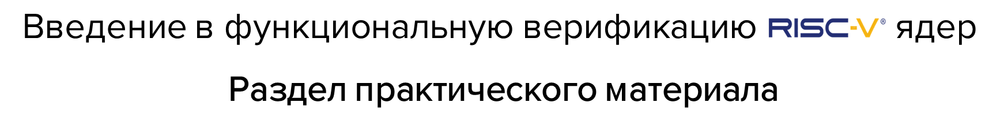

---

## Общее описание

**Курс состоит из 3 практических занятий**. Каждое занятие содержит ссылки на теорию, рекомендуемую к освоению перед выполнением. Хоть каждое занятие и является самостоятельной единицой (не зависит от других), рекомендуется выполнять их по порядку.

## Занятия

---

- [Практическое занятие 00: Тест "Hello world!"](./00_basic_hex/)
  
  **Краткое описание:**

  Данное занятие воспроизводит маршрут подхода к верификации процессорных ядер ["Hello world"](../theory/03_func.md#hello-world) на примере RISC-V ядра с открытым исходным кодом [MIRISCV](https://github.com/riscv-tests-intro/MIRISCV/tree/b510b308addc4a7271e36f2a348bd18bf24c1d77).
  
  В ходе занятия анализируются функциональные особенности тестируемого ядра, создается верификационное окружение при помощи языка [SystemVerilog](https://en.wikipedia.org/wiki/SystemVerilog). Пишется простейшая тестовая программа на языке ассемблера RISC-V[^1]. Программа загружается в модель памяти, взаимодействие ядра с которой симулируется при помощи [Verilator](https://github.com/verilator/verilator/tree/522bead374d6b7b2adb316304126e5361b18bcf1). Анализируется поведение процессорного ядра, делается вывод о корректности его работы

---

- [Практическое занятие 01: Тестирование с самопроверкой](./01_riscv_tests/)
  
  **Краткое описание:**

  Данное занятие воспроизводит маршрут подхода к верификации процессорных ядер [тестирование с самопроверкой](../theory/03_func.md#тестирование-с-самопроверкой) на примере RISC-V ядра с открытым исходным кодом [MIRISCV](https://github.com/riscv-tests-intro/MIRISCV/tree/b510b308addc4a7271e36f2a348bd18bf24c1d77).

  В ходе занятия разбирается один из самых популярных наборов тестовых сценариев [riscv-tests](https://github.com/riscv-software-src/riscv-tests/tree/408e461da11e0b298c4b69e587729532787212f5). Анализируются  функциональные особенности тестируемого ядра, сценарии [riscv-tests](https://github.com/riscv-software-src/riscv-tests/tree/408e461da11e0b298c4b69e587729532787212f5) модифицируются с целью их поддержки, создается верификационное окружение при помощи языка [SystemVerilog](https://en.wikipedia.org/wiki/SystemVerilog). Тестовые программы компилируются, экспортируются и загружаются в модель памяти. Взаимодействие ядра с памятью симулируется при помощи [Verilator](https://github.com/verilator/verilator/tree/522bead374d6b7b2adb316304126e5361b18bcf1). Анализируется поведение процессорного ядра, делается вывод о корректности его работы, автоматизируется процесс проверки каждой инструкции расширений RV32I и RV32M[^2].

---

- [Практическое занятие 02: сравнение с эталонной моделью](./02_aapg/)

  **Краткое описание:**

  Данное занятие воспроизводит маршрут подхода к верификации процессорных ядер [сравнение с эталонной моделью](../theory/04_rgen.md) на примере RISC-V ядра с открытым исходным кодом [MIRISCV](https://github.com/riscv-tests-intro/MIRISCV/tree/b510b308addc4a7271e36f2a348bd18bf24c1d77).

  В ходе занятия при помощи генератора случайных инструкций [AAPG](https://gitlab.com/shaktiproject/tools/aapg/-/tree/7ce4a9073a040bbc784edfd1c8a7b21f269f7766) создается тестовая программа. В процессе генератор модифицируется и конфигурируется с учетом особенностей тестируемого ядра. Создается верификационное окружение с использованием объектно-ориентированного подхода. Тестовая программа экспортируется и загружается в модель памяти окружения. Взаимодействие ядра с памятью симулируется при помощи [Verilator](https://github.com/verilator/verilator/tree/522bead374d6b7b2adb316304126e5361b18bcf1). Ход выполнения программы процессором логируется при помощи интерфейса [RVFI](../theory/04_rgen.md#интерфейс-rvfi)) и [несинтезируемого модуля трассировки](../theory/04_rgen.md#описание-подхода-часть-1).
  
  Запуск сгенерированной тестовой программы также воспроизводится на эталонной модели [Spike](https://github.com/riscv-software-src/riscv-isa-sim/tree/00dfa28cd71326a9b553052bf0160cb76f0e7e07), написанной на языке C. Эталонная программа формирует лог-файл, который сравнивается с лог-файлом тестируемого ядра.

---

[^1]: Язык ассемблера - язык программирования низкого уровня со строгим соответствием между командами языка и инструкциями машинного кода архитектуры. Исчерпывающий документ по ассемблеру RISC-V доступен по [ссылке](https://github.com/riscv-non-isa/riscv-asm-manual/blob/main/riscv-asm.md). Статья для начинающих по ассемблеру RISC-V доступна по [ссылке](https://habr.com/en/articles/558706/).

[^2]: Расширения определены в спецификации RISC-V (ссылку на нее можно найти в разделе [Минимальные требования к знаниям](../README.md#минимальные-требования-к-знаниям) в корне репозитория)
