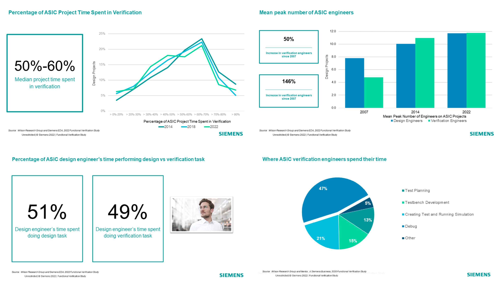

# Тема 00: Вводная

- [Тема 00: Вводная](#тема-00-вводная)
  - [Краткое содержание](#краткое-содержание)
  - [Актуальность верификации цифровых устройств](#актуальность-верификации-цифровых-устройств)
  - [Верификация процессорных ядер](#верификация-процессорных-ядер)
  - [Архитектура набора команд RISC-V](#архитектура-набора-команд-risc-v)
  - [Особенности RISC-V](#особенности-risc-v)
    - [Открытость](#открытость)
    - [Модульность](#модульность)
  - [Вектор развития RISC-V](#вектор-развития-risc-v)
  - [To be continued...](#to-be-continued)

## Краткое содержание

Данное занятие является вводным и рассказывает об актуальности верификации[^1] цифровых устройств и особой актуальности верификации процессорных ядер в настоящее время.

Также в ходе занятия дается краткое описание архитектуры набора команд RISC-V и ее особенностей, позволивших ей набрать популярность в последние годы. Описывается предполагаемый автором вектор развития RISC-V.

## Актуальность верификации цифровых устройств

Индустрия микроэлектроники последние несколько десятков лет развивается действительно впечатляющими темпами. [Законе Мура](https://en.wikipedia.org/wiki/Moore%27s_law) продолжает выполняться по сей день, "удваивая" количество транзисторов в цифровых устройствах каждые 2 года. Очевидными тенденциями являются увеличение количества функциональных блоков, возрастание архитектурной и микроархитектурной сложностей[^2].

Каждые 2 года компания Siemens публикует исследование, связанное с основными трендами верификации заказных цифровых схем. Последнее опубликованное (на 23.06.2024) [исследование](https://blogs.sw.siemens.com/verificationhorizons/2022/12/12/part-8-the-2022-wilson-research-group-functional-verification-study/) указывает на несколько важных фактов, а именно:

- процесс верификации цифровых устройств в среднем занимает 50-60% времени всего маршрута проектирования;
- количество инженеров-верификаторов примерно равно количеству инженеров-проектировщиков[^3];
- 49% времени инженер проектировщиков проводит за верификацией.

Мало того, что процесс верификации занимает больше 50% времени в большинстве компаний, так еще и сам инженер-проектировщиков тратит почти половину своего времени на отладку созданного решения.

Инженеры со всего мира работают над решением задачи ускорения процессов тестирования (далее, если не указано иного, термин "тестирование" является синонимом термина "верификация"). Разрабатываются [методологии верификации](https://www.accellera.org/downloads/standards/uvm), создаются [различные системы автоматизации](https://github.com/olofk/fusesoc), предпринимаются [попытки выхода на более высокий уровень абстракции](https://www.cocotb.org).

## Верификация процессорных ядер

Системы на Кристалле состоят из множества аналоговых и цифровых устройств, работающих независимо или совместно. **Основным цифровым устройством систем в большинстве случаев является процессор**, выполняющий программную обработку цифровых данных. Сфера верификации процессорных ядер является одной из самых актуальных составляющих индустрии проектирования и тестирования сложно-функциональных блоков.

Большое количество компаний при проектировании выбирают путь использования покупных блоков, которые уже были протестированы и предоставляют определенный уровень надежности. Это касается и процессорных ядер. Например, по состоянию на 2022 год в 90% современных мобильных устройств в настоящее время установлены ядра компании ARM. Однако, **не так давно на рынке процессоров появилась многообещающая архитектура, способная к заданию новых тенденций.**

## Архитектура набора команд RISC-V

В настоящее время все большую популярность набирает **архитектура набора команд (АНК) [RISC-V](https://riscv.org)**. В 2015 году был создан международный фонд архитектуры. Уже с 2018 года он работает в партнёрстве с [The Linux Foundation](https://www.linuxfoundation.org/).

У архитектуры есть несколько особенностей, которые делают ее крайне многообещающей как для использования во всем мире, так и в России в частности. Поговорим ниже об этих особенностях, а также о предполагаемом векторе развития АНК.

## Особенности RISC-V

### Открытость

**Основная отличительная черта архитектуры RISC-V – ее открытость.** Так как АНК может быть использована бесплатно, то уже сейчас вокруг RISC-V сформировалось сообщество из десятков тысяч разработчиков, готовых к сотрудничеству и обмену опытом.

**В 2022 году в России был создан [Альянс RISC-V](https://riscv-alliance.ru/)** - объединение независимых разработчиков вычислительной техники и программного обеспечения на основе данной архитектуры.

### Модульность

**Еще одной особенностью RISC-V является модульность**. Базовый набор содержит 49 инструкций, при этом в спецификациях присутствует **несколько десятков расширений** для аппаратной поддержки дополнительного функционала.

В расширения входит поддержка аппартного умножения/деления (M), вычислений с плавающей точкой (F,D), векторных операций (V), сжатых инструкций (C) и многое другое. Даже [криптографию](https://github.com/riscv/riscv-crypto/releases) "завезли". Также инженерам предоставлена возможность создания [нестандартных команд и их интеграции в архитектуру](https://www.youtube.com/watch?v=PkKfcW72NcI).

## Вектор развития RISC-V

Стоит заметить, что, так как АНК является относительно "молодой", то **наблюдается малое количество высокопроизводительных решений, а также общее сравнительно небольшое количество ядер на рынке.** 

Хотя тенденция развития у архитектуры многообещающая. Например, в [опубликованное в 2022 году исследование](https://riscv.org/blog/2022/02/semico-researchs-new-report-predicts-there-will-be-25-billion-risc-v-based-ai-socs-by-2027) предсказывает к 2027 году наличие 27 миллиардов RISC-V СнК для искусственного интеллекта по всему миру.

Не так давно [поступил в продажу первый ноутбук с ядром на архитектуре RISC-V](https://habr.com/en/companies/selectel/articles/691252/). Множество компаний высказываются в поддержку и проводят инвестиционные программы, например:
- [RISC-V дизайн-центр в Барселоне от Intel](https://www.eenewseurope.com/en/400m-risc-v-design-centre-for-barcelona);
- [Qualcomm разработает решение на RISC-V для умных часов от Google](https://riscv.org/news/2023/10/qualcomm-to-bring-risc-v-based-wearable-platform-to-wear-os-by-google/);
- [Крупнейшая российская компания в сфере систем хранения данных Yadro "переключилась" на архитектуру RISC-V](https://3dnews.ru/1088875/yadro-ushlo-ot-ibm-i-prishlo-k-risc-v).

Представленные выше факты способствуют **созданию ядер на архитектуре RISC-V, в том числе с открытым исходным кодом**. Сообщество активно делится опытом и исследует различные подходы к оптимизации для увеличения производительности, уменьшения площади и энергопотребления кристаллов ядер.

## To be continued...

Если компания выбирает RISC-V как архитектуру для процессорного ядра своей СнК, то, **ввиду отсутствия необходимых решений на рынке готовых СФ-блоков, может появиться необходимость в разработке собственного процессора**. Однако любое новое решение необходимо верифицировать. И здесь инженеры могут столкнуться с рядом проблем, свойственных как процессорным ядрам в целом, так и конкретной архитектуре.

О том, что же такое функциональная верификация, в частности RISC-V ядер, будет рассказано в [следующем занятии](./01_basics.md).

[^1]: В общем случае, верификация цифрового устройства – процесс обоснованного доказательства его корректной работы в рамках представленной на него спецификации. Спецификация – набор задокументированных требований. Она определяет характеристики устройства. Более подробно данные термины будут разобраны в [Теме 01: Функциональная верификация процессорных ядер](./01_basics.md#верификация-цифровых-устройств).
 
[^2]: Термины архитектура и микроархитектура применительно к процессорным ядрам будут рассмотрены в [Теме 01: Функциональная верификация процессорных ядер](./01_basics.md#архитектура-и-микроархитектура-процессорного-ядра).

[^3]: Термин "инженер-проектировщик" в данном контексте аналогичен английскому термину "Design Engineer".
