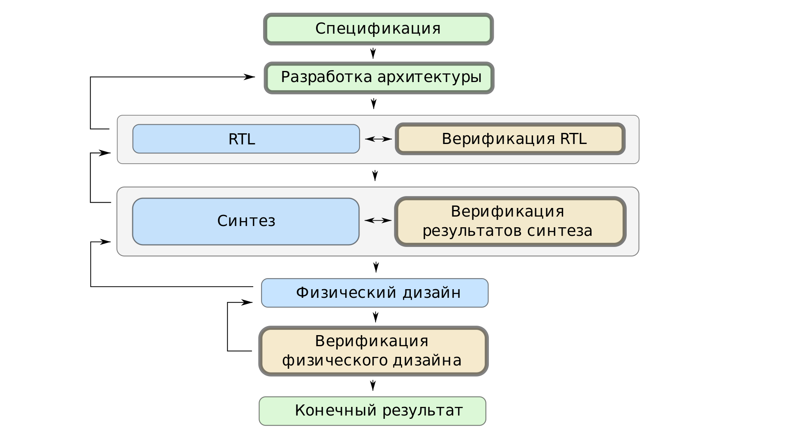
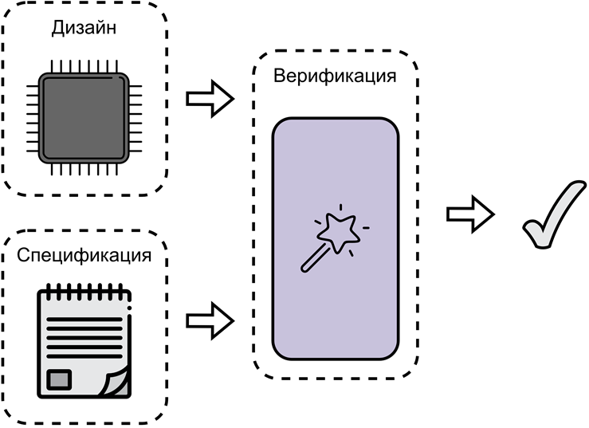
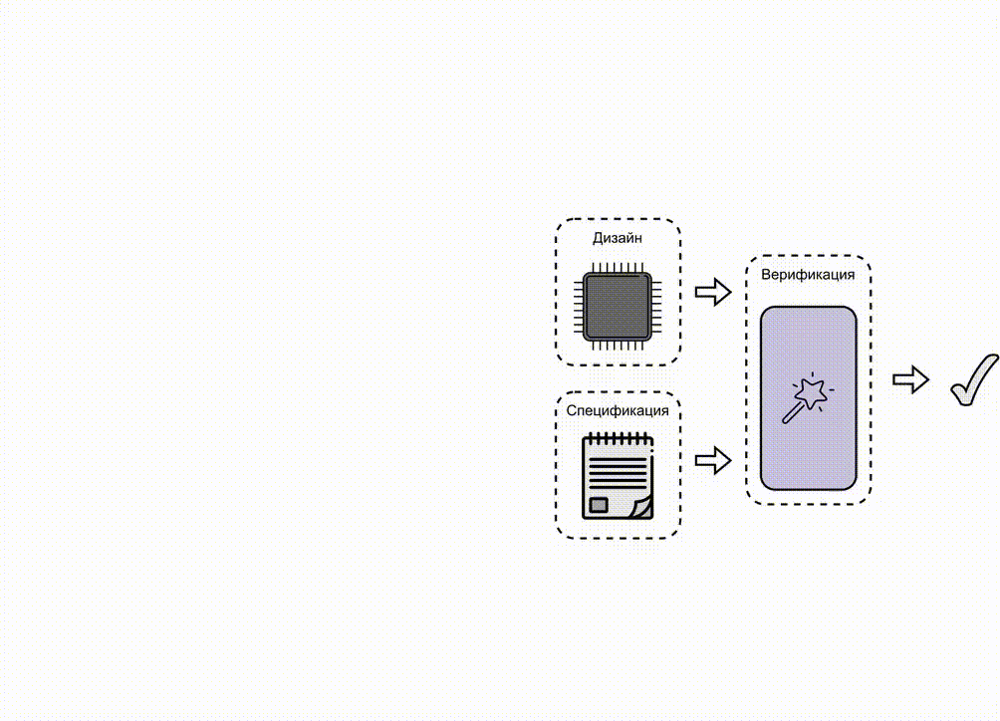
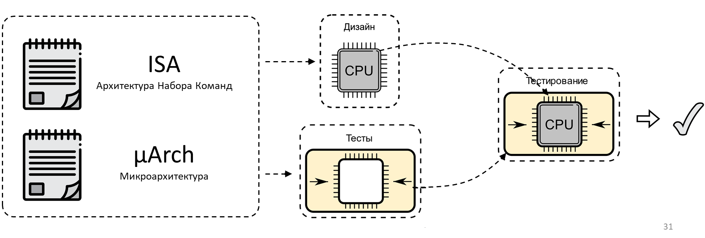

# Тема 01: Функциональная верификация процессорных ядер

- [Тема 01: Функциональная верификация процессорных ядер](#тема-01-функциональная-верификация-процессорных-ядер)
  - [Рекомендуемый материал](#рекомендуемый-материал)
  - [Краткое содержание](#краткое-содержание)
  - [Верификация цифровых устройств](#верификация-цифровых-устройств)
  - [Маршрут проектирования цифровых устройств](#маршрут-проектирования-цифровых-устройств)
    - [Этап спецификации](#этап-спецификации)
    - [Этап разработки архитектуры](#этап-разработки-архитектуры)
    - [Этапы RTL и верификации RTL](#этапы-rtl-и-верификации-rtl)
    - [Этапы синтеза и верификации результатов синтеза](#этапы-синтеза-и-верификации-результатов-синтеза)
    - [Этап физического дизайна и верификации физического дизайна](#этап-физического-дизайна-и-верификации-физического-дизайна)
  - [Верификация в маршруте проектирования цифровых устройств](#верификация-в-маршруте-проектирования-цифровых-устройств)
  - [Функциональная верификация цифровых устройств](#функциональная-верификация-цифровых-устройств)
  - [Введение в верификацию процессорных ядер](#введение-в-верификацию-процессорных-ядер)
    - [Обобщенная схема верификации процессорного ядра](#обобщенная-схема-верификации-процессорного-ядра)
    - [Архитектура и микроархитектура процессорного ядра](#архитектура-и-микроархитектура-процессорного-ядра)
    - [Спецификация процессорного ядра](#спецификация-процессорного-ядра)
  - [Особенности верификации процессорных ядер](#особенности-верификации-процессорных-ядер)
    - [Архитектурные особенности](#архитектурные-особенности)
    - [Микроархитектурные особенности](#микроархитектурные-особенности)
  - [Особенности верификации RISC-V ядер](#особенности-верификации-risc-v-ядер)
    - [Как RISC-V упрощает работу верификатора](#как-risc-v-упрощает-работу-верификатора)
    - [Как RISC-V усложняет работу верификатора](#как-risc-v-усложняет-работу-верификатора)
    - [Так упрощает или усложняет?](#так-упрощает-или-усложняет)
  - [To be continued...](#to-be-continued)

## Рекомендуемый материал

- [Тема 00: Вводная](./00_intro.md)

## Краткое содержание

В данном занятии даются определения верификации и функциональной верификации цифровых устройств. Подробно разбирается маршрут проектирования цифровых устройств, определяются особенности каждого из его этапов. Определяется место верификации в маршруте проектирования.

Во второй части занятия водятся понятия архитектуры и микроархитектуры процессора, определяется их роль функциональной верификации процессорных ядер. В том числе разбирается влияние особенностей архитектуры набора команд RISC-V на процесс верификации ядер, спроектированных на ее основе.

## Верификация цифровых устройств

В общем случае, **верификация цифрового устройства** – это процесс обоснованного доказательства его корректной работы в рамках представленной на него спецификации. Но что же такое спецификация?

**Спецификация** – это набор задокументированных требований. Она определяет характеристики устройства. Например, для устройства, вычисляющего быстрое преобразование Фурье[^1], спецификация может определять как функциональные особенности (разрядность данных, количество точек, основание и т.д.), так и требования к производительности и энергопотреблению (частота работы схемы, потребляемая мощность). [Статья про сравнение различных реализаций быстрого преобразования Фурье  в интегральных схемах](https://essay.utwente.nl/72179/1/FFT_Comparison_Simon_Dirlik.pdf).

## Маршрут проектирования цифровых устройств

Ниже представлен обобщенный маршрут проектирования цифровых устройств.

### Этап спецификации

На **этапе спецификации** формируется документация, описывающая функционал устройства, его временные и мощностные характеристики (например, максимально возможная тактовая частота, а также пиковая потребляемая мощность). В создании спецификации участвует как заказчик, так и исполнитель.

### Этап разработки архитектуры

На **этапе разработки архитектуры[^2]** создается внутренняя документация исполнителя, которая описывает устройство на уровне совокупности блоков, каждый из которых выполняет определенный ему функционал. После описания совокупности блоков, каждый описывается отдельно. Причем блок так же может является совокупностью блоков. Таких уровней вложенности может быть несколько, их количество определяется командной проектировщиков[^3]. Каждое описание по своей сути является спецификацией, но более низкого уровня, и является интеллектуальной собственностью исполнителя, то есть, в большинстве случаев, заказчик имеет очень ограниченный доступ к этим документам.

### Этапы RTL и верификации RTL

На этапах **RTL** и **верификации RTL** (выполняемых в идеальном случае параллельно) набор спецификаций преобразуется командой проектировщиков в HDL-представление[^4] на уровне регистровых передач (Register Transfer Level, RTL)[^5], которое проверяется на соответствие спецификации командой верификации. О том, как это делается, поговорим чуть позже.

### Этапы синтеза и верификации результатов синтеза

Этап синтеза подразделяется еще на два этапа:

- логический синтез;
- физический синтез.

На этапе **логического синтеза** RTL представление проекта при помощи специализированного ПО преобразуется в более низкий уровень представления - [логическую схему в виде библиотечных ячеек (комбинационных и последовательностных) - gate-level представление](https://www.youtube.com/watch?v=UrMumwROPK8). Это все еще представление на HDL, правда уже не универсальное, а специфичное для той фабрики (завода по производству), на которой будет изготавливаться устройство. 

На этапе **физического синтеза** логическая схема (gate-level представление) при помощи специализированного ПО (отличного от ПО для [этапа логического синтеза](#этапы-логического-синтеза-и-верификации-результатов-синтеза)) преобразуется в еще более низкий уровень представления - топологию интегральной схемы, в которой каждый элемент размещается на кристалле (англ. placement) и соединяется с другими элементами (англ. routing). Топология описывается [файлом формата GDSII](https://en.wikipedia.org/wiki/GDSII), который будет использован для создания фотошаблонов для производства реальной микросхемы. Также на этапе **физического синтеза** на основании топологии формируется финальное gate-level представление устройства и сопровождающие это представление файлы (например, [файлы временных задержек](https://docstech.ru/sdf-verilog/)).

Подытоживая, можно сказать, что на этапе синтеза формируются несколько gate-level представлений и [файл топологии GDSII](https://en.wikipedia.org/wiki/GDSII). Для финального gate-level представления также формируются сопровождающие файлы (например, [файлы временных задержек](https://docstech.ru/sdf-verilog/)).

На этапе **верификации результатов синтеза** происходит проверка соответствия gate-level описаний между собой, их соответствие HDL-представлению на уровне RTL, а также их соответствие спецификации (в том числе временным и мощностным характеристикам). Также на этапе **верификации результатов синтеза** производится верификация топологии. Данный этап включает в себя множество проверок, большую часть из которых составляют [проверки отсутствия нарушений правил проектирования (Design Rule Checking, DRC)](https://en.wikipedia.org/wiki/Design_rule_checking).

### Этап физического дизайна и верификации физического дизайна

После получения реального физического дизайна[^6] с фабрики (завода по производству) начинается этап его верификации. На микросхеме запускается программное обеспечение, оцениваются временные и мощностные характеристики.

## Верификация в маршруте проектирования цифровых устройств

На [изображении обобщенного маршрута проектирования цифрового устройства](#маршрут-проектирования-цифровых-устройств) слово "верификация" присутствует в 3 этапах, однако неявно части этого процесса присутствуют и в других этапах. Все этапы, в которые явно или неявно входит верификация, выделены жирным серым контуром.

Про этапы [верификации RTL](#этапы-rtl-и-верификации-rtl), [верификации результатов синтеза](#этапы-синтеза-и-верификации-результатов-синтеза) и [верификации физического дизайна](#этапы-физического-дизайна-и-верификации-физического-дизайна) и роль процесса верификации в них было сказано в предыдущем разделе. На этапе [спецификации](#этап-спецификации) команда верификации принимает непосредственное участие в ее обсуждении, анализируя фронт предстоящих работ и формируя представление о будущем верификационном окружении[^7]. На этапе [разработки архитектуры](#этап-разработки-архитектуры) тестировщики могут сосредоточиться на архитектуре[^8] окружения и приступить к написанию простейших моделей тестируемых блоков.

## Функциональная верификация цифровых устройств

**Важно обратить внимание**, что в рамках данного курса под термином "верификация" будет подразумеваться верификация функциональных особенностей устройства. Например, функциональная верификация модуля быстрого преобразования Фурье подтверждает правильность вычислений в рамках определенной разрядности входных и выходных данных, количества точек и т.д. При этом временные и мощностные характеристики в ходе функциональной верификации не проверяются!

При этом подразумевается, что рассматривается только [этап верификации RTL](#этапы-rtl-и-верификации-rtl). Часть процессов [этапа верификации результатов синтеза](#этапы-синтеза-и-верификации-результатов-синтеза) также можно рассматривать как функциональную верификацию, однако со своими особенностями, которые выходят за рамки данного курса. Это касается и [этапа верификации физического дизайна](#этапы-физического-дизайна5-и-верификации-физического-дизайна).

Максимально упрощенно процесс функциональной верификации представлен на изображении ниже.

  </img>

В ближайших разделах данный процесс будет рассмотрен более подробно в контексте верификации процессорных ядер.

## Введение в верификацию процессорных ядер

### Обобщенная схема верификации процессорного ядра

**Обратим внимание**, что частным случаем цифрового устройства является процессорное ядро. Таким образом, **верификация процессорного ядра** – это процесс обоснованного доказательства корректной его работы в рамках представленной на него спецификации.

Важным замечанием здесь является то, что спецификация определяет не только функционал устройства (далее в качестве синонима слова "устройство" может использоваться слово "дизайн"), но и прямым образом влияет на структуру и особенности верификационного окружения.

**Проектирование дизайна и верификационного окружения – процессы достаточно независимые**, опирающиеся на спецификацию. Можно сказать, что дизайнер и верификатор описывают каждый свое видение представленных требований. Далее эти описания сравниваются.

Открытым остается вопрос: **чем по своей сути является спецификация на процессорное ядро?** Для ответа необходимо определить то, что свойственно каждому процессору.

### Архитектура и микроархитектура процессорного ядра

Современному процессору свойственны:
- архитектура;
- микроархитектура.

В текущих реалиях индустрии термин **"архитектура" синонимичен термину "архитектура набора команд (АНК)"**, которая определяет набор инструкций для исполнения, адресное пространство, количество и разрядность регистров общего и специального назначения, модель памяти, особенности виртуализации адресного пространства и т.д. **Обратите внимание**, что в данном контексте термин "архитектура" не является синонимом терминам из предыдущих разделов[^2][^8].

**Микроархитектура – это аппаратная реализация АНК.** Изначально она определяется внутренней документацией конкретной компании, в которой разрабатывается ядро. На основе этой документации уже создается HDL-описание, которое отправляется на дальнейшие этапы проектирования. 

**Если архитектура отвечает на вопрос "что?", то микроархитектура отвечает на вопрос "как?".** Одна и та же АНК (или ее часть) может быть реализована посредством аппаратно абсолютно различающихся между собой ядер.

Один процессор может быть конвейерным, второй – однотактным. В различных конвейерах могут быть применены различные алгоритмы разрешения конфликтов. Одно ядро может позиционироваться, как высокопроизводительное, и из-за микроархитектурных особенностей потреблять больше энергии, чем второе ядро, основным преимуществом которого является низкая потребляемая мощность.

### Спецификация процессорного ядра

Архитектура набора команд оказывает непосредственное влияние на микроархитектуру, а микроархитектура определяет функциональные особенности ядра. Таким образом, **АНК и микроархитектура определяют спецификацию процессора.** Стоит заметить, что процесс интеграции пользовательского функционала также определяется в рамках АНК.

В общем виде верификация процессора представляет собой практически параллельный c реализацией дизайна процесс проектирования верификационного окружения на основе АНК и микроархитектуры с последующей проверкой.

По сути, на этапе проверки происходит сравнение интерпретации спецификации дизайнером и верификатором. **Здесь важен именно независимый взгляд с разных сторон**: со стороны синтезируемого HDL-описания и со стороны высокоуровневого HDL-описания или описания при помощи других средств программирования.

## Особенности верификации процессорных ядер

Как было сказано выше, спецификацию на процессор определяют АНК и микроархитектура. Каждая из этих составляющих вносит определенные сложности для верификатора.

### Архитектурные особенности

**АНК в большинстве случаев является документом или набором документов сравнительно большого объема.** В качестве примера, последняя на момент написания текста часть спецификации RISC-V [The RISC-V Instruction Set Manual Volume I. Unprivileged Architecture. Version 20240411](https://drive.google.com/file/d/1uviu1nH-tScFfgrovvFCrj7Omv8tFtkp/view) занимает 670 страниц. Обратите внимания, что это лишь ее часть. Прочтение и анализ могут занять недели и даже месяцы в зависимости от части архитектуры, которую планируется реализовать[^9].

В процессе проверки необходимо подтвердить корректность выполнения каждой инструкции, корректность доступа ко всем реализованным регистрам общего и специального назначения. Для генерации тестовых программ важно соблюдать соглашение о вызовах[^10], которое тоже является частью АНК. Особое место отводится проверке обработки исключений, ведь обновление состояния ядра в этом случае также описано в архитектуре набора команд.

### Микроархитектурные особенности

**Микроархитектура также влияет на процесс создания верификационного окружения.** Здесь производятся специфичные проверки на определенные последовательности инструкций, приводящие, например, к конфликтам в конвейере. Особое место отводится проверке асинхронных событий (прерываний), очередность и условия обработки которых определяются микроархитектурой. Свою роль также играет, как правило, пользовательский интерфейс памяти со своим протоколом обмена.

Для процессоров с поддержкой режима отладки важны проверки обновления внутреннего состояния при переходе в этот режим. Специфичное внутреннее состояние определяется АНК. Однако внешние воздействия для входа в режим отладки могут варьироваться в зависимости от конкретной микроархитектурной реализации[^11].

## Особенности верификации RISC-V ядер

В прошлом разделе были определены общие особенности верификации процессорных ядер. Однако **стоит заметить**, что у каждой АНК есть свои отличительные черты, которые могут как вносить дополнительные сложности, так и облегчать задачу тестирования. Рассмотрим архитектуру RISC-V.

### Как RISC-V упрощает работу верификатора

**Упрощает работу верификатору открытость данной архитектуры**. Уже сейчас в открытом доступе существует большое количество решений для верификации RISC-V ядер, начиная от готовых верификационных окружений, например:

- [Верификационное окружение ядра Ibex](https://github.com/lowRISC/ibex/tree/master/dv);
- [Верификационные окружения ядер OpenHW Group](https://github.com/openhwgroup/core-v-verif).

и наборов тестовых сценариев, например:

- [Набор тестовых сценариев riscv-tests](https://github.com/riscv-software-src/riscv-tests);
- [Набор тестовых сценариев riscv-arch-test](https://github.com/riscv-non-isa/riscv-arch-test).

и заканчивая генераторами случайных инструкций, например:

- [Генератор случайных RISC-V инструкций RISCV-DV](https://github.com/chipsalliance/riscv-dv);
- [Генератор случайных RISC-V инструкций MicroTESK](https://forge.ispras.ru/projects/microtesk-riscv);
- [Генератор случайных RISC-V инструкций AAPG](https://gitlab.com/shaktiproject/tools/aapg).

Также в открытом доступе присутствуют программные модели процессоров, например:

- [Программная С модель RISC-V Spike](https://github.com/riscv-software-src/riscv-isa-sim);
- [Программная C++ модель RISC-V VeeR-ISS](https://github.com/chipsalliance/VeeR-ISS);
- [Программная Rust модель RISC-V Rust RISC-V Simulator](https://github.com/GregAC/rrs);

**Инженер может повторно использовать открытые решения в своих разработках**, перенимать опыт и делиться своим собственным. Данные факторы ускоряют и упрощают процесс верификации.

### Как RISC-V усложняет работу верификатора

**Усложняет работу верификатора модульность АНК.** RISC-V содержит базовое расширение RV32I, состоящее из 49 инструкций. При этом оно дополнено еще несколькими десятками опциональных расширений для реализации умножения, деления, операций с плавающей точкой, криптографии и т.п.

Опциональные расширения содержат сотни инструкций, каждая из которых может иметь свою реализацию в аппаратуре (например, деление в зависимости от алгоритма может занимать различное количество тактов). 

**Таким образом, каждое ядро имеет свою уникальную микроархитектуру и уникальный набор инструкций, который оно реализует.** Это приводит к уникальной, если не структуре, то конфигурации верификационного окружения.

### Так упрощает или усложняет?

**Для RISC-V ситуация в итоге выглядит неоднозначно.** С одной стороны, инженер имеет доступ к большому количеству открытых решений, с другой стороны, ни одно из них не подходит ему в полной мере.

Верификация сводится в итоге к интеграции, модификации и настройке уже существующих сценариев тестирования, а также самостоятельному описанию части, взаимодействующей с микроархитектурными элементами.

## To be continued...

В данном занятии была заложена база, позволяющая понять основные подходы, используемые в верификации процессорных ядер, которые будут разобраны в [следующем занятии](./02_approach.md). Поговорим о том, что такое формальная верификация и верификация на основе симуляции, и как они применяются для тестирования RISC-V ядер.

[^1]: Быстрое преобразование Фурье - алгоритм ускоренного вычисления дискретного преобразования Фурье. [Прекрасное видео про математический аппарат преобразования Фурье](https://www.youtube.com/watch?v=spUNpyF58BY).

[^2]: Под термином "архитектура" здесь подразумевается набор документов, описывающий цифровое устройство на различных уровнях абстракции (каких? - [ответ в соответствующем](#этап-разработки-архитектуры2) разделе).

[^3]: Термин "инженер-проектировщик" или "проектировщик" в данном контексте аналогичен английскому термину "Design Engineer".

[^4]: HDL-описание - представление цифрового устройства в виде кода языков описания аппаратуры (Hardware Description Language, HDL). Примеры таких языков: Verilog, SystemVerilog, VHDL. [Лекция Школы синтеза цифровых схем на эту тему](https://youtu.be/DFcvEO-gP0c?t=1310).

[^5]: RTL-описание - представление цифрового устройства в виде описания [логических операций](https://en.wikipedia.org/wiki/Boolean_algebra), которые применяются к данным, которые распространяются между [регистрами](https://en.wikipedia.org/wiki/Hardware_register).

[^6]: Под термином "дизайн" подразумевается некоторое представление цифрового устройство. Как правило, этим термином начинают оперировать на этапе RTL и заканчивают на этапах физического дизайна и его верификции (вместо термина "физический дизайн" начинают употреблять термин "чип"/"микросхема" и т.п.).

[^7]: Верификационное окружение - совокупность специализированных средств и методолгий их применения для реализации процесса [верификации](#верификация-цифровых-устройств).

[^8]: Под термином "архитектура" здесь подразумевается набор документов, описывающий верификационное окружение на различных уровнях абстракции.

[^9]: Оговорка: для создания простейшего ядра в случае RISC-V достаточно ознакомиться всего с несколькими десятками страниц спецификации. Но только для простейшего. О конкурентоспособности речи не идет.

[^10]: Соглашение о вызовах - документ, регламентирующий, как подпрограммы получают аргументы от вызывающей их программы, и как они возвращают результат. Работа над соглашением о вызовых RISC-V ведется в [этом документе](https://github.com/riscv-non-isa/riscv-elf-psabi-doc/blob/master/riscv-cc.adoc).

[^11]: С отладкой в индустрии все обстоит достаточно интересно. Работа над спецификацией на нее все еще активно ведется ([ссылка репозиторий](https://github.com/riscv/riscv-debug-spec)), однако необходимость в рабочем решении появилась еще давно. Это привело к тому, что большинство компаний разработали свои [собственные решения](https://www.sifive.com/technology/sifive-insight). Например, в описании флагманских ядер команий [Syntacore](https://syntacore.com/products/scr9) и [SiFive](https://www.sifive.com/cores/performance-p870-p870a) не упоминается о соответствии реализации отладки какой-либо версии ее спецификации.
