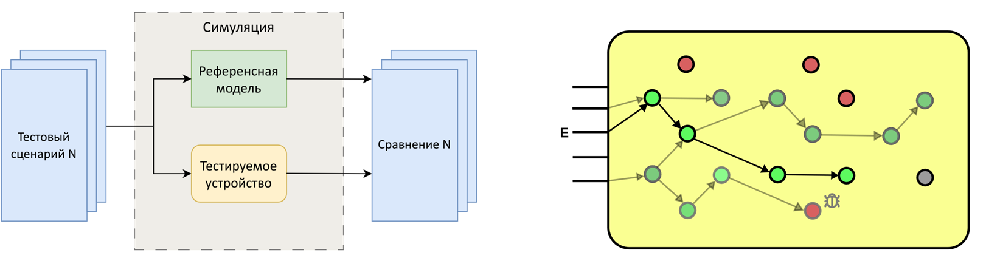
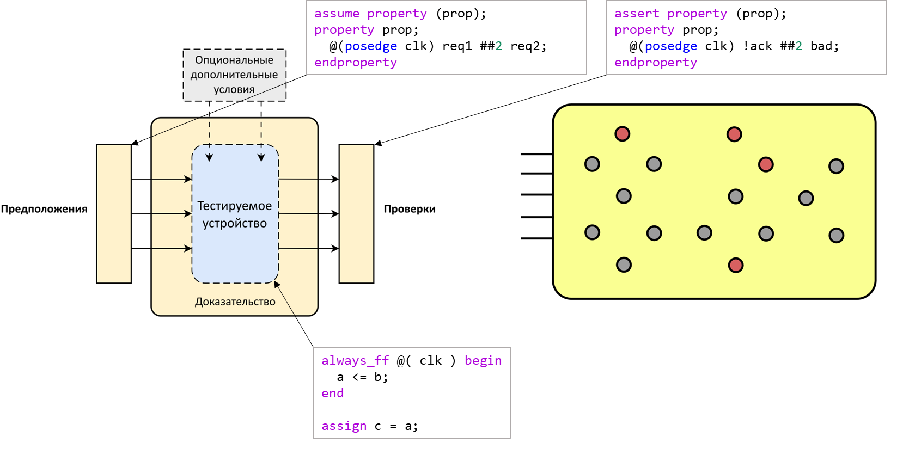
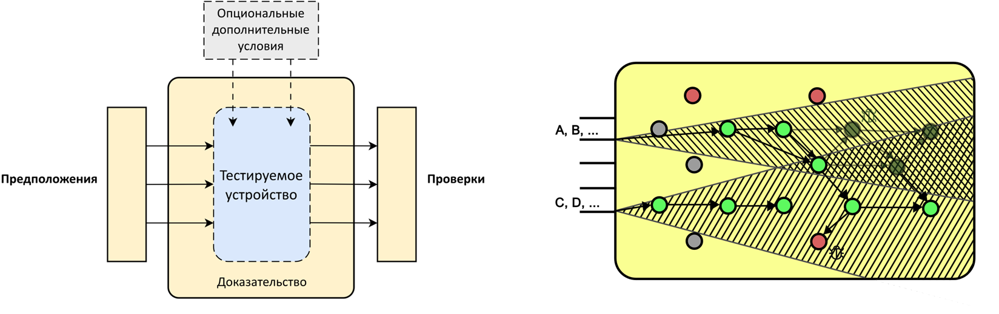
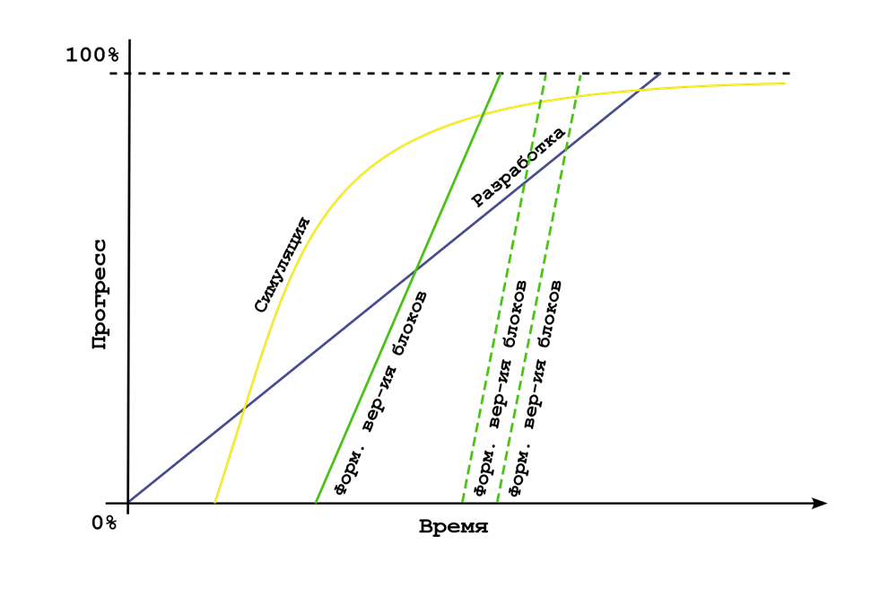
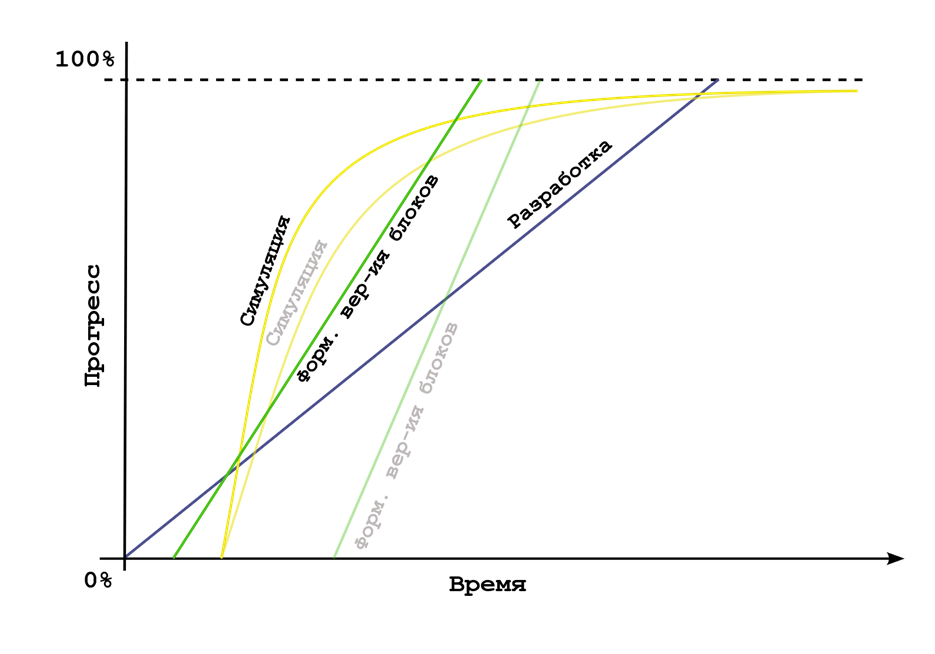

# Тема 02: Основные подходы к функциональной верификации RISC-V ядер

- [Тема 02: Основные подходы к функциональной верификации RISC-V ядер](#тема-02-основные-подходы-к-функциональной-верификации-risc-v-ядер)
  - [Рекомендуемый материал](#рекомендуемый-материал)
  - [Краткое содержание](#краткое-содержание)
  - [Формальная верификация и симуляция](#формальная-верификация-и-симуляция)
    - [Симуляция](#симуляция)
    - [Состояния устройства](#состояния-устройства)
    - [Формальная верификация](#формальная-верификация)
    - [Сравнение симуляции и формальной верификации](#сравнение-симуляции-и-формальной-верификации)
  - [Формальная верификация и симуляция RISC-V ядер](#формальная-верификация-и-симуляция-risc-v-ядер)
  - [Выбор в пользу симуляции](#выбор-в-пользу-симуляции)
  - [To be continued...](#to-be-continued)

## Рекомендуемый материал

- [Тема 00: Вводная](./00_intro.md)
- [Тема 01: Функциональная верификация процессорных ядер](./01_basics.md)

## Краткое содержание

Данное занятие содержит в себе теорию о двух основных направлениях функциональной верификации цифровых устройств - симуляция и формальная верификация. Производится сравнение этих направлений и их определяются области их применимости для верификации RISC-V процессоров.
## Формальная верификация и симуляция

Подходы к функциональной верификации цифровых устройств делятся на 2 типа:
- симуляция;
- формальная верификация.

### Симуляция

**В ходе симуляции работа HDL-описания устройства моделируется во времени. Моделирование производится при различных сценариях тестирования.** Сценарии определяются тем, какие значения и в какой последовательности подаются на входы устройства. Допустимые и недопустимые значения, а также их последовательности определяются спецификацией.

Применительно к процессору это может выражаться, например, в том, что он поддерживает только входные инструкции сложения и вычитания, при этом, пока процессорное ядро не сгенерирует сигнал готовности, значение инструкции на соответствующем входе изменять нельзя.

**Поведение устройства сравнивается с референсной (эталонной) моделью.** Модель, как правило, тоже проектируется при помощи языков описания аппаратуры или при помощи высокоуровневых языков программирования.

### Состояния устройства

**В ходе своей работы устройство может принимать ограниченный набор состояний.** Допустимые состояния и зависимости между ними определяются спецификацией.

Применительно к процессору это может выражаться, например, в том, что, если полученная инструкция не поддерживается, то процессор меняет свой счетчик команд на значение, определенное в специальном регистре А, в котором содержится адрес обработчика исключений.

То есть из состояния `получена неподдерживаемая инструкция` переход может быть осуществлен в состояние `счетчик команд изменен на значение в специальном регистре A` и не может быть осуществлен в состояние "счетчик команд изменен на значение адреса следующей инструкции".

**Практически в каждом сравнительно сложном устройстве сокрыты ошибки, которые приводят к попаданию устройства в недопустимое состояние.** Например, дизайнер неверно написал условие для определения исключения, и вот счетчик команд уже не меняется на адрес обработчика исключений, и программа продолжает свое выполнение. 

**Задача верификатора в ходе симуляции – сгенерировать как можно больше таких воздействий, которые приведут к недопустимым состояниям.** Она как раз-таки состоит в том, чтобы "сломать" дизайн, а не подвердить, что он работает корректно.

Какие-то воздействия не приведут к переходу в недопустимые состояния, а какие-то помогут обнаружить ошибку разработчика.

Стоит заметить, что, чтобы гарантировать отсутствие ошибок в устройстве, **необходимо перебрать все возможные комбинации входных сигналов и все их допустимые последовательности, что в большинстве случаев не является возможным** в виду размеров дизайна, его сложности и жестких временных рамок, которые диктует индустрия. **В современных реалиях задача верификатора – это, прежде всего, исключить критические ошибки в аппаратуре.**

### Формальная верификация

Второй подход – формальная верификация. Он значительно отличается от верификации на основе симуляции. **В ходе формальной верификации инженер описывает набор ограничений на входные и выходные сигналы.**  Также инженером опционально задаются некоторые условия, определяющие в большинстве случаев внутреннее состояние устройства в начале симуляции.

Ограничения на входные сигналы определяют то, какие воздействия могут быть поданы на устройство. Ограничения не выходные сигналы определяют, каким должен быть результат работы устройства.

**В настоящее время описание ограничений осуществляется при помощи подмножества SystemVerilog Assertions (SVA) языка описания аппаратуры SystemVerilog.**

**Основное отличие формальной верификации от симуляции состоит в том, что здесь генерация входных воздействий осуществляется программным обеспечением.** Пользователь лишь определяет диапазон. Далее генерацию и проверку осуществляет симулятор.

**Проверка в случае формальной верификации основывается на доказательстве.** Программное обеспечение при помощи различных алгоритмов запускает процесс подтверждения того, что при всех возможных комбинациях входных сигналов с учетом ограничений пользователя устройство сгенерирует выходные сигналы, которые также удовлетворяют ограничениям пользователя.

Однако, есть нюансы. Как и в случае с симуляцией, в большинстве случаев не представляется возможным описать все возможные комбинации входов и все возможные значения выходов.

Ко всему прочему, даже если это возможно сделать в разумное время, то процесс доказательства в этом случае может занять еще больше времени, или же доказательство может оказаться невозможным в принципе ввиду чрезмерного количества состояний и недостаточных аппаратных мощностей системы.

Таким образом, **формальная верификация в целом может быть применима только для устройств ограниченной сложности и размера.**

### Сравнение симуляции и формальной верификации

Сравнивая симуляцию и формальную верификацию, можно сказать, что:
- в ходе симуляции инженер генерирует входные воздействия, в ходе формальной верификации за это отвечает программное обеспечение;
- в большинстве случаев скорость развертывания верификационного окружения на основе симуляции быстрее (по крайней мере для генерации простейших сценариев);
- надежность формальной верификации выше при полном описании спецификации при помощи ограничений;
- верификация на основе симуляции является более доступной, как с точки зрения качества открытых решений, так и с точки зрения дружелюбия программного обеспечения к пользователю;
- верификация на основе симуляции может быть применена к любому дизайну, для формальной верификации свойственно ограничение по сложности и размеру.

## Формальная верификация и симуляция RISC-V ядер

Для верификации RISC-V ядер и процессорных ядер в целом применяется следующая **концепция: для верификации целого ядра и большинства его блоков используется верификация на основе симуляции, а для верификации отдельных, критически важных составляющих, используется формальная верификация.** Примеры формальной верификации целых ядер существуют ([проект по формальной верификации RISC-V ядер от SymbioticEDA](https://github.com/SymbioticEDA/riscv-formal/tree/master/cores)), однако их количество значительно меньше, чем проектов на основе симуляции.

Так, в ходе разработки большинство блоков проходят верификацию при помощи симуляции, **малая часть критически важных блоков проверяется на простых тестовых сценариях и после досконально проверяется формально.** Работа целого ядра симулируется на различных тестовых программах и шаблонах генерации внешних воздействий.

Стоит заметить, что некоторые блоки могут претерпевать несколько итераций конечного HDL-описания ввиду микроархитектурных изменений в ходе разработки из-за неучтенных ранее параметров. В таком случае процессы формальной верификации отдельных блоков могут повторяться через определенные промежутки времени.

Схематичные графики прогрессов симуляции и формальной верификации в ходе разработки процессорного ядра представлены на рисунке ниже.

**Полезной практикой при проектировании процессорных ядер является написание SystemVerilog Assertions дизайнерами в ходе разработки HDL-описания блоков.**

SVA могут быть интегрированы непосредственно в исходные файлы дизайна, а на этапе синтеза будут проигнорированы. **Преимущество данного подхода заключается в том, что, потенциально, дизайнер может написать ограничения для своего дизайна даже лучше, чем верификатор, ведь именно он его проектировал и знает все его особенности.**

Дополнительно такой подход снимет часть нагрузки с тестировщика, позволив ему перераспределить освободившееся время для написания, например, тестовых сценариев симуляции. Влияние такого подхода на процессы верификации представлено на рисунке ниже.

## Выбор в пользу симуляции

Так как верификация на основе симуляции является основой при проверке процессорных ядер в настоящее время, то в данном курсе будут рассмотрены подходы на основе симуляции применительно к RISC-V ядрам.

Если читатель хочет больше узнать о формальной верификации, то автор рекомендует ознакомиться с лекцией ["Введение в формальную верификацию. Теория и области применения. Примеры."](https://www.youtube.com/watch?v=URM5IoQsyk8&t=7127s) школы синтеза цифровых схем.

## To be continued...

В [следующем занятии](./03_func.md) будут рассмотрены базовые подходы к функциональной верификации RISC-V ядер на основе симуляции: "Hello world!" и тестирование с самопроверкой.
