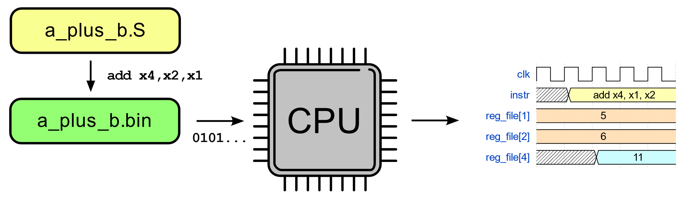
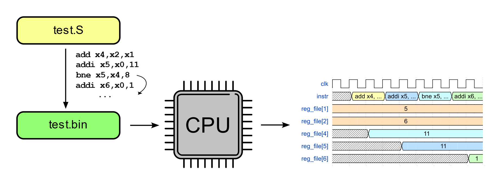

# Тема 03: Базовые подходы к симуляции RISC-V ядер

- [Тема 03: Базовые подходы к симуляции RISC-V ядер](#тема-03-базовые-подходы-к-симуляции-risc-v-ядер)
  - [Рекомендуемый материал](#рекомендуемый-материал)
  - [Краткое содержание](#краткое-содержание)
  - ["Hello world!"](#hello-world)
  - [Практическое занятие "Hello world!"](#практическое-занятие-hello-world)
  - [Тестирование с самопроверкой](#тестирование-с-самопроверкой)
  - [Практическое занятие на тестирование с самопроверкой](#практическое-занятие-на-тестирование-с-самопроверкой)
  - [Bug hunting с тестированием с самопроверкой](#bug-hunting-с-тестированием-с-самопроверкой)
  - [To be continued...](#to-be-continued)

## Рекомендуемый материал

- [Тема 00: Вводная](./00_intro.md)
- [Тема 01: Функциональная верификация процессорных ядер](./01_basics.md)
- [Тема 02: Основные подходы к функциональной верификации RISC-V ядер](./02_approach.md)

## Краткое содержание

В данном занятии подробно рассматриваются два базовых подхода к верификации RISC-V ядер на основе симуляции: "Hello world!" и тестирование с самопроверкой.

Оба этих подхода не являются достаточными для качественной проверки процессоров, однако находят применимость на определенных этапах их разработки.

## "Hello world!"

**Простейшим подходом является тест "Hello world!"**, в ходе которого верификатором создается тестовая программа с элементарным набором инструкций. Программа загружается в ядро, симулируется его работа. Инженер анализирует результат и выносит вердикт о корректности работы.


"Hello world!" в описании подхода употребляется для простоты восприятия. В реальности используются более простые тесты, чем вывод строки в консоль. Это может быть выполнение арифметических инструкций, простейших циклов и т.п. **В ходе симуляции инженер по временной диаграмме оценивает корректность работы устройства.**



**Такой подход к тестированию в некотором роде напоминает [утиный тест](https://books.google.ru/books?id=j7zds6xx7S0C&q=%22james+Riley%22+OR+%22James+Whitcomb+Riley%22+bird++duck&pg=PA68&redir_esc=y#v=snippet&q=%22james%20Riley%22%20OR%20%22James%20Whitcomb%20Riley%22%20bird%20%20duck&f=false).** По аналогии с "если это выглядит как утка, плавает как утка и крякает как утка, то это, вероятно, и есть утка" можно сказать, что "если процессор выполняет программу, то, вероятно, процессор работает исправно". Звучит достаточно абсурдно, не так ли? Да, **этот способ далеко не гарантирует корректность работы устройства, однако может быть использован в самом начале процесса верификации для поиска легко определяемых ошибок в дизайне**, пока более сложные тестовые сценарии еще не интегрированы в окружение.

## Практическое занятие "Hello world!"

Для того, чтобы на практике повторить тестирование процессора при помощи подхода "Hello world!", перейдите в раздел [practice/00_basic_hex](../practice/00_basic_hex/) и следуйте инструкциям. Будет интересно!

## Тестирование с самопроверкой

**Подход с самопроверкой заключается в использовании программ, в которые уже встроена проверка корректности работы.** Давайте рассмотрим пример.

Предположим, что в ходе выполнения программы складываются два числа в регистрах `x1` и `x2`. Результат записывается в `x4`.

```
add  x4, x1, x2  # сложение
```

После выполнения инструкции сложения, следующие инструкции сравнивают полученный результат с заранее известным, который до этого был загружен в память процессора.

```
add  x4, x1, x2  # сложение
addi x5, x0, 11  # загрузка константы в регистр x5
bne  x5, x4, 8   # сравнение значений в регистрах x4 и x5
```

При несовпадении результатов следующая инструкция пропускается при помощи условного перехода. Пропущенная инструкция записала бы в регистровый файл некоторое значение, которое по завершении симуляции свидетельствовало об успешном прохождении тестирования.

```
add  x4, x1, x2  # сложение
addi x5, x0, 11  # загрузка константы в регистр x5
bne  x5, x4, 8   # сравнение значений в регистрах x4 и x5
addi x6, x0, 1   # запись 1 в регистр x6
```


В нашем примере инструкция `addi x6, x0, 1` будет пропущена, если значение в регистре `x5` не совпадет со значением в регистре `x4`, т.к. инструкция `bne  x5, x4, 8` совершит переход по адресу `PC + 8`, где `PC` - адрес этой инструкции. Инструкция `addi x6, x0, 1` находится в памяти по адресу `PC + 4`. **Обратите внимание, что адресация побайтовая.**

Возможный вариант расположения инструкций в памяти представлен на рисунке ниже:

<p align="center">
    </img>
</p>

**Стоит заметить**, что для RISC-V в открытом доступе существует достаточное количество тестов с самопроверкой, например [riscv-tests](https://github.com/riscv-software-src/riscv-tests) и [riscv-arch-test](https://github.com/riscv-non-isa/riscv-arch-test). Сообщество активно поддерживает эти наборы, обновляя и дополняя их в соответствии с АНК.

**Очевидным минусом такого подхода является тот факт, что операции сравнения с эталонным результатом, загрузки результата в память процессорного ядра и т.д. осуществляются при помощи проверяемого процессорного ядра.** Нет никакой гарантии, что, например, в реализации инструкции сравнения нет ошибки, и одна ошибка, наложенная на другую, не даст в итоге верный результат.

Таким образом, данный подход предоставляет множество качественно написанных тестовых сценариев, а также быструю актуализацию при изменениях в архитектуре набора команд, однако все еще **не является достаточным для проверки корректности работы ядра из-за зависимости результата проверки от аппаратной части проверяемого процессора.**

## Практическое занятие на тестирование с самопроверкой

Для того, чтобы на практике повторить тестирование процессора при помощи подхода с самопроверкой, перейдите в раздел [practice/01_riscv_tests](../practice/01_riscv_tests/) и следуйте инструкциям. Будет интересно!

## Bug hunting с тестированием с самопроверкой

Список занятий из раздела [bug hunting](../bughunt/), в которых применяется тестирование с самопроверкой:

- [Bug hunting 00: Потерянные регистры](../bughunt/00_regs/).

## To be continued...

В [следующем занятии](./04_rgen.md) будет рассмотрен подход к функциональной верификации RISC-V ядер на основе симуляции, в котором применяется сравнение хода выполнения программы с эталонной моделью.

