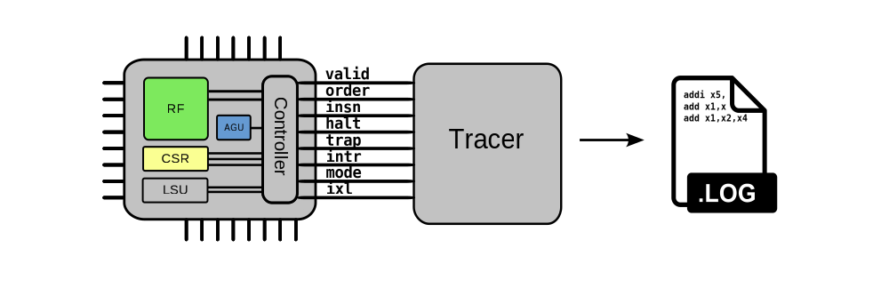
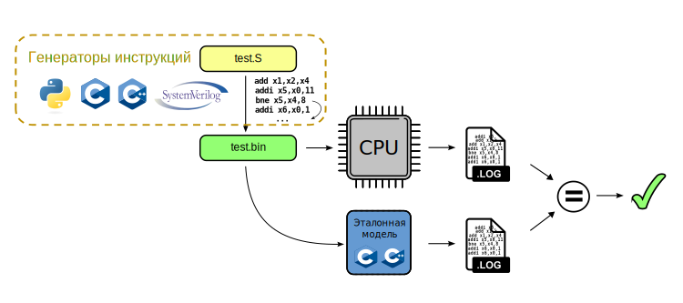
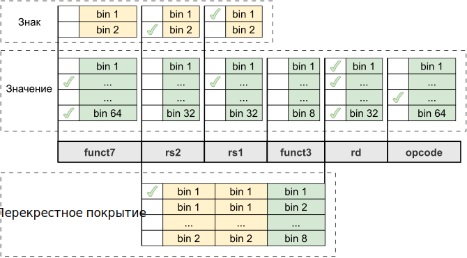

# Тема 04: RISC-V верификация: сравнение с эталонной моделью

- [Тема 04: RISC-V верификация: сравнение с эталонной моделью](#тема-04-risc-v-верификация-сравнение-с-эталонной-моделью)
  - [Рекомендуемый материал](#рекомендуемый-материал)
  - [Краткое содержание](#краткое-содержание)
  - [Описание подхода. Часть 1](#описание-подхода-часть-1)
  - [Интерфейс RVFI](#интерфейс-rvfi)
  - [Описание подхода. Часть 2](#описание-подхода-часть-2)
  - [Практическое занятие на сравнение с эталонной моделью](#практическое-занятие-на-сравнение-с-эталонной-моделью)
  - [To be continued...](#to-be-continued)

## Рекомендуемый материал

- [Тема 00: Вводная](./00_intro.md)
- [Тема 01: Функциональная верификация процессорных ядер](./01_basics.md)
- [Тема 02: Основные подходы к функциональной верификации RISC-V ядер](./02_approach.md)
- [Тема 03: Базовые подходы к симуляции RISC-V ядер](./03_func.md)
  - [Практическое занятие 00: Тест "Hello world!"](../practice/00_basic_hex/)
  - [Практическое занятие 01: Тестирование с самопроверкой](../practice/01_riscv_tests/)

## Краткое содержание

В данном занятии рассматривается подход к функциональной верификации RISC-V ядер, основанный на сравнении с программной эталонной моделью. Также разбирается стандартный интерфейс RVFI, используемый для получения информации о внутреннем состоянии процессорного ядра.

## Описание подхода. Часть 1

**При подходе, основанном на сравнении c эталонной моделью, используется программная модель процессорного ядра.** В настоящее время сообщество RISC-V предоставляет большое количество моделей с открытым исходным кодом, написанных при помощи различных языков программирования, например: [Spike](https://github.com/riscv-software-src/riscv-isa-sim), [VeeR-ISS](https://github.com/chipsalliance/VeeR-ISS), [Rust RISC-V Simulator](https://github.com/GregAC/rrs), [Pydgin](https://github.com/cornell-brg/pydgin).

**Суть подхода заключается в запуске одной и той же программы на тестируемом процессоре и на его эталонной модели.**

В ходе симуляции поведения ядра формируется лог-файл его внутреннего состояния, содержащий в основном информацию о содержимом регистров общего и специального назначения, информацию об обращениях в память и содержимом счетчика команд. Для получения информации о состоянии ядра часто используется [интерфейс RVFI](#интерфейс-rvfi) и специальный несинтезируемый модуль трассировки, различные реализации которого также присутствуют в открытом доступе (например [модуль трассировки ядра Ibex](https://github.com/lowRISC/ibex/blob/master/rtl/ibex_tracer.sv) или [модуль трассировки ядра CVA6](https://github.com/openhwgroup/cva6/blob/0c58e399873eae553daeaa0f2981612813da0078/corev_apu/tb/rvfi_tracer.sv)).

## Интерфейс RVFI

Интерфейс [RVFI](https://github.com/SymbioticEDA/riscv-formal/blob/master/docs/rvfi.md) изначально был разработан компанией Symbiotic EDA с целью продвижения [формального подхода к верификации RISC-V ядер](https://riscv.org/wp-content/uploads/2018/12/13.30-Humbenberger-Wolf-Formal-Verification-of-RISC-V-processor-implementations.pdf). Интерфейс содержит набор сигналов, отражающих:

- информацию о счетчике команд;
- информацию о выполняемых инструкциях;
- информацию о состоянии регистров общего назначения;
- информацию о состоянии регистров специального назначения;
- информацию об исключениях/прерываниях;
- информацию о текущем режиме доступа;
- информацию об обращении к памяти.

**Для поддержки RVFI процессорное ядро должно содержать логику (можно сказать контроллер), реализующую протокол** в соответствии со спецификацией на этот интерфейс.

Хоть RVFI изначально и был создан для формальной верификации, он нашел свое применение в верификации на основе симуляции, особенно в подходах, использующих сравнение с эталонной моделью. В части этих подходов RVFI используется для формирования лог-файлов поведения ядра при помощи анализа интерфейса несинтезируемым модулем трассировки.

RVFI сыграл важнейшую роль в истории верификации процессорных ядер, стандартизировав набор информационных сигналов о состоянии ядра в ходе выполнения программы.

## Описание подхода. Часть 2

Эталонная модель эмулирует работу процессора и так же формирует лог-файл, описывающий состояние ядра в ходе выполнения программы.

**Для каждого тестового сценария происходит сравнение лог-файлов процессора и эталонной модели.** На основании совпадения или несовпадения формируется результат тестирования.

**Для создания тестовых программ в данном подходе используются генераторы случайных инструкций.** Благодаря сообществу RISC-V в настоящее время в открытом доступе существует достаточное количество генераторов с открытым исходным кодом и подробной документацией по применению, например [RISCV-DV](https://github.com/chipsalliance/riscv-dv), [MicroTESK](https://forge.ispras.ru/projects/microtesk-riscv), [AAPG](https://gitlab.com/shaktiproject/tools/aapg), [FORCE-RISCV](https://github.com/openhwgroup/force-riscv).

**В ходе верификации при помощи сравнения с эталонной моделью используется сбор функционального покрытия.** Под функциональным покрытием в данном контексте прежде всего подразумевается сбор информации об используемых в ходе тестирования инструкциях. Собирается информация о типах инструкций, сочетаниях конкретных полей.

**На рисунке выше представлена визуализация разбиения полей одного из типов RISC-V инструкций** на разделы функционального покрытия (`bins`) и их пересечение[^1]. В данном примере, например, интервал всех возможных значений поля `funct7` разбивается на 64 подинтервала. Если в ходе симуляции выполняется инструкция конкретного типа и значение ее поля `funct7` попадает в один из интервалов, а в этот интервал не было попаданий ранее во времени, то процент покрытия увеличивается на 1/64, то есть примерно на 1.6%. Функциональное покрытие инструкций позволяет верификатору убедиться, что все поля всех поддерживаемых ядром инструкций принимали все возможные значения.

Стоит заметить, что сообщество RISC-V зачастую предоставляет модели покрытия совместно с генераторами ([пример для генератора RISV-DV](https://github.com/chipsalliance/riscv-dv/blob/master/src/riscv_instr_cover_group.sv)), которые дают верификатору дополнительную уверенность в полноте проверки процессора. Часто инженер реализует дополнительную модель покрытия ([пример для ядра Ibex](https://ibex-core.readthedocs.io/en/latest/03_reference/coverage_plan.html)), характерную для конкретной микроархитектуры.  Это может быть, например, покрытие сочетаний инструкций, приводящих к конфликтам в конвейере или покрытие пользовательских инструкций. Сбор покрытия осуществляется или во время симуляции, или в ходе анализа лог-файлов поведения ядра.

У представленной методики существует **ряд особенностей:**

- **Подход характерен генерацией большого количества временных файлов** (прежде всего лог-файлов поведения ядра), которые при большом количестве тестовых сценариев могут занимать существенное количество памяти системы.
- **Подход ограничен относительно проверки асинхронных событий (прерывания, выход в режим отладки и т.п.)**, так как раздельная симуляция программы в HDL-описании и в эталонной модели не позволяет синхронизировать процессы генерации внешних воздействий.

## Практическое занятие на сравнение с эталонной моделью

Для того, чтобы на практике повторить тестирование процессора при помощи подхода со сравнением с эталонной моделью, перейдите в раздел [practice/02_aapg](../practice/02_aapg/) и следуйте инструкциям. Будет интересно!

## To be continued...

В [следующем занятии](./05_advanced.md) будут рассмотрены модификации подхода к функциональной верификации RISC-V ядер при помощи сравнения с эталонной моделью, в которых применяется пошаговая проверка работы верифицируемого ядра. Ядро и его модель работают совместно, после выполнения каждой инструкции происходит сравнение.

[^1]: Для ознакомления с функциональным покрытием в SystemVerilog рекомендуется ознакомится с лекцией автора в Школе синтеза цифровых схем: [Условия завершения верификации. Модель функционального покрытия](https://www.youtube.com/watch?v=GTjXXXwwdnM&t=8531s)
