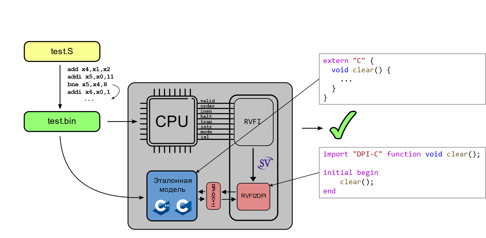
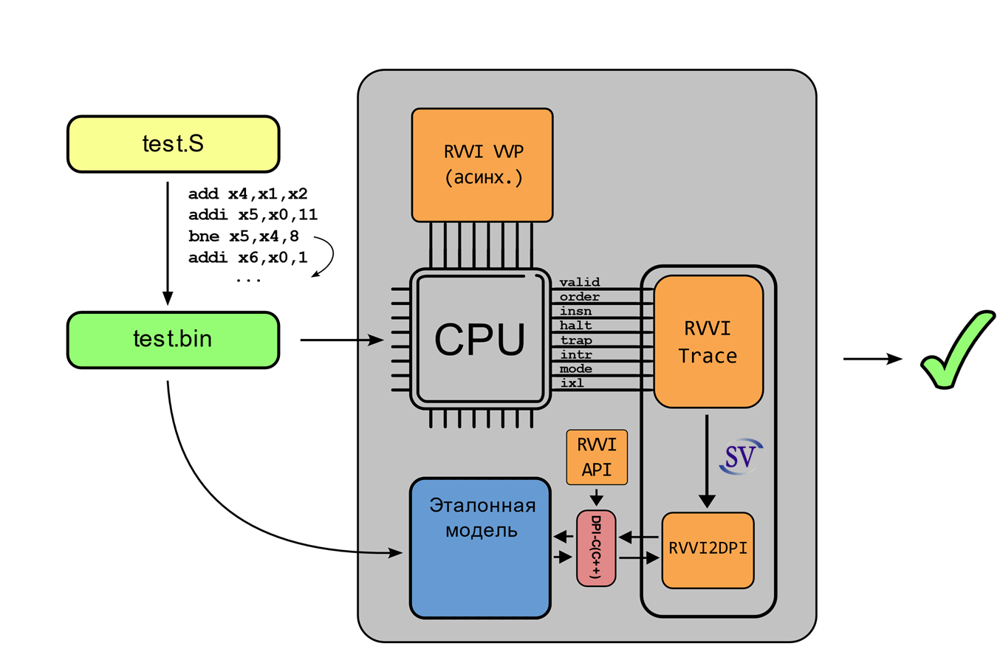

# Тема 05: RISC-V верификация: модифицированное сравнение с эталонной моделью

- [Тема 05: RISC-V верификация: модифицированное сравнение с эталонной моделью](#тема-05-risc-v-верификация-модифицированное-сравнение-с-эталонной-моделью)
  - [Рекомендуемый материал](#рекомендуемый-материал)
  - [Краткое содержание](#краткое-содержание)
  - [Синхронное сравнение](#синхронное-сравнение)
  - [Асинхронное сравнение](#асинхронное-сравнение)

## Рекомендуемый материал

- [Тема 00: Вводная](./00_intro.md)
- [Тема 01: Функциональная верификация процессорных ядер](./01_basics.md)
- [Тема 02: Основные подходы к функциональной верификации RISC-V ядер](./02_approach.md)
- [Тема 03: Базовые подходы к симуляции RISC-V ядер](./03_func.md)
  - [Практическое занятие 00: Тест "Hello world!"](../practice/00_basic_hex/)
  - [Практическое занятие 01: Тестирование с самопроверкой](../practice/01_riscv_tests/)
- [Тема 04: RISC-V верификация: сравнение с эталонной моделью](./04_rgen.md)
  - [Практическое занятие 02: сравнение с эталонной моделью](./practice/02_aapg/)

## Краткое содержание

В данном занятии описываются два модифицированных подхода к верификации RISC-V ядер с использованием эталонной модели: [синхронное сравнение](#синхронное-сравнение) и [асинхронное сравнение](#асинхронное-сравнение).

## Синхронное сравнение

Подход, основанный на синхронном сравнении, также использует [эталонную модель](./04_rgen.md#описание-подхода-часть-1), однако сравнение результатов работы происходит в ходе HDL-симуляции. Изменение состояния ядра также отслеживается при помощи [интерфейса RVFI](./04_rgen.md#интерфейс-rvfi).

**В даннном подходе при изменении состояния ядра верификационное окружение генерирует запрос об изменении состояния эталонной модели при помощи SystemVerilog DPI-C** (механизма, позволяющего осуществлять вызов C/C++ программ непосредственно из SystemVerilog в ходе симуляции). Информация попадает в окружение, и производится сравнение состояния тестируемого ядра и референсной модели. **В большинстве случаев опрос модели происходит каждый раз, когда тестируемое ядро сигнализирует о выполнении инструкции в ходе симуляции.**

Для создания тестовых программ, как и в подходе со сравнением файлов трассировки, **используются генераторы случайных инструкций. Модель покрытия также применяется.**

В данном подходе сравнение поведения ядра и его эталонной модели производится в ходе симуляции. **Подход решает проблему генерации большого объема временных файлов** и инкапсулирует процесс проверки в процесс симуляции, делая его более явным. **Однако синхронное сравнение также не поддерживает верификацию ядра с учетом асинхронных событий.**

## Асинхронное сравнение

**Асинхронное сравнение является модифицированным синхронным подходом.** При асинхронном сравнении используется интерфейс [RVVI](https://github.com/riscv-verification/RVVI), основанный на интерфейсе [RVFI](https://github.com/SymbioticEDA/riscv-formal/blob/master/docs/rvfi.md) и являющийся его идейным и функциональным продолжением.

**В RVVI была прежде всего добавлена поддержка асинхронных событий.** Теперь, при генерации внешних воздействий для HDL-описания ядра информация об этих воздействиях через DPI-C отправляется в эталонную модель с целью обновления ее состояния одновременно с состоянием тестируемого ядра.

Таким образом, **тестируемый процессор и эталонная модель являются полностью "синхронизированными" в контексте асинхронных событий.**

**Стоит заметить**, что данный подход является новейшим из перечисленных выше. На момент написания статьи автор не смог найти в открытом доступе моделей с поддержкой RVVI и асинхронной проверки, чего не скажешь о [коммерческих решениях](https://www.imperas.com/imperasdv). Наиболее приближенный к асинхронному сравнению [подход, существующий в открытом доступе](https://ibex-core.readthedocs.io/en/latest/03_reference/cosim.html), был реализован сообществом lowRISC.

Также в репозитории программной модели RISC-V Spike существует [Issue](https://github.com/riscv-software-src/riscv-isa-sim/issues/911), в которой активно обсуждается возможность использования модели с целью асинхронной проверки.
