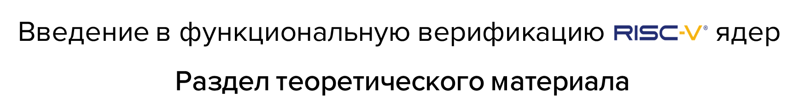

---

## Общее описание

**Курс состоит из 6 тем теоретического материала**, каждая из которых является продолжением предыдущей. Рекомендуется ознакамливаться по порядку. **Часть из тем содержит практические занятия.** Перед их выполнением рекомендуется ознакомиться с теоретическим материалом темы.

В ходе ознакомления с материалом вы будете встречать ссылки на практические занятия. Если вы ее встретили ссылку - значит уже готовы приступить к соответствующему занятию.

## Темы

---

- [Тема 00: Вводная](./00_intro.md)
  
  **Краткое описание:**

  Данное занятие является вводным и рассказывает о причинах актуальности верификации цифровых устройств и особой актуальности верификации процессорных ядер.

  Также в занятии дается краткое описание архитектуры набора команд RISC-V и ее особенностей, описывается предполагаемый вектор развития RISC-V.

---

- [Тема 01: Функциональная верификация процессорных ядер](./02_approach.md)
  
  **Краткое описание:**

  Данное занятие содержит в себе теорию об основах верификации цифровых устройств, а в частности функциональной верификации. Вводятся понятия архитектуры и микроархитектуры. Подробно разбирается их связь с фукнциональной верификацией процессорных ядер.

  В завершение занятия разбирается влияние особенностей архитектуры набора команд RISC-V на процесс верификации ядер, спроектированных на базе данной архитектуры.

---

- [Тема 02: Основные подходы к функциональной верификации RISC-V ядер](./02_approach.md)

  **Краткое описание:**

  Данное занятие содержит в себе теорию о двух основных направлениях функциональной верификации цифровых устройств - симуляция и формальная верификация. Производится сравнение этих направлений и их определяются области их применимости для верификации RISC-V процессоров.

---

- [Тема 03: Базовые подходы к симуляции RISC-V ядер](./03_func.md)

  **Краткое описание:**

  В данном занятии будут подробно рассматриваются два базовых подхода к функциональной верификации RISC-V ядер на основе симуляции: "Hello world!" и тестирование с самопроверкой.

  Оба этих подхода не являются достаточными для качественной проверки процессоров, однако находят применимость на определенных этапах их разработки.

  **Практические занятия:**
    - [Практическое занятие 00: Тест "Hello world!"](../practice/00_basic_hex/);
    - [Практическое занятие 01: Тесты с самопроверкой](../practice/01_riscv_tests/).

---

- [Тема 04: RISC-V верификация: сравнение с эталонной моделью](./04_rgen.md)

  **Краткое описание:**

  В данном занятии рассматривается подход к функциональной верификации RISC-V ядер, основанный на сравнении с программной эталонной моделью. Также разбирается стандартный интерфейс RVFI, используемый для получения информации о внутреннем состоянии процессорного ядра.

  **Практические занятия:**
    - [Практическое занятие 02: Сравнение с эталонной моделью](../practice/02_aapg/).

---

- [Тема 05: RISC-V верификация: модифицированное сравнение с эталонной моделью](./05_advanced.md)

  **Краткое описание:**

  Данное занятие описывает два модифицированных подхода к функциональной верификации RISC-V ядер с использованием эталонной модели: синхронное сравнение и асинхронное сравнение.

---
